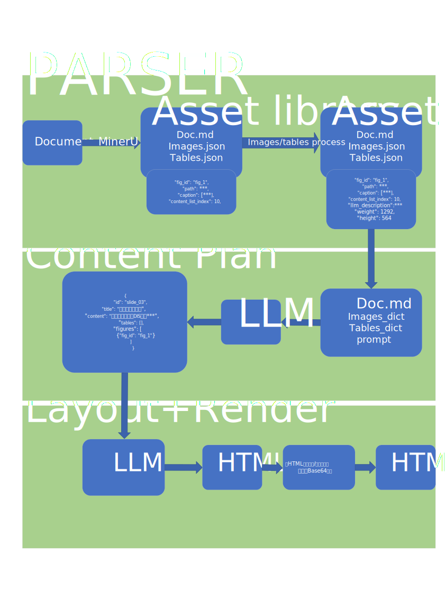
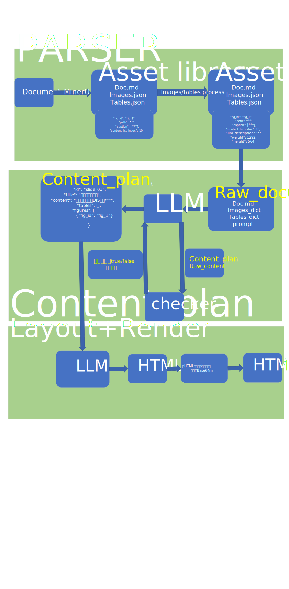

# Document2ALL

*基于agent把输入的通用文档转换为PPT、Poster、Web和Video等展示形式*

## Baseline1模型

完成了一个可以运行的测试模型，具体模型见下图

## baseline2模型

**在baseline1的基础上为contentPlan加上了check**

check提示词效果不好

## 创新方向

* 通用文档的解析
* 基于HTML文件使用一个模型完成PPT、Poster和Web的展示
* 文档解析阶段用Scene Graph的思路解析文档
* 把parser和plan阶段合并起来，参考VQA的做法
* 输入多文档，输出一个展示文件
* 将文档中的表格等数据转换为更适合展示的数据形式，例如表格->柱状图
* 设计layout模型，对poster人为设定二位阅读顺序
* 智能体的概念，为什么是多智能体，与传统方法的区别