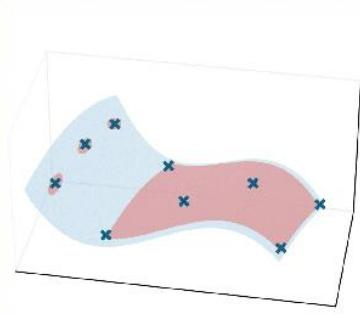
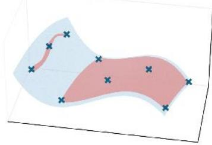
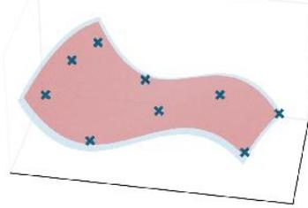
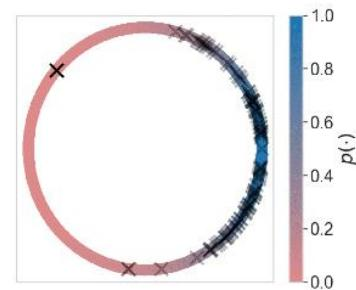
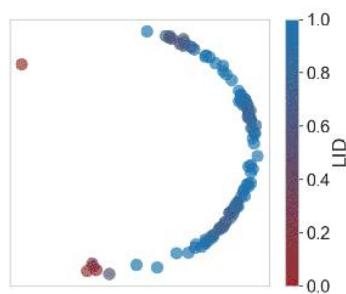
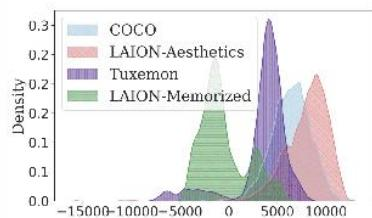
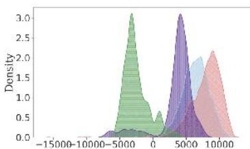
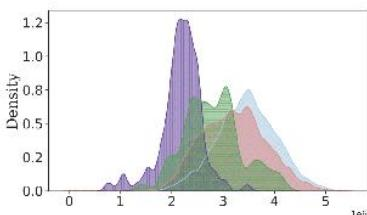

# Background

# Memorization and Overfitting in Deep Generative Models

Deep generative modelsare known to memorize and reproduce their trainingdata   
This behaviour reduces model utility and may have severe privacyand legal implications   
Contributingfactors[4]:datacomplexity，duplication of training points,and highly specific conditioning   
There is as yet no systematic framework describing memorization in DGMs

# The Manifold Hypothesis

High-dimensional data lies on a manifold $\mathcal { M } _ { * }$ with multiple components of varying dimensionalities   
DGMsalso generate samples fromamanifold $\mathcal { M } _ { \theta }$ with the goal ofmatching $\mathcal { M } _ { \ell }$ to $\mathcal { M } _ { \ast }$   
The local intrinsic dimension of $x \in \mathcal { M } _ { * }$ (resp. $x \in \mathcal { M } _ { \theta }$ ），, denoted $\mathsf { L I D } _ { * } ( x )$ (resp. $\lfloor \mathsf { I D } _ { \theta } ( x ) )$ ,is the dimension of the manifold component containing $x$   
Intuitively,the LIDof $\mathscr { X }$ captures the complexity of the datapoint $x$ and constraints on the dataset's structure

# Our Geometric Framework

  
（a)Exact memorization（LIDθ（x）=0）

  
(b）Some Memorization $( \mathsf { L I D } _ { \theta } ( x ) = 1 )$

  
(c） No memorization$\left( \mathsf { L } | \mathsf { D } _ { \theta } ( { \boldsymbol { \chi } } ) = 2 \right)$   
Figure 1:LID values for three red model manifolds with different degrees of memorization of the three leftmost datapoints,which are depicted as dark blue crosses.The true manifold is light blue.

Wepropose that $x \in \mathcal { M } _ { * }$ is memorized when $\mathsf { L } | \mathsf { D } _ { \theta } ( x )$ is small.

Thisencompasss both exactcopying of training images $( \mathsf { L I D } _ { \theta } ( x ) = 0 )$ and copying of styles or parts of an image as in Figure2 $\langle \mathsf { L } | \mathsf { D } _ { \theta } ( x ) > 0 \rangle$ but still small)

From this definition,memorization can be split into two types:

$\mathsf { L I D } _ { \theta } ( x ) < \mathsf { L I D } _ { * } ( x )$ :overfitting-driven memorization (OD-Mem), in which the model fails to generalize to the ground truth manifold correctly (Figure1)   
$\mathsf { L I D } _ { \theta } ( x ) = \mathsf { L I D } _ { * } ( x )$ :data-driven memorization (DD-Mem),in which the ground truth data distribution has been learned correctly，but itselfcontainsvery fewdegreesof freedomat $x$

  
Figure2:8images alongarelatively low-dimensional manifold learnedby Stable Diffusion v1.5.The first isa real image from LAlON (flagged as memorized by [2]),and the remainder were generatedby the model.

# Explaining Memorization

Thegeometric framework explains memorization-related phenomena in the literature:

Duplicated Data It has been observed that memorization occurs when training pointsare duplicated. Here we identify that data duplication isequivalent to an LIDof 0:

Theorem(Informal).Withhigh probabilityandasuficiently large dataset,duplicate samples occurat $x _ { 0 }$ ifand only if $\mathsf { L } | \mathsf { D } _ { * } ( x _ { 0 } ) = 0$

Complexity. [4] observes that simple images arememorized more often.This isneatlyexplainedbythefact that they have lower $\mathsf { L } | \mathsf { D } _ { * }$

Conditioning. Highly-specific conditioning inputs encourage the reproduction of memorized samples.We explain this by the fact that conditioning ona prompt $c$ decreases LID:

Proposition. $\begin{array} { r } { \mathsf { I D } _ { \theta } ( x | c ) \le \mathsf { L I D } _ { \theta } ( x ) . } \end{array}$

Classifier-Free Guidance (CFG).A large classfier-free guidance vector in diffusion models correlates strongly with memorization [5]. This is explainable by observations in the literature that faster explosion of model norms during sampling corresponds to lower $\mathsf { L } | \mathsf { D } _ { \theta }$

# Empirical Verification

We can test this framework using the $\mathsf { L I D } _ { \vartheta }$ estimator of [3]:

von Mises Distribution We train a diffusion model on a von Mises distribution;in Figure 3b we depict model samples with their corresponding LIDs,and a couple of samplesare clearly memorized with $\mathsf { L } | \mathsf { D } _ { \theta } ( x ) = 0$ ,while the remaining samples have $\mathsf { L } | \mathsf { D } _ { \theta } ( x ) = 1$

  
(a) Ground truth manifold.

  
(b) Model samples.   
Figure:Training a diffusion model onavon Mises distribution.

Stable Diffusion on LAlON,COCO,and Tuxemon We compute $\mathsf { L } | \mathsf { D } _ { \theta }$ of Stable Diffusion [1] on

Unmemorized images fromamixofLAlONAesthetics $6 . 5 +$ COCO,and Tuxemon   
·Memorized images from LAION [2]

We find that low LIDs correspond better to memorized images than PNG size,a proxy for image complexity.

  
(a) UnconditionalLID $( \mathsf { A U R O C } = \overleftrightarrow { \mathfrak { U } } , \overleftrightarrow { \mathfrak { U } } , \overleftrightarrow { \mathfrak { o } } )$

  
（b)CndiaLIAURO99.2%），

  
(C） PNG compression $( \mathsf { A U R O C } = \vec { \imath } ( ) , \vec { \imath } ( \breve { \jmath } ) )$   
Figure4:Density histograms for each memorizationmetric on the different datasets.