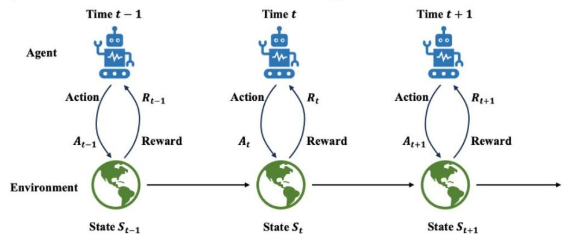
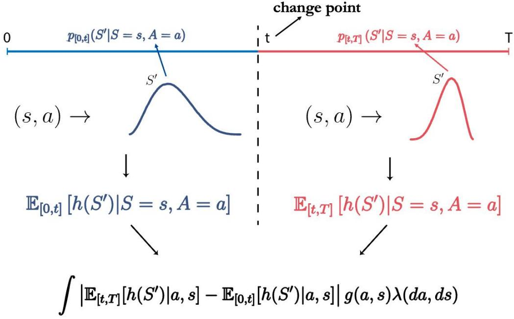
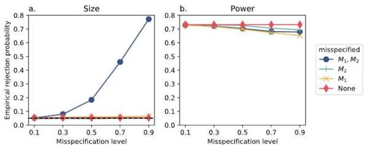
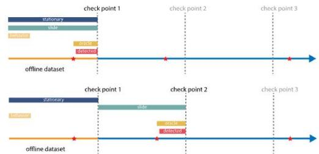
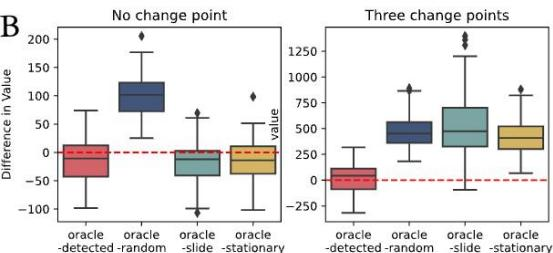
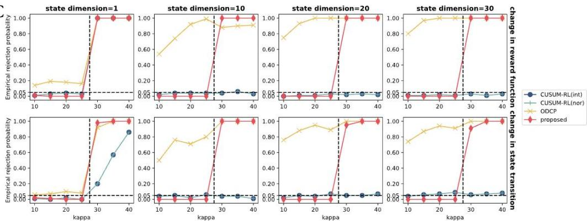
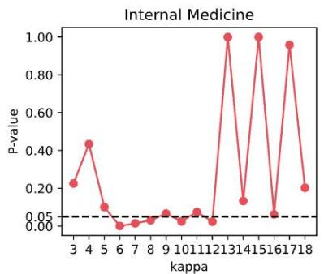
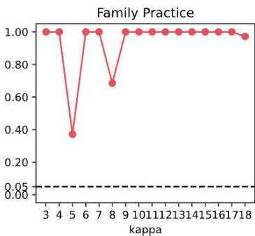

# Preliminary

  
Sequential Decision Making

Markov Decision Process (MDP): $p _ { t } ( S _ { t + 1 } , R _ { t } | A _ { t } , S _ { t } )$   
Stationarity assumption

H:{pi(S+1R|S $H _ { 0 } \colon \{ p _ { j } ( S _ { j + 1 } , R _ { j } | S _ { j } , A _ { j } ) \} _ { 0 \leq j \leq T - 1 }$ are homogeneous over time j;

Offline reinforcement learning (RL) : static dataset without further interactions.   
Additional challenges in modern RL problems

State variable $S _ { t }$ can be high-dimensional (e.g.,7056 for Atari).   
Dynamics $p _ { t }$ can be highlycomplex (e.g,autonomous driving).

Modern ML methods well-suited for non-linearity and high-dimensionality, however, need careful treatment for proper statistical inference.

# Proposed Test

  
Graphical illustration

The proposed test is based on sample spliting[1].

Maximum-type test statistic:

$$
\hat{\Gamma} = \max_{\substack{\epsilon T\leq t\leq (1 - \epsilon)T\\ b\in \{1,\ldots ,B\}}}\sqrt{\frac{t(T - t)}{T^{2}}}\hat{\sigma} (t,h_{b})^{-1}\frac{1}{|I_{2}|}\sum_{i = 1}^{|I_{2}|}\hat{\psi}_{i},
$$

where

$$
\hat {\psi} _ {i} = \underbrace {\int \left| \hat {E} _ {[ t , T ]} \left[ h _ {b} \left(S ^ {\prime}\right) | a , s \right] - \hat {E} _ {[ 0 , t ]} \left[ h _ {b} \left(S ^ {\prime}\right) | a , s \right] \right| g (a , s) \lambda (d a , d s)} _ {\hat {\Delta} (a, s; h _ {b}, t)} \quad \begin{array}{l} \text {p l u g - i n t e r m} \\ \text {a u g m e n t e d t e r m} \end{array}
$$

$$
\begin{array}{l} + \frac {1}{T - t} \sum_ {j = t} ^ {T - 1} \operatorname {s g n} (\widehat {\Delta} (A _ {i, j}, S _ {i, j}; h _ {b}, t)) [ h _ {b} (S _ {i, j + 1}) - \widehat {E} _ {[ t, T ]} [ h _ {b} (S ^ {\prime}) | A _ {i, j}, S _ {i, j} ] ] \frac {g (A _ {i , j} , S _ {i , j})}{\widehat {\omega} _ {[ t , T ]} (A _ {i , j} , S _ {i , j})} \\ - \frac {1}{t} \sum_ {j = 0} ^ {t - 1} \operatorname {s g n} \left(\widehat {\Delta} \left(A _ {i, j}, S _ {i, j}; h _ {b}, t\right)\right) \left[ h _ {b} \left(S _ {i, j + 1}\right) - \widehat {E} _ {[ 0, t ]} \left[ h _ {b} \left(S ^ {\prime}\right) \mid A _ {i, j}, S _ {i, j} \right] \right] \frac {g \left(A _ {i , j} , S _ {i , j}\right)}{\widehat {\omega} _ {[ 0 , t ]} \left(A _ {i , j} , S _ {i , j}\right)}. \\ \end{array}
$$

□ $h _ { b }$ is a test function from a rich function class and $B$ is the number of test functions; $g$ is some reference density function. $\epsilon \in ( 0 , 0 . 5 )$ is the boundary removal parameter.   
□ $\mid \sqrt { t ( T - t ) / T ^ { 2 } } \hat { \sigma } ( t , h _ { b } ) ^ { - 1 }$ is the normalized factor for different $( t , h _ { b } )$ where $\hat { \sigma } ^ { 2 } ( t , h _ { b } )$ is the sampling variance estimator.   
Nuisance functions $\widehat { p } _ { [ 0 , t ] } , \widehat { p } _ { [ t , T ] } , \widehat { \omega } _ { [ 0 , t ] } , \widehat { \omega }$ $\widehat { \omega } _ { [ t , T ] }$ are estimated using the data from $I _ { 1 }$ . One can use flexible machine/deep learning tools. The estimator $\hat { \psi } _ { i }$ is evaluated by directly plugging estimated nuisancefunctions and samples from $I _ { 2 }$   
Gaussian multiplier bootstrap is used to approximate the limiting distribution and compute theresulting p-vale,i.e. $\textstyle { \widehat { p } } = \sum _ { q = 1 } ^ { Q } I ( { \widehat { \Gamma } } \geq { \widehat { \Gamma } } ^ { q } ) / Q$

# Theoretical Property

Double Robustnes: Suppose $H _ { 0 }$ holds. For any $h \in H$ and $t \in ( 0 , T - 1 )$ , we have

$$
E \psi_ {i} ^ {*} = 0, i = 1, \dots , N,
$$

Moreover, theabove equation is doubly robust,i.e.,forany $p _ { [ 0 , t ] } , \ p _ { [ t , T ] } , \omega _ { [ 0 , t ] } , \omega _ { [ t , T ] } ,$ ,the following holds as long as either $p _ { [ 0 , t ] } = p _ { [ t , T ] } = p ^ { * }$ or $\omega _ { [ 0 , t ] } = \omega _ { [ 0 , t ] } ^ { * } , \omega _ { [ t , T ] } = \omega _ { [ t , T ] } ^ { * }$

$$
E \psi_ {i} = 0, i = 1, \dots , N.
$$

$\boldsymbol { \mathbf { \nabla } } \sqcup \psi _ { i } ^ { * }$ is the oracle version of $\hat { \psi } _ { i }$ by replacing the estimated nuisance functions with the oracle ones. $\psi _ { i }$ is similar to $\hat { \psi } _ { i }$ by replacing estimated ones with general functions.

Size: Suppose $B = O ( ( N T ) ^ { c } )$ for any $c > 0$ and $t = O ( T )$ for any $t \in [ \epsilon T , ( 1 - \epsilon T ) ]$ hold.Inadditionupposeuniformboussf $\frac { g } { \omega _ { [ 0 , t ] } } , \frac { g } { \omega _ { [ t , T ] } } ,$ strict stationarity and geometrical ergodicity of $\{ S _ { t } \} _ { t \ge 0 }$ $T \to \infty$ andthe"convergence speed of $\widehat { p } _ { [ 0 , t ] } , \widehat { p } _ { [ t , T ] } , \widehat { \omega } _ { [ 0 , t ] }$ $\widehat { \omega } _ { [ t , T ] }$ to oracle value satisfying

$$
\begin{array}{l} \left[ E \left\{d _ {T V} ^ {2} \left(\hat {p} _ {[ 0, t ]}, p _ {[ 0, t ]} ^ {*}\right) \right\} \right] ^ {1 / 2} = O \left((N T) ^ {- \kappa_ {1}}\right), \left[ E \left\{d _ {T V} ^ {2} \left(\hat {p} _ {[ t, T ]}, p _ {[ t, T ]} ^ {*}\right) \right\} \right] ^ {1 / 2} = O \left((N T) ^ {- \kappa_ {2}}\right), \\ \left[ E \bigl \{d _ {T V} ^ {2} \bigl (\widehat {\omega} _ {[ 0, t ]}, \omega_ {[ 0, t ]} ^ {*} \bigr) \bigr \} \bigr \} \right] ^ {1 / 2} = O \bigl ((N T) ^ {- \kappa_ {3}} \bigr), \left[ E \bigl \{d _ {T V} ^ {2} \bigl (\widehat {\omega} _ {[ t, T ]}, \omega_ {[ t, T ]} ^ {*} \bigr) \bigr \} \bigr \} \right] ^ {1 / 2} = O \bigl ((N T) ^ {- \kappa_ {4}} \bigr), \\ \kappa_ {1}, \kappa_ {2}, \kappa_ {3}, \kappa_ {4} \in (0, 1 / 2) a n d \kappa_ {1} + \kappa_ {3} > \frac {1}{2}, \kappa_ {2} + \kappa_ {4} > \frac {1}{2}, \\ \end{array}
$$

, we have

$$
P (\hat {p} \geq \alpha | H _ {0}) = \alpha + o (1)
$$

# Simulation

  
A

Fig.A: Double Robustness.   
Fig.B:Applicablity toonlinestings.   
Fig.C: Superiority under highdimensional settings

  
C

# Application to Intern Health Study Data

Intern Health Study [2]: Wearable and survey data of 1565 medical interns in the U.S.collected for 26 weeks (fromJuly1,2018,toDec 31,2018).   
The goal is to improve the health-related outcome of medical interns through mobile-based push notification.   
Every week,each intern would be either randomly assigned to notification week $( A _ { t } = 1 )$ with 0.75 probability or non-notification week $( A _ { t } = 0 )$ ).   
Intern's previous week's average daily step count, sleep duration and survey mood score are considered as the state $S _ { t }$   
We consider the next week daily average step count as the reward $R _ { t }$   
The treatment effect of push notification decrease over time.

# References

[1] V. Chernozhukov et al., “Double/debiased machine learning for treatment and structural parameters,TbeEconometricsJournal, vol.21,no.1,pp.C1-C68.

[2] T.NeCamp et al.,“Assessing real-timemoderation fordeveloping adaptive mobile health interventions for medical interns:Microrandomized trial,"Journal of

Medical Internet Research, vol.22, no.3,2020.