# A View From Somewhere: Human-Centric Face Representations

Jerone T. A.Andrews1,Przemys law Joniak², Alice Xiang3

1Sony Al,Tokyo2University of Tokyo,Tokyo3SonyAl,New York

jerone.andrews@sony.com

# Sony Al

# Motivation

# Dataset Bias

Dataset bias can result in models that are discriminatory or depend on spurious correlations. Forinstance,a face image restorationmodel may“hallucinate"featurescorrelatedwith oversampled subgroups,resulting in theerasure ofminority groups.

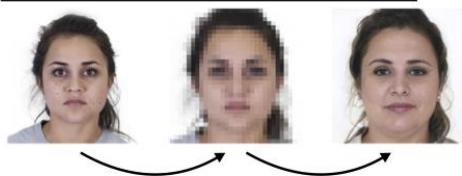  
Upsamplingvia latent space exploration of StyleGAN2   
Downsample

Downsample   
Upsample   
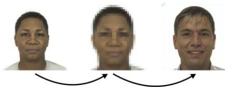  
Originalimagesare takenfromthe ChicagoFaceDatabase (https://ww.chicagofaces.org)

Priorto learning,human-centricimagedataset users shouldevaluate thediversityof thedata.

# Parity and Diversity

Thecanonical approach istocategorizepeople usingdemographic labels. However,evaluating diversity by examining counts across subgroupsfails to reflect thecontinuous nature of human phenotypicdiversity (e.g.,skin tone isoften reduced tolight vs.dark).Moreover,such approaches often denymulti-groupmembership (e.g.,erasingmulti-ethnic individuals).

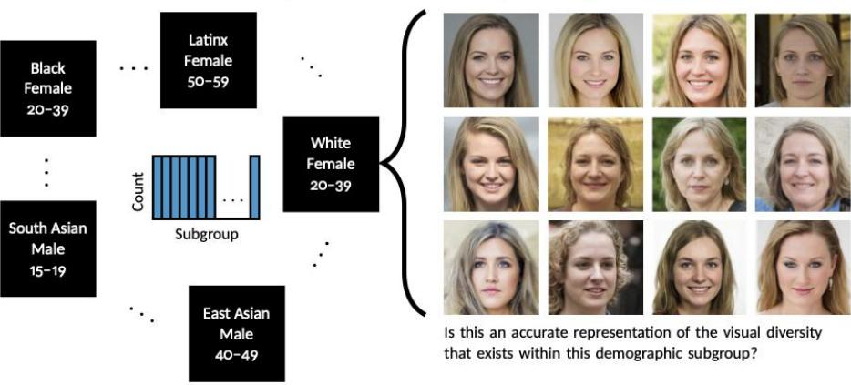

# Unknown Label Distributions

Mosthuman-centricimagedatasetsareweb-scraped,lackingground-truth informationabout theimage subjects.Therefore,researchers typically choose certainattributes they considerto berelevantfor humandiversityandusehumanannotatorstoinfer them.This isdifficult for ill-defined and highlychangeable social constructs suchas raceand gender.Observational labelsrisk not only encoding stereotypes,butreifyingandpropagating thembeyond“their culturalcontext".Furthermore,discrepancies between observed and self-identifiedattributes can invalidatean image subject'sself-imageand identity.

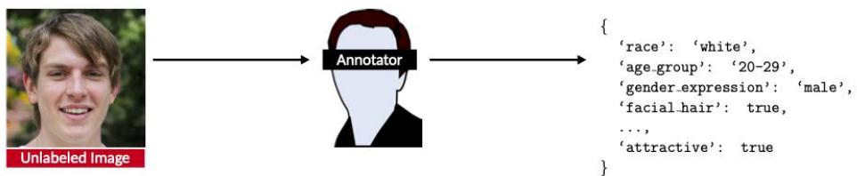

# Contributions

Motivatedby issues inherenttocategoricallabels,weaimtodevelopatoolthatcanevaluate thevisual diversityoffaces inunlabeled datasets.Wedosowithout everaskinganannotator toexplicitly categorizea person.

# Face Similarity (FAX) Dataset

Weintroduceanoveldataset,FAX,containing638,18oodd-one-outfacesimilarityjudgments over4,921faces (stimulus set).Judgments correspond to theodd-one-out (i.e.,least similar) faceina triplet,andareassociatedwiththeidentifieranddemographicattributesof the annotator who made the judgment.

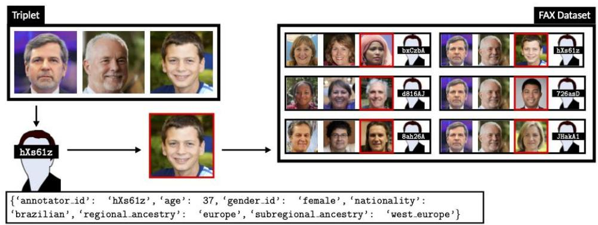

# Model of Conditional Decision-Making

Weintroduceamodel that learns topredicthuman judgments of face similarity conditioned on theannotatorwho generated the judgment.The conditionsare realized usingannotatormasks.

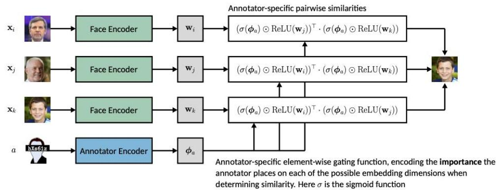

Afacecan exhibit certain characteristics toa greateror lesser extent than others,even within thesamesubpopulation.Therefore,weconstrainourmodelto learn face embeddingsthatare continuous,non-negative (human-interpretable),and sparse byminimizing:

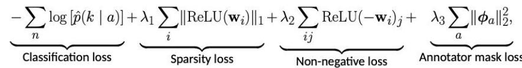

where ${ \hat { p } } ( k \mid a )$ isthepredictedprobabilitythat face ${ \bf x } _ { k }$ is the odd-one-out accordingto annotator $^ { a }$

# Results

# Interpretability

From learning on FAX,we note the materialization ofdistinct dimensions coinciding with commonlydefineddemographic subgroups,i.e.,Male,Female,Black,White,East Asian, SouthAsian,andElderly.Inaddition,separatedimensionssurfaceforfaceand hair morphology,i.e.,Wide Face,Long Face,Smiling Expression,Neutral Expression, Balding,Facial Hair,and Dyed Hair.

Dimension1/22

  
South Asian

Dimension 4/22

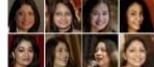

Femal Femal

Dimension 5/22

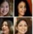

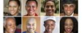  
Smiling

Dimension 10/22

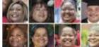  
Wide Face

Dimension 11/22

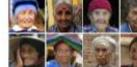  
Elderly

Dimension 18/22

Balding   
  
Original imagesare taken from FFHQ (https://github.com/NVlabs/ffhq-dataset）

Moreover,wevalidate thatFAX dimensions can be used to directly collect continuous attribute valuesfornovel faces,sidesteppingthe limitsofcategorical definitions.

Predicting Novel Similarity Judgments   

<table><tr><td>Model</td><td>Loss/Method</td><td>Acc.</td><td>r</td></tr><tr><td>FairFace</td><td>Cross-entropy</td><td>51.9</td><td>0.67</td></tr><tr><td>CelebA</td><td>Cross-entropy</td><td>48.9</td><td>0.56</td></tr><tr><td>FFHQ</td><td>Cross-entropy</td><td>51.8</td><td>0.68</td></tr><tr><td>CASIA-WebFace</td><td>ArcFace</td><td>46.1</td><td>0.40</td></tr><tr><td>FAX-C</td><td>Conditional</td><td>61.7</td><td>0.82</td></tr><tr><td>FAX-U</td><td>Unconditional</td><td>57.5</td><td>0.86</td></tr><tr><td>FAX-Triplet</td><td>Triplet margin with distance swap</td><td>52.8</td><td>0.64</td></tr></table>

From56images，we generate(5)possible tripletswith 2-3 unique judgmentsper triplet(8o,3oo judgments).

Wereportodd-one-outpredictive accuracy;and，Spearman's rbetween thestrictlyupper triangularmodel-and humangenerated similaritymatrices.Entry(i,j）inthehumangeneratedsimilaritymatrixcorrespondstothefractionof triplets containing(i,j)，where neitherwas judged as the odd-one-out. Entry(i,j)inamodel-generated similaritymatrixcorrespondsto themean ρ(k)over alltriplets containing(i,j).

AnnotatorBias   

<table><tr><td>Annotator attribute</td><td>Groups</td><td># Masks</td><td>AUROC</td></tr><tr><td>Age group</td><td>30-39 / 40-49</td><td>393 / 121</td><td>0.59 ± 0.05</td></tr><tr><td>Gender identity</td><td>Male / Female</td><td>523 / 473</td><td>0.65 ± 0.05</td></tr><tr><td>Nationality</td><td>America / India</td><td>530 / 204</td><td>0.86 ± 0.03</td></tr><tr><td>Regional ancestry</td><td>Europe / Asia</td><td>407 / 243</td><td>0.86 ± 0.03</td></tr><tr><td>Subregional ancestry</td><td>West Europe / South Asia</td><td>173 / 107</td><td>0.88 ± 0.05</td></tr></table>

Using1o-fold crossvalidation，we train linearSVMs todiscriminate betweenannotatormasks from twodifferentannotator subgroups.

Comparative Diversity Auditingand Binary Attribute Classification   

<table><tr><td colspan="9">Comparative diversity auditing</td></tr><tr><td rowspan="3">Data</td><td rowspan="3">Attribute</td><td colspan="5">Model (Disparity Δ / Spearman&#x27;s r)</td><td colspan="2">Discriminating between binary-valued attributes</td></tr><tr><td rowspan="2">FAX</td><td rowspan="2">CelebA</td><td rowspan="2">FairFace</td><td rowspan="2">FFHQ</td><td colspan="3">AUROC</td></tr><tr><td>Data Attribute</td><td>FAX CelebA FairFace</td><td>FFHQ</td></tr><tr><td>CC</td><td>&gt;70 y.o.*</td><td>0.22 / 0.96</td><td>0.06 / 0.99</td><td>0.06 / 0.95</td><td>0.08 / 0.99</td><td>CC &gt;70 y.o.*</td><td>0.800</td><td>0.936</td></tr><tr><td>CC</td><td>Male*</td><td>0.06 / 0.97</td><td>0.02 / 0.99</td><td>0.02 / 1.00</td><td>0.04 / 0.99</td><td>FFHQ</td><td>0.905</td><td>0.959</td></tr><tr><td>CC</td><td>Light skin</td><td>0.06 / 0.94</td><td>0.3 / 0.65</td><td>0.18 / 0.85</td><td>0.06 / 0.99</td><td>CFD Male*</td><td>0.991</td><td>0.997</td></tr><tr><td>CFD</td><td>Smiling</td><td>0.12 / 0.99</td><td>0.06 / 0.95</td><td>-</td><td>-</td><td>CC Male*</td><td>0.971</td><td>0.986</td></tr><tr><td>CFD</td><td>Male*</td><td>0.00 / 1.00</td><td>0.08 / 0.99</td><td>0.02 / 1.00</td><td>0.02 / 1.00</td><td>CA Male</td><td>0.990</td><td>0.994</td></tr><tr><td>CFD</td><td>East Asian*</td><td>0.06 / 1.00</td><td>-</td><td>0.02 / 0.98</td><td>0.02 / 1.00</td><td>COCO Male</td><td>0.893</td><td>0.926</td></tr><tr><td>CFD</td><td>Black*</td><td>0.10 / 0.98</td><td>-</td><td>0.14 / 0.97</td><td>0.00 / 1.00</td><td>MIAP Male</td><td>0.924</td><td>0.942</td></tr><tr><td>CFD</td><td>White*</td><td>0.04 / 1.00</td><td>0.02 / 0.99</td><td>0.04 / 0.97</td><td>0.04 / 0.99</td><td>FFHQ Male</td><td>0.933</td><td>0.959</td></tr><tr><td>CFD</td><td>Indian*</td><td>0.08 / 1.00</td><td>-</td><td>0.30 / 0.73</td><td>0.08 / 0.87</td><td>CA Smiling</td><td>0.895</td><td>0.982</td></tr><tr><td></td><td></td><td></td><td></td><td></td><td></td><td>CFD Smiling</td><td>0.969</td><td>0.992</td></tr><tr><td></td><td></td><td></td><td></td><td></td><td></td><td>CFD Neutral</td><td>0.731</td><td>-</td></tr><tr><td></td><td></td><td></td><td></td><td></td><td></td><td>CFD East Asian*</td><td>0.969</td><td>-</td></tr><tr><td></td><td></td><td></td><td></td><td></td><td></td><td>CFD Black*</td><td>0.992</td><td>-</td></tr><tr><td></td><td></td><td></td><td></td><td></td><td></td><td>CFD White*</td><td>0.972</td><td>0.889</td></tr><tr><td></td><td></td><td></td><td></td><td></td><td></td><td>CFD Indian*</td><td>0.960</td><td>-</td></tr><tr><td></td><td></td><td></td><td></td><td></td><td></td><td>CC Light skin</td><td>0.930</td><td>0.830</td></tr><tr><td></td><td></td><td></td><td></td><td></td><td></td><td>COCO Light skin</td><td>0.889</td><td>0.771</td></tr><tr><td></td><td></td><td></td><td></td><td></td><td></td><td>CA Balding</td><td>0.963</td><td>0.995</td></tr></table>