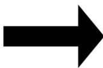
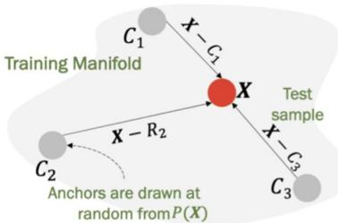
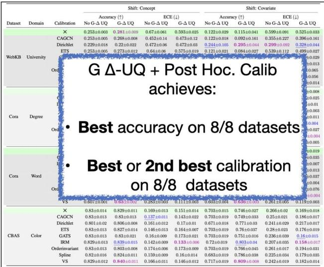
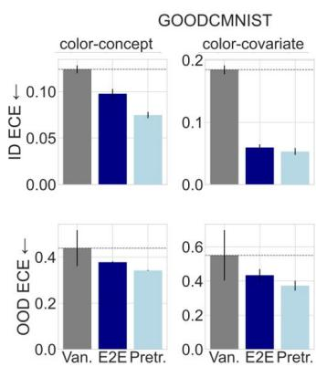
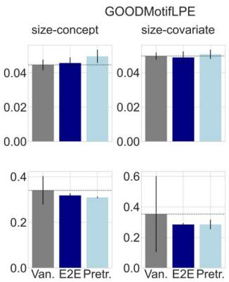
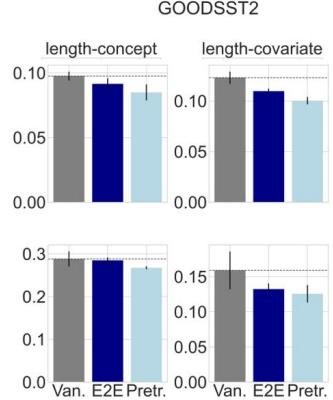
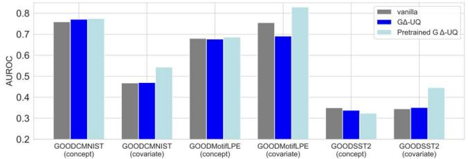
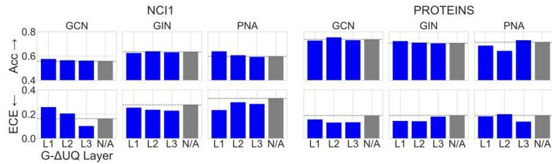
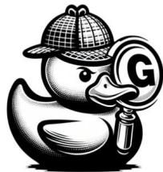
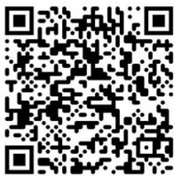

# Stochastic Centering: Single Model Ensembles

NTKs for (Graph) Neural Networks are not shift invariant

The variability over shifts captures epistemic uncertainty!

· Stochastic Centering creates a relativerepresentation foran input, x， in terms of a random anchor, c.   
·During training, the anchor is randomized, thus implicitlysampling different hypotheses.

· During testing, predictions are computed over multiple anchors.   
·Discrepancy across anchors choices captures epistemic uncertainty!

# G △-UQ: Stochastic Centering for GNNs

# Node Feature

# READOUT/MLP

# Int.MPNN

<table><tr><td>READOUT/MLP</td><td>MLP</td></tr><tr><td>GNNk...l</td><td>[Gi - Gc||Gc]</td></tr><tr><td>(Ai, Xk+1 - Xc k+1 || Xc k+1)]</td><td>Gi | Gc</td></tr><tr><td>(Ai, Xk+1) (Ac, Xc k+1)</td><td>READOUT</td></tr><tr><td>GNN1...k</td><td>GNN1...l</td></tr><tr><td>(Ai, Xi)
(Ac, Xc) ~ Dtrain</td><td>(Ai, Xi)
(Ac, Xc) ~ Dtrain</td></tr></table>

# Readout

# Anchored Inference

Prediction:

$$
\mu (y \mid \mathcal {G} _ {i}) = \frac {1}{K} \sum_ {k = 1} ^ {K} f _ {\theta} ([ \mathcal {G} _ {i}, c _ {k} ])
$$

Uncertainty:

$$
\boldsymbol {\sigma} (y \mid \mathcal {G} _ {i}) = \sqrt {\frac {1}{K - 1} \sum_ {k = 1} ^ {K} \left(f _ {\theta} \left(\left[ \mathcal {G} _ {i} , c _ {k} \right]\right) - \boldsymbol {\mu}\right) ^ {2}}
$$

Calibrated Prediction:

$$
\boldsymbol {\mu} _ {c a l i b} = \boldsymbol {\mu} (1 - \sigma)
$$

· Since graphs are variable sized and discrete,we introduce three anchoring strategies tailored for GNNs.   
· Induce varying levels of stochasticity, trading off hypothesis diversity and the semantic diversity of the anchoring distribution.

# We propose G △-UQ, a novel training paradigm for improving calibration with GNNs

√

Scalable and Lightweight

√

Robust to Distribution Shifts

√

Supports Pretrained Models

√

Easy to Implement

#Corres.to GDUQLayer！

# G△-UQ is easy to implement, with only a few changes to standard GNNs !

0

# Improved Node Classification Calibration

We evaluate G Δ-UQ with node feature anchoring on:

· 4 Datasets   
·2 Distribution shifts   
·8 Post Hoc Calibration

G △-UQ matches or surpasses accuracy and calibration of the vanilla GNN on 8/8 datasets.

# Better Graph Classification Calibration

  
G △-UQ Improves Calibration of Pretrained GNNs

  
G△-UQ Estimates are Effective in Safety Critical Tasks

·G△-UQ achieves the best OOD detection AUROC on 5/6 datasets.   
· G △-UQ also performs well on the generalization gap prediction tasks.

  
G△-UQ Improves Graph Classification Calibration with Different MPNNs

· G △-UQ is flexible to message passing layer.   
·Required level of stochasticity may vary fordataset/GNN.

  
Check out the G △-UQ Family!

  
Try E△-UQ for link prediction calibration!