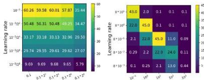
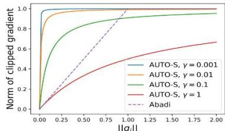

# AUTOMATICCLIPPING:DIFFERENTIALLYPRIVATEDEEPLEARNING

# MADE EASIER ANDSTRONGER

Zhiqi Bu, Yu-Xiang Wang,Sheng ZhaGeorge Karypis

zhiqibu@amazon.com;yuxiangw@cs.ucsb.edu;zhasheng@amazon.com； gkarypis@amazon.com

# ABSTRACT

Per-example gradient clipping is a key algorithmic step that enables practical differential private (DP) training for deep learning models.Thechoice of clipping threshold $R$ is shown to be vital for achieving high accuracy under DP but difficult to tune (must be tuned jointly with learning rate).

Figure1: Ablationstudyofppigthresholdandeaingrate thatachievesSOA results.Left:GPT2 on E2E dataset using DP-AdamW.Right:ResNet18on ImageNet dataset using DP-SGD with momentum.

We propose an easy-to-use replacement,called Automatic Clipping, that eliminates theneed to tune R forany DPoptimizers,while beingas private and computationally efficient as existing DP optimizers.

# CONTRIBUTIONS

·We propose a new per-sample gradient clipping function does not require the clipping threshold $R ,$ making hyperparameter tuning of DP deep learningas easy as the regular non-private one.   
·We give a convergence analysis of automatic DP-SGD in the nonconvex seting,which shows that it enjoys anasymptotic convergence rate $O ( T ^ { - 1 / 4 } )$ that matches the standard non-private SGD.   
·We demonstrate on extensive language (SST-2,QNLI,MNLI,QQP, E2E)and isiontasks (NT,FashionMNT,FAR10,ImageNet, CelebA) that automatic clipping outperforms or matches the state-ofthe-art accuracy.   
· We demonstrate minimal changes to adopt our automatic clipping in existing codebases,e.g.Opacus,ObJAPrivate Transformers,etc.

# CONVERGENCE ANALYSIS OF AUTOMATIC DP-SGD

Weanalyzethveeceoessitaardssuptsiitauedsugtemeryfslegdts

Assumption 3(Lower bound of loss).For all wand some constant $\mathcal { L } _ { * } ,$ wehave $\mathcal { L } ( w ) \geq \mathcal { L } _ { * }$

Assumption 4 (Smoothness). Let $g ( w )$ denotethegradientoftheobjective $\mathcal { L } ( w )$ $\forall w , v ,$ thereisan non-negativeconstant $L$ $\begin{array} { r } { \left[ \mathscr { L } ( \pmb { w } ) + \pmb { g } ( \pmb { w } ) ^ { \top } ( \pmb { v } - \pmb { w } ) \right] \leq \frac { L } { 2 } \| \pmb { w } - \pmb { v } \| ^ { 2 } } \end{array}$

Assumption 5(Gradient noise).The per-sample gradient noise $\hat { g } _ { t , i } - g _ { t }$ is i.id.fromsomeditributionsuch that $\mathbb { E } ( \tilde { { \bf g } } _ { t , i } - { \bf g } _ { t } ) = 0 , \mathbb { E } \| \tilde { { \bf g } } _ { t , i } - { \bf g } _ { t } \| ^ { 2 } \leq \xi ^ { 2 }$ ,and $\tilde { g } _ { t , i }$ centrallysymmetric about $\scriptstyle g _ { t }$ in distribution: $\tilde { { \mathbf g } } _ { t , i } - { \mathbf g } _ { t } \overset { \mathcal { D } } { = } { \mathbf g } _ { t } - \tilde { { \mathbf g } } _ { t , i }$

Theorem3. Under Assumption3-5,runing automaticDP-SGD for $T$ iterationswith learningrate $\eta \propto 1 / \sqrt { T }$ give

$$
\min  _ {0 \leq t \leq T} \mathbb {E} (\| g _ {t} \|) \leq \mathcal {G} \left(\frac {4}{\sqrt {T}} \sqrt {\left(\mathcal {L} _ {0} - \mathcal {L} _ {*}\right) L \left(1 + \frac {\sigma^ {2} d}{B ^ {2}}\right)}; \xi , \gamma\right) := \min  _ {r > 0} \frac {\xi}{r} + \mathcal {F} (\dots ; r, \xi , \gamma). \tag {0.4}
$$

Here... is the argumentofG,which is increasingand positive.As $T \to \infty$ ,weget mintE(llgl)=O(-1/4)forAuO-S,thesamerateasstandard GD.

# DIFFERENTIAL PRIVACY IN DEEP LEARNING

Ddiferentialprivacy(DP;Dworketal.)isforaldefinitionofprivacytathasbeesowntopreventheprvacyrissineeing.

Definition1.Arandomized algorithm $M$ $( \varepsilon , \delta )$ DPifforanyneighboringdatasets $S , S ^ { \prime }$ that differ byonesample,andforany eventE:

$$
\mathbb {P} [ M (S) \in E ] \leqslant \mathrm {e} ^ {\varepsilon} \mathbb {P} [ M \left(S ^ {\prime}\right) \in E ] + \delta . \tag {0.1}
$$

ThekedifreeetenteeeagdegulaoisethrtadentspriatelyeleasedIerodladd optimizers update on the summed gradient $\textstyle \sum _ { i } { g _ { i } }$ and DPoptimizers update on the prioate gradient:

$$
\begin{array}{r} \text {P D O p t i m i z e r} (\{\boldsymbol {g} _ {i} \} _ {i = 1} ^ {B}) = \text {O p t i m i z e r} (\overbrace {\sum_ {i} \boldsymbol {g} _ {i} \cdot \operatorname {C l i p} (\| \boldsymbol {g} _ {i} \| ; R) + \sigma R \cdot \mathcal {N} (0 , I)}) \\ \text {S t a n d a r d O p t i m i z e r} (\{\boldsymbol {g} _ {i} \} _ {i = 1} ^ {B}) = \text {O p t i m i z e r} (\sum_ {i} \boldsymbol {g} _ {i}) \end{array} \tag {0.2}
$$

Here $g _ { i } \in \mathbb { R } ^ { d }$ is the per-sample gradient of loss $l _ { i } , \mathcal { N }$ is the standard normal random variable, $\sigma$ is the noise multiplier, and $R$ is the clipping threshold. The clipping function $\mathbb { C } \bot \bot \rho : \mathbb { R } ^ { d }  \mathbb { R }$ is defined such that $\| \pmb { g } _ { i } \cdot \mathbb { C } \mathrm { 1 i p } ( \pmb { g } _ { i } ; \pmb { R } ) \| \le R$

$$
\text {W e w i l l s h o w} \quad \boxed {\mathrm {D P O p t i m i z e r} _ {\mathrm {A b a d i}} \approx R - \text {d e p e n d e n t D P O p t i m i z e r} _ {\mathrm {A U T O}} \equiv R - \text {i n d e p e n d e n t D P O p t i m i z e r} _ {\mathrm {A U T O}}}
$$

# PER-SAMPLE GRADIENT CLIPPING

Abadi'sclippingis the most widelyapplied clipping function,which requiresahyperparameter-theclipping threshold R.

$$
\operatorname {C l i p} _ {\text {A b a d i}} \left(\boldsymbol {g} _ {i}; R\right) = \min  \left(R / \left\| \boldsymbol {g} _ {i} \right\|\right), 1)
$$

Recent advances have observed small clipping threshold works best,which motivates our automatic clipping:

$$
\operatorname {C l i p} _ {\text {A U T O - V}} \left(\boldsymbol {g} _ {i}; R\right) := R / \| \boldsymbol {g} _ {i} \|.
$$

We notice that AUTO-V loses the magnitude information of per-sample gradients.We additionally propose AUTO-Swith apositive stability constant that is set to 0.01 across tasks.

$$
\operatorname {C l i p} _ {\text {A U T O - S}} \left(\boldsymbol {g} _ {i}; R\right) := R / \left(\left\| \boldsymbol {g} _ {i} \right\| + \gamma\right).
$$

Finallywe can always set $R \ : = \ : 1$ which leads to theactual automatic clipping,which is $R \cdot$ -independent.

$$
\operatorname {c l i p} _ {\text {A U T O - S}} \left(\boldsymbol {g} _ {i}\right) := 1 / \left(\left\| \boldsymbol {g} _ {i} \right\| + \gamma\right).
$$

Notice that all clipping functions have the same noise-to-sensitivity ratio,hence they have the same DP guarantee.

Figure2:Gradient norms before and afterdifferent clippingat $R = 1$

# R-INDEPENDENCE OF AUTOMATIC CLIPPING

We show that using automatic clipping, it sufices to tune learning rate and weight decay in DP trainingas in theregular training.

Theorem1. Non-adaptie R-dependent automatic DP-SGD(possbly usingmomentum)with learningratenandweightdecayX,isequivalent to R-independentautomaticDPoptimizers,with learningrate $\eta ^ { \prime } = \eta R$ and weight decay $\lambda ^ { \prime } = \lambda / R$

Theorem2. Adaptioe R-dependent automatic DPoptimizers (including AdaGrad,daelta，daMax/Adam,damdam，,), with learning rate $\eta$ andweightdecayXisequivalentto R-independent automatic DP optimizers with learning raten and weight decay $\lambda ^ { \prime } = \lambda / R$

Remark2.Withdecoupled weightdecay,R-dependent automatic DP-AdamWis equivalent to R-independent automatic DP-AdamW with the samen and X.

To prove this,theideais to couple $R$ with learning rate:

$$
R \text {- d e p} \mathrm {D P - S G D} _ {\mathrm {A U T O - S}}: \quad \boldsymbol {w} _ {t + 1} = \boldsymbol {w} _ {t} - \eta \left(\sum_ {i \in B _ {t}} \boldsymbol {g} _ {i} \cdot \frac {R}{\| \boldsymbol {g} _ {i} \| + 0 . 0 1} + \sigma R \cdot \mathcal {N} (0, I)\right)
$$

$$
R - \text {i n d e p} \mathrm {D P - S G D} _ {\mathrm {A U T O - S}}: \quad \boldsymbol {w} _ {t + 1} = \boldsymbol {w} _ {t} - \eta^ {\prime} \left(\sum_ {i \in B _ {t}} \frac {\boldsymbol {g} _ {i}}{\| \boldsymbol {g} _ {i} \| + 0 . 0 1} + \sigma \cdot \mathcal {N} (0, I)\right)
$$

Wefurther take the privacy into consideration to understand how hyperparametersafect theconvergence.

Theorem4. Under Assumption3-5andfixed prioacybudget $\mu ( \epsilon , \delta )$ ,runningautomaticDP-SGDforTiterations with eaningrate $\eta \propto 1 / \sqrt { T }$

$$
\min  _ {0 \leq t \leq T} \mathbb {E} (\| \boldsymbol {g} _ {t} \|) \leq \mathcal {G} \left(4 \sqrt {\left(\mathcal {L} _ {0} - \mathcal {L} _ {*}\right) L \left(\frac {1}{T} + \frac {d}{\mu^ {2} n ^ {2}} + O \left(\frac {1}{B ^ {2} T}\right)\right)}; \xi , \gamma\right) \tag {0.5}
$$

LeveragingTheor4ouraalysisprovidesgudelinestoDtrainingthatmatchtheempiicalobservation:weminmiethefirstargentof $\mathcal { G }$ in (0.5), denotedas $X ( B , T , \mu , d , L , \mathcal { L } _ { 0 } )$ .

1.[Train longer with larger noise] Fixing the expected batch size B, $X$ is decreasing in $T$ .Hence larger $T$ and consequently larger $\sigma$ are preferred.   
2.[Larger batch size helpslFixing numberof iterations $T$ or epochs, $X$ is decreasing in $B$ .Hence larger $B$ and consequently larger $\sigma$ are preferred.   
3.[Pretraining is critical] Pretraining can leads toamuch smaller initial loss $\mathcal { L } _ { 0 }$ and froma smooth (small L) and flat (smallε) initialization.   
4.[earingatestugOeldergatefoalloelkerprcygerallthize.

# AUTOMATIC CLIPPING IS EASY TO CODE

Switchinglel inhttps://github.com/pytorch/opacus/blob/main/opacus/optimizers/optimizer.py to

$$
\text {p e r} = \text {s a m p l e} + 0. 0 1)
$$

# EMPIRICAL RESULTS

Automaticabt ompatibl

<table><tr><td rowspan="2">Task</td><td rowspan="2">Model</td><td rowspan="2">(ε,δ)</td><td colspan="3">Accuracy %</td></tr><tr><td>Abadi&#x27;s clipping</td><td>AUTO-S clipping</td><td>non-DP (ε=∞)</td></tr><tr><td>MNIST</td><td>4-layer CNN</td><td>(3,1e-5)</td><td>98.04 ± 0.09</td><td>98.15 ± 0.07</td><td>99.11 ± 0.07</td></tr><tr><td>FashionMNIST</td><td>4-layer CNN</td><td>(3,1e-5)</td><td>86.04 ± 0.26</td><td>86.36 ± 0.18</td><td>89.57 ± 0.13</td></tr><tr><td>CIFAR10 pretrained</td><td>SimCLRv2</td><td>(2,1e-5)</td><td>92.44 ± 0.13</td><td>92.70 ± 0.02</td><td>94.42 ± 0.01</td></tr><tr><td>ImageNette</td><td>ResNet9</td><td>(8,1e-4)</td><td>60.29 ± 0.53</td><td>60.71 ± 0.48</td><td>71.11 ± 0.37</td></tr><tr><td>CelebA [Smiling]</td><td>ResNet9</td><td>(8,5e-6)</td><td>90.75 ± 0.11</td><td>91.08 ± 0.08</td><td>92.61 ± 0.20</td></tr><tr><td>CelebA [Male]</td><td>ResNet9</td><td>(8,5e-6)</td><td>95.54 ± 0.14</td><td>95.70 ± 0.07</td><td>97.90 ± 0.04</td></tr><tr><td>CelebA Multi-label</td><td>ResNet9</td><td>(3,5e-6)</td><td>86.81 ± 0.03</td><td>87.05 ± 0.01</td><td>90.30 ± 0.02</td></tr><tr><td>CelebA Multi-label</td><td>ResNet9</td><td>(8,5e-6)</td><td>87.52 ± 0.15</td><td>87.58 ± 0.04</td><td>90.30 ± 0.02</td></tr></table>

Table 1: Average test accuracy and $9 5 \%$ confidence interval over 5 runs.   

<table><tr><td rowspan="2">Method</td><td colspan="4">ε = 3</td><td colspan="4">ε = 8</td><td colspan="4">ε = ∞ (non-DP)</td></tr><tr><td>MNLI</td><td>QQP</td><td>QNLI</td><td>SST2</td><td>MNLI</td><td>QQP</td><td>QNLI</td><td>SST2</td><td>MNLI</td><td>QQP</td><td>QNLI</td><td>SST2</td></tr><tr><td>RGP</td><td>-</td><td>-</td><td>-</td><td>-</td><td>86.1/86.0</td><td>86.7</td><td>90.0</td><td>93.0</td><td>-</td><td>-</td><td>-</td><td>-</td></tr><tr><td>full Abadi</td><td>86.43/86.46</td><td>86.43</td><td>90.76</td><td>93.04</td><td>87.02/87.26</td><td>87.47</td><td>91.10</td><td>93.81</td><td></td><td></td><td></td><td></td></tr><tr><td>full AUTO-V</td><td>85.33/85.61</td><td>86.61</td><td>89.99</td><td>93.12</td><td>85.91/86.10</td><td>86.86</td><td>90.55</td><td>93.35</td><td>90.33/90.03</td><td>87.90</td><td>93.61</td><td>96.21</td></tr><tr><td>full AUTO-S</td><td>86.27/86.67</td><td>86.76</td><td>91.01</td><td>93.92</td><td>87.07/87.16</td><td>87.47</td><td>91.45</td><td>94.61</td><td></td><td></td><td></td><td></td></tr></table>

Table2: Test accuracy on language tasks with RoBERTa-large (407M parameters).

<table><tr><td rowspan="2">Metric</td><td rowspan="2">DP guarantee</td><td>GPT2 large</td><td>GPT2 medium</td><td colspan="8">GPT2</td></tr><tr><td>full AUTO-S</td><td>full AUTO-S</td><td>full AUTO-S</td><td>full AUTO-V</td><td>full Abadi</td><td>full LoRA</td><td>RGP</td><td>prefix</td><td>top2</td><td>retrain</td></tr><tr><td rowspan="3">BLEU</td><td>\( \epsilon  = 3 \)</td><td>64.180</td><td>63.850</td><td>61.340</td><td>61.519</td><td>61.519</td><td>58.153</td><td>58.482</td><td>47.772</td><td>25.920</td><td>15.457</td></tr><tr><td>\( \epsilon  = 8 \)</td><td>64.640</td><td>64.220</td><td>63.600</td><td>63.189</td><td>63.189</td><td>63.389</td><td>58.455</td><td>49.263</td><td>26.885</td><td>24.247</td></tr><tr><td>non-DP</td><td>66.840</td><td>68.500</td><td>69.463</td><td>69.463</td><td>69.463</td><td>69.682</td><td>68.328</td><td>68.845</td><td>65.752</td><td>65.731</td></tr><tr><td rowspan="3">ROGUE-L</td><td>\( \epsilon  = 3 \)</td><td>67.857</td><td>67.071</td><td>65.872</td><td>65.670</td><td>65.670</td><td>65.773</td><td>65.560</td><td>58.964</td><td>44.536</td><td>35.240</td></tr><tr><td>\( \epsilon  = 8 \)</td><td>68.968</td><td>67.533</td><td>67.073</td><td>66.429</td><td>66.429</td><td>67.525</td><td>65.030</td><td>60.730</td><td>46.421</td><td>39.951</td></tr><tr><td>non-DP</td><td>70.384</td><td>71.458</td><td>71.359</td><td>71.359</td><td>71.359</td><td>71.709</td><td>68.844</td><td>70.805</td><td>68.704</td><td>68.751</td></tr><tr><td rowspan="3">NIST</td><td>\( \epsilon  = 3 \)</td><td>7.937</td><td>7.106</td><td>7.071</td><td>6.697</td><td>6.697</td><td>5.463</td><td>5.775</td><td>5.249</td><td>1.510</td><td>0.376</td></tr><tr><td>\( \epsilon  = 8 \)</td><td>8.301</td><td>8.172</td><td>7.714</td><td>7.444</td><td>7.444</td><td>7.449</td><td>6.276</td><td>5.525</td><td>1.547</td><td>1.01</td></tr><tr><td>non-DP</td><td>8.730</td><td>8.628</td><td>8.780</td><td>8.780</td><td>8.780</td><td>8.822</td><td>8.722</td><td>8.722</td><td>8.418</td><td>8.286</td></tr><tr><td rowspan="3">METEOR</td><td>\( \epsilon  = 3 \)</td><td>0.403</td><td>0.387</td><td>0.387</td><td>0.384</td><td>0.384</td><td>0.370</td><td>0.331</td><td>0.363</td><td>0.197</td><td>0.113</td></tr><tr><td>\( \epsilon  = 8 \)</td><td>0.420</td><td>0.418</td><td>0.404</td><td>0.400</td><td>0.400</td><td>0.407</td><td>0.349</td><td>0.364</td><td>0.207</td><td>0.145</td></tr><tr><td>non-DP</td><td>0.460</td><td>0.449</td><td>0.461</td><td>0.461</td><td>0.461</td><td>0.463</td><td>0.456</td><td>0.445</td><td>0.443</td><td>0.429</td></tr><tr><td rowspan="3">CIDEr</td><td>\( \epsilon  = 3 \)</td><td>2.008</td><td>1.754</td><td>1.801</td><td>1.761</td><td>1.761</td><td>1.581</td><td>1.300</td><td>1.507</td><td>0.452</td><td>0.116</td></tr><tr><td>\( \epsilon  = 8 \)</td><td>2.163</td><td>2.081</td><td>1.938</td><td>1.919</td><td>1.919</td><td>1.948</td><td>1.496</td><td>1.569</td><td>0.499</td><td>0.281</td></tr><tr><td>non-DP</td><td>2.356</td><td>2.137</td><td>2.422</td><td>2.422</td><td>2.422</td><td>2.491</td><td>2.418</td><td>2.345</td><td>2.180</td><td>2.004</td></tr></table>

Table 3: Test performance on E2E dataset with GPT2.