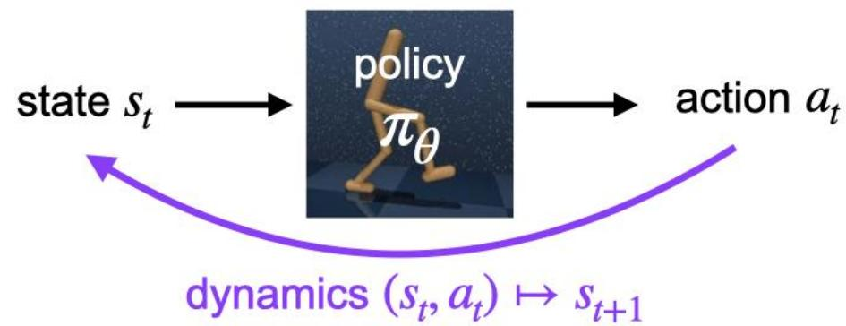
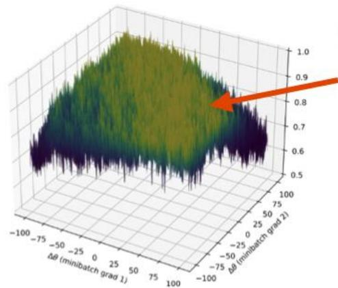
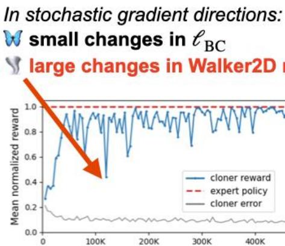
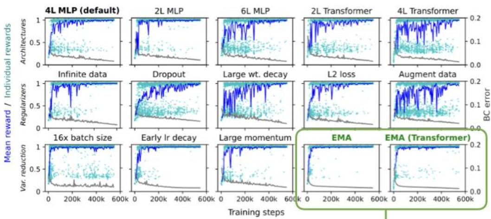
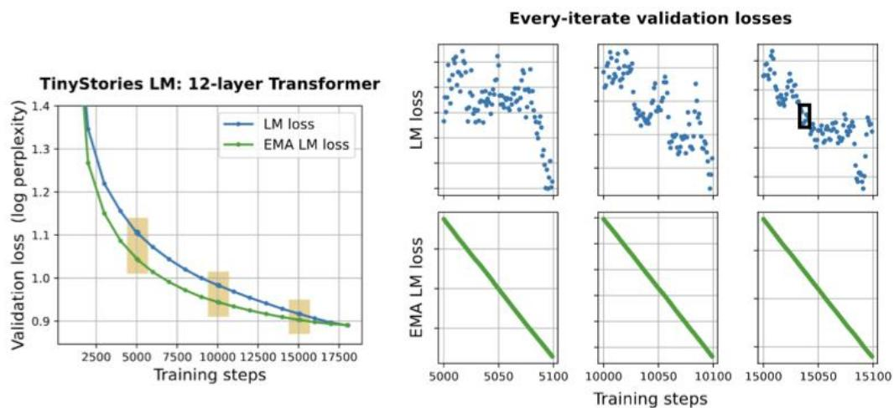

Adam Block*，Dylan Foster，Akshay Krishnamurthy*，Max Simchowitz*，Cyril Zhang*

+MIT*Microsoft Research NYC

  
Behavior cloning & feedback loops

BC: fit $\theta$ to a collection of demonstrations from expert policy $\pi ^ { \star }$ ,minimizing 1-step loss

$$
(e. g.) \ell_ {\mathrm {B C}} (\theta) = \underset {\text {e x p e r t ' s} \left(s _ {t}, a _ {t}\right)} {\mathbb {E}} \left[ \| \pi_ {\theta} \left(s _ {t}\right) - \pi^ {\star} \left(s _ {t}\right) \| ^ {2} \right]
$$

Usual view: BC reduces offline imitation learning to supervised learning

eBc（）≤ε

train on1-step loss

JH（πθ）≥JH（π*）-C.ε

evaluatemulti-steprollout rewards

Q1: When BC works, how big is C in practice?   
Q2: When BC fails,must we improve the data? Or can we improve upon standard training?

Special case: pretraining vs. generation in LLMs

$s _ { t }$ :sequence of t tokens   
$a _ { t }$ :append a single token   
$\pi _ { \theta }$ :autoregressive language model

# Gradient Variance Amplification

A1: Long-horizon rollouts can be extremely sensitive to small SGD fluctuations.

GVA:an empirical pathology in BC with NNs

small changes in 0 due to minibatch noise

...causing smallchanges in 1-step $\ell _ { \mathrm { B C } } ( \theta ) \ldots$

..and chaotic long-rollout rewards $J _ { H } ( \pi _ { \theta } )$

Evidence: (across locomotion tasks&archs)

  
fractal reward landscape

  
oscillations during training

(in the paper:accompanying quantitative studies)

Theory: vignettes in toy models

- marginally stable linear dynamics,linear π,π*   
- "CliffLQR": halfspace reward $ G V A$   
- SDE limit: EMA& LR schedules both work

# Algorithmic mitigations for GVA

A2:Variance reduction techniquesmitigate the oscillations;EMAishighly effective.

Exponential Moving Average

$\theta _ { t + 1 }  \theta _ { t } - \eta _ { t } \widetilde { \nabla } _ { \theta } \ell _ { \mathrm { B C } } ( \theta )$ (or Adam, etc.)   
$\bar { \theta } _ { t + 1 }  ( 1 - \beta _ { t } ) \bar { \theta } _ { t } + \beta _ { t } \cdot \theta _ { t }$ use $\bar { \theta } _ { t }$ for inference

Bonus: GVA& EMA in language generation   
