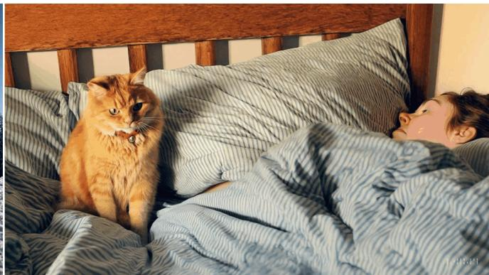
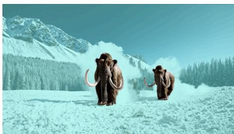
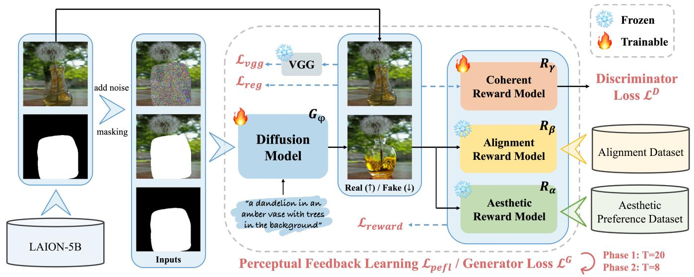
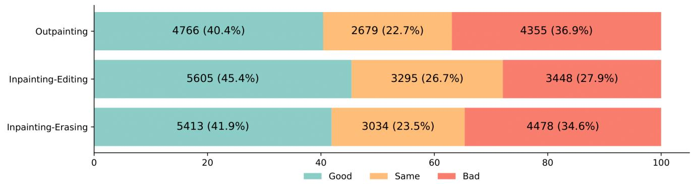
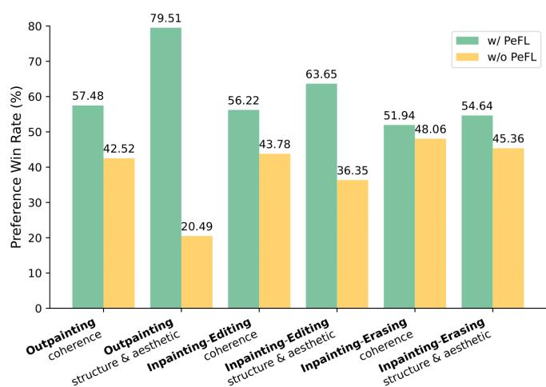
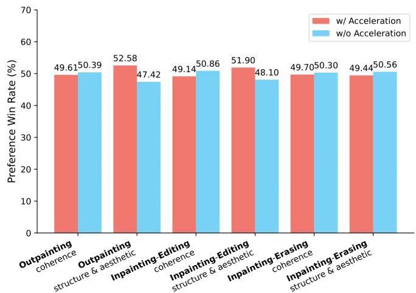

# ByteEdit

# Boost, Comply and Accelerate Generative Image Editing

Yuxi Ren , Jie Wu , Yanzuo Lu , Huafeng Kuang, Xin Xia, Xionghui Wang,* *† * Qianqian Wang, Yixing Zhu, Pan Xie, Shiyin Wang, Xuefeng Xiao, Yitong Wang, Min Zheng, Lean Fu

ByteDance Inc. Equal Contribution Project Lead * †

ECCV 2024

Research Paper

Inpainting Demo

# Outpainting Demo

# Abstract

Recent advancements in diffusion-based generative image editing have sparked a profound revolution, reshaping the landscape of image outpainting and inpainting tasks. Despite these strides, the field grapples with inherent challenges, including: i) inferior quality; ii) poor consistency; iii) insufficient instrcution adherence; iv) suboptimal generation efficiency. To address these obstacles, we present ByteEdit, an innovative feedback learning framework meticulously designed to Boost, Comply, and Accelerate Generative Image

Editing tasks. ByteEdit seamlessly integrates image reward models dedicated to enhancing aesthetics and image-text alignment, while also introducing a dense, pixel-level reward model tailored to foster coherence in the output. Furthermore, we propose a pioneering adversarial and progressive feedback learning strategy to expedite the model's inference speed. Through extensive large-scale user evaluations, we demonstrate that ByteEdit surpasses leading generative image editing products, including Adobe, Canva, and MeiTu, in both generation quality and consistency. ByteEdit-Outpainting exhibits a remarkable enhancement of $38 8 \%$ and $13 5 \%$ in quality and consistency, respectively, when compared to the baseline model. Experiments also verfied that our acceleration models maintains excellent performance results in terms of quality and consistency.

# Examples

"across river" "flower surround" "ice and snow" "muddy trail" "rainforest" "the sea"

"a coffee cup" "a cup of tea" "a pot" "coffee flavored cake" no prompt

ByteEdit formulates a comprehensive feedback learning framework that facilitating aesthetics, image-text matching, consistency and inference speed.

# Human Evaluation

To further investigate the gap between Adobe and our proposed ByteEdit, we solicited feedback from a large number of volunteers on the images generated by both, and the results are illustrated in the figure below. More than 12,000 samples are collected for each task. "Good" indicates the generated images by our ByteEdit is preferred and vice versa. The results show that users generally found the images we generated to be more natural in overall perception. Our GSB superiority percentages (i.e. $( \mathsf { G } + \mathsf { S } ) / ( \mathsf { S } + \mathsf { B } ) \ ^ { \star } \ 1 0 0 \% )$ on three different tasks are $105 \%$ , $163 \%$ , and $1 1 2 \%$ , respectively.

Human Perference Evaluation on our proposed PeFL and Acceleration. Our proposed PeFL significantly improves the generation quality, outperforming the

baseline on all different tasks. Especially in the outpainting task with PeFL, our method exceeds the baseline by about $60 \%$ in terms of structure and aesthetic. Moreover, our model has no significant loss in either consistency or structure and aesthetic with the progressive training strategy. To our surprise, we have even achieved both increasing speed and quality in the outpainting and inpainting-editing tasks.

# BibTex

@InProceedings{ren2024byteedit, title={ByteEdit: Boost, Comply and Accelerate Generative Image Edi autho $\mathsf { r } =$ {Ren, Yuxi and Wu, Jie and Lu, Yanzuo and Kuang, Huafeng an booktit $\scriptstyle { \mathsf { L e } } = \{ { \mathsf { E C C V } } \}$ , yea $r { = } \{ 2 0 2 4 \}$ }