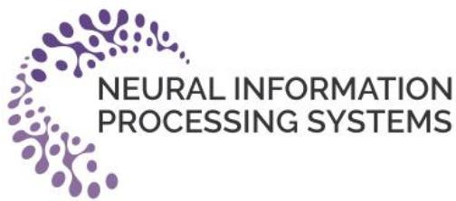
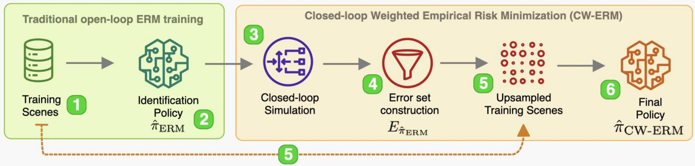
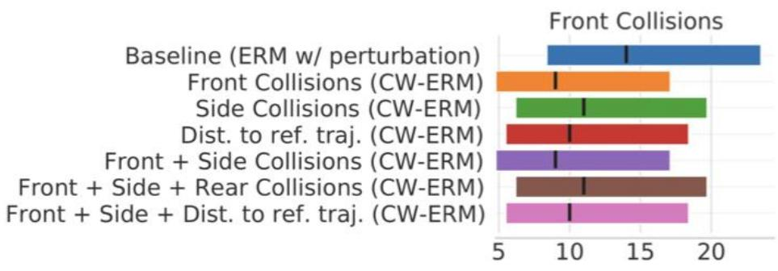
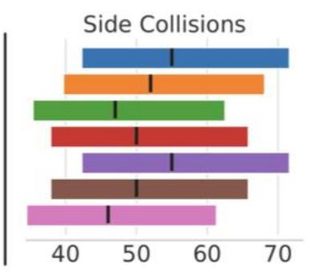
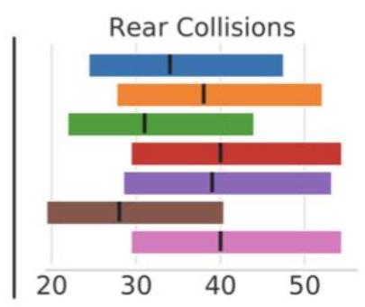
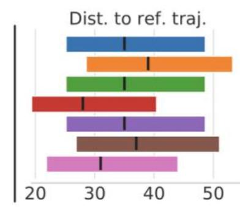
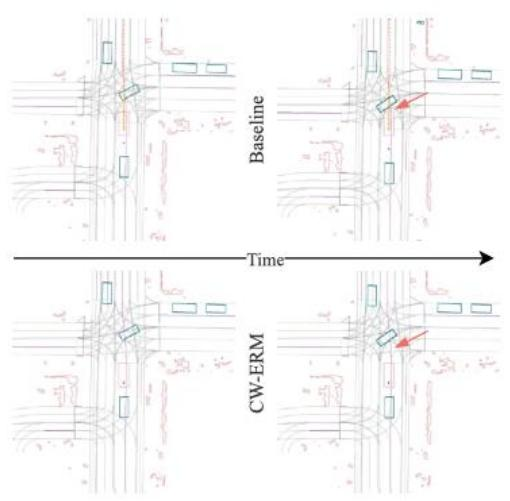
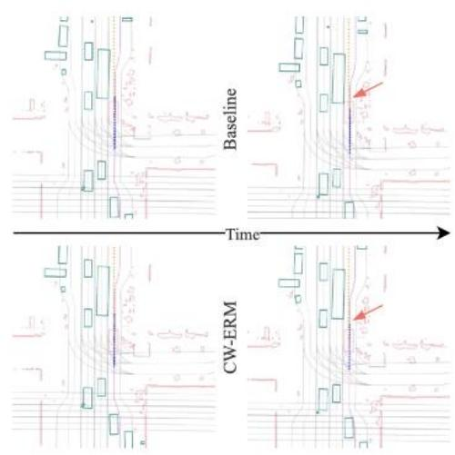

# CW-ERM: Improving Autonomous Driving Planning with Closed-loop Weighted Empirical Risk Minimization

EeshaKumar1*,Yiming Zhang²,Stefano Pini1,Simon Stent1, AnaSofia Rufino Ferreira2,SergeyZagoruyko1,ChristianS.Perone1*

1Woven Planet UnitedKingdom Limited 2Woven Planet NorthAmerica,Inc. Contact:{firstname}.{lastname}@woven-planet.global

*Equalcontribution

# Main ldeas and Motivation

·Behavior Cloning (BC)algorithms for training selfdrivingvehiclesvia pure Empirical Risk Minimization (ERM) biases policy towards matching open-loop behavior   
·We debias the policy network by identifying important samples via a closed-loop evaluator   
·Training in three phases

·Open-loop identification phase   
·Error set construction and evaluation phase   
·Upsampling training phase

# Our Contributions

·Motivate and propose a technique that leverages closed-loop evaluationmetricsacquired from policy rollouts ina simulator to debias the policy network and reduce the distributional differences between training (open-loop) and inference time (closed-loop);   
·Evaluate CW-ERMonachallenging urban driving dataset ina closed-loop fashion to show that our method,although simple to implement,yieldssignificant improvementsinclosed-loop performancewithout requiring complexand computationally expensive closed-loop trainingmethods;   
·Showan important connection of ourmethod toa familyof methods thataddresses covariate shiftthroughdensity ratio estimation.

  
Collision Avoidance Examples

# Methodology

# Stage 1(ldentification Policy)

·Train policy network via BC in open-loop using ERM,get $\hat { \pi } _ { E R M }$

# Stage 2 (Closed-Loop Simulation)

·Perform rollouts using $\hat { \pi } _ { E R M }$ in closed-loop simulator   
·Collect closed-loop metricsand identify the error set

$$
E _ {\hat {\pi} _ {E R M}} = \left\{\left(s _ {i}. a _ {i}\right) \text {s . t .} C \left(s _ {i}, a _ {i}\right) > 0 \right\},
$$

where $C ( s _ { i } , a _ { i } )$ isa cost (e.g.collisions) incurred during the closed-loop rollouts.

# Stage3 (Final Policy)

Train newpolicywherescenesblonging toER $E _ { \hat { \pi } _ { E R M } }$ areunweighted bya factor $w ( \cdot )$

$$
\underset {\pi \in \Pi} {\arg \min } \mathbb {E} _ {s \sim d _ {\pi^ {*}, a} \sim \pi^ {*} (s)} [ w (E _ {\hat {\pi} _ {E R M}}, s) \ell (s, a, \pi) ]
$$

  
Front collisions

  
Side collisions

# References

1.Liu et al.(2021).Just Train Twice: Improving Group Robustness without TrainingGroupInformation.InternationalConferenceonMachineLearning.   
2.Vitellietal.(2022).Safetynet:Safeplanningforreal-world self-driving vehicles usingmachine-learnedpolicies.International ConferenceonRoboticsand Automation (ICRA).   
3.Scheel etal.(2022).Urbandriver:Learning todrive fromreal-world demonstrationsusingpolicy gradients.Conferenceon Robot Learning.

  
woven.mobi/   
cw-erm