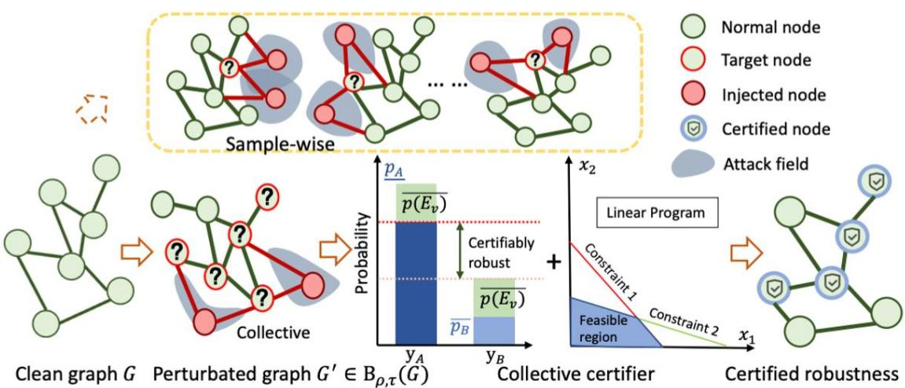
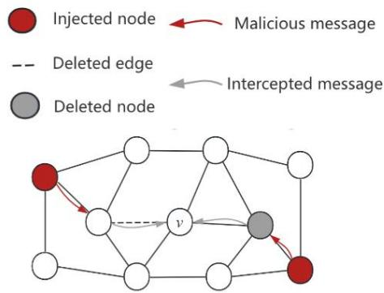
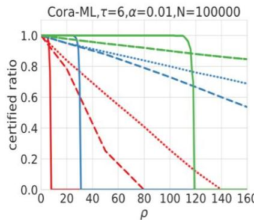
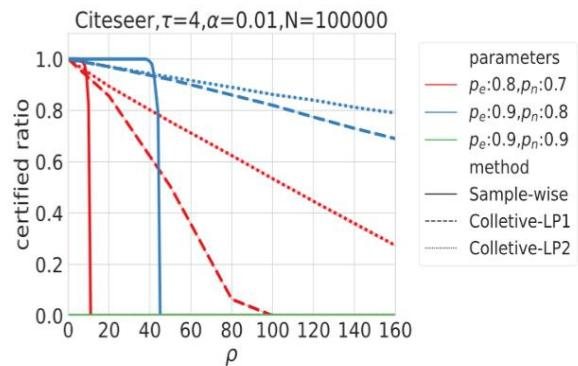
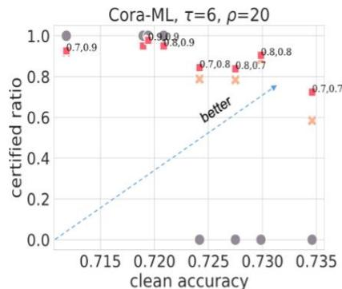
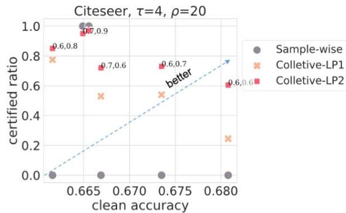

# Yuni Lai1 Bailin Pan² Kaihuang Chen² Yancheng Yuan² Kai Zhou 1

# Introduction

Deep Graph Learning (DGL) has emerged as a crucial technique across various domains. However， recent studies have exposed vulnerabilities in DGL models,such as susceptibility to graph injection attacks (GlAs). Existing research only provides sample-wise certificatesby verifying each node independently, leading to very limited certifying performance.In this paper,we present the first collective certificate against GlAs,which certifies a set of target nodes simultaneously.

# Randomized Smoothing

Forany node classifier $f ( \cdot ) .$ ,its smoothed classifier $g ( \cdot )$ is created by:

1.Node-aware Bi-Smoothing (Y. Lai.et.al.S&P2024): $\phi ( G ) = { \bigl ( } \phi _ { e } ( G ) , \phi _ { n } ( G ) { \bigr ) } ;$

$\phi _ { e } ( G )$ :randomly delete edges.   
$\phi _ { n } ( G )$ : randomly delete nodes.

2. Majority vote: $\begin{array} { r l } & { g _ { v } ( G ) : = \arg m a x _ { y \in \{ 1 , . . . , K \} } p _ { v , y } ( G ) , } \\ & { \quad p _ { v , y } ( G ) : = P \big ( f _ { v } \big ( \phi ( G ) \big ) = y \big ) . } \end{array}$

The goal of certified robustness is to verify:

$$
g _ {v} (G) \stackrel {?} {=} g _ {v} \left(G ^ {\prime}\right), \forall G ^ {\prime} \in B _ {\rho , \tau} (G).
$$

# Collective Certificate Problem

$B _ { \rho , \tau } ( G )$ : the attacker can inject $\rho$ malicious nodes, with t malicious edges per node.

T : A set of target nodes.

$$
\min  _ {G ^ {\prime} \in B _ {\rho , \tau} (G)} | \mathbb {T} | - \sum_ {v \in \mathbb {T}} \mathbb {I} \{g _ {v} \left(G ^ {\prime}\right) \neq g _ {v} (G) \},
$$

s.t. $| \tilde { \mathcal { V } } | \leq \rho , \delta ( \tilde { v } ) \leq \tau , \forall \tilde { v } \in \tilde { \mathcal { V } } .$

1.Department of Computing, The Hong Kong Polytechnic University partment of Applied Mathematics, The Hong Kong Polytechnic University

  
Figure1:While the sample-wise certificate verifies target nodes one by one,our collective certificate verifies a set of target nodes simultaneously by linear programming.

  
Figure 2: Malicious message has probability to be interceptedin the Node-aware Bi-smoothing (2-layer GNNs). (Adapted fromY.Scholten.et.al.NeurIPS2022.)

Let $p ( E _ { v } )$ denotes the probability that the malicious messages is NOT intercepted, then we have that the :absolutechangeofprediction probability is bounded by $p ( E _ { v } )$ ：

$$
\left| p _ {v, y} (G) - p _ {v, y} \left(G ^ {\prime}\right) \right| \leq p \left(E _ {v}\right).
$$

# Collective Certificatevia Optimization

$p ( E _ { v } )$ :the probability that the malicious messages is not intercepted. $c _ { v } : = p _ { v , y * } ( G ) \mathfrak { - } m a x _ { y \neq y * } p _ { v , y } ( G ) .$

$$
\max  _ {G ^ {\prime} \in B _ {\rho , \tau} (G)} M = \sum_ {v \in \mathbb {T}} \mathbb {I} \left\{\overline {{p \left(E _ {v}\right)}} \geq c _ {v} / 2 \right\},
$$

$| \tilde { \mathcal { V } } | \leq \rho , \delta ( \tilde { v } ) \leq \tau , \forall \tilde { v } \in \tilde { \mathcal { V } } ,$

The remaining |Tl - M*nodes are certified robust.

# Sample-wise v.s.Collective Certificate

Sample-wise certificates (Bojchevski et al.， 202O; Lai et al., 2023) essentially verify the prediction for a node one by one,assuming that the attacker can craft a different perturbed graph each time to attack every single node (Figure 1, top).

However，in reality，the attacker can only produce a single perturbed graph to simultaneously disrupt all predictions for a set of target nodes (Figure1,bottom).

  
Figure 3: Certified ratio comparison (GCN model).

# Evaluation Results

With the same smoothing parameter， both proposed colective certificates achieve a higher certifiableradius (Figure 3), outperforming the sample-wise approach significantly when the $\rho$ is large. For example, in the Citeseer dataset, when $\rho = 1 4 0 ,$ our Collective-LP1 and Collective-LP2 have the certified ratios of $7 3 . 0 \%$ ， and $8 1 . 2 \%$ ，while sample-wise can certify $0 . 0 \%$ nodes. Since the sample-wise and collective certificate share the same smoothed model, they always have the same clean accuracy.