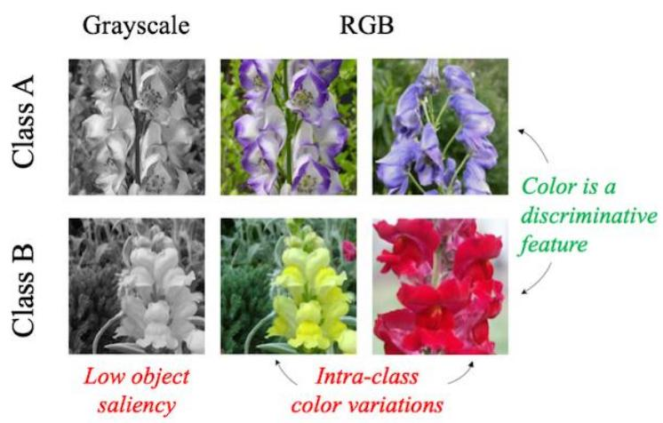
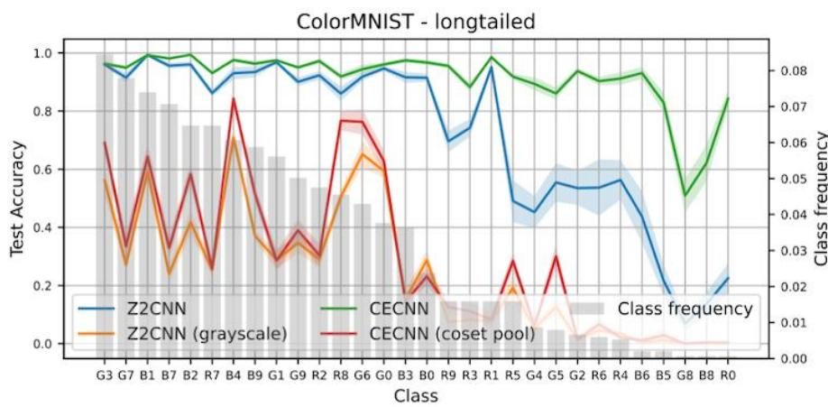
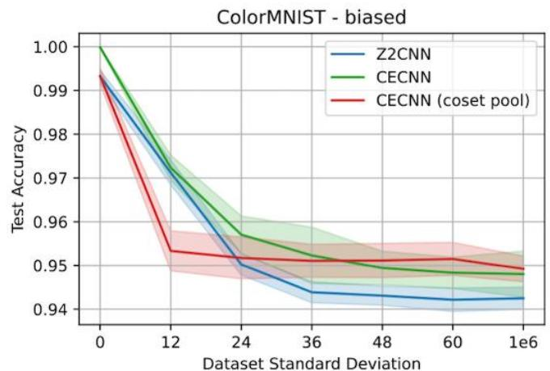
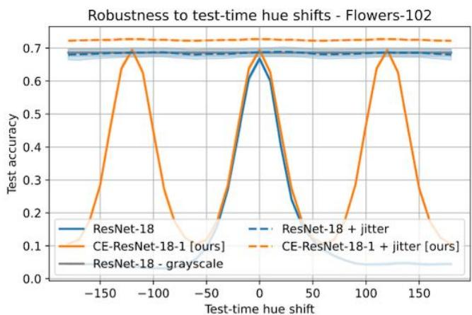
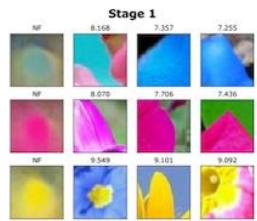
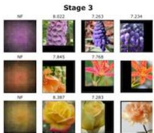

# Color Equivariant Convolutional Networks

Color is acrucial visual cue for object recognition,but CNNs fail to generalize if there is dataimbalance between color variations.Color invariance addresses this issue by removing all color information.We introduce Color Equivariant Convolutions (CEConvs): a novel deep learning building block that sharesshape features across the color spectrumwhileretaining important color information.

# Authors

Attila Lengyel,Ombretta Straforello,obert-JanBruintjes,AexanderGielisse,JanvanGemert

# Affiliations

DelftUniversityofTechnology

  
Figure1.Color isoften a discriminative feature inobject recognition. However,intra-classcolorvariationscanconfuseaclassification model.Ontheother hand,removingcolormakes flowers lessdistinct from their background and thus harder to classify.

# 01）Preliminaries

ACNN isequivarianttoa transformation Tif transforming theinput xby Tresults inanequally transformed featuremap:

$$
f (T (x)) = T ^ {\prime} (f (x))
$$

Equivariance allows parameter sharing,resulting in better data efficiency and OoD generalization.

Transformation informationisstored inextra FM dimension-invariance achieved by avg pooling.

# C02 contributions

1.We show that CNNs benefit from color information and at the same time are   
2.We introduce Color Equivariant Convolutions (CEConvs),which allows feature sharingbetween colors.   
3.We demonstrate that CEConvs improve robustness to train-test color shifts in the input.

# 03) Color Equivariant Convolutions

·CEConvs implement equivariance to hue shifts.   
Hue shifts aremodeled as 3D rotations around [1,1] diagonal,parameterized asa3x3rotationmatrix H.   
·CEConv input layer isdefined as:

$$
\left[ f \star \psi^ {i} \right] (x, k) = \sum_ {y \in \mathbb {Z} ^ {2}} \sum_ {c = 1} ^ {c ^ {l}} f _ {c} (y) \cdot H _ {n} (k) \psi_ {c} ^ {i} (y - x)
$$

·Hidden layers: cyclic permutations in color dimension.   
·Hybrid CECNNsuse CEConvs in part of network.

# 04) When is color equivariance useful?

# Synthetic toy settings:

2.Color variations:simulated by biased ColorMNisT,a10-class clasification problem where each class $c$ has its own characteristic hue $\theta _ { c }$ definedindegrees,distributed uniformlyonthe huecircle.Theexact colorofeach digit $x$ issampledaccording to $\theta _ { x } \sim N ( \theta _ { c } , \sigma )$

（LeftLong-tailedColorMNIST-CECNN（91.35±0.40%）performs significantly better than Z2CNN $( 7 . 5 9 \pm 0 . 6 1 \% )$ ).Performancemostly increases for classeswith few samples,indicating thatCEConvs areindeedmoredataefficient.Z2cNN(grayscale）and CECNN (coset pool) withanaverageaccuracy of 24.19±0.53%and29.43± 0.46%,respectively,areunable todiscriminatebetweencolors.

Right>Biased ColorMNiST-Test accuraciesfordifferent standard deviations (σ).CECNN outperforms Z2CNN across all σ.CECNN (cosetpool)outperformsCECNNforgz48-above thisvaluecolor isno longer informativeandactsasnoise.Z2cNN (grayscale)is omittedas it performssignificantlyworse,ranging between 89.89% $( \sigma = 0 )$ and79.94 $( \sigma = 1 0 ^ { 6 } )$

# 05) Robustness to color shifts

LeftTest accuracies under gradual testtime hue shift.Hue variations degrade the performanceof CNNs (ResNet-18).Grayscale imagesandcolorjitterare invariantand thus robust,butalso fail to captureuseful color features.Ourcolorequivariant network (CE-ResNet-18-1) enables feature sharingacross colorsand generalizes to discrete hue shifts. Equivarianceiscomplementarytocolorjitter asthecombinationperformsbest.

Right>Neuron Feature visualizationsoffilters atdifferent depths in the network.Rows representthe color dimension and encode thesame shape in different colors.

# 06 conclusions

·Color Equivariant convolutions enable feature sharing across colors and, unlike invariance,can still use color information.   
·CECNNsoutperformregularCNNs inacolor imbalanced or biased setting.   
CEConvs are computationally more expensive than regular convolutions.Hybrid CECNNs provide early equivariance with only limited compute increase.   
· CEConvs are only approximately equivariant due to clipping errors.   
·Future work: combine color and geometric transformationsinequivariantconvolutions.