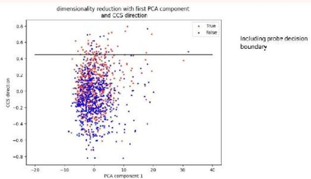
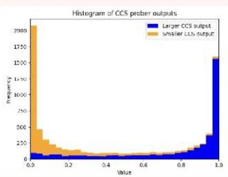
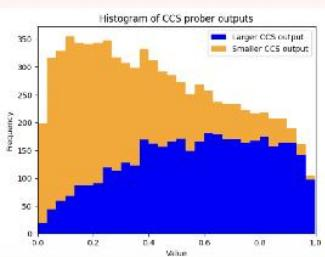

# Abstract

Weinvestigate the optimi7ation target of Contrast-Consistent Scarch (CCS),which aims lo rccovcr thc inlcrnal rcprcscnlalions of truthofalargelanguagemodel.Wepresentanewlossfunction that wecall the Midpoint-Displacernent(MD)loss function.Wedemonstratethat foracertain hyper-parametervalue thisMD loss function leads toaproberwithvery similarweightsto CCS.We further showthat this hyper-parameterisnot optimal and that withabetter hypcr-paramclcr lhc MD loss[unclion lcnlalivclyallainsa highcr test accuracy than CCS.

# Introducing Ccs

Contrast-Consistent Search (CCS),developed by Burns et al.[1].is anunsupcrviscdmclhodforcxlractingknowlcdgcfrom lhc hiddcn states of large languagemodels.Given onlyunlabelled model activations,CCSisable toaccuratelyclassify statementsaccordingto theirtruth value.It does this byutilising thenegation consistency property of truth:astatement and itsnegationmust have opposite truthvalues.Framedin terms of probabilities,given theprobability $\gamma$ thatapropositionis truc,thcprobabilityitsncgation is truc is $1 - p ,$ CCSworks by finding a direction in activation space that satisfies Lhis consislcncy conslraint.

Dataset.We take a dataset of contrast pairs $\{ ( \boldsymbol { x } ; t , \boldsymbol { x } ; t ) \} _ { i = 1 } ^ { n }$ consist ing of nalural languagc slalcmcnls $\boldsymbol { \cdot } \boldsymbol { \cdot } \boldsymbol { \cdot } \boldsymbol { \cdot }$ and Lhcir logical opposilcs $\boldsymbol { x } _ { i } ^ { - }$ Thepairsareformedbytakingaquestion ${ \dot { q } } _ { i }$ andappending with one of two mutuallyexclusiveanswers.Contrast pairsare fed toapre-trained languagemodel to obtainaset of representations $\{ ( \boldsymbol { \phi } _ { i } ^ { + } , \boldsymbol { \phi } _ { i } ^ { - } ) \} _ { i = 1 } ^ { 3 5 }$ where $\phi _ { i } ^ { \perp } : - \phi ( x _ { i } ^ { - } ) \in \mathbb { R } ^ { d }$ is theactivation vector of aparticular layer for the input $\cdot \cdot _ { i } ^ { - }$ .These representationsare then used to traina linearclassifieraccordingtoan objective designed to enforce negation consistency on contrast pairs.

In order toavoid training the classifier to simplydetect the presence ofthemutually exclusive answers,thesets $\{ \Leftrightarrow _ { i } ^ { + } \}$ and $\{ \phi _ { i } ^ { - } \}$ should beindependentlynormalized.Thenormalized representationsare given by

$$
\tilde {\phi} _ {i} ^ {-} := \frac {\phi_ {i} ^ {-} - \mu^ {-}}{\sigma^ {\perp}}, \tag {1}
$$

where $( \mu ^ { \perp } , \sigma ^ { - } )$ are the meansand standard deviations of therespective sets.「or convenience,we will omit the tilde and simply use ${ \boldsymbol { \phi } } _ { \hat { \imath } } ^ { + }$ torepresent the normalized representations.

Loss Function.Alinear classiffer $p _ { 0 , { \dot { \boldsymbol { \psi } } } } : \dot { \boldsymbol { \wp } }  \sigma ( \boldsymbol { \wp } ^ { T } \dot { \boldsymbol { \phi } } | \mathbf { \Sigma } b )$ is trained on thcnormalizcd activations,whcrc $\sigma$ is thc sigmoid function, $\theta$ isa vector of weights and $b$ isa bias.The loss function is given by

$$
L _ {\mathrm {C C S}} (\theta , b) := - \frac {1}{n} \sum_ {i = 1} ^ {n} \left[ 1 - p _ {\theta , b} \left(\phi_ {i} ^ {+}\right) - p _ {\theta , b} \left(\phi_ {i} ^ {-}\right) \right] ^ {2} + \min  \left\{p _ {\theta , b} \left(\phi_ {i} ^ {+}\right), p _ {\theta , b} \left(\phi_ {i} ^ {-}\right) \right\} ^ {2}.
$$

Thefirst term encourages the classifier to find featuresthatare negation-consistent and the second term is included todisincentivise the degenerate assignment $p _ { \theta , \delta } ( \dot { \phi } _ { i } ^ { + } ) = p _ { \theta , \delta } ( \phi _ { i } ^ { - } ) = 0 . 5 ,$

Inference.Tomakeaprediction onanexample $q _ { i }$ after training,the average

$$
\bar {p} _ {i} \left(q _ {i}\right) := - \frac {1}{2} \left(p _ {\theta , b} \left(\phi_ {i} ^ {+}\right) + \left(1 - p _ {\theta , b} \left(\phi_ {i} ^ {-}\right)\right)\right) \tag {3}
$$

iscompared to0.5with $p _ { i } > 0 . 5$ correspondingto either theanswer "yes"or"nobased on whichever gives the maximum accuracy ona givcn lcsl scl.

# Clarifying Ccs

A natural guess for how CCs isable toaccurately classify truth isLhal Lhe normalizcd model reprcscntalionsare approximalcly clusteredaccordingtotruthandthatCCSisable tofindahyperplanethat separates these two clusters.However,this explanation is incorrect.

Recall thatafter training,an example $q _ { i }$ is classified according to $\smash { p ( q _ { i } ) \geq 0 . 5 }$ .Usingcquation 3.this condition rcduccsto

$$
\sigma \left(\theta^ {T} \phi_ {i} ^ {-} + b\right) > \sigma \left(\theta^ {T} \phi_ {i} ^ {-} - b\right)
$$

$$
\rightarrow \theta^ {T} \left(\phi_ {i} ^ {+} - \phi_ {i} ^ {-}\right) > 0.
$$

We see that CCS is classifying only according to the displacement vectors $\{ \phi _ { i } ^ { - } - \phi _ { i } ^ { - } \}$ .Since theseare translation invariant.CCsdoes notrequire the contrast pairs to be separable bya hyperplane. Figure1 shows an example inwhich CCS is nol finding a separalinghyperplane evenwhen it gainsa high testaccuracy.

  
Figure1.We ccnsider activatiors of theT5-base mode on the BoolQ train dataset.On tcr-ax's wc plot thc projcctions of thc activation5 $\dot { \mathcal { O } _ { i } }$ ortothe first principlecomponentandonthe $y ^ { * }$ axiswe lolthedatapoints projected onto.Wc colour thc datzpoints；əy tnc (grourd-truth) truth-labcls'truc'(red) anc‘fasc'(bluc) o²thc datapoints $x _ { i } .$ Thc hor'zontal linedicates treinputs fowhich CCS outputs0.5.

Additiorally,the original paper:1]presents CCSas learning prob abilities for the truth values of contrast pairs.We suggest abandoning thisprobabilities framing.Figure2 shows that CCScan stillperform well evenwhenthe probabilitiesare strongly clustered around 0.5.

  
  
Figure2.(a) Histograrrd'splayingthe CCSorober otputs evaluated o1te lest hidden state of theercoder cf UnfiedQAT5-Large for the Bco Q datasct.(b) H'stogram d splaying thc CCS orobcrotputs cvaluated othc lsthiddenstateoftedecoderofUifedQAT5-LargefortheBoolQdtatset. Dcspite the cncodcravi-ga higher confidence in thc prober outouts,the encoder nasa lower lesl accuracy(O.523)than Lhedecccer(0.978).

# Introducing the MD loss function

Usingthe normali7ed weight vectorθ we define the following quan-

$$
u _ {i} := \phi_ {i} ^ {+} - \phi_ {i} ^ {-}, \text {a n d}
$$

$$
\sigma_ {d} ^ {2}: - \frac {1}{n} \sum (\hat {\theta} ^ {T} u _ {i}) ^ {2}. \tag {4}
$$

Hcrc $u _ { i }$ isthcdisplaccmcnt bctwccn thc activations ofa contrast pairand $\sigma _ { \it 2 } ^ { 2 }$ isthemean square separation of the activations of the contrast pairsalong the direction0.

Furthermore,we analogouslydefine

$$
v _ {i} := \phi_ {i} ^ {+} + \phi_ {i} ^ {-}, a n d
$$

$$
\sigma_ {m} ^ {2} := \frac {1}{n} \sum (\hat {\theta} ^ {\tau} v _ {i}) ^ {2}. \tag {5}
$$

$\frac { v _ { i } } { 2 }$ $\frac { \sigma _ { m } ^ { 2 } } { 4 }$ is the mean square value of the midpoint of the activations of the contrast pairs alongthc dircctionθ.

We proposea newloss function and demonstrate that this new loss funclion isa good proxy oplimisalion largel for CCs.Thc ncwloss function is given by

$$
L _ {\mathrm {M D}} - (\lambda - 1) \sigma_ {d} ^ {2} \quad \lambda \cdot \sigma_ {m i} ^ {2}, \tag {6}
$$

where $\lambda \in \left[ 0 , 1 \right]$ isahyper parameter controllingthe relative trade off betwccn $\sigma _ { d } ^ { 2 }$ and $\sigma _ { m } ^ { 2 } ,$ and LhewcighL vcctor $\theta$ is constraincd Lo satisfy $| \theta | = 1$

Tounderstand whyweuse this loss function,first that the CCsloss functionincentivisesincreasing the separation of the prober outputs of conlrasl pairs $| p ( \phi _ { i } ^ { \ : | } ) - p ( \phi _ { i } ^ { - } ) |$ Consider a CCSprober $p ( \phi ) -$ $\sigma \langle \theta ^ { T } \phi + \bar { \theta } \rangle$ in which $\theta$ is constrained toa fixed norm $\vert \theta \vert = c$

Inorder for CCS to increase the difference between prober outputs,onemight expect that CCsfindsadirection that increases the difference of the prober inputs (since sigmoid is a monotonically increasing function).Thatis to say,onemight expect CCSwill find a direction that maximises $\sigma _ { \mathcal { I } } ^ { 2 }$

However,if $\sigma _ { m } ^ { 2 }$ ismuch larger than $\sigma _ { \it ( l } ^ { 2 }$ ,then theinput to the sigmoid foreach contrast pair(i.e $\theta ^ { T } ( \vec { \cdot } ) _ { i } ^ { + } + b$ and $\theta ^ { T } { \phi } _ { i } ^ { - } + b )$ will be pushed into thesame saturation regime of the sigmoid.This resultsina lower differencein prober outputs of contrast pairs,which in turn results inalradeoff betweenmaximising $\textstyle ( \mathcal { T } _ { \vec { d } } ^ { 2 }$ while minimising $\sigma _ { m } ^ { 2 }$

It should be stressed that this trade off between $\sigma _ { \mathcal { I } } ^ { 2 }$ and $\sigma _ { m } ^ { 2 }$ is purely anartifact of the double saturation of sigmoid used in the CCS prober.Since this trade off should occur no matterwhat $| \theta | = c$ is constrained to,we propose that the unconstrained CCS prober is ingencraloptimisingforsomcbalanccbctwccn $\sigma _ { \it d } ^ { 2 }$ and $\sigma _ { m } ^ { 2 }$

# Results

structure as the CCS probers, $p ( \boldsymbol { \phi } ) = \sigma ( \boldsymbol { \theta } ^ { T } \boldsymbol { \phi } + b ) ,$

# Similarity

In Table 1 we find that the average cosine similarity between the weight vector of the CCS prober and theweight vector of the prober trained using our new MDmethod isabout O.63.Forreference,the probabilityof twouniformlysampled1o24-dimensionalunit vectorshavingacosinesimilarityof 0.63 or higherisapproximalely $1 0 ^ { - 2 3 7 }$ Notethat theCCS probershadanaveragecosine similarily with themselves of only O.78.This suggests that the MD-CCs lossfunction isagood proxy optimization target for CCS.

<table><tr><td rowspan="2">Model</td><td colspan="8">Loss Function</td></tr><tr><td>CCS</td><td>MD-CCS</td><td>MD-Acc</td><td>MA</td><td>SMR</td><td>PCA</td><td>Rand.</td><td>Superv.</td></tr><tr><td>UQA (E)</td><td>0.8359</td><td>0.7034</td><td>0.2995</td><td>0.1418</td><td>0.1991</td><td>0.2406</td><td>0.0222</td><td>0.2583</td></tr><tr><td>UQA (D)</td><td>0.8787</td><td>0.7269</td><td>0.5303</td><td>0.1687</td><td>0.2432</td><td>0.1792</td><td>0.0228</td><td>0.6014</td></tr><tr><td>DcBERTa</td><td>0.8643</td><td>0.6209</td><td>0.2786</td><td>0.2309</td><td>0.2024</td><td>0.0741</td><td>0.0202</td><td>0.4617</td></tr><tr><td>GPT-Neo</td><td>0.5277</td><td>0.4830</td><td>0.4164</td><td>0.0226</td><td>0.0485</td><td>0.1901</td><td>0.0245</td><td>0.1347</td></tr><tr><td>Average</td><td>0.7767</td><td>0.6336</td><td>0.3812</td><td>0.1418</td><td>0.1733</td><td>0.1710</td><td>0.0224</td><td>0.3640</td></tr></table>

Table1.We compute thcaverage ccsine similar'tics of tncdirecticns foundusing different lossfunctions ta the direcionsof 2OCC5probers.Weaverageoverfvedatasetsusingtheactivationsofourdifferentmodels.Foreachrow welaveenboderedthelossfunctionthatobtaedthehighestaveregecosinesinilaitywithCCS.notincludingte CCS lcss furcticn. Notc that thc(E)and (D)rcfer to trc ccodeand decoderlayers of the UQA model.

# Accuracy

In Table 2 we show the test accuracies of probers trained using the MD loss function on various datasetsand models.We tentatively findthat the accuracies of thenewprobersare similarto those achieved byCCS,and oftenout-perform CCS.Note that MD-Accprobersgeta higher test accuracy LhanbolhLhe MD-CCSandCCSprobersfor threeoulof fourmodels,foranaveragedifferenceof around4%.

<table><tr><td rowspan="2">Model</td><td colspan="8">Loss Function</td></tr><tr><td>CCS</td><td>MD-CCS</td><td>MD-Acc</td><td>MA</td><td>SMR</td><td>PCA</td><td>Rand.</td><td>Superv.</td></tr><tr><td>UQA (E)</td><td>0.6863</td><td>0.6902</td><td>0.7414</td><td>0.7399</td><td>0.7419</td><td>0.7383</td><td>0.6363</td><td>0.8839</td></tr><tr><td>UQA (D)</td><td>0.8305</td><td>0.8200</td><td>0.8180</td><td>0.7550</td><td>0.7460</td><td>0.7525</td><td>0.6286</td><td>0.9140</td></tr><tr><td>DeBFRTa</td><td>0.7740</td><td>0.7855</td><td>0.8735</td><td>0.8650</td><td>0.8585</td><td>0.8605</td><td>0.7288</td><td>0.9135</td></tr><tr><td>CPT-Neo</td><td>0.5510</td><td>0.5755</td><td>0.5898</td><td>0.5820</td><td>0.5555</td><td>0.5737</td><td>0.5603</td><td>0.7580</td></tr><tr><td>Average</td><td>0.7105</td><td>0.7178</td><td>0.7557</td><td>0.7355</td><td>0.7255</td><td>0.7313</td><td>0.6385</td><td>0.8674</td></tr></table>

Table2.Wecompare test accurac'esofdifferent lossfunctiorsaveragedoverfvedatasets,usingthezctivatio5of a nurborofmodels.Focachrowwchavccrboldcnedthclossfurcticnthatobtainccthchighestavcragetcstaccuracy nolincludingthe supervisedloss.Te)anc (D)abels relerlo the encoderanddecoderlayerscl the UQAmode.

# References