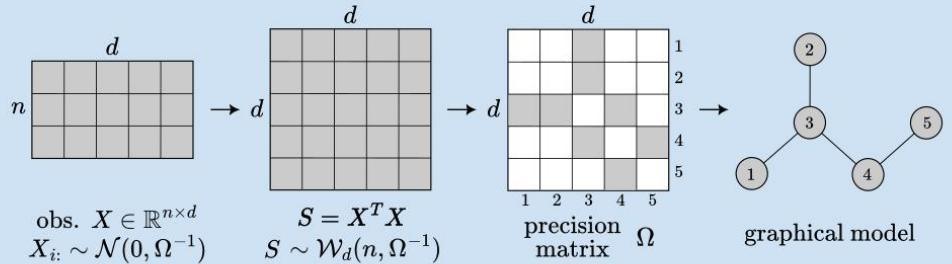
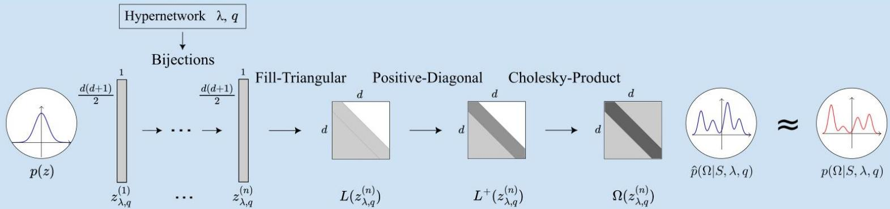
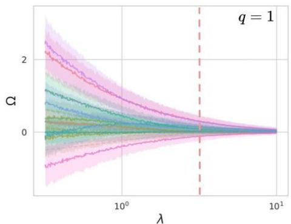
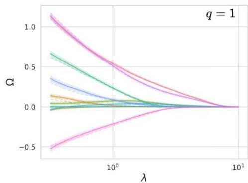
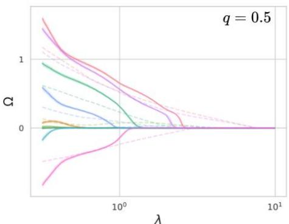
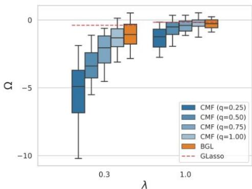

# Conditional Matrix Flows for Gaussian Graphical Models

Marcello Massimo Negri,Fabricio Arend Torres,VolkerRoth Department of Computer Science,University of Basel,Switzerland marcellomassimo.negri@unibas.ch

# Gaussian Graphical Models: Graphical Lasso

GGMs provides structural information: $\Omega _ { i j } = 0$ implies conditional independenceoffeatures $i$ and $j$ givenall remaining features   
Maximum likelihood estimate of $\Omega$ is not sparse and for $d > n$ is not unique penalized likelihood to encourage sparse $\Omega$ $\begin{array} { r } { \operatorname * { a r g m a x } _ { \Omega \sim 0 } \{ \log \operatorname* { d e t } \Omega - \operatorname { T r } ( \frac { 1 } { n } S \Omega ) - \lambda \| \Omega \| _ { 0 } \} } \end{array}$

Intractable because the objective is highly non-convex

· Graphical Lasso: use convex relaxation $\| \Omega \| _ { 0 } \longrightarrow \| \Omega \| _ { 1 }$

# Benefits

$\clubsuit$ Solution path: frequentist approach provides solutions as a function of $\lambda$

# Limitations

$\clubsuit$ Over-shrinking: $l _ { 1 }$ norm causes well-known over-shrinking of features   
$\clubsuit$ No credibility interval

# Bayesian Graphical Lasso

·Bayesian approach: $p ( \Omega | S , \lambda ) \propto p ( S | \Omega ) \ p ( \Omega | \lambda )$   
· Encourage sparsity with double exponential prior (DE)

$$
p (S | \Omega) \propto \mathcal {W} _ {d} (n, \Omega^ {- 1})
$$

$$
p (\Omega | \lambda) \propto \mathcal {W} _ {d} (d + 1, \lambda 1 _ {d}) \prod_ {i <   j} \mathrm {D E} (\omega_ {i j} | \lambda) I [ \Omega \succ 0 ]
$$

·Recovers the $l _ { 1 }$ norm penalized likelihood solution in the MAP limit

# Benefits

$\clubsuit$ Credibility interval: canbe computed within Bayesian framework

# Limitations

$\clubsuit$ Expensive posterior sampling:needs Gibbs sampler (also limits prior choice)   
$\clubsuit$ Over-shrinking:prior cannotbe generalized to sub- $\boldsymbol { l } _ { 1 }$ pseudo-norms   
$\clubsuit$ Expensive solution path: independent Markov chains for each Avalue

# Conditional Matrix Flow for Gaussian Graphical Models

Goal:unify benefits offrequentist and Bayesian frameworks while overcoming limitations

Wproposeaert flowacontinuum of sparse regressionmodels jointly forallregularization parameters $\lambda$ andall $l _ { q }$ norms,icdingooesub $\mathbf { \cdot } l _ { 1 }$ pseudo-norms.

# PROPOSEDAPPROACH

VARIATIONAL INFERENCE

·PosteriorapproximationandeffcentsamplingviaNormalizngFlow: $\mathrm { D } _ { \mathrm { K L } } \big ( \hat { p } ( \Omega | S , \lambda ) | | p ( \Omega | S , \lambda ) \big )$   
· Free choice of prior $p ( \Omega | \lambda )$ and likelihood $p ( S | \Omega ) $ model any Bayesian GGMs beyond Lasso

SUB- $\boldsymbol { \cdot } \boldsymbol { l } _ { 1 }$ PSEUDO-NORMS

· Generalized Gaussian Distributions (GGD) as sparsity-inducing priors corresponding to $\iota _ { q }$ (pseudo-) norms

$$
\operatorname {G G D} (x | \lambda , q) = \frac {q \lambda^ {1 / q}}{2 \Gamma (1 / q)} \exp \{- \lambda | x | ^ {q} \}
$$

CONDITIONALFLOW

·Condition the Normalizing Flow on $\lambda$ and $q$ to obtain solution paths   
·Can select $\lambda$ by maximizing marginal likelihood

  
ARCHITECTURE

· Condition bijections on Xand $q$ and define flow on space of symmetric positive definite matrices by construction   
EfficientlogdeterinantofJacobanforCholesk-Product→dethL)=2d(i

# Combine benefits

$\clubsuit$ Credibility intervals:sample-based credibility intervals forany $\lambda$ and $q$   
$\clubsuit$ Solution paths:we recover Bayesian Graphical Lasso ( $T = 1$ )and Graphical Lasso solutionpaths $( T \to 0 )$ bytrainingwithsimulatedannealing

# Overcome limitations

$\clubsuit$ Cheap posterior sampling:no need for sequential Gibbs sampler   
$\clubsuit$ No over-shrinking:GGD prior enables exploration of sub- $l _ { 1 }$ pseudo-norms   
$\clubsuit$ Model selection:direct access to the marginal likelihood for selecting X

  
Bayesian solution pathat $T = 1$ &model selection

  
Frequentist solution path at $T \to 0$

  
Solution path in sub-l1 regime

  
Credibility intervals in sub $l _ { 1 }$ regime: no over-shrinking

# References

N.Meinshausen and P.

Buhlmann (2006).

“High-dimensional graphs

andvariable selection

with the Lasso"In:

H.Wang (2012)

"Bayesian Graphical

Lasso Modelsand

EfficientPosterior

Computation." In:

G.Papamakarioset al

（2021)“Normalizing

Flowsfor Probabilistic

Modelingand Inference"