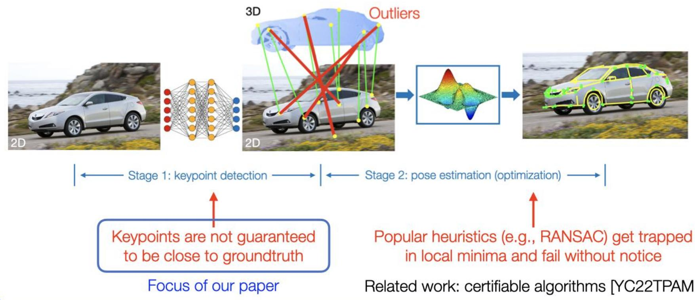
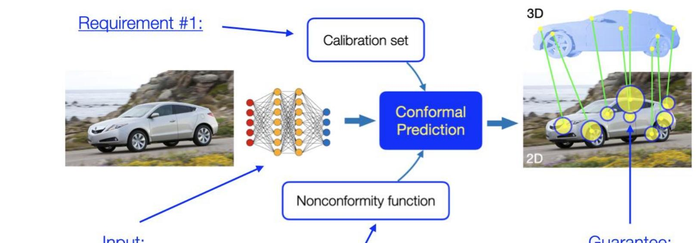
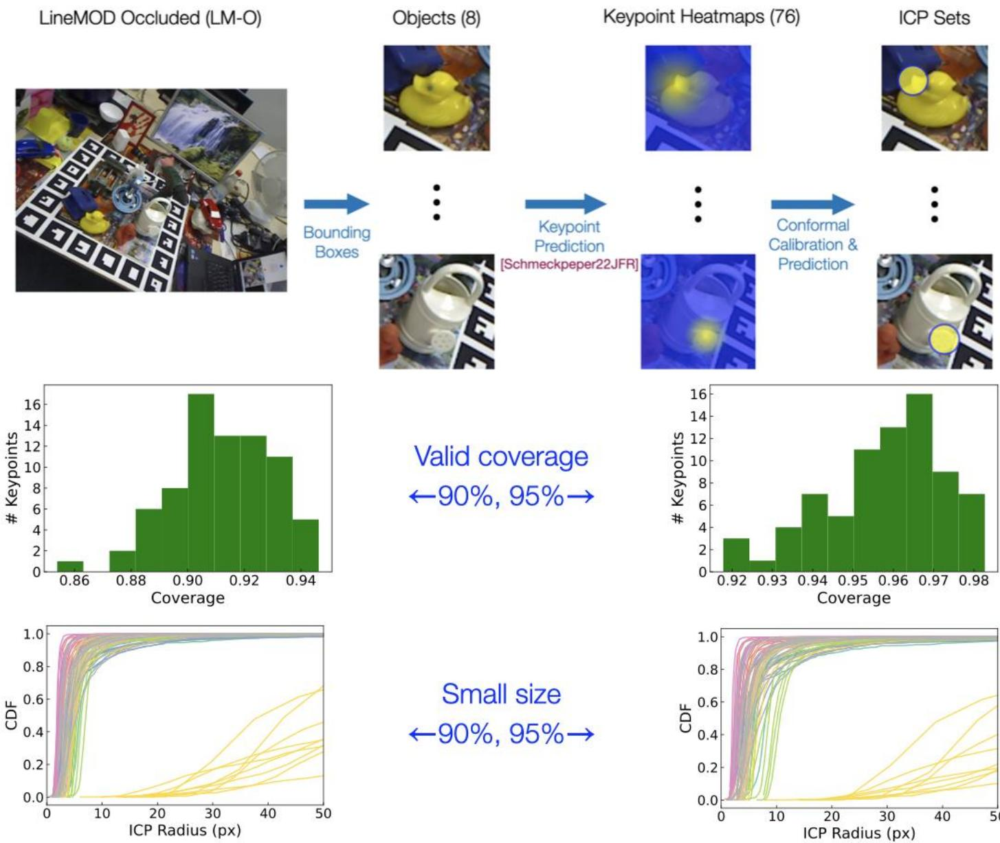
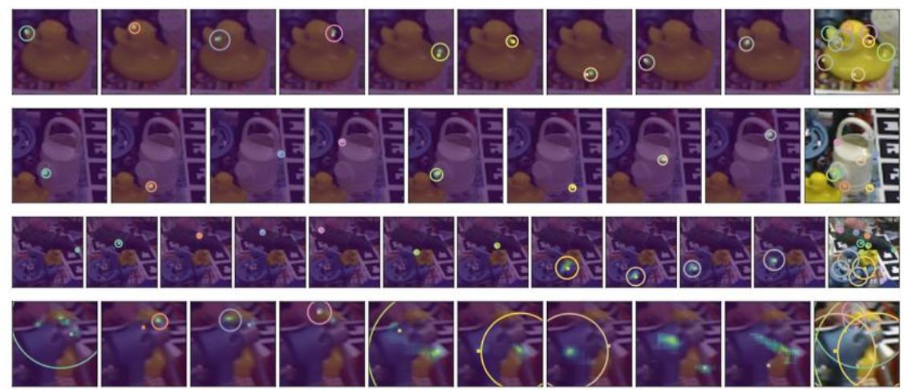

# Heng Yang and Marco Pavone

Workshop on Robot Learning: Trustworthy Robotics

  
Object Pose Estimation: why untrustworthy?

# Our method: conformal keypoint detection

Paradigm shift: from heuristic prediction to probabilistically correct prediction sets

Keyingredient: inductive conformal prediction (ICP)- finite-sample uncertainty quantification without assumptions on the data distribution or the prediction model

Input: Heuristic prediction (e.g., heatmap of the keypoint location)

Requirement #2: See paper for details!

Guarantee:

Cover the true keypoints with a userspecified probability (e.g., $90 \%$

# Experiments: works out of the box!

Setup:200 images forcalibration,1214images for testing User: give me $90 \%$ and $9 5 \%$ coverage of the true keypoints

