# DRAGONN: Distributed Randomized Approximate Gradients of Neural Networks

Zhuang Wang*, Zhaozhuo Xu*, Xinyu Crystal Wu, Anshumali Shrivastava,and T.S. Eugene Ng

* equal contribution

# Introduction

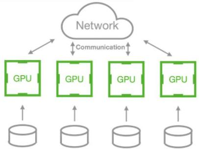  
Data-parallel Distributed Training (DDT)   
Training with multiple GPUs

# Communication bottleneck in DDT

# Computation gets faster

·Advanced DNN accelerators   
。P100->V100->A100   
·Advanced DNN compilers   
  
·The single-GPU iteration time of ResNet50 has reduced by 22x

  
Communicationbecomesthe performance bottleneck

# Gradient Sparsification (GS)

# Selecttop-k gradients for synchronization

·Exact TopKGS   
·Approximate TopK GS,e.g.,DGC

# Save up to 99.9% the gradient exchange

·Greatly reduce the communication time

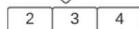

  
Limitations of previous GS

# Method

# GS does not always help

·Full synchronization is better than DGC forsmaller tensors

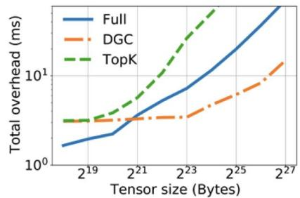

# GSbecomes the major bottleneck

. Compression time exceeds communication time

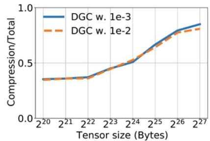  
DRAGONN: a hashing-based compressor

# Cheap encoding operations

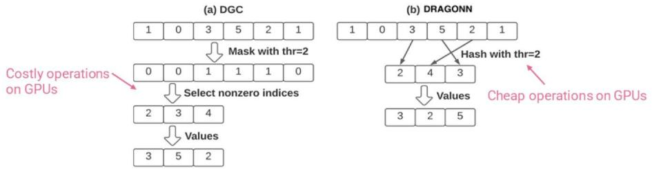

# Deploying DRAGONN in Practice

# Efficiency-awaretensor selectionforGS

·Apply DRAGONN to tensors only when itbenefits the iteration time

# Sparse decoding

·Minimize the decoding overhead after communication

# Experiment

Evaluations

# Training throughput

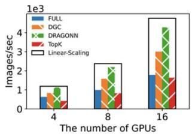  
ResNet50 overImageNet

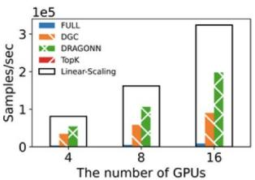  
XMLover Wiki10-31K

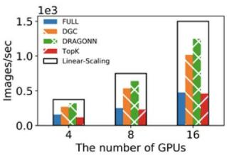  
ViT over ImageNet

# Accuracy vs Iteration

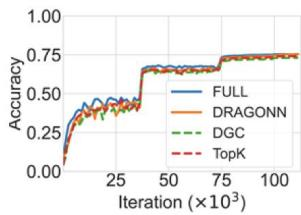  
ResNet50

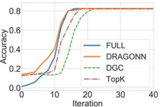  
XML

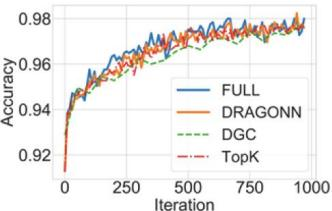  
ViT

# Improvementbreakdown

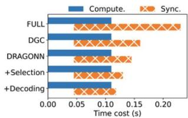  
ResNet50

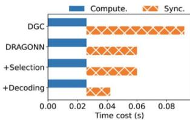  
XML

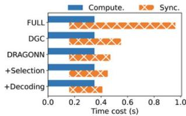  
ViT

# Acknowledgements

NSF, ONR DURIP, ONR BRC and Ken Kennedy Institute BP fellowship