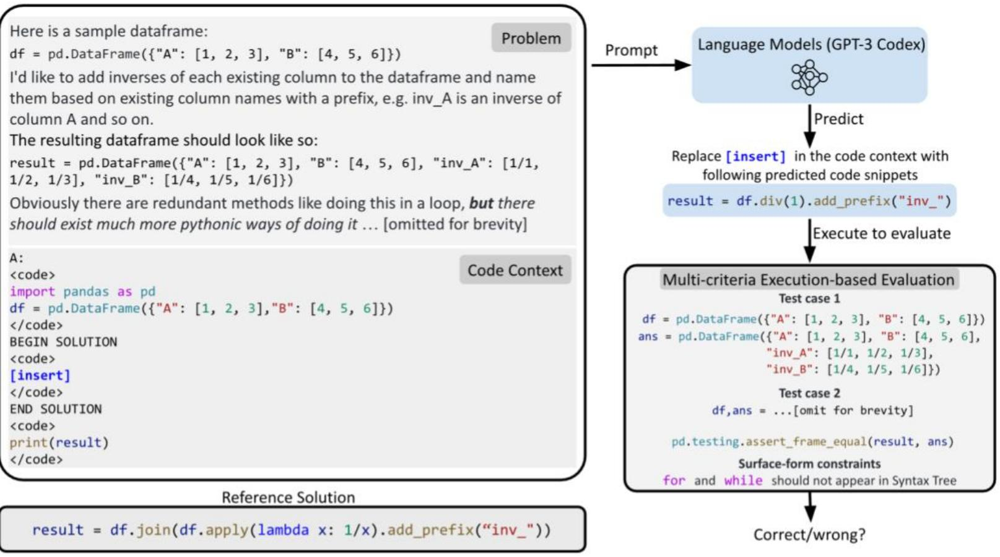
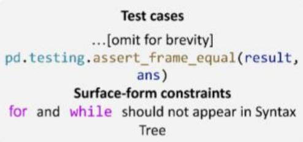
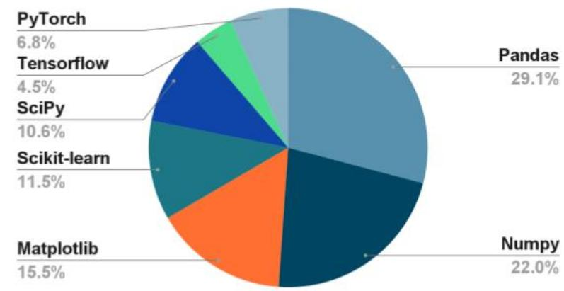
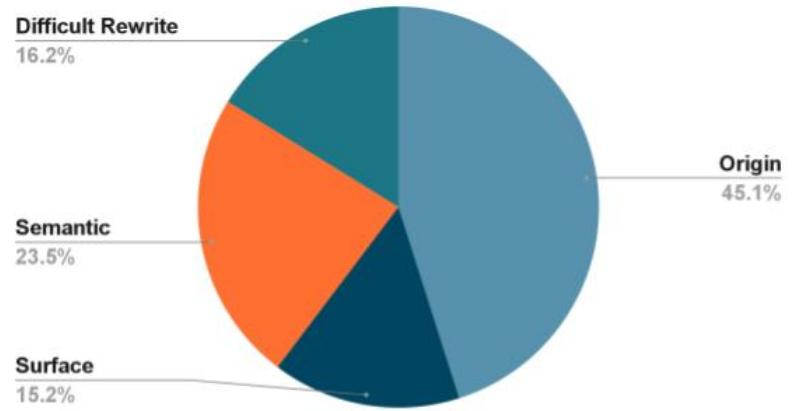
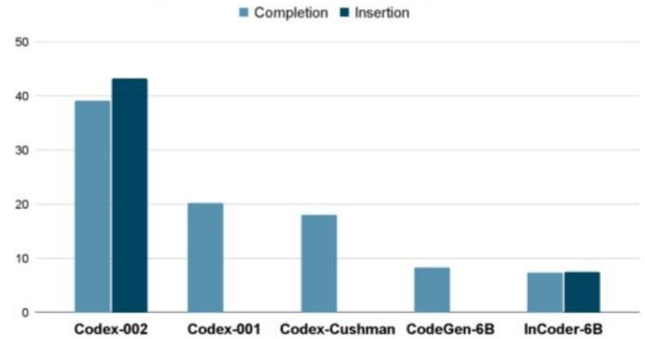
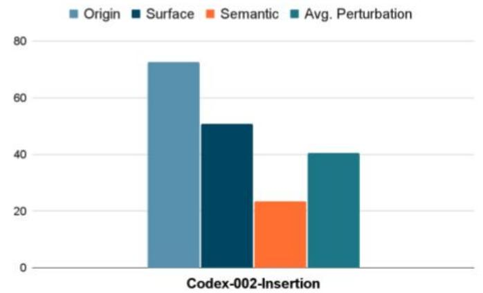

# DS-100o: A Natural and Reliable Benchmark for Data Science Code Generation

# An Example Problem in DS-1000

# The Pipeline for Building DS-1000

# Manually SelectingandModifyingStackOverflowProblems

<table><tr><td>Here is a sample dataframe: 
df = pd.DataFrame({&#x27;A&#x27;: [1, 2, 3], &quot;B&quot;: [4, 5, 6]})</td><td>High vote</td></tr><tr><td>I&#x27;d like to add inverses of each existing column to the dataframe 
and ... [omitted for brevity]</td><td>Testable</td></tr><tr><td>try:</td><td>Useful</td></tr><tr><td colspan="2">inv_df = df.join(df.apply(lambda x: 1/x).add_prefix(&quot;inv&quot;))</td></tr></table>

# ②Adding Code Context

<table><tr><td>import pandas as pd</td></tr><tr><td>df = pd.DataFrame({&#x27;A&#x27;: [1, 2, 3],
                    &quot;B&quot;: [4, 5, 6]})</td></tr><tr><td>##### BEGIN SOLUTION
[insert]</td></tr><tr><td>##### END SOLUTION</td></tr><tr><td>print(result)</td></tr></table>

# Implementing Automatic Tests

# ④Perturbing Original Problem

<table><tr><td>... I&#x27;d like to apply the exponential function to each existing column ... The resulting dataframe should look like so:</td></tr><tr><td>result = pd.DataFrame({&#x27;A&#x27;: [1, 2, 3], &#x27;B&#x27;: [4, 5, 6], &#x27;exp_A&#x27;: [e^1, e^2, e^3], &#x27;exp_B&#x27;: [e^4, e^5, e^6]})</td></tr><tr><td>... [omitted for brevity]</td></tr></table>

# Red Teaming

<table><tr><td>df = pd.DataFrame({&#x27;A&#x27;: [1, 2, 3],
&quot;B&quot;: [4, 5, 6]})</td></tr><tr><td>##### BEGIN SOLUTION</td></tr><tr><td># A known WRONG SOLUTION</td></tr><tr><td>result = df.join(df.apply(lambda
x: math.e**x).add_prefix(&#x27;exp&#x27;))</td></tr><tr><td>## END SOLUTION</td></tr><tr><td>print(result)</td></tr></table>

·Problems reflect diverse,realistic,and practical daily usage collected from StackOverflow   
· Highly specific evaluation ensure its reliability - very few $( 1 . 8 \% )$ incorrect predicted solutions pass our evaluation   
·Proactively defend against memorization by perturbations

# Dataset Statistics

Comparison to other benchmarks - the first three target general Python usage and the next three involve data science code generation

<table><tr><td>Dataset</td><td>Problems</td><td>Evaluation</td><td>Avg. Test Cases</td><td>Avg. P Words</td><td>Avg. Lines of Code Solution</td><td>Data Source</td></tr><tr><td>HumanEval</td><td>164</td><td>Test Cases</td><td>7.7</td><td>23.0</td><td>6.3</td><td>Hand-Written</td></tr><tr><td>MBPP</td><td>974</td><td>Test Cases</td><td>3.0</td><td>15.7</td><td>6.7</td><td>Hand-Written</td></tr><tr><td>APPS</td><td>10000</td><td>Test Cases</td><td>13.2</td><td>293.2</td><td>18.0</td><td>Competitions</td></tr><tr><td>JuICe</td><td>1981</td><td>Exact Match + BLEU</td><td>-</td><td>57.2</td><td>3.3</td><td>Notebooks</td></tr><tr><td>DSP</td><td>1119</td><td>Test Cases</td><td>2.1</td><td>71.9</td><td>4.5</td><td>Notebooks</td></tr><tr><td>CoNaLa</td><td>2879</td><td>BLEU</td><td>-</td><td>13.8</td><td>1.1</td><td>StackOverflow</td></tr><tr><td>DS-1000</td><td>1000</td><td>Test Cases + Surface-Form Constraints</td><td>1.6</td><td>140.0</td><td>3.6</td><td>StackOverflow</td></tr></table>

# Experiments

Afrequently occurring NumPy problemset on GitHub

<table><tr><td></td><td>Pandas</td><td>NumPy</td><td>Scikit-learn</td><td>SciPy</td><td>TensorFlow</td><td>PyTorch</td><td>Overall</td></tr><tr><td>Originsurface</td><td>37.3</td><td>61.2</td><td>52.6</td><td>33.0</td><td>64.9</td><td>64.8</td><td>53.2</td></tr><tr><td>Surface</td><td>31.9 -5.4</td><td>58.4 -2.8</td><td>55.7 +3.1</td><td>32.1 -0.9</td><td>58.0 -8.9</td><td>50.0 -14.8</td><td>49.8 -3.4</td></tr><tr><td>Originsemantic</td><td>36.8</td><td>56.7</td><td>60.6*</td><td>40.3</td><td>71.3</td><td>65.1</td><td>47.2</td></tr><tr><td>Semantic</td><td>33.2 -3.6</td><td>49.0 -7.7</td><td>38.9* -21.7</td><td>34.3 -6.0</td><td>42.5 -25.8</td><td>30.5 -34.6</td><td>38.2 -9.0</td></tr><tr><td>Origindifficult</td><td>39.9</td><td>52.7</td><td>5.0*</td><td>58.1</td><td>73.0*</td><td>53.8*</td><td>46.8</td></tr><tr><td>Difficult Rewrite</td><td>17.7 -22.2</td><td>27.1 -25.6</td><td>0.0* -5.0</td><td>13.8 -44.3</td><td>38.0* -35.0</td><td>28.8* -25.0</td><td>21.0 -25.8</td></tr></table>