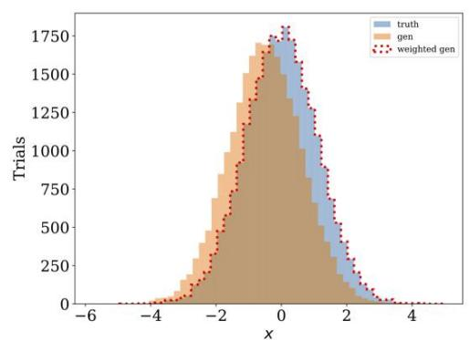
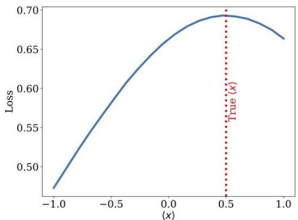
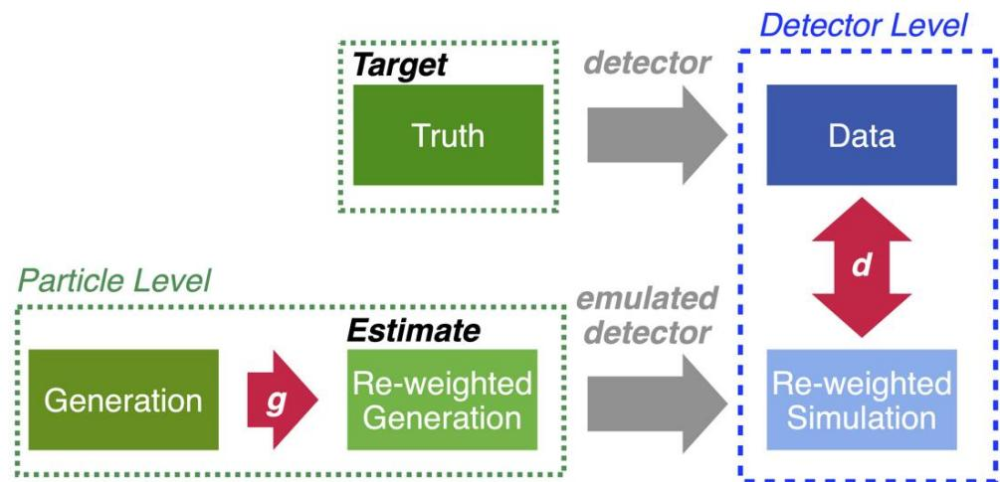
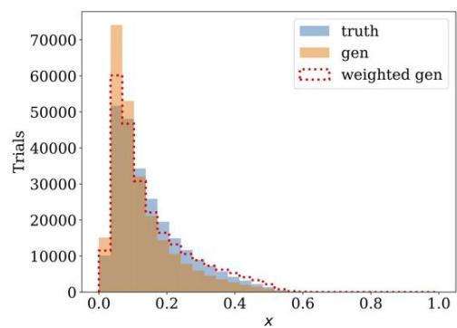
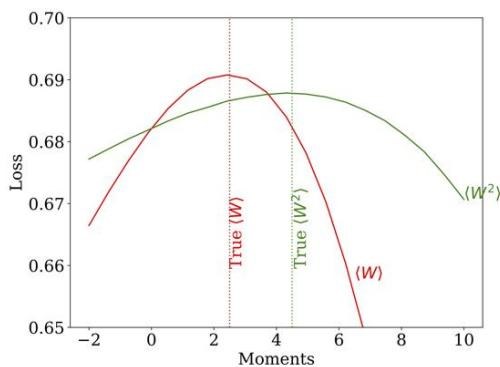

# Abstract

Deconvolving detector distortions - critical step to compare cross section measurements with theoretical predictions   
· Most approaches require binning   
·Theoretical predictions often at the level of moments.   
New approach to directly unfold distribution moments as a function of other observables without discretizing data   
·Moment Unfolding uses amodified GAN architecture   
Demonstrate the performance of this approach using jet substructure measurements in collider physics.

#

Unfolding (deconvolution): correcting detector distortions in experimental data - necessary for accurately comparing data between experiments and with theoretical predictions.   
· Typically, entire spectra unfolded -moments computed afterward.   
·Current approaches discretize support-then unfold histogram.   
· This binning procedure introduces discretization artifacts.   
Unfold without binning-generic solution to unfolding entire spectra-may compromise precision for small set of moments.   
Dedicated machine learning-based unfolding method to directly unfold the observable moments.   
GAN learns reweighting function inspired by the Boltzman equation- parameters identified with observable moments   
Noniterative in contrast to methods like Omnifold (Andreassen et al,Phys.Rev.Lett.124,182001-2020)

#

# Neural Networks

Generator: $g ( x ) = e ^ { \lambda _ { 1 } x + \cdots + \lambda _ { n } x ^ { n } }$ reweights generation to truth. $n$ trainable parameters $\lambda _ { i }$ learn $n$ moments

Discriminator: $d : \mathbb { R }  [ 0 , 1 ]$ distinguishes reweighted simulation from data

·Maxwell-Boltzmann distribution maximizes entropy while holding mean energy constant   
· Moment unfolding maximises BCE loss holding moments constant

# Data sets

$\textcircled { > }$ Simulation (Xs) : detector level simulation   
Generation $( X _ { G } ) :$ particle level simulation   
$\textcircled { \circ }$ Data(XD) : detector level data   
·Truth (Xr) : particle level data

#

# Loss Function

$$
L [ g, d ] = - \frac {1}{N} \sum_ {x _ {\mathrm {D}}} \left[ \log (d (x _ {\mathrm {D}})) + \sum_ {(x _ {\mathrm {G}}, x _ {\mathrm {S}})} g (x _ {\mathrm {G}}) \log (1 - d (x _ {\mathrm {S}})) \right]
$$

· All neural networks implemented using the KERAs high-level API with TENsoRFLOw2 backend,optimized with ADAM.   
Discriminator $d$ parametrized with three hidden layers,50 nodes per layer. Intermediate layers ReLU, last layer sigmoid.

#

# Gaussian distributions

·XT~N(0.5,1)   
·XG~N(0,1)   
detector effets $Z \sim { \mathcal { N } } ( 0 , 5 )$

# Jet width

$$
w = \frac {1}{p _ {T , j e t}} \sum_ {i \in \text {j e t}} p _ {T, i} \Delta R _ {i}
$$

${ } ^ { \circ } p _ { T , i } =$ transverse momentum   
$\Delta R _ { i } =$ angular distance from jet axis   
·Example focusses on jet width. Method can be applied to other jet observables like charge, mass, etc.

•First two moments of the reweighted generation match truth well   
·Full distributions not statistically identical   
This is because higher moments are relevant and are not the same between truth and generation.

#

Proposed Moment Unfolding as a novel, flexible,unbinned, and non-iterative reweighting-based deconvolution method   
Showed promising results when applied to both Gaussian datasets as well as detector data from the LHC   
Future work-whether this method could be used to unfold infinitely many moments,i.e.entire probability density   
·Important questions about partition function normalization, stability, and overlapping support