# Introduction

# The vision of Runtime One-shot imitation Learning

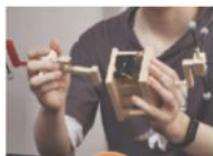

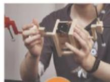

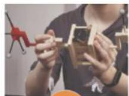

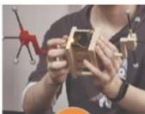

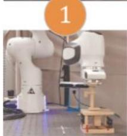

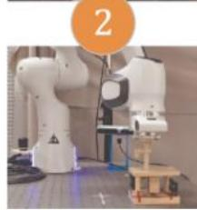

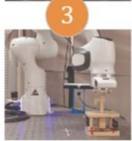

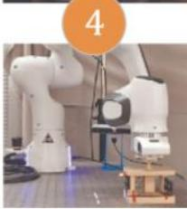

# Popular paradigm: Transformer +behavior cloning

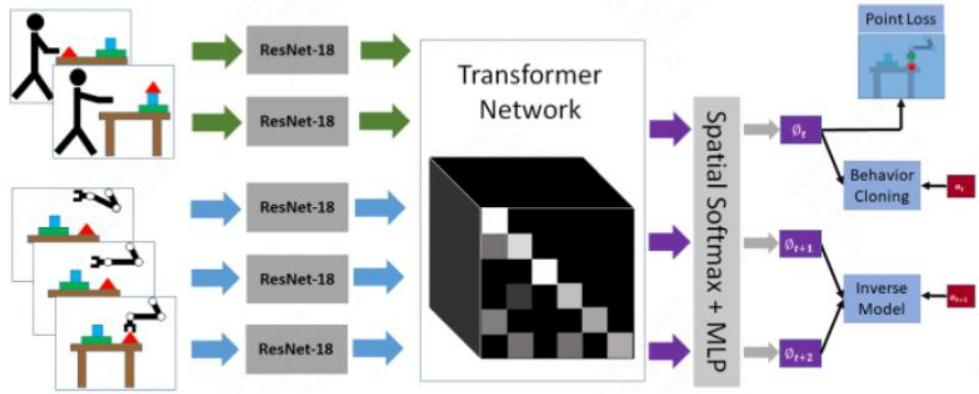

# Our focus: Generlization Challenges of runtime OSIL

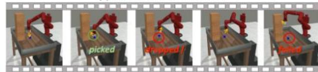  
(a)Provided demonstration.

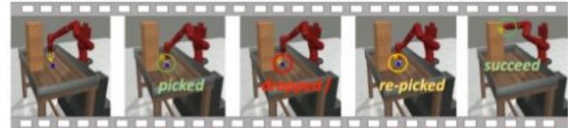  
(b)Policy trained byatraditional OSIL method.   
(c)Policy trained by DDT.

·Unseen demonstrations in unseen envirnoments.   
->incorrect representation caused bytransformer.   
·Unforseen changes after demonstrationscollection.   
->limitation of behavior cloning.

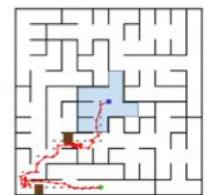

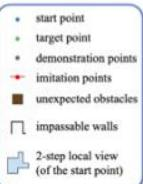

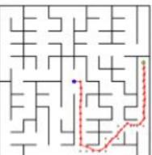  
(A) Valet Parking Assist in Maze(VPAM)   
Trained byDDT

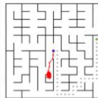  
Trained by traditional OSIL

# Methodology

KEY1: Inject the induective bias of "how human make decisions in runtime OsiL”into the imitator policy network.

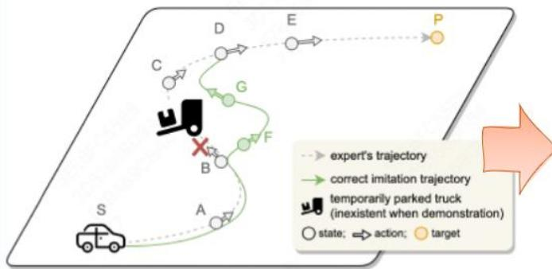  
An example of3-stage OSIL of humans.

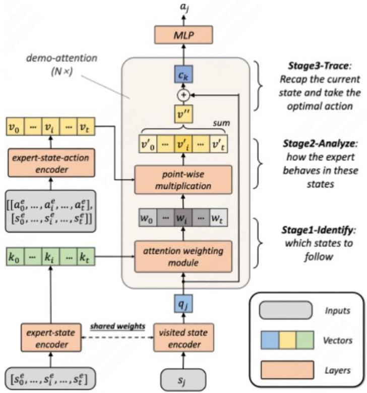

·Stage 1: Identify relevant states within the trajectory based on the current state.   
·Stage 2: Analyze the expert's behavior patterns associated with these states.   
Stage 3: Trace the expert's demonstrations based on the relationship between the current state and the expert's behavior patterns in the demonstrations.

# KEY2: Solve runtime one-shot imitation learning by context-based meta-RL,instead of supervised ling

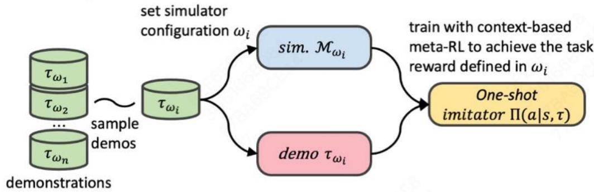

·The unforeseen changes willrandomly apprear in the simulators (M).   
·With meta-RL,the imitator policy will try to achieve allofthe targets the same to the demonstration guided by O-1 task rewards.   
·In the process,the imitator policy will suffer from the unforseen changes and have to handlethembeforeachievethe targets.

# Major Experiments

# Q1: One-shot imitation ability in unseen situations

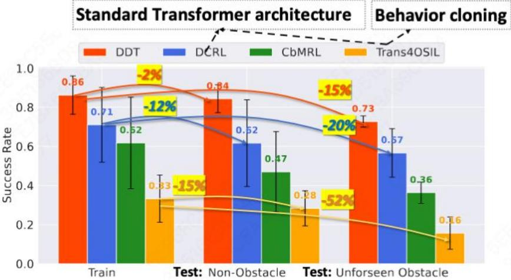  
Groupresultsavergedby8settings with3seeds(VPAMenv).

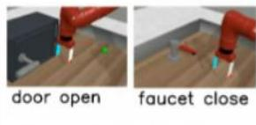

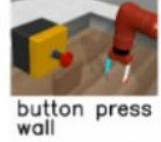

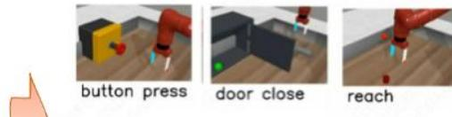

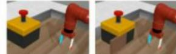  
buttonpre topdown

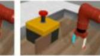  
button press topdown wall

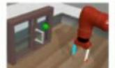  
window open   
Table4:Performanceonunseen heterogeneousdemonstra tions.   
EnvironmentButton Press Door Close Reach   
Performance 0.78 1.00 0.75

# Q2: Does DDT imitating via tracing the demos

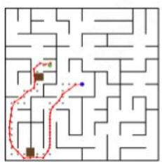  
(a)Trajectory of DDT.

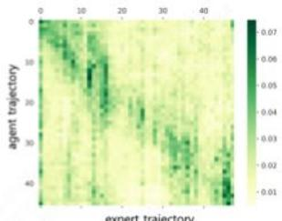  
(b) Attention score.

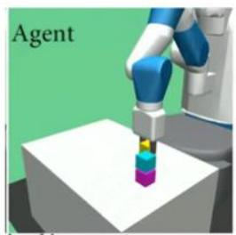

# Q3: The “Scaling Law” of DDT in the OSIL seting

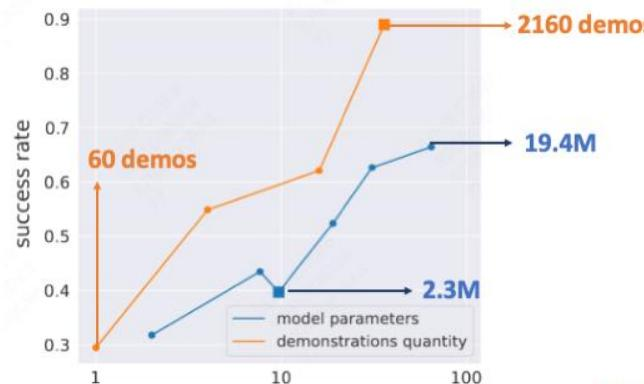  
scaling-uprate