# Motivation

· Most RL methods assume an episodic setting where resets to the initial state are readily available at the end of each episode.   
· Autonomous learning of embodied agents involves continual interactions and existing methods often require costly external interventions such as human supervision, and scripted policies to simulate resets.   
· Recently, Autonomous RL (ARL) framework[1] formalized the non-episodic RL setting but previous works on ARL rely on demonstration data to guide the learning process.   
· However,a truly autonomous agent should be able to learn from scratch without external interventions and prior data.

# Contribution

We propose a demonstration-free ARL algorithm via Implicit and Bidirectional Curriculum (IBC) that consists of a conditionally activated auxiliary agent and a bidirectional goal curriculum.   
· To the best of our knowledge, IBC is the first non-episodic RL that can consistently learn without manual resets and demonstrations by leveraging curriculum learning.   
· IBC achieves state-of-the-art performance against previous methods,including even the ones that leverage prior data.

# References

[1] Sharma,Archit,etal."AutonomousReinforcement Learning:Formalismand Benchmarking."International Conferenceon LearningRepresentations.2021.

[2]Kakade,ShamandJohnLangford."Approximatelyoptimalapproximatereinforcementlearning."Proceedings of theNineteenth InternationalConference on Machine Learning.2002.

[3]Sharma,Archit,etal."Autonomousreinforcement learningviasubgoalcuricula."AdvancesinNeural InformationProcessingSystems34(2021):18474-18486.

[4]Sharma,Archit,RehaanAhmadandChelsea Finn."AState-DistributionMatchingApproachtoNon-Episodic Reinforcement Learning." InternationalConferenceon Machine Learning.PMLR,2022.

# Overview

· Implicit curriculum

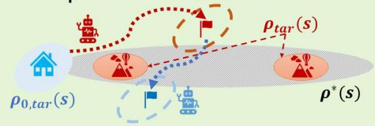

Only forward episode remains at convergence

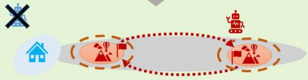

agent of interest (forward agent)

: conventional RL agent

auxiliary agent

:returns to the initial state

·Bidirectional curriculum

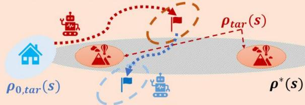

Bidirectional curriculum generation towards

$\pmb { \rho _ { 0 , t a r } } ( s )$ and $\textbf { \rho } _ { f a r } ( s )$

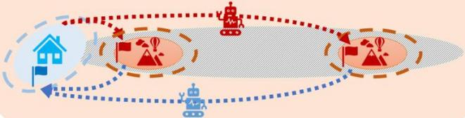

Forward episode

curriculum goal

Backward episode

curriculum goal

# Methods

· Implicit curriculum via an auxiliary agent

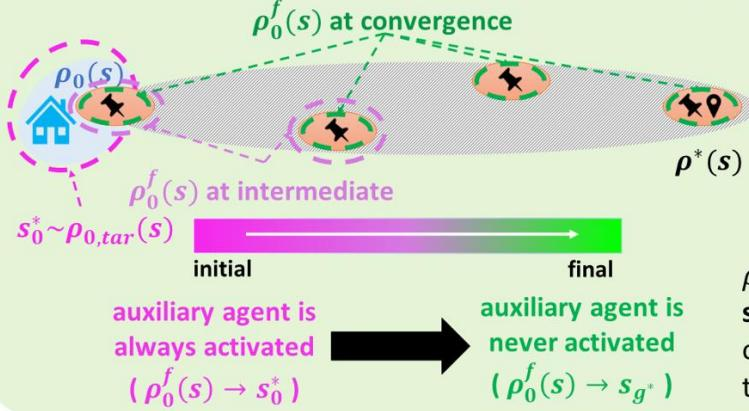

${ \pmb \rho } _ { \bf 0 } ( { \pmb s } ) \mathrm { : }$ initial state dist.   
${ \pmb \rho } ^ { * } ( s )$ :state dist.of $\pi ^ { * }$ that achieves geval Ptar(s), $\pmb { \rho _ { 0 , t a r } } ( s ) :$ target goals foragents

${ \big \bullet } : s _ { g ^ { * } }$ , a few examples from $\rho ^ { * } ( s )$   
$\bullet : \pmb { g } _ { e v a l } ,$ goal given during evaluation

· Bidirectional goal curriculum optimization

[Lipschitz assumption]

original targets $s _ { g ^ { * } } { \sim } \rho _ { t a r } ( s ) ,$ $s _ { 0 } ^ { * } \sim \rho _ { 0 , t a r } ( s )$ fortheagents

· Curriculum objective

$\mathop { m i n } _ { \tau ^ { i } = \left\{ s _ { t } ^ { i } , \forall t \right\} \in B } \sum _ { \left( s _ { 0 } ^ { * } , s _ { g ^ { * } } \right) ^ { i } } w \left( \left( s _ { 0 } ^ { * } , s _ { g ^ { * } } \right) ^ { i } , \tau ^ { i } \right) .$

# Environments

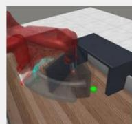

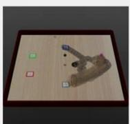

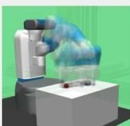

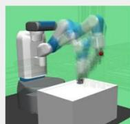

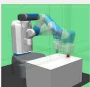

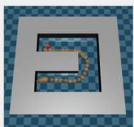

# Experiments

· IBC vs. Baselines

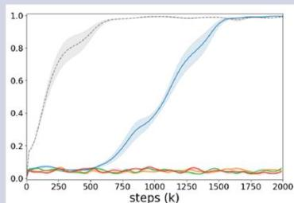  
（a)Fetch Pick&Place

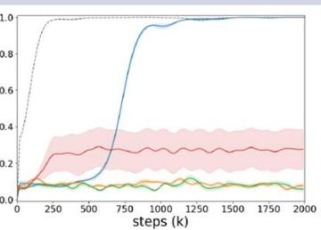

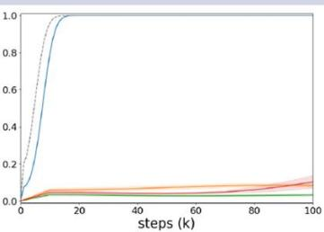  
(c) Fetch Reach

(b)Fetch Push

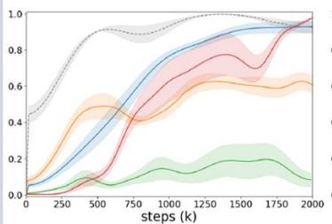  
(d) Sawyer Door

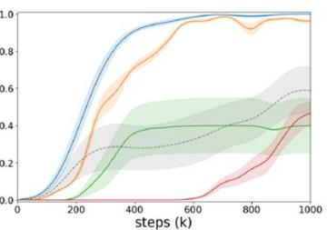

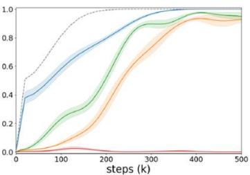  
(e) Tabletop Manipulation   
(f) Point-U-Maze

IBC(ours)

VaPRL[3] VaPRL(w/odemo)

MEDAL[4]

Oracle RL

# · Ablation study

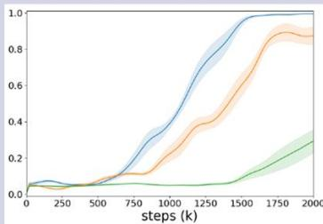  
(c) Tabletop Manipulation

(a) Fetch Pick&Place

IBC(ours)

(b) Sawyer Door

IBC w/o Bidirectional

BC W/o Bidirectional&Auxiliary

· Curriculum progress

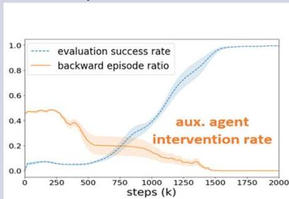  
Implicit curriculum   
Bidirectional goal curriculum

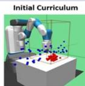

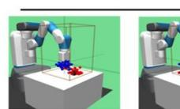

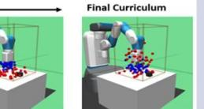

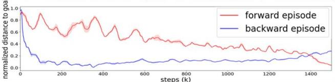

· Reward-free experiments

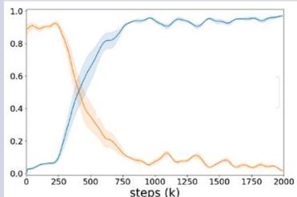  
(a)Fetch Pick&Place

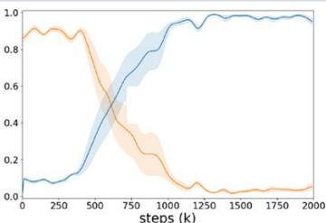  
(b) Fetch Push

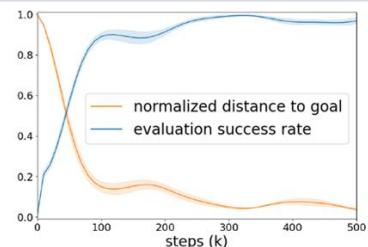  
(c)Point-U-Maze