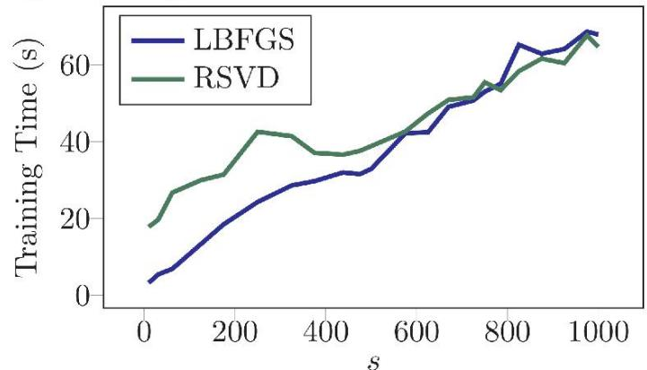
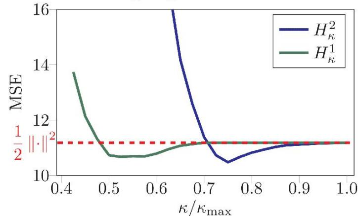
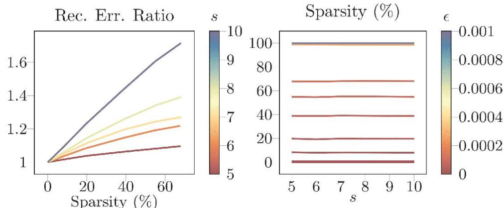

# ExtendingKernel PCA through Dualization: Sparsity,Robustnessand Fast Algorithms

Francesco Tonin,Alex Lambert,Panagiotis Patrinos, Johan Suykens ESAT,KU Leuven,Belgium

# Kernel PCA Problem

Given: $n$ datapoints $( x _ { i } ) _ { i = 1 } ^ { n } \in \mathcal { X } ^ { n }$ ,feature map $\phi \colon { \mathcal { X } }  { \mathcal { H } }$ to a Hilbert space $\mathcal { H }$

Goal: find $s$ directions in $\mathcal { H }$ that maximize the variance under orthonormal conditions. The KPCA optimization problem is

$$
\sup  _ {W \in \mathcal {S} _ {\mathcal {H}} ^ {s}} \frac {1}{2} \| \Gamma W \| _ {\mathrm {F}} ^ {2}. \tag {1}
$$

Wc usc thc following definitions.

· Thc Sticfcl manifold of orthonormal s-framcs in $\mathcal { H }$ is

$$
\mathcal {S} _ {\mathcal {H}} ^ {s} := \{W \in \mathcal {H} ^ {s} \mid \mathcal {G} (W) = I _ {s} \}.
$$

· $\mathcal { G } ( W ) \in \mathbb { R } ^ { s \times s }$ is thc matrix such that $\mathcal { G } ( W ) _ { i j } = \langle w _ { i } , w _ { j } \rangle$   
· $\Gamma \colon \mathcal { H } ^ { s }  \mathbb { R } ^ { n \times s }$ is thc lincar opcrator s.t.for all $( i , j ) \in [ n \times s ]$ and $W = ( w _ { 1 } , \dots , w _ { s } ) \in \mathcal { H } ^ { s }$ $[ \Gamma W ] _ { i j } = \langle \phi ( x _ { i } ) , w _ { j } \rangle$   
· $G$ is the Gram matrix $G = [ k ( x _ { i } , x _ { j } ) ] _ { i , j = 1 } ^ { n }$ ,where $k \colon \mathcal { X } \times \mathcal { X }  \mathbb { R }$ the positive definite kernel function induced by $\phi$

The usual way to solve (1) is through SVD of $G \Rightarrow$ slow with larger $n$

Paper TL;DR

We proposea duality framework to solve the KPCA problem faster,with extension to robust and sparse losses.

# Difference of convex functions

Key idea:Rewrite (1） as a difference of convex functions

$$
\inf  _ {W \in \mathcal {H} ^ {s}} g (W) - f (\Gamma W), \tag {2}
$$

with $\begin{array} { r } { f = \frac { 1 } { 2 } \left. \cdot \right. _ { \mathrm { F } } ^ { 2 } } \end{array}$ $g = \iota _ { \mathcal { S } _ { \mathcal { T } } ^ { s } } ( \cdot )$ ,and $\iota _ { C } ( \cdot )$ the indicator function for set $\mathcal { C }$

Two key advantages:

1.Allows new gradient-based algorithm to solve KPCA efficiently without the SVD of $G$   
2.It becomes possible to slightly modify the loss function $f$ to enforce specific properties such as robustness or sparsity.

Proposition O.1 (Dual of diffcrcncc of convcx functions).Let $\mathcal { U } , \mathcal { K }$ be two Hilbert spaces, $g : \mathcal { U } \to \bar { \mathbb { R } }$ and $f \colon \mathcal { K }   { \mathbb { R } }$ be two convex lower semi-continuous functions and $\Gamma \in { \mathcal { L } } ( { \mathcal { U } } , { \mathcal { K } } )$ .The problem

$$
\inf  _ {W \in \mathcal {U}} g (W) - f (\Gamma W)
$$

admits the dual formulation

$$
\inf  _ {H \in \mathcal {K}} f ^ {\star} (H) - g ^ {\star} (\Gamma^ {\sharp} H),
$$

and strong duality holds.

# Faster KPCA with Gradient Descent

Motivation for going from primal to dual:we show that $g ^ { \star } ( \Gamma ^ { \sharp } H )$ is rclatcd to thc nuclcar norm of somc low dimcnsional matrix.

Proposition 0.2. Let $g$ be the indicator function of the Stiefel manifold andTasin Problem1.Then forall $H \in \mathbb { R } ^ { n \times s }$

$$
g ^ {\star} (\Gamma^ {\sharp} H) = \operatorname {T r} \sqrt {H ^ {\top} G H} =: \pi (H).
$$

The computational complexity of computing the gradient of $\pi$

· Computation of $H ^ { \top } G H$ in $\mathcal { O } ( s n ^ { 2 } )$   
· SVD of $H ^ { \top } G H$ in $\mathcal { O } ( s ^ { 3 } )$

We solve our dual problem with L-BFGS and compare training time with full SVD, Lanczos mcthod, and Randomizcd SVD (RSVD).

·KPCA Training Time for multiple KPCA problems with fixed $\delta = 1 0 ^ { - 2 }$ accuracy. Spccdup factor w.r.t. RSVD.

<table><tr><td rowspan="2">Task</td><td rowspan="2">n</td><td colspan="4">Time (s)</td><td rowspan="2">Speedup Factor</td></tr><tr><td>SVD</td><td>Lanczos</td><td>RSVD</td><td>Ours</td></tr><tr><td>Synth 1</td><td>7000</td><td>96.73</td><td>0.85</td><td>1.97</td><td>0.53</td><td>3.72</td></tr><tr><td>Protein</td><td>14895</td><td>868.64</td><td>3.46</td><td>6.70</td><td>1.07</td><td>6.25</td></tr><tr><td>RCV1</td><td>20242</td><td>-</td><td>6.04</td><td>12.50</td><td>2.12</td><td>5.90</td></tr><tr><td>CIFAR-10</td><td>60000</td><td>-</td><td>48.10</td><td>123.89</td><td>13.51</td><td>9.17</td></tr></table>

·Influence of the number of components s on training time:higher $s$ leads to longer training times.

# Beyond variance maximization

Typical los function: square loss $\begin{array} { r } { f = \frac { 1 } { 2 } \left. \cdot \right. _ { \mathrm { F } } ^ { 2 } } \end{array}$

Problems: sensible to outliers, no sparsity.

Key idea: usc a loss obtaincd with infimal convolution

$$
f = \frac {1}{2} \| \cdot \| _ {\mathrm {F}} ^ {2} \square \Psi ,
$$

where $\Psi$ is a well-chosen function that enforces robustness or sparsity. Compatibility between the Fenchel-Legendre transform and the infimal convolution operator then allows to write the dual to Equation (2） as

$$
\inf  _ {H \in \mathbb {R} ^ {n \times s}} \frac {1}{2} \| H \| _ {\mathrm {F}} ^ {2} + \Psi^ {\star} (H) - \pi (H).
$$

# DC Optimization

As $f$ is aMoreau envelope,its gradient is always defined for all $Y \in \mathbb { R } ^ { n \times s }$

$$
\nabla \left(\frac {1}{2} \| \cdot \| _ {\mathrm {F}} ^ {2} \square \Psi\right) (Y) = Y - \operatorname {p r o x} _ {\Psi} (Y).
$$

According to Moreau decomposition, it holds that for all $Y \in \mathbb { R } ^ { n \times s }$

$$
Y - \operatorname {p r o x} _ {\Psi} (Y) = \operatorname {p r o x} _ {\Psi^ {*}} (Y).
$$

Algorithm 1 DCA for Moreau envelope objectives

input：Gram matrix $G$

forepoch t from 0 to $T - 1$ do

$$
\begin{array}{l} \text {/ / a l t e r n a t i n g g r a d i e n t s t e p s} \\ Y = \nabla \pi (H ^ {(t)}) \\ H ^ {(t + 1)} = \operatorname {p r o x} _ {\psi^ {\star}} (Y) \end{array}
$$

return H(T) $H ^ { ( T ) }$

# Robustness and sparsity

Denoting $\left\| \cdot \right\| _ { \star }$ as the dual norm of $\lVert \cdot \rVert$ and the balls of radius $t$ forthese norms as $B _ { t } ^ { \star }$ and $B _ { t }$ ，we extend KPCA with Huber and $\epsilon$ -insensitive objectives to promote robustness and sparsity, respectively.

Extended Huber loss $H _ { \kappa }$

$$
\Psi := \kappa \| \cdot \|, \qquad \Psi^ {\star} = \iota_ {\mathcal {B} _ {\kappa} ^ {\star}}, \qquad \operatorname {p r o x} _ {\Psi^ {\star}} (Y) = \operatorname {P r o j} _ {\mathcal {B} _ {\kappa} ^ {\star}} (Y).
$$

·Effect of $\kappa$ for the losses $H _ { \kappa } ^ { 2 }$ $H _ { \kappa } ^ { 1 }$ on contaminated Iris dataset.

Extended e-insensitive loss $\ell _ { \epsilon }$

$$
\Psi := \iota_ {\mathcal {B} _ {\epsilon}}, \qquad \Psi^ {\star} = \epsilon \| \cdot \| _ {\star}, \qquad \operatorname {p r o x} _ {\Psi^ {\star}} (Y) = Y - \operatorname {P r o j} _ {\mathcal {B} _ {\epsilon}} (Y).
$$

·Reconstruction error for the $\ell _ { \epsilon } ^ { \infty }$ loss for multiple $\epsilon$ and $s$

