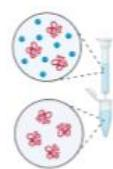
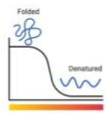
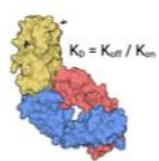
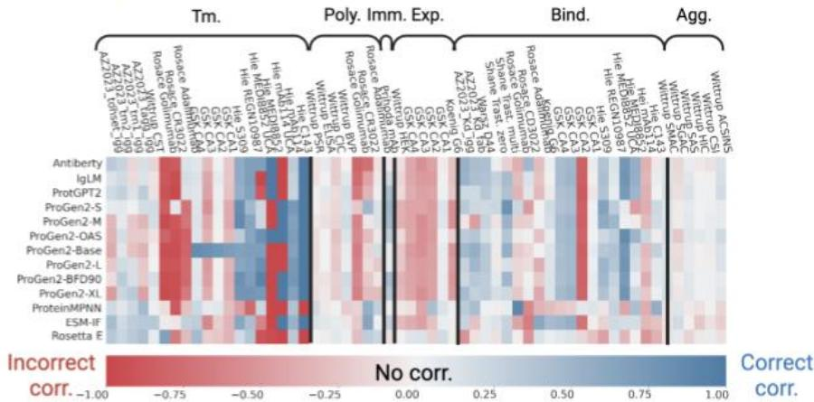
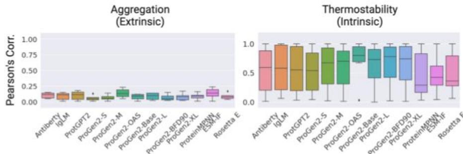
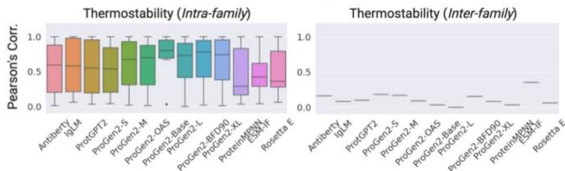
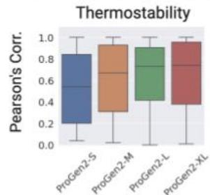
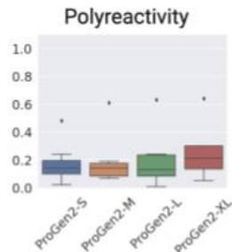
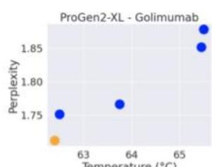
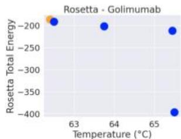

# FLAb: Benchmarking deep learning methods for antibody fitness prediction

Michael Chungyoun, Jeffrey Ruffolo, Jeffrey Gray

# 1 Background

Antibody therapeutics must have a particular set of fitness properties

a)Expressionb)Thermostabilityc)Immunogenicityd)Bindingaffnitye)Aggregationf)Polyreactivity

Sixclasses of biophysical data relevant toantibodydevelopmentare (a) expression,(b) thermostability,(c)immunogenicity,(d) bindingaffinity,(e) aggregation,and (f)polyreactivity

# Do deep learning methods capture properties of therapeuticantibodies?

We seek toanswer thisquestion by:

1.Creatingacollection of datasets of antibody therapeuticdata   
2.BenchmarkrepresentativeAImodellikelihoodsforfitnessprediction

# 2 Dataset curation

We curated publicly available antibody fitness

<table><tr><td rowspan="22"></td><td colspan="6">Number of datapoints</td></tr><tr><td>Antibody</td><td>Exp. (μg/mL)</td><td>Tm(°C)</td><td>Imm. (% ADA)</td><td>Binding (nM)</td><td>Agg. (Wv shift)</td></tr><tr><td>GSK CA1</td><td>34</td><td>34</td><td>-</td><td>29</td><td>-</td></tr><tr><td>GSK CA2</td><td>25</td><td>22</td><td>-</td><td>22</td><td>-</td></tr><tr><td>GSK CA3</td><td>11</td><td>8</td><td>-</td><td>11</td><td>-</td></tr><tr><td>GSK CA4</td><td>24</td><td>24</td><td>-</td><td>19</td><td>-</td></tr><tr><td>Hie C143</td><td>-</td><td>2</td><td>-</td><td>16</td><td>-</td></tr><tr><td>Hie mAb114</td><td>-</td><td>7</td><td>-</td><td>20</td><td>-</td></tr><tr><td>Hie mAb114 UCA</td><td>-</td><td>2</td><td>-</td><td>-</td><td>-</td></tr><tr><td>Hie MEDI8852</td><td>-</td><td>2</td><td>-</td><td>15</td><td>-</td></tr><tr><td>Hie MEDI8852 UCA</td><td>-</td><td>6</td><td>-</td><td>20</td><td>-</td></tr><tr><td>Hie REGN10987</td><td>-</td><td>8</td><td>-</td><td>13</td><td>-</td></tr><tr><td>Hie S309</td><td>-</td><td>10</td><td>-</td><td>19</td><td>-</td></tr><tr><td>Koenig G6</td><td>4275</td><td>-</td><td>-</td><td>4275</td><td>-</td></tr><tr><td>Prihoda imm</td><td>-</td><td>-</td><td>217</td><td>-</td><td>-</td></tr><tr><td>Rosace Adalimumab</td><td>-</td><td>14</td><td>-</td><td>14</td><td>14</td></tr><tr><td>Rosace CD3022</td><td>-</td><td>6</td><td>-</td><td>6</td><td>6</td></tr><tr><td>Rosace Golimumab</td><td>-</td><td>5</td><td>-</td><td>5</td><td>5</td></tr><tr><td>Shane. Trast. multi</td><td>-</td><td>-</td><td>-</td><td>24</td><td>-</td></tr><tr><td>Shane. Trast. zero</td><td>-</td><td>-</td><td>-</td><td>422</td><td>-</td></tr><tr><td>Warszawski D44</td><td>-</td><td>-</td><td>-</td><td>2049</td><td>-</td></tr><tr><td>Wittrup CST</td><td>274</td><td>137</td><td>-</td><td>-</td><td>822</td></tr></table>

Thisdatabase includes mutational landscapes of17distinct antibody families andatotal of13,384associated fitnessmetrics.Each sequence ismapped toat leastone fitness labelpertainingto the6fitness properties

# 3 Methods

Pipeline for benchmarking protein language models

Foreach protein languagemodel,we separatelyinput theantibody heavyand light sequences to return two perplexity scores,and we tabulate the average perplexity between the two sequences.Wecalculate Spearman's (p),Pearson’s(r) and Kendall tau's (t) correlationcoeficients between perplexityand fitness.

# 4 Results

A heat map of model-dataset correlations

Summaryof Pearson'scorrelations.Models generallyperform bestwith thermostabilityand bindingafinitydatasets,butmost strugglewithaggregation propensityand polyreactivity.

# Intrinsic biophysical propertiesare more accurately predicted than extrinsic

Intrinsic propertiesare impacted by inherent propertiesof theantibody. Extrinsicpropertiesresultfrom target biologyandmechanisms of action.

Modelsare moreaccurateat distinguishing intra-family versus inter-family antibody sets

Intra-familyantibodiesare mutants originating from same wild type. Inter-familyantibodies havedifferent wild type origins.

Parameter size influences performance over architectureand dataset composition

Polyreactivityand thermostabilityperformancecorrelationsimprovewith parametersizeforProGen2(151M,764M,2.7B,6.4Bparameters)

Some models favor evolutionary signal rather than physical fitness

Thelanguagemodel (left)incorrectlyassigns higherconfidence towildtype antibody.Physics-based model(right)correctlyassigns higherstability to the mutants

# 5 Conclusion

FLAbisa living benchmark where we willcontinuously add models evaluated and availableantibodydata

Nomodel was top performingacrossall sixfitness classes