# Fast, Scalable, Warm-Start Semidefinite Programming with Spectral Bundling and Sketching

Rico Angell1 and Andrew McCallum1

1University of Massachusetts Amherst

# Motivation

·Semidefinite programming (SDP) is an important tool for many applications

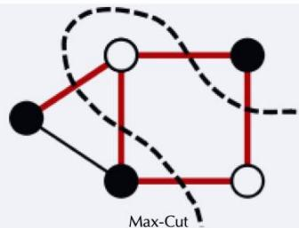

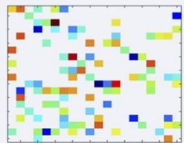

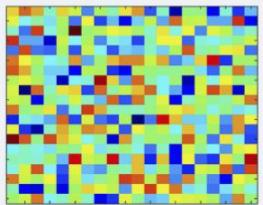  
MatrixCompletion

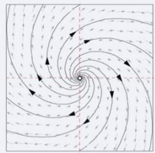  
Stability of Linear   
Dynamical Systems

$$
\begin{array}{l} \left(x _ {1} \vee x _ {2}\right) \wedge (\neg x _ {2} \vee x _ {3}) \\ (\neg x _ {1} \vee x _ {2} \vee \neg x _ {3}) \\ \text {B o o l e a n S a t s i f i a b l i t y} \\ \end{array}
$$

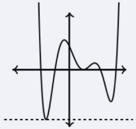  
polynomial Optimization

·Many existing methods for solving or approximately solving SDPs   
·Need for a method that is fast, scalable,and provably correct for massive SDPs   
· Need a method where hyperparameters can modulate memory,accuracy speed,and scalability of solving general SDPs

# Problem Setup

$$
\begin{array}{l} \max  _ {X \succ 0} \langle C, X \rangle \\ \mathrm {s . t .} \mathcal {A} _ {\mathcal {I} ^ {\prime}} X = b _ {\mathcal {I} ^ {\prime}} \\ \begin{array}{c} \mathcal {A} _ {\mathcal {I}} X \leq b _ {\mathcal {I}} \\ \mathcal {A}: \mathbb {S} ^ {n} \to \mathbb {R} ^ {m} \text {l i n e a r o p e r a t o r} \end{array} \\ \end{array}
$$

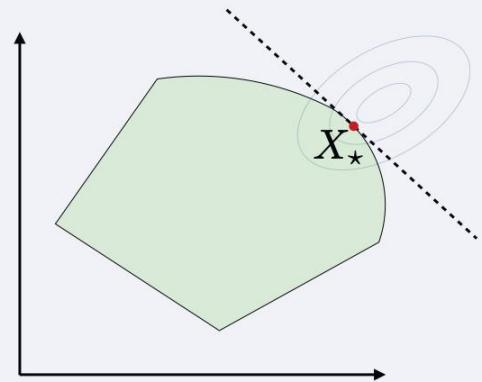

· Want to solve general SDPs with both equality and inequality constraints   
· Want to have theoretical guarantees about convergence to optimal solution   
·Assume cost matrix $C$ is sparse and a upper bound $\alpha \geq \mathrm { t r } ( X _ { \star } )$ exists   
·Assume the number of constraints is small compared to the problem size   
· Want to be able to solve SDPs where Xwill not fit in memory   
·Want solver to be able to take advantage of a warm-start initialization

# Unified Spectral Bundling

·Reformulated SDP as a the following penalized dual objective:

$$
f (y) := \alpha \left[ \lambda_ {\max } \left(C - \mathcal {A} ^ {*} y\right) \right] _ {+} + \langle b, y \rangle + \iota_ {\mathcal {Y}} (y)
$$

$$
= \sup  \quad \langle C - \mathcal {A} ^ {*} y, X \rangle + \langle b - \nu , y \rangle
$$

$$
(X, \nu) \in \mathcal {X} \times \mathrm {N}
$$

$$
\begin{array}{l} \text {D u a l s l a c k v a r i a b l e f o r} \\ \text {i n e q u a l i t y c o n s t r i n g t o y} \end{array}
$$

· Solve the SDP by minimizing $f$ usinga proximal bundle method:

$$
\tilde{y}_{t + 1}\leftarrow \operatorname *{arg  min}_{y\in \mathbb{R}^{m}}\hat{f}_{t}(y) + \frac{\rho}{2}\| y - y_{t}\|^{2}
$$

where the model $\hat { f } _ { t }$ is parameterized by the low dimensional subspace of $\mathcal { X }$

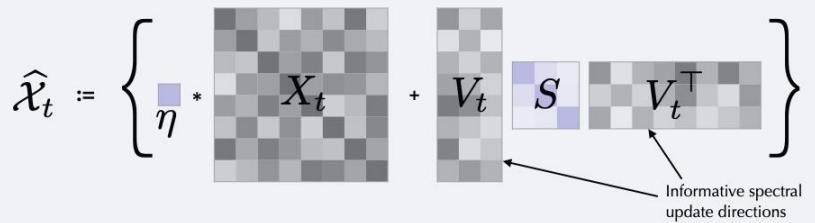

·The size of V determines the rank $k$ of each update, specified by the user   
· Only update $y _ { t + 1 } \gets \tilde { y } _ { t + 1 }$ if $\beta ( f ( y _ { t } ) - \hat { f } _ { t } ( \tilde { y } _ { t + 1 } ) ) \leq f ( y _ { t } ) - f ( \tilde { y } _ { t + 1 } )$   
· Always use $\tilde { y } _ { t + 1 }$ to create $\hat { \mathcal { X } } _ { t + 1 } , V _ { t + 1 }$ $V _ { t + 1 }$ is the top-k eigenvectors of $C - A ^ { * } \tilde { y } _ { t + 1 }$   
·Analytical solution to the proximal bundle method lead to the following updates

$$
\tilde {y} _ {t + 1} = y _ {t} - \frac {1}{\rho} (b - \nu_ {t + 1} - \mathcal {A} X _ {t + 1})
$$

$$
\left(X _ {t + 1}, \nu_ {t + 1}\right) \in \underset {(X, \nu) \in \hat {\mathcal {X}} _ {t} \times \mathrm {N}} {\arg \max } \langle C, X \rangle + \langle b - \nu - \mathcal {A} X, y _ {t} \rangle - \frac {1}{2 \rho} \| b - \nu - \mathcal {A} X \| ^ {2}
$$

$f ( y _ { t } ) - \operatorname* { i n f } f \leq \varepsilon$ after $t \geq O ( 1 / \varepsilon )$ iterations, $O ( \cdot )$ suppresses dependence on $n , m$

# Scaling with Matrix Sketching

· Only need to keep track of projections of $X$ such as $\langle C , X \rangle$ and AX   
·All of the memoization can be done eficientlydue to linearity of operations   
·Apply low-rank matrix sketching techniques to enable scaling to problems where $X$ cannot fit in memory—track projection $P$ instead of $X$

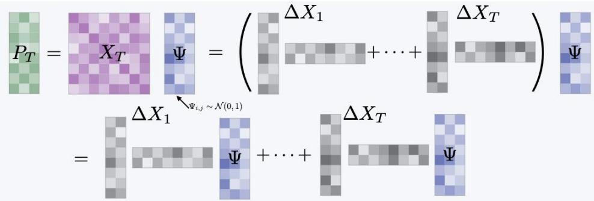

# Results

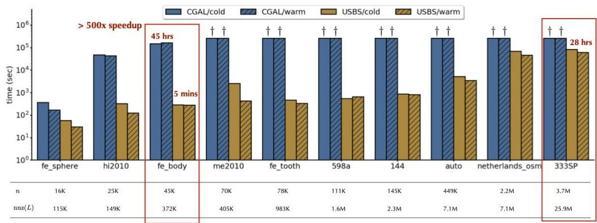  
Max-Cut   
>2 billion decision variables   
>1013 decision variables   
findicates than an ε-approximate solution was not achieved in72 hours.

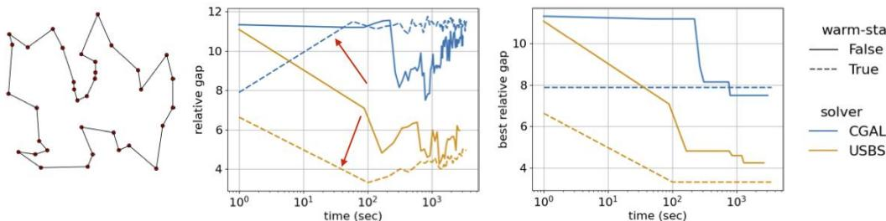  
Traveling Salesman Problem   
USBSeffectivelytakingadvantageofwarm-start initialization

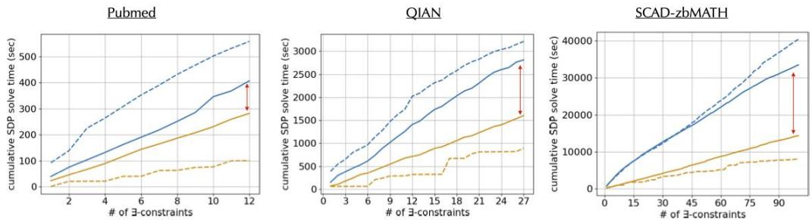  
Clustering with 3-constraints   
Problem size increases

# UMassAmherst

Manning College of Information & Computer Sciences

