# Why

# Knowledge-Grounded Reinforcement Learning?

What learning capabilities do humans possess, yet RL agents still missing? [1,2]   
Knowledge-Acquirable: Develop unique policies by observing.   
· Compositional: Combine policies from multiple sources to form a knowledge set.

<table><tr><td>Policy</td><td></td><td></td></tr><tr><td>Observed from</td><td>Amy</td><td>Jack</td></tr><tr><td>Solved for</td><td></td><td></td></tr></table>

<table><tr><td>Policy</td><td></td><td></td><td>if ... 
else ...</td></tr><tr><td>Observed 
from</td><td>Amy</td><td>Jack</td><td>Myself</td></tr><tr><td>Solved 
for</td><td></td><td></td><td></td></tr></table>

Incremental: Arbitrarily remove outdated policies or add new ones, no need to relearn how to navigate the entire knowledge set from scratch.   
· Sample-Efficient: Require fewer interactions.   
Generalizable: Be able to apply previously learned policies to unseen tasks.   
KGRL: An RL paradigm aiming to learn with external policies and achieve the five properties above.

# Method:

# Knowledge-Inclusive

# Attention Network (KIAN)

KIAN: An actor that separates knowledge representations from their selection mechanism.

# Model Architecture:

·Inner Actor   
· Knowledge Keys   
·Query

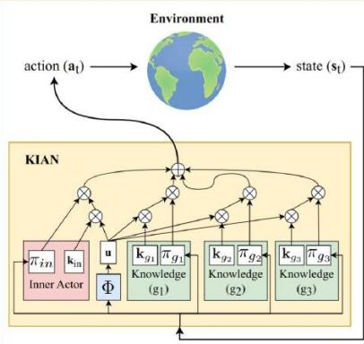

· Naive policy fusion leads to challenges:

$$
\pi (\cdot | \mathbf {s} _ {t}) = \hat {w} _ {i n} \pi_ {i n} (\cdot | \mathbf {s} _ {t}) + \Sigma_ {j = 1} ^ {n} \hat {w} _ {g _ {j}} \pi_ {g _ {j}} (\cdot | \mathbf {s} _ {t})
$$

○ Discrete vs Continuous action space   
○ Entropy Imbalance in maximum

entropy KGRL

# P1: always inner actor

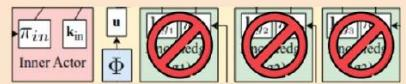

P2: distant means

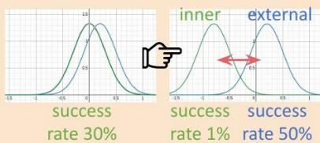

# Discrete Action Policy

$$
\begin{array}{l} \pi (\cdot | \mathbf {s} _ {t}) = \boxed {\hat {w} _ {t, i n}} \pi_ {i n} (\cdot | \mathbf {s} _ {t}) + \Sigma_ {j = 1} ^ {n} \boxed {\hat {w} _ {t, g _ {j}}} \operatorname {s o f t m a x} \left(\beta_ {t, g _ {j}} \pi_ {g _ {j}} (\cdot | \mathbf {s} _ {t})\right) \\ w _ {t, g _ {j}} = \Phi (\mathbf {s} _ {t}) \cdot \mathbf {k} _ {g _ {j}} / \beta_ {t, g _ {j}} \quad \beta_ {t, g _ {j}} = \| \Phi (\mathbf {s} _ {t}) \| _ {2} \| \mathbf {k} _ {g _ {j}} \| _ {2} \\ \end{array}
$$

# Continuous Action Prediction

$$
\pi_ {i n} (\cdot | \mathbf {s} _ {t}) = \mathcal {N} \left(\boldsymbol {\mu} _ {t, i n}, \boldsymbol {\sigma} _ {t, i n} ^ {2}\right), \pi_ {g _ {j}} (\cdot | \mathbf {s} _ {t}) = \mathcal {N} \left(\boldsymbol {\mu} _ {t, g _ {j}}, \boldsymbol {\sigma} _ {t, g _ {j}} ^ {2}\right)
$$

$$
e \sim \text {g u m b e l} _ {\text {s o f t m a x}} \left(\left[ \hat {w} _ {t, i n}, \hat {w} _ {t, g _ {1}}, \dots , \hat {w} _ {t, g _ {n}} \right] ^ {\top}\right) \quad \mathbf {a} _ {t} \sim \pi_ {e} (\cdot | \mathbf {s} _ {t})
$$

# Continuous Probability Distribution

$$
\pi (\mathbf {a} _ {t} | \mathbf {s} _ {t}) = \hat {w} _ {i n} \pi_ {i n} (\boxed {\mathbf {a} _ {t, i n}} \mathbf {s} _ {t}) + \Sigma_ {j = 1} ^ {n} \hat {w} _ {g _ {j}} \pi_ {g _ {j}} (\boldsymbol {\mu} _ {t, g _ {j}} | \mathbf {s} _ {t})
$$

# How well are the KGRL properties satisfied?

· Environments:

○ Discrete decision making (MiniGrid)   
o Continuous control (OpenAl-Robotics)

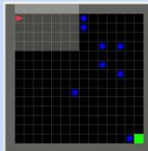  
Dynamic-Obstacles

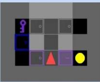  
KeyCorridor

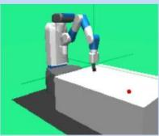  
OpenAl-Robotics

RL algorithms: proximal policy optimization (PPO) and soft actor critic (SAC)   
· Main Results:

# Sample Efficiency & Compositional

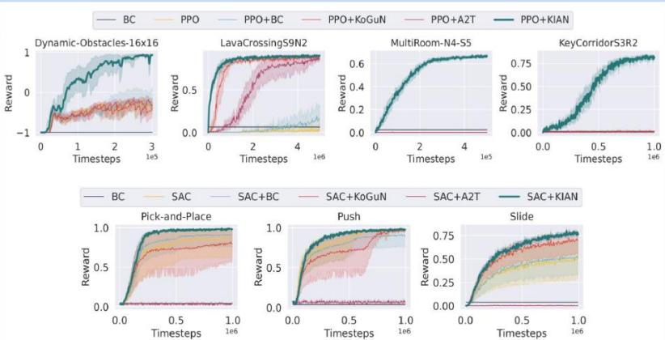

# Generalizability

· Zero-shot transfer policies from simple to more complex tasks

<table><tr><td rowspan="2">Train in Test in</td><td colspan="3">Empty-Random-5x5</td><td colspan="2">DoorKey-5x5</td><td colspan="2">Push</td><td colspan="2">Slide</td><td colspan="2">Pick-and-Place</td></tr><tr><td>6x6</td><td>8x8</td><td>16x16</td><td>8x8</td><td>16x16</td><td>5x</td><td>10x</td><td>5x</td><td>10x</td><td>5x</td><td>10x</td></tr><tr><td>RL</td><td>0.88</td><td>0.71</td><td>0.45</td><td>0.29</td><td>0.08</td><td>0.87</td><td>0.52</td><td>0.45</td><td>0.17</td><td>0.34</td><td>0.27</td></tr><tr><td>RL+BC</td><td>0.87</td><td>0.60</td><td>0.24</td><td>0.40</td><td>0.09</td><td>0.89</td><td>0.60</td><td>0.44</td><td>0.16</td><td>0.34</td><td>0.30</td></tr><tr><td>KoGuN [3]</td><td>0.94</td><td>0.83</td><td>0.53</td><td>0.77</td><td>0.35</td><td>0.63</td><td>0.43</td><td>0.55</td><td>0.18</td><td>0.32</td><td>0.24</td></tr><tr><td>A2T [4]</td><td>0.92</td><td>0.78</td><td>0.51</td><td>0.53</td><td>0.11</td><td>0.03</td><td>0.05</td><td>0.00</td><td>0.01</td><td>0.01</td><td>0.06</td></tr><tr><td>KIAN (ours)</td><td>0.96</td><td>0.91</td><td>0.93</td><td>0.76</td><td>0.42</td><td>0.93</td><td>0.70</td><td>0.42</td><td>0.15</td><td>0.92</td><td>0.72</td></tr></table>

# Compositional & Incremental

· Combine previously learned knowledge keys and inner policies to learn a new task

KIAN(for reference) Cont.RL Cont.KoGuN Cont.A2T Cont.KIAN

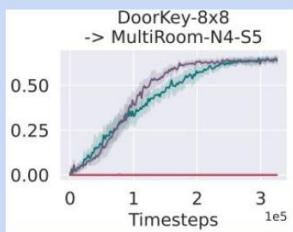

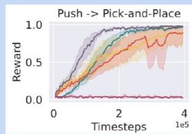

# How entropy imbalance affects?

Addressing entropy imbalance is important!

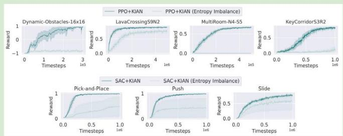

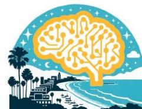  
UCSB NLP GROUP

# References

[1]A.Bandura.Social Learning Theory.Prentice-Hall series insociallearning theory.PrenticeHall,1977.ISBN 9780138167516.   
[2] Leslie Pack Kaelbling.The foundation of efficient robot learning.Science,369(6506):915-916,2020.   
[3]Peng Zhang,Jianye Hao,Weixun Wang,Hongyao Tang,Yi Ma,Yihai Duan,andYan Zheng.Kogun:Acceleratingdeep reinforcementlearningviaintegratinghumansuboptimal knowledge.In InternationalJointConferenceon Artificial Intelligence,2020.   
[4] Janarthanan Rajendran,Aravind Lakshminarayanan,Mitesh M.Khapra,PrasannaP,andBalaramanRavindran.Attend, adaptandtransfer:Attentivedeeparchitectureforadaptive transfer frommultiple sourcesin thesame domain.In International ConferenceonLearningRepresentations,2017.