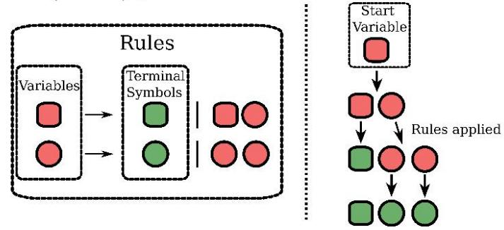
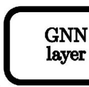
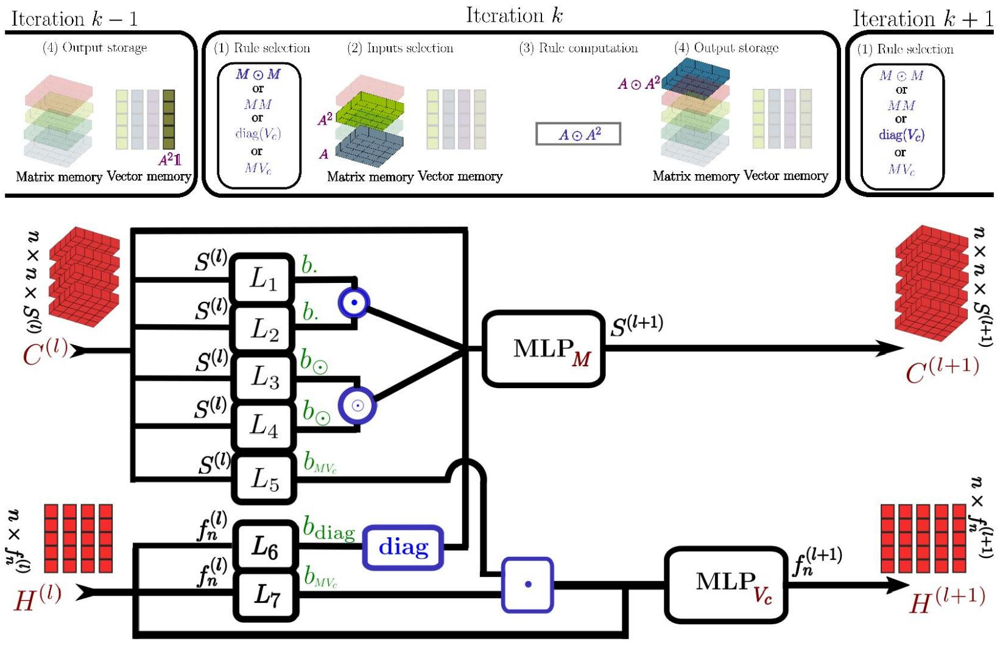
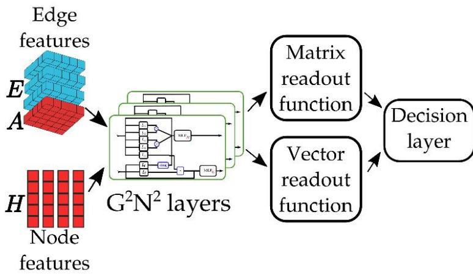

UNIVERSITE DE ROUEN 0 RMANDIE

niversite leTOURS

litis

anr

# Contributions

• A generic framework to design a GNN from any fragment of an algebraic language.   
· The instantiation of the framework on $\mathrm { M L } \left( \mathcal { L } _ { 3 } \right)$ resulting in $\mathsf { G } ^ { 2 } \mathsf { N } ^ { 2 }$ , a provably 3-WL GNN.   
● Experiments demonstrating that $\mathsf { G } ^ { 2 } \mathsf { N } ^ { 2 }$ outperforms existing 3-WL GNNs on various downstream tasks.

# MATLANG and WL

Definition1:MATLANG is a matrix language with operation set {+,,，T ${ \mathrm { T r } } , { \mathrm { d i a g } } , 1 , \times , f { \big \} }$ Restricting operations toa subset $\mathcal { L }$ definesa fragment of MATLANG ML $( \mathcal { L } )$ $s ( X ) \in \mathbb { R }$ isa sentence in $\operatorname { M L } \left( \mathcal { L } \right)$ if it consists of consistent consecutive operations in $\mathcal { L }$ ，operatingonamatrix $X$ resultingin a scalar value. In terms of separative power, $\mathrm { M L } \left( \mathcal { L } _ { 3 } \right) \sim 3 \ – \mathsf { W L }$ with $\mathcal { L } _ { 3 } = \{ \cdot , \mathrm { ~ \bf ~ ^ { T } ~ } , 1 , \mathrm { d i a g } , \odot \}$   
·Ex: $s ( X ) = 1 ^ { \mathbf { T } } \left( X ^ { 2 } \odot \mathrm { d i a g } \left( 1 \right) \right) 1 = \mathrm { T r } ( X ^ { 2 } ) \in \mathrm { M L } \left( \mathcal { L } _ { 3 } \right)$

# Context-Free Grammar

Definition 2: A Context-Free Grammar (CFG) $G = ( V , \Sigma , R , S )$ with $V$ a finite set of variables, $\Sigma$ a finite set of terminal symbols, $R$ a finite set of rules $V \to ( V \cup \Sigma ) ^ { * }$ $S$ a start variable.

# Grammar of literature GNNs

Variables: $S$ scalar, $V _ { c } / V _ { r }$ column/row vector， M matrix.   
GCN:   
·2-IGN:

$$
V _ {c} \rightarrow C V _ {c} \mid 1
$$

$$
M _ {1} \rightarrow M _ {2} \odot | M _ {2} \odot J | (M _ {2}) ^ {\mathrm {T}} \odot J
$$

$$
M _ {2} \rightarrow J M _ {1} \mid M _ {1} J \mid J M _ {1} J \mid A
$$

PPGN:

$$
M \to M M | \operatorname {d i a g} (1) | A
$$

# Framework

# Step 1: 3-WL exhaustive CFG

Theorem 1:For $G _ { \mathcal { L } _ { 3 } }$ definedas follow we have $L ( G _ { \mathcal { L } _ { 3 } } ) = \mathrm { M L } \left( \mathcal { L } _ { 3 } \right)$

$$
\begin{array}{l} S \rightarrow (V _ {r}) (V _ {c}) | \operatorname {d i a g} (S) | S S | (S \odot S) \\ V _ {c} \rightarrow (V _ {c} \odot V _ {c}) \mid M V _ {c} \mid (V _ {r}) ^ {\mathbf {T}} \mid V _ {c} S \mid 1 \\ V _ {r} \rightarrow \left(V _ {r} \odot V _ {r}\right) \mid V _ {r} M \mid \left(V _ {c}\right) ^ {\mathbf {T}} \mid S V _ {r} \\ M \rightarrow (M \odot M) | M M | (M) ^ {\mathbf {T}} | \operatorname {d i a g} (V _ {c}) | (V _ {c}) (V _ {r}) | A \\ \end{array}
$$

# Step 2: 3-WL reduced CFG

Theorem 2:The following CFG denoted $\mathsf { r } { - } G _ { \mathcal { L } _ { 3 } }$ isas expressive as 3-WL.

$$
\begin{array}{l} V _ {c} \rightarrow M V _ {c} \mid 1 \\ M \rightarrow (M \odot M) \mid M M \mid \operatorname {d i a g} \left(V _ {c}\right) \mid A \\ \end{array}
$$

$V _ { c }$ variable maintains expressiveness at aset depth.

# $G _ { \mathcal { L } _ { 3 } }$

# Overview of G²N²

# Regression task: QM9 dataset (MAE ↓)

<table><tr><td>Target</td><td>PPGN</td><td>\( {\mathrm{G}}^{2}{\mathrm{\;N}}^{2} \)</td></tr><tr><td>\( \mu \)</td><td>0.0934</td><td>0.0703</td></tr><tr><td>\( \alpha \)</td><td>0.318</td><td>0.127</td></tr><tr><td>\( {\epsilon }_{\text{homo }} \)</td><td>0.00174</td><td>0.00172</td></tr><tr><td>\( {\epsilon }_{\text{lumo }} \)</td><td>0.0021</td><td>0.00153</td></tr><tr><td>\( {\Delta \epsilon } \)</td><td>0.0029</td><td>0.00253</td></tr><tr><td>\( {R}^{2} \)</td><td>3.78</td><td>0.342</td></tr><tr><td>ZPVE</td><td>0.000399</td><td>0.0000951</td></tr><tr><td>\( {U}_{0} \)</td><td>0.022</td><td>0.0169</td></tr><tr><td>\( U \)</td><td>0.0504</td><td>0.0162</td></tr><tr><td>\( H \)</td><td>0.0294</td><td>0.0176</td></tr><tr><td>\( G \)</td><td>0.024</td><td>0.0214</td></tr><tr><td>\( {C}_{v} \)</td><td>0.144</td><td>0.0429</td></tr><tr><td>T / ep</td><td>129 s</td><td>98 s</td></tr></table>

<table><tr><td>PPGN</td><td>G2N2</td></tr><tr><td>0.231</td><td>0.102</td></tr><tr><td>0.382</td><td>0.196</td></tr><tr><td>0.00276</td><td>0.0021</td></tr><tr><td>0.00287</td><td>0.00211</td></tr><tr><td>0.0029</td><td>0.00287</td></tr><tr><td>16.07</td><td>1.19</td></tr><tr><td>0.00064</td><td>0.0000151</td></tr><tr><td>0.234</td><td>0.0502</td></tr><tr><td>0.234</td><td>0.0503</td></tr><tr><td>0.229</td><td>0.0503</td></tr><tr><td>0.238</td><td>0.0504</td></tr><tr><td>0.184</td><td>0.0707</td></tr><tr><td>131 s</td><td>57 s</td></tr></table>

# Classification task:

Dataset G²N rank Best GNN

competitor

MUTAG 92.5±5.51(1) 92.2±7.5

PTC72.3±6.31（1） 68.2±7.2

Proteins 80.1±3.71(1) 77.4±4.9

NCI1 82.8±0.95(3)83.5±2.0

IMDB-B 76.8±2.83（3)77.8±3.3

IMDB-M 54.0±2.92(2)54.3±3.3

# Acknowledgments

Theauthors acknowledge the support of the French Agence Nationale de la Recherche (ANR) undergrant ANR-21-CE23-0025(CoDeGNN project).Theauthorsacknowledge thesupport oftheANRandtheRégionNormandieunder grant ANR-20-THIA-0021(HAISCoDe project).

  
GITHUB link