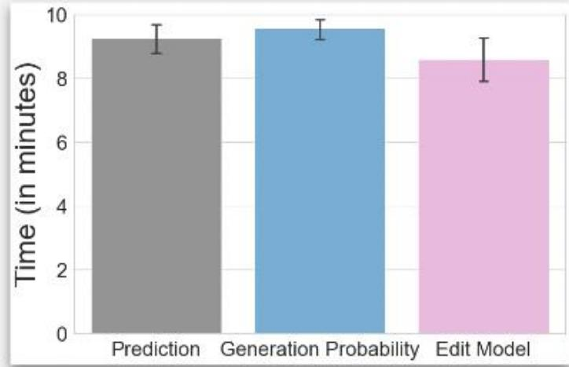
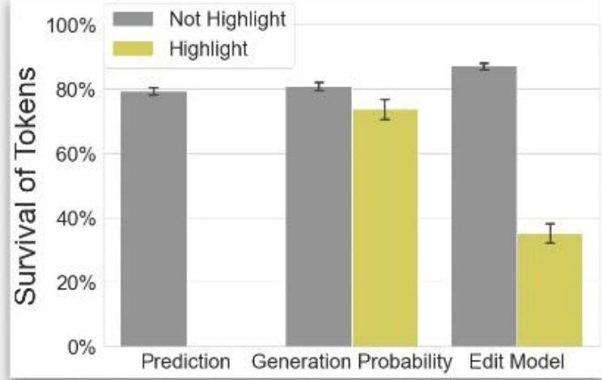
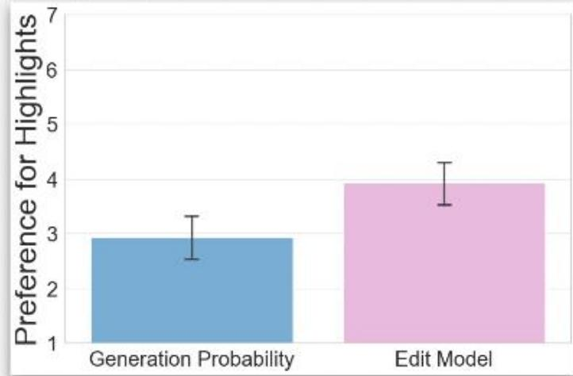

# Generation Probabilities are Not Enough: Improving Error Highlighting in Al Code Suggestions

Helena Vasconcelos,Gagan Bansal,Adam Fourney,

Vera Liao, Jennifer Wortman Vaughan

Research

Programmers increasingly use Al generated code (e.g., from CoPilot) in IDEs!

However,generated code may be erroneous! We need to help programmers double-check Al code and identify when and where it may be incorrect.

We explore two options to highlight uncertain, potentially erroneous regions:

Use generation probabilities or "confidence scores" to show where the model is uncertain   
Learn an edit model to show where programmersare most likely to make edits

Mixed-methods, within-subjects study with 30 programmers showed that edit model leads to:

-Significantly faster task completion time

-Significantly more localized edits

-Stronger preference

compared to the generation probability and no-highlights