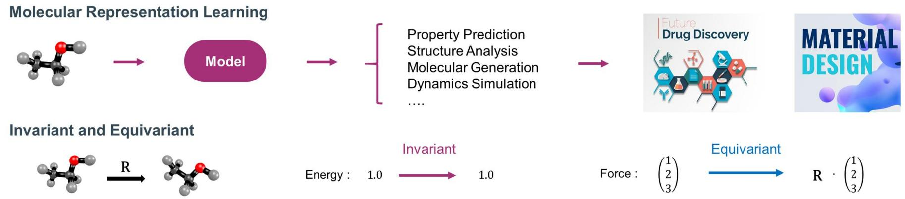
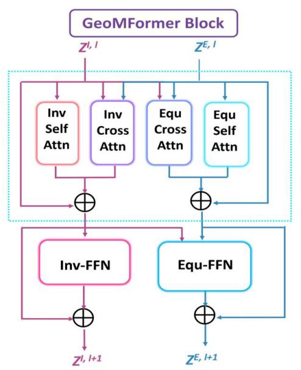
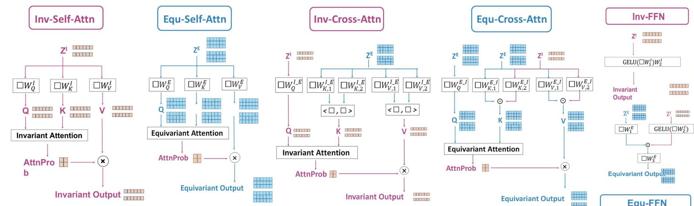

  
Background

# GeoMFormer

  
Overview

>Goal of design: Devise a framework that performs wel on both invariant and equivariant tasks in real-world applications.   
>Key to the Design: Simultaneously and comprehensively model interatomic interactions within and across feature spaces in a unified manner.

$$
\text {I n v a r i a n t S t r e a m} \left\{ \begin{array}{l l} \mathbf {Z} ^ {\prime I, l} & = \mathbf {Z} ^ {I, l} + \operatorname {I n v - S e l f - A t t n} (\mathbf {Q} ^ {I, l}, \mathbf {K} ^ {I, l}, \mathbf {V} ^ {I, l}) \\ \mathbf {Z} ^ {\prime \prime I, l} & = \mathbf {Z} ^ {\prime I, l} + \operatorname {I n v - C r o s s - A t t n} (\mathbf {Q} ^ {I, l}, \mathbf {K} ^ {I _ {-} E, l}, \mathbf {V} ^ {I _ {-} E, l}) \\ \mathbf {Z} ^ {I, l + 1} & = \mathbf {Z} ^ {\prime \prime I, l} + \operatorname {I n v - F F N} (\mathbf {Z} ^ {\prime \prime I, l}) \end{array} \right.
$$

$$
\text {E q u i v a r i a n t S t r e a m} \left\{ \begin{array}{l l} \mathbf {Z} ^ {\prime E, l} & = \mathbf {Z} ^ {E, l} + \operatorname {E q u - S e l f - A t t n} \left(\mathbf {Q} ^ {E, l}, \mathbf {K} ^ {E, l}, \mathbf {V} ^ {E, l}\right) \\ \mathbf {Z} ^ {\prime \prime E, l} & = \mathbf {Z} ^ {\prime E, l} + \operatorname {E q u - C r o s s - A t t n} \left(\mathbf {Q} ^ {E, l}, \mathbf {K} ^ {E _ {-} I, l}, \mathbf {V} ^ {E _ {-} I, l}\right) \\ \mathbf {Z} ^ {E, l + 1} & = \mathbf {Z} ^ {\prime \prime E, l} + \operatorname {E q u - F F N} \left(\mathbf {Z} ^ {\prime \prime E, l}\right) \end{array} \right.
$$

  
Instantiation

# Experiments

> Invariant: OC20 IS2RE (Energy Prediction)

Table2.ResultsonOC2IS2REvalset.Wereporttheofcialesultsofbaselinesfromtheoriginalpaperoldvaluesdenotethebest.   

<table><tr><td rowspan="2">Model</td><td colspan="5">Energy MAE (eV) ↓</td><td colspan="5">EwT (%) ↑</td></tr><tr><td>ID</td><td>OOD Ads.</td><td>OOD Cat.</td><td>OOD Both</td><td>Average</td><td>ID</td><td>OOD Ads.</td><td>OOD Cat.</td><td>OOD Both</td><td>Average</td></tr><tr><td>CGCNN (Xie &amp; Grossman, 2018)</td><td>0.6203</td><td>0.7426</td><td>0.6001</td><td>0.6708</td><td>0.6585</td><td>3.36</td><td>2.11</td><td>3.53</td><td>2.29</td><td>2.82</td></tr><tr><td>SchNet (Schütt et al., 2018)</td><td>0.6465</td><td>0.7074</td><td>0.6475</td><td>0.6626</td><td>0.6660</td><td>2.96</td><td>2.22</td><td>3.03</td><td>2.38</td><td>2.65</td></tr><tr><td>DimeNet++ (Gasteiger et al., 2020a)</td><td>0.5636</td><td>0.7127</td><td>0.5612</td><td>0.6492</td><td>0.6217</td><td>4.25</td><td>2.48</td><td>4.4</td><td>2.56</td><td>3.42</td></tr><tr><td>GemNet-T (Gasteiger et al., 2021)</td><td>0.5561</td><td>0.7342</td><td>0.5659</td><td>0.6964</td><td>0.6382</td><td>4.51</td><td>2.24</td><td>4.37</td><td>2.38</td><td>3.38</td></tr><tr><td>SphereNet (Liu et al., 2022b)</td><td>0.5632</td><td>0.6682</td><td>0.5590</td><td>0.6190</td><td>0.6024</td><td>4.56</td><td>2.70</td><td>4.59</td><td>2.70</td><td>3.64</td></tr><tr><td>Graphormer-3D (Shi et al., 2022)</td><td>0.4329</td><td>0.5850</td><td>0.4441</td><td>0.5299</td><td>0.4980</td><td>-</td><td>-</td><td>-</td><td>-</td><td>-</td></tr><tr><td>GNS (Pfaff et al., 2020)</td><td>0.47</td><td>0.51</td><td>0.48</td><td>0.46</td><td>0.4800</td><td>-</td><td>-</td><td>-</td><td>-</td><td>-</td></tr><tr><td>Equiformer (Liao &amp; Smidt, 2023)</td><td>0.4156</td><td>0.4976</td><td>0.4165</td><td>0.4344</td><td>0.4410</td><td>7.47</td><td>4.64</td><td>7.19</td><td>4.84</td><td>6.04</td></tr><tr><td>GeoMFormer (ours)</td><td>0.3883</td><td>0.4562</td><td>0.4037</td><td>0.4083</td><td>0.4141</td><td>11.26</td><td>6.70</td><td>9.97</td><td>6.42</td><td>8.59</td></tr></table>

>Equivariant: OC20 IS2RS (Structure Prediction)

Table 3.Results on OC20 IS2RS validation set. All models are trained and evaluated under the direct prediction setting.Bold values indicate the best.

<table><tr><td rowspan="2">Model</td><td colspan="5">ADwT (%) ↑</td></tr><tr><td>ID</td><td>OOD Ads</td><td>OOD Cat</td><td>OOD Both</td><td>Average</td></tr><tr><td>PaiNN (Schütt et al., 2021)</td><td>3.29</td><td>2.37</td><td>3.10</td><td>2.33</td><td>2.77</td></tr><tr><td>TorchMD-Net (Thölke &amp; De Fabritiis, 2022)</td><td>3.32</td><td>3.35</td><td>2.94</td><td>2.89</td><td>3.13</td></tr><tr><td>Spinconv (Shuaibi et al., 2021)</td><td>5.81</td><td>4.88</td><td>5.63</td><td>4.84</td><td>5.29</td></tr><tr><td>GemNet-dT (Gasteiger et al., 2021)</td><td>6.87</td><td>7.10</td><td>6.03</td><td>7.08</td><td>6.77</td></tr><tr><td>GemNet-OC (Gasteiger et al., 2022)</td><td>11.31</td><td>12.20</td><td>4.40</td><td>5.55</td><td>8.36</td></tr><tr><td>GeoMFormer (ours)</td><td>11.45</td><td>10.52</td><td>9.94</td><td>10.78</td><td>10.67</td></tr></table>

》 Invariant: Molecule3D (Property Prediction)

Table 5.Results on Molecule3D for both random and scaffold splits.We report the official results of baselines.Bold values denote the best.

<table><tr><td rowspan="2">Model</td><td colspan="2">MAE ↓</td></tr><tr><td>Random</td><td>Scaffold</td></tr><tr><td>GIN-Virtual (Hu et al., 2021)</td><td>0.1036</td><td>0.2371</td></tr><tr><td>SchNet (Schütt et al., 2018)</td><td>0.0428</td><td>0.1511</td></tr><tr><td>DimeNet++ (Gasteiger et al., 2020a)</td><td>0.0306</td><td>0.1214</td></tr><tr><td>SphereNet (Liu et al., 2022b)</td><td>0.0301</td><td>0.1182</td></tr><tr><td>ComENet (Wang et al., 2022)</td><td>0.0326</td><td>0.1273</td></tr><tr><td>PaiNN (Schütt et al., 2021)</td><td>0.0311</td><td>0.1208</td></tr><tr><td>TorchMD-Net (Thölke &amp; De Fabritiis, 2022)</td><td>0.0303</td><td>0.1196</td></tr><tr><td>GeoMFormer (ours)</td><td>0.0252</td><td>0.1045</td></tr></table>

> Invariant: PCQM4Mv2 (Property Prediction)

Table 4.Results on PCQM4Mv2. The evaluation metric is the Mean Absolute Error (MAE).We report the official results of baselines. $^ *$ indicates the best performance achieved by models with the same complexity (n denotes the number of atoms).

<table><tr><td>Model</td><td>Complexity</td><td>Valid MAE ↓</td></tr><tr><td>MLP-Fingerprint (Hu et al., 2021)</td><td></td><td>0.1735</td></tr><tr><td>GINE-vN (Brossard et al., 2020; Gilmer et al., 2017)</td><td></td><td>0.1167</td></tr><tr><td>GCN-vN (Kipf &amp; Welling, 2017; Gilmer et al., 2017)</td><td>O(n)</td><td>0.1153</td></tr><tr><td>GIN-vN (Xu et al., 2019; Gilmer et al., 2017)</td><td></td><td>0.1083</td></tr><tr><td>DeeperGCN-vN (Li et al., 2020; Gilmer et al., 2017)</td><td></td><td>0.1021*</td></tr><tr><td>TokenGT (Kim et al., 2022)</td><td></td><td>0.0910</td></tr><tr><td>EGT (Hussain et al., 2022)</td><td></td><td>0.0869</td></tr><tr><td>GRPE (Park et al., 2022)</td><td></td><td>0.0867</td></tr><tr><td>Graphomer (Ying et al., 2021a; Shi et al., 2022)</td><td>O(n2)</td><td>0.0864</td></tr><tr><td>GraphGPS (Rampášek et al., 2022)</td><td></td><td>0.0858</td></tr><tr><td>GPS++ (Masters et al., 2022)</td><td></td><td>0.0778</td></tr><tr><td>Transformer-M (Luo et al., 2023)</td><td></td><td>0.0787</td></tr><tr><td>GEM-2 (Liu et al., 2022a)</td><td></td><td>0.0793</td></tr><tr><td>Uni-Mol+ (Lu et al., 2023)</td><td>O(n3)</td><td>0.0708*</td></tr><tr><td>GeoMFormer (ours)</td><td>O(n2)</td><td>0.0734*</td></tr></table>

> Equivariant: N-body Simulation (Position Prediction)

Table 6.Results on N-body System Simulation. We report the official results of baselines.Bold values indicate the best.

<table><tr><td>Model</td><td>MSE ↓</td></tr><tr><td>SE(3) Transformer (Fuchs et al., 2020)</td><td>0.0244</td></tr><tr><td>Tensor Field Network (Thomas et al., 2018)</td><td>0.0155</td></tr><tr><td>Graph Neural Network (Gilmer et al., 2017)</td><td>0.0107</td></tr><tr><td>Radial Field (Köhler et al., 2019)</td><td>0.0104</td></tr><tr><td>EGNN (Satorras et al., 2021)</td><td>0.0071</td></tr><tr><td>GeoMFormer (ours)</td><td>0.0047</td></tr></table>