# Introduction

This work tackles the problem of geo-localization with anew paradigm using a large vision-language model (LVLM) augmented with human inference knowledge.

Challenge: The scarcity of data for training the LVLM-existing street-view datasets often contain numerous low-quality images lacking visual clues, and lack any reasoning inference.

Dataset:We devise a CLIP-based network to quantify the locatability of street-view images, resulting in the creation of a new dataset comprising highly locatable street views. Additionally,we integrate external knowledge obtained from real geo-localization games, tapping into valuable human inference capabilities.

Model: GeoReasoner,which undergoes finetuning through dedicated reasoning and locationtuning stages,outperforms counterpart LVLMs by more than $25 \%$ at country-level and $38 \%$ at citylevel geo-localization tasks,and surpasses StreetCLIP in performance while requiring fewer training resources.

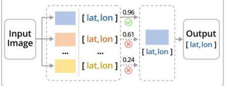  
Retrieval-based approaches

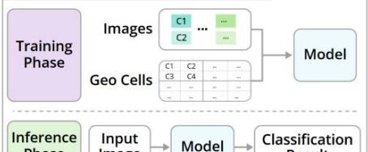  
Classification-based approaches

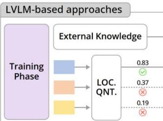

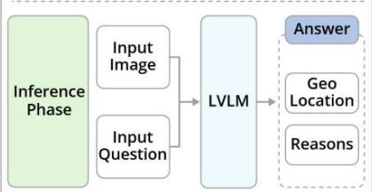

# Data Curation

Street-View Images: A total of over 130k street-view images with geo-tags collected from Google Street View

Textual Clues: A total of over 3K textual clues that encapsulate rich geo-localization information from GeoGuessrand Tuxun communities

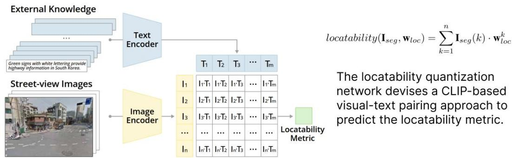

# Geo-localization with Reasoning

The architecture of GeoReasoner consists of three modules: Vision Encoder,VL Adapterand Pre-trained LLM.The model undergoes a two-fold supervised fine-tuning process: reasoning tuning and location tuning, to enable geo-localization with reasoning.

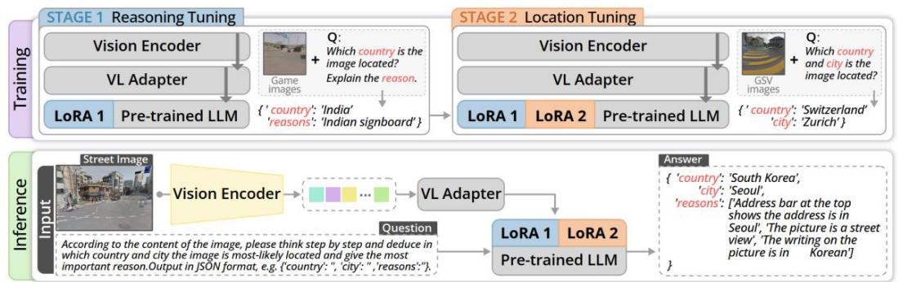

# Experiments

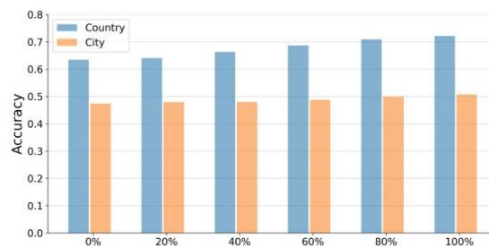  
Locatability Quantization Method

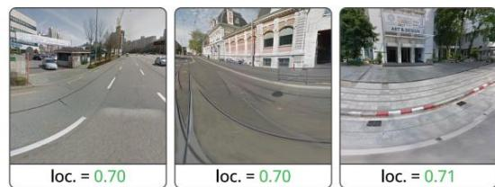

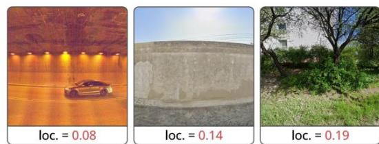

# GeoReasoner

Comparison of Precision,RecallandF1scores in country-level and city-level geo-localization. *represents the model trained on high-locatability GSV images.

<table><tr><td rowspan="2">Model</td><td colspan="4">Country</td><td colspan="2">City</td></tr><tr><td>Accuracy↑</td><td>Recall↑</td><td>F1↑</td><td>Accuracy↑</td><td>Recall↑</td><td>F1↑</td></tr><tr><td>StreetCLIP (Haas et al., 2023)</td><td>0.7943</td><td>1.00</td><td>0.8854</td><td>0.7457</td><td>1.00</td><td>0.8543</td></tr><tr><td>LLaVA (Liu et al., 2024)</td><td>0.4029</td><td>1.00</td><td>0.5744</td><td>0.2400</td><td>1.00</td><td>0.3871</td></tr><tr><td>Qwen-VL (Qwen-7B) (Bai et al., 2023a)</td><td>0.5829</td><td>0.95</td><td>0.7225</td><td>0.3743</td><td>0.89</td><td>0.5270</td></tr><tr><td>GPT-4V (Achiam et al., 2023)</td><td>0.8917</td><td>0.34</td><td>0.4923</td><td>0.5083</td><td>0.31</td><td>0.3851</td></tr><tr><td>ViT* (Dosovitskiy et al., 2021)</td><td>0.7100</td><td>1.00</td><td>0.8304</td><td>0.6762</td><td>1.00</td><td>0.8068</td></tr><tr><td>GeoReasoner*</td><td>0.8237</td><td>1.00</td><td>0.9033</td><td>0.7521</td><td>1.00</td><td>0.8585</td></tr></table>

Results of theablationexperiments   

<table><tr><td rowspan="2">Model</td><td colspan="2">Training</td><td colspan="2">Country</td><td colspan="4">Performance</td></tr><tr><td>Reasoning</td><td>Location</td><td>Accuracy↑</td><td>Recall↑</td><td>F1↑</td><td>Accuracy↑</td><td>City Recall↑</td><td>F1↑</td></tr><tr><td>Qwen-VL (Qwen-7B)</td><td>-</td><td>-</td><td>0.5829</td><td>0.95</td><td>0.7225</td><td>0.3743</td><td>0.89</td><td>0.5270</td></tr><tr><td>GeoReasoner w/o location tuning</td><td>✓</td><td>×</td><td>0.6971</td><td>1.00</td><td>0.8215</td><td>0.4114</td><td>0.99</td><td>0.5813</td></tr><tr><td>GeoReasoner w/o reasoning tuning</td><td>×</td><td>✓</td><td>0.7803</td><td>1.00</td><td>0.8766</td><td>0.7029</td><td>1.00</td><td>0.8255</td></tr><tr><td>GeoReasoner</td><td>✓</td><td>✓</td><td>0.8237</td><td>1.00</td><td>0.9033</td><td>0.7521</td><td>1.00</td><td>0.8584</td></tr></table>

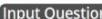

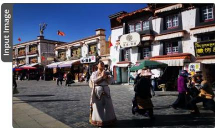

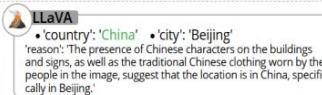  
GroundTruth·country':China'·'city':'Lhasa'

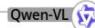

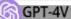

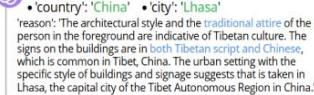

·country':'China'·'city':'Lhasa' reason':Themain square of Lhasa is themost famous squarein

Lasanditioteo

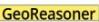

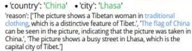

# Contributions

·We present a new paradigm that leveragesanLVLM and external knowledge of human inference for geolocalization with reasoning from street-view images.   
·We introduce the concept of locatability and devise a CLIP-based network to quantify the degree of locatability in street-view images.   
·We propose GeoReasoner, an LVLM that outperforms existing geo-localization modelsand providesdetailed reasoningforthe inferred results.