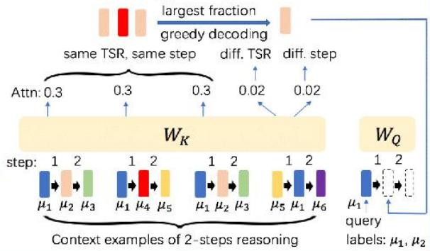
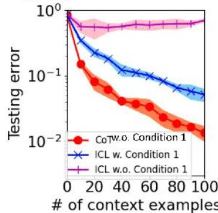
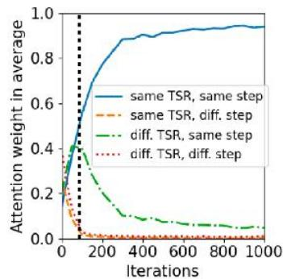

# How Do Nonlinear Transformers Acquire Generalization-Guaranteed CoT Ability?

Hongkang ${ \mathsf { L } } { \mathsf { i } } ^ { 1 }$ ,MengWang1,Songtao Lu²,Xiaodong Cui²,Pin-Yu Chen2

1:Rensselaer Polytechnic Institute;2: IBM Research

# Overview

$\spadesuit$ Theoretically characterize how training Transformers can enable chain-of thought (CoT).   
$\spadesuit$ Quantitative analysis of how context examples affect CoT performance.   
$\bullet$ Theoretical study of why CoT outperforms ICL.

# Background and motivation

# Standard Prompting

# Model Input

Q:Rogerhas5tennisballs.He buys2more cansof tennisballs.Eachcan has3tennisball.Howmany tennis balls does he have now?   
A:The answer is11.   
Q:Thecafeteria had23apples.Ifthey used20to make lunchand bought6more,howmany apples dothey have?

# Chain-of-ThoughtPrompting

# Model Input

Q:Roger has5 tennis balls.He buys2 more cans of tennis balls.Each can has3tennis bals.Howmany tennis balls does he have now?   
A:Roger startedwith5balls.2cansof 3tennisballs eachis6tennis bals.5+6=11.The answeris11.   
Q:Thecafeteria had23apples.If theyused 20to make lunch andbought6more,howmanyapples do they have？

# Model Output

A:Theansweris27.

# Model Output

A:The cafeteria had 23 apples originally.They used 20tomakelunch.Sothey had23-20=3.They bought6moreapples,sothey have3+6=9.The answeris9.

CoTaugments K-step reasoning examples to the query for generation,i.e.,an extension of incontext learning (ICL) by multi-step examples.   
$\spadesuit$ Existing works [1,2,3]: the expressive power.   
$\spadesuit$ The problem of why a Transformer can be trained to conduct CoT is less investigated.

# Problem formulation

Study learning $K$ -step reasoning tasks. Each task $f$ is a composition of $\left\{ f _ { i } \right\} _ { \mathrm { { i } } = 1 } ^ { K } { } _ { \mathrm { { i } } = 1 }$ and outputs $\left\{ { z _ { i } } \right\} ^ { K } _ { \mathrm { i } = 1 }$ for the input $z _ { 0 } = x _ { q u e r y }$ ,where $z _ { k } = f _ { k } ( z _ { k - 1 } )$

Learning model: one-layer Transformer $F ( P ) =$

$\begin{array} { r } { \sum _ { i } W _ { V } \widetilde { p _ { i } } s o f t m a x \left( ( W _ { K } \widetilde { p _ { i } } ) ^ { \top } W _ { Q } \widetilde { p } _ { q u e r y } \right) } \end{array}$ ,where $P$ is the input prompt, $\tilde { p } _ { i }$ is $p _ { i }$ with positional encoding.

Training: Following theoretical works [4,5] for ICL,we aim to solve an empirical risk minimization by stochastic gradient descentwith squared loss.

Each Training prompt consists of context examples and a query. Each example $P = \left( { \begin{array} { l } { x _ { 1 } \ y _ { i , 1 } \dots y _ { i , K - 1 } } \\ { y _ { i , 1 } y _ { i , 2 } \dots y _ { i , K } } \end{array} } \right)$ iiyi2..yik hasK steps,where $y _ { i , s } = f _ { k } ( y _ { i , s - 1 } )$ .The query contains the first $k \in [ K ]$ steps of the reasoning.

CoT Inference: The testing prompt consists of examples and a query.The query contains one

CoT repeats the two steps below for $K$ steps.

> Greedy decoding to generate the next step.   
Y Add the generation to the end of the prompt.

CoT generalization error:average O-1 error of K steps.

ICL Inference: The testing examples only contain the inputand the final-step output.The generalization erroristheaverageO-1 error.

[1]Lietal.Dissecting Chain-of-Thought:Compositionality through In-Context Filteringand Learning. Neurips2023.   
[2] Feng etal.Towards Revealing the Mystery behind Chain ofThought:ATheoretical Perspective. Neurips2023   
[3]Lietal.Chainof Thought Empowers Transformers to Solve Inherently Serial Problem.ICLR 2024.   
[4]Huangetal.In-context convergence of transformers.ICML2024.   
[5]Zhangetal.Trained transformers learn linearmodelsin-context.JMLR2024.

# Theoretical results

Data&Tasks:The training and testing data are formulated by training/testing-relevant (TTR/TSR) patterns $\{ \mu _ { i } \} _ { i = 1 } ^ { M }$ and $\{ \mu _ { i } ^ { \prime } \} _ { i = 1 } ^ { M \prime }$ $\mathsf { T S R } \in$ span{TRR}. Consider erroneous testing prompts: reasoning in some examples contains incorrect steps.For task $f$ ,

α (or α'): the fraction of contexts with inputs that share the same TRR (or TSR) patterns as the query.   
$\tau ^ { f }$ : the fraction of accurate context examples.   
$\rho ^ { f }$ : the normalized gap of accurate over the most likely inaccurate reasoning steps.

Theorem 1(Convergence):With the number of context examples and iterations linear in $\Omega ( \alpha ^ { - 1 } )$ the population risk is $\le { \cal O } ( \epsilon )$

Theorem 2 (CoT Generalization):To achieve a zero CoT error, the number of context examples for task $f$ is proportional to $\left( \alpha ^ { \prime } \tau ^ { f } \rho ^ { f } \right) ^ { - 2 }$ . The CoT performanceisimprovedwith

·More accurate reasoning examples,   
·More similar examples to the query.

Theorem 3 (Comparison with ICL): The success of ICL requires a dominant fraction of correct input-label examples in the testing prompt (Condition 1), but CoT does not.

# The mechanism of CoT

Proposition1:Theattention weights is concentrated on prompt columns with the same TSR pattern and the step index as the query step.This leads to a correct prediction in each reasoning step.

Transformers Provably Implement CoT by Attending to the Most Similar Examples Every Step.

# Numerical experiments

Condition 1 is crucial for the success of ICL but not for CoT.   
Training dynamics of CoT: same TSR & step matter.

