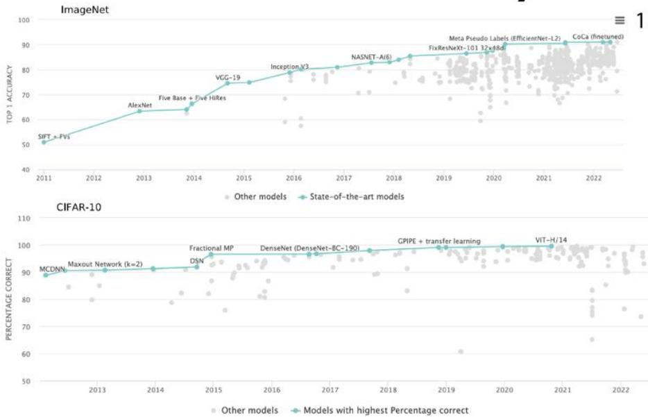
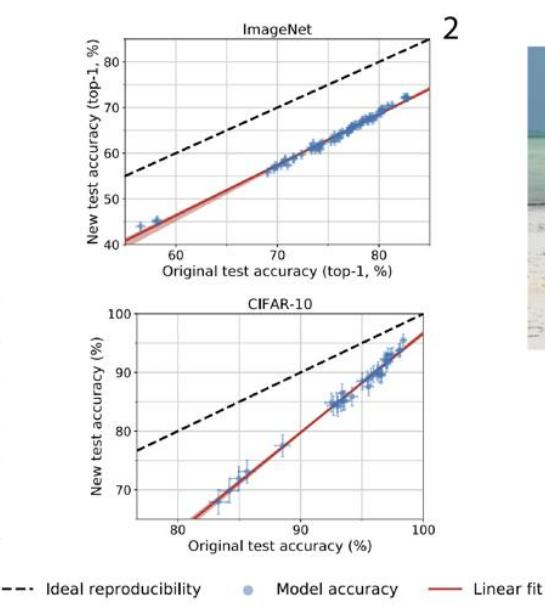
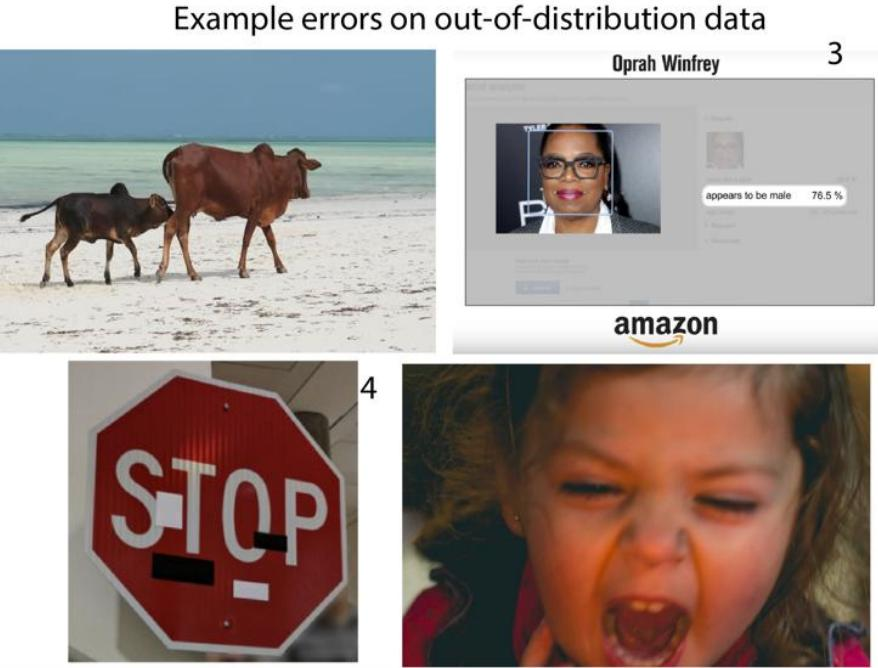
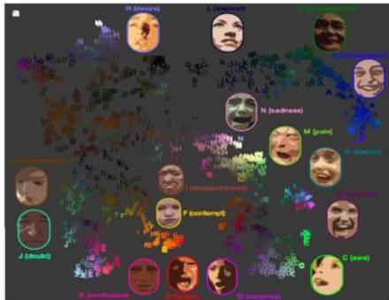
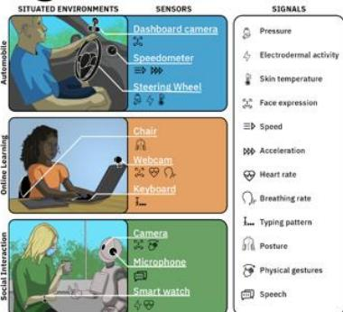
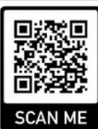

# ldentifying the Context Shift between Test Benchmarks and Production Data

Matt Groh, MIT Media Lab

# Will your model work in production?

# Consider the Data Generating Process

Distribution Shift Perspective

Covariate Shift: $P _ { t e s t } ( x ) \neq P _ { t r a i n } ( x )$ and $P _ { t e s t } ( y | x ) = P _ { t r a i n } ( y | x )$

Prior Probability Shift: $P _ { t e s t } ( y ) \neq P _ { t r a i n } ( y )$ and $P _ { t e s t } ( y | x ) = P _ { t r a i n } ( y | x )$

Concept Shift: $P _ { t e s t } ( x ) = P _ { t r a i n } ( x )$ and $P _ { t e s t } ( y | x ) \neq P _ { t r a i n } ( y | x )$

Other Distribution Shift: $P _ { t e s t } ( x , y ) \neq P _ { t r a i n } ( x , y )$

# Context Shift Perspective

Sample Selection Bias:when the data distribution is missing relevant examples or dimensions

Non-stationarity:when the data distribution changes over time or environment

Adversarial Perturbations:when thedistribution of data isaltered in a way that does not affect human task performance

# Contextual Dimensions in Human Centered ML Applications

e ds

Who is represented in the data Who is annotating the data? When and where is data collected? Howdo socialgograpical,mporal,sttic,incialndtheridosycrasiesinfeceta

# Data Generation Process Desiderata for Dynamic Benchmarks

1.Prediction Task:What are the input features and output labels?   
2.Test Size:Whatis the minimum test size forreducing withindata sampling error toan acceptably small rate?   
3.GroundTruthAnnotationArbitration:Whohastheauthoritytoannotatethedata?Howshoulddisagreementberepresented?   
4.DataInclusionandExcusionCriteria:Whatare thepossbledatasources?Howisdatacurated?Whatarethequalityconstraints?   
e.g.Dynabench13

# Case Study of Implicit Assumptions in Facial Expression Recognition

ExamplePerformance EvaluationofFERfrom Mollahosseinietal2016

<table><tr><td></td><td>Proposed Architecture</td><td>AlexNet</td></tr><tr><td>MultiPie</td><td>94.7</td><td>94.8</td></tr><tr><td>MMI</td><td>77.9</td><td>56.0</td></tr><tr><td>DISFA</td><td>55.0</td><td>56.1</td></tr><tr><td>FERA</td><td>76.7</td><td>77.4</td></tr><tr><td>SFEW</td><td>47.7</td><td>48.6</td></tr><tr><td>CK+</td><td>93.2</td><td>92.2</td></tr><tr><td>FER2013</td><td>66.4</td><td>61.1</td></tr></table>

HowShould Facial Expressionsbe Represented?

Asthefollowing"basic emotion categories:" Neutral,Hainss,ds,a

Disgust,Surprise?Oras theemotions on the rightfrom Cowen et al 2020?Or something else?

  
15

Toomanydegreesoffreedom+toomanyassumptions Whatdata can serve as ground truth:

posedphotographswithobservers'labels, framesfromavideowith observers'labeled peak expressions,self reports,mappings of facial action units to categories?When

should we expect the model to generalize? What limitsshould beexpress?

References

1.paperswitodecom/sota/imageclsificaton-cifar-10ndpapeswcde.com/sotaimageclasifcatioonmeet 2.Recht,et al.Do ImageNet Clasifiers Generalize to ImageNet.2019

3.BuolamwiniandGebruGender Shades:Intersectional Acuracy Diparities in CommercialGenderClassification.2018

4.Eykholt K,etal.Physicial-WorldAttackson Deep Learning isualClassfication2018

5.Groh etal.Evaluating Deep Neural Networks Trained on...2021

6.Daneshjou et al.Disparities in Dermatology Al..2022

ZKosti etal.ContextBase EmotionRecognition,using. 2019

8.Groh et al.Deepfake Detection by Crowds，Machines，and...2

9.Obermeyer et al.Dissecting Racial Bias in an Algorithm...2019

10.Winkleretal.Association BetweenSurgical Skin Markings in Dermoscopic..2019

11Oakden-Rayner et al.Hidden Stratification Causes Clinically Meaninful..2020

12.Piersonetal.AnAlgorithmic Approach to Reducing Unexpline

13.Kielaetal.Dynabench:RethinkingBenchmarkinginNLP.2021

15.Cowen et al.Sixteen Facial Expressions Occur in Similar Contexts..2020

Link to Preprint

