# Improving Equilibrium Propagation Without Weight Symmetry Through Jacobian Homeostasis

Axel Laborieux1,Friedemann Zenke1,2

1Friedrich Miescher Institute for Biomedical Research,2Facultyof Natural Sciences,Universityof Basel

# Generalized Equilibrium Propagation [1]

Goal: Local gradients for Neurobiology and Neuromorphics

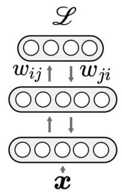

Dynamics $: \widehat { \mathrm { d } \ b { \mathscr { t } } } = F ( \pmb { \theta } , \pmb { u } , \pmb { x } ) \widehat { \mathrm { ~  ~ \xi ~ } + \beta \frac { \mathrm { d } \mathscr { L } } { \mathrm { d } u } } ^ { \dagger }$

Fixed-point (prediction): $0 = F ( \pmb \theta , \pmb u _ { 0 } ^ { * } , \pmb x )$

EP error vector:

$$
\begin{array}{l} \left. \frac {\mathrm {d} \boldsymbol {u} ^ {*}}{\mathrm {d} \beta} \right| _ {\beta = 0} = - J _ {F} \left(\boldsymbol {u} _ {0} ^ {*}\right) ^ {- 1} \cdot \frac {\partial F}{\partial \beta} \left(\boldsymbol {u} _ {0} ^ {*}\right) \\ = - \underbrace {J _ {F} \left(\boldsymbol {u} _ {0} ^ {*}\right) ^ {- \top}} _ {\text {f o r E B M s}} \cdot \underbrace {\frac {\mathrm {d} \mathcal {L}}{\mathrm {d} \boldsymbol {u} _ {0} ^ {*}}} _ {\text {b y D e f . 1}} ^ {\top} = \delta \\ \end{array}
$$

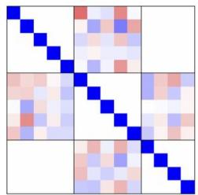  
Non-symmetric

Entangled sources of bias:

- Finite differences X   
- Jacobian asymmetry X

# Our contributions:

·Disentangle the two sources of bias in non-symmetric EP   
· Extend holomorphic EP [2] to non symmetric networks   
· New homeostatic loss promotes Jacobian symmetry

# Accurate computation of the EP error vector

For complex-differentiable F:

$$
\left. \frac {\mathrm {d} \boldsymbol {u} ^ {*}}{\mathrm {d} \beta} \right| _ {\beta = 0} = \frac {1}{T | \beta |} \int_ {0} ^ {T} \boldsymbol {u} _ {\beta (t)} ^ {*} e ^ {- 2 \mathrm {i} \pi t / T} \mathrm {d} t.
$$

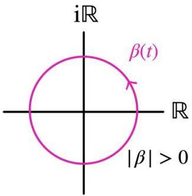

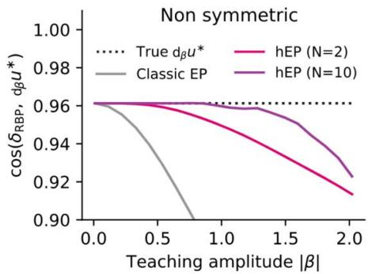

Derivative as integral√ Non vanishing perturbations

# Continuous-in-time estimation of the gradient

Presynaptic term

(Mean value theorem):

$$
\frac {1}{t} \int_ {0} ^ {t} \frac {\partial F}{\partial \boldsymbol {\theta}} \left(\boldsymbol {u} _ {\beta (\tau)} ^ {*}\right) d \tau \underset {t \rightarrow \infty} {\longrightarrow} \frac {\partial F}{\partial \boldsymbol {\theta}} \left(\boldsymbol {u} _ {0} ^ {*}\right)
$$

Post synaptic error:

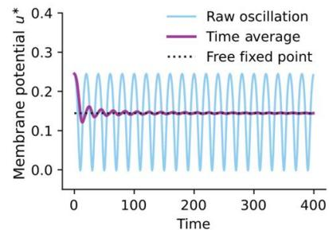

$$
\frac {1}{t | \beta |} \int_ {0} ^ {t} \boldsymbol {u} _ {\beta (\tau)} ^ {*} e ^ {- 2 \mathrm {i} \pi \tau / T} \mathrm {d} \tau \underset {t \rightarrow \infty} {\longrightarrow} \frac {\mathrm {d} \boldsymbol {u} ^ {*}}{\mathrm {d} \beta}
$$

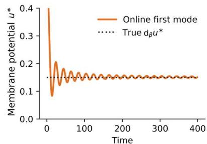

The gradient estimate can be computed in continuous time without discrete forward/backward phases $\circledcirc$

# Isolated effect of Jacobian asymmetry

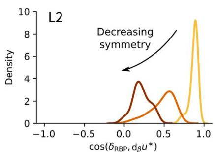

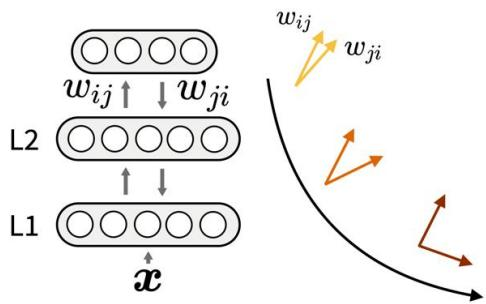

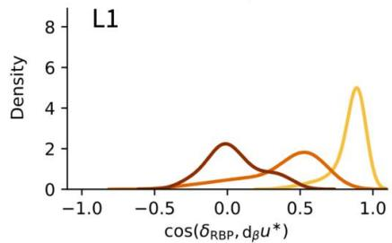

General transformation:

$$
\mathrm {d} _ {\beta} \boldsymbol {u} ^ {*} = J _ {F} \left(\boldsymbol {u} _ {0} ^ {*}\right) ^ {- 1} J _ {F} \left(\boldsymbol {u} _ {0} ^ {*}\right) ^ {\top} \boldsymbol {\delta}
$$

At first order:

$$
\mathrm {d} _ {\beta} \boldsymbol {u} ^ {*} = \delta - 2 S ^ {- 1} A \delta + o (S ^ {- 1} A \delta)
$$

New homeostatic loss:

$$
\mathcal {L} _ {\text {h o m e o}} := \underset {\varepsilon \sim \mathcal {N} (0, I)} {\mathbb {E}} \underbrace {\left[ \| J _ {F} \varepsilon \| ^ {2} - \varepsilon^ {\top} J _ {F} ^ {2} \varepsilon \right]} _ {\downarrow}
$$

Minimize sensitivity to perturbation

Increase second-order reconstruction

# Benefits of the homeostatic loss on learning

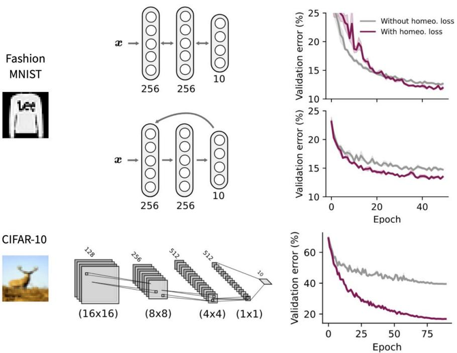

<table><tr><td rowspan="2"></td><td>CIFAR-10</td><td colspan="2">ImageNet 32 × 32</td></tr><tr><td>Top-1 (%)</td><td>Top-1 (%)</td><td>Top-5 (%)</td></tr><tr><td>hEP w/o Lhomeo</td><td>60.4 ± 0.4</td><td>-</td><td>-</td></tr><tr><td>hEPN=2,|β|=1</td><td>81.4 ± 0.1</td><td>-</td><td>-</td></tr><tr><td>hEP (True dβu*)</td><td>84.3 ± 0.1</td><td>31.4 ± 0.1</td><td>55.2 ± 0.1</td></tr><tr><td>RBP</td><td>87.8 ± 0.3</td><td>-</td><td>-</td></tr><tr><td>RBP w/o Lhomeo</td><td>87.7 ± 0.2</td><td>-</td><td>-</td></tr><tr><td>Sym. hEPN=2,|β|=1</td><td>88.6 ± 0.2</td><td>36.5 ± 0.3</td><td>60.8 ± 0.4</td></tr></table>

Homeostatic loss is:

- More general than symmetrising weights   
- Reduces the gap with the energy-based case

# References

[1]Scellier，etal Generalizationof equilibriumpropagation to vector field dynamics.arXiv:1808.04873,2018.   
[2] Laborieuxand Zenke. Holomorphic equilibrium propagation computes exact gradients through finite size oscillations.NeurlPS 2022.

# Funding

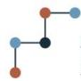

Horizon 2020 European Union Funding European Union Funding

forResearch&Innovatior

Swiss National

Science Foundation

The Novartis Foundation

