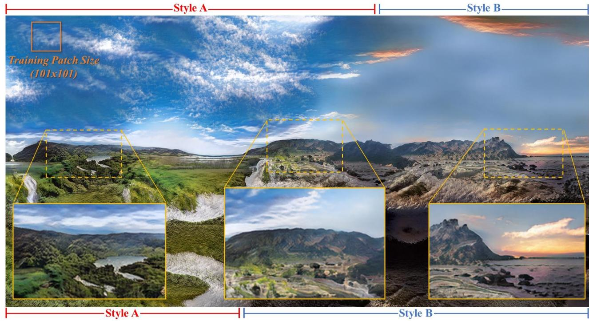
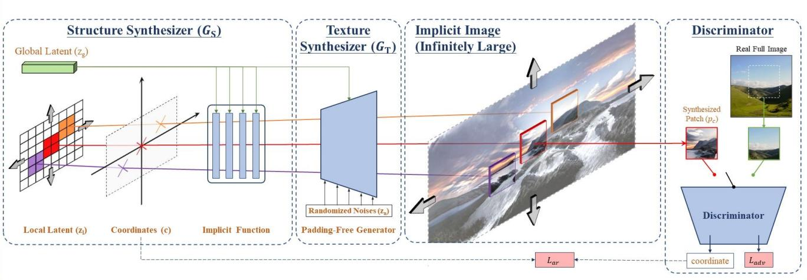
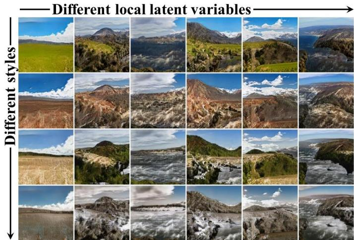
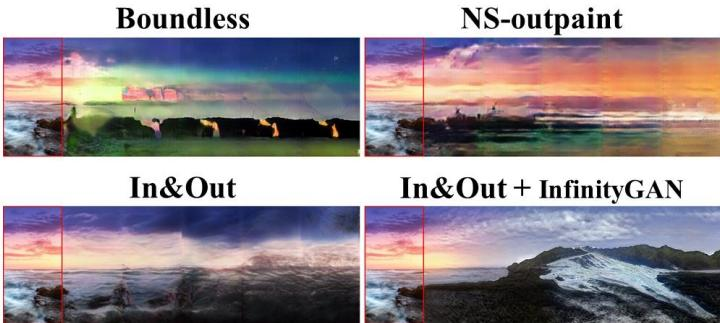
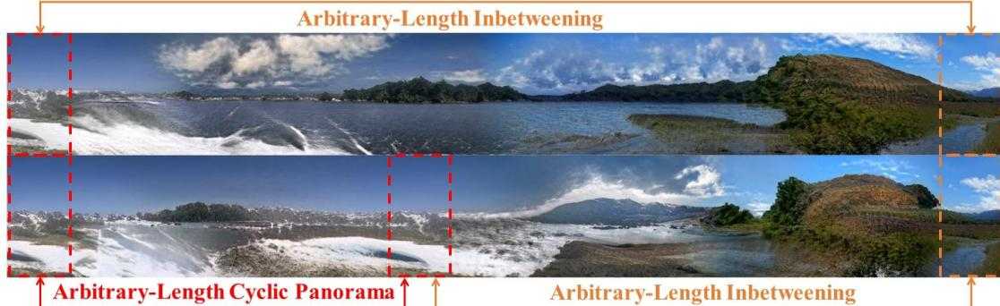
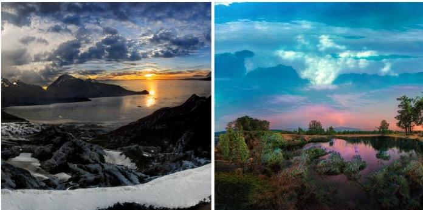
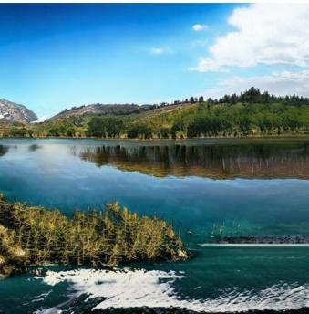
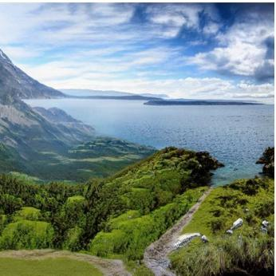

# InfinityGAN: Towards Infinite-Pixel Image Synthesis

Chieh Hubert Lin1Hsin-Ying Lee²Yen-Chi Cheng³Sergey Tulyakov2Ming-Hsuan Yang1.4.5

lUC Merced²Snap Research3CMU4Google Research’5Yonsei University

TL;DR We tackle the problem of synthesizing images at arbitrarily sizes, up to infinitely large.

# Synthesizing infinite-pixel images from finite-sized training data.

A1024×2048 image composedof 242 patches,independently synthesizedby InfinityGAN with spatial fusion of two styles.Thegenerator is trainedon101x101patches (e.g.,marked intop-left)sampled from197×197realimages.Note that training and inference (of any size) are performed on a single GTX TITAN X GPU.

Without carefully taming the positional information in the generator, other frameworks cannot generalize to extended image sizes at testing.   
Weshowthat the two sets oflatent variables learn different and diverse appearances.   

<table><tr><td></td><td>COCO-GAN</td><td>SinGAN</td><td>StyleGAN+NCI</td><td>InfinityGAN (ours)</td></tr><tr><td rowspan="2">Generated Full Image</td><td>128×128</td><td>128×128</td><td>128×128</td><td>197×197</td></tr><tr><td></td><td></td><td></td><td></td></tr><tr><td>1024×1024</td><td></td><td></td><td></td><td></td></tr></table>

  
InfinityGAN $^ +$ GAN-inversion (In&Out $\textcircled{4}$ CVPR'22) $=$ Seamless and arbitrarily-length image outpainting / inbetweening

More samples from models trained at higherresolution settings.

A 256x10240 image

