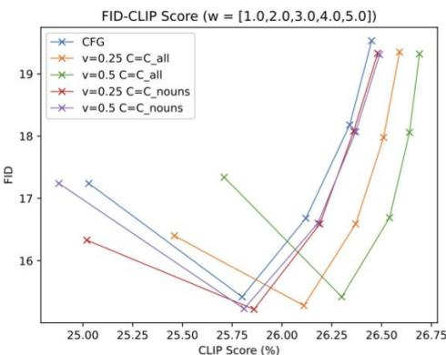
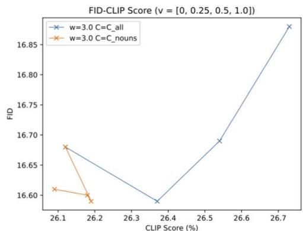
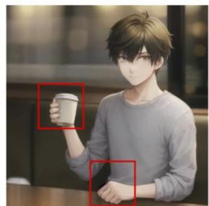
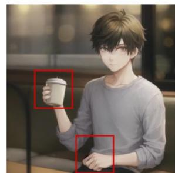

# Inner Classifier-Free Guidance and Its Taylor Expansion for Diffusion Models

Shikun Sun1, Longhui Wei, Zhicai Wang, Zixuan Wang,Junliang Xing, Jia Jia, Qi Tian 1Department of Computer Science and Technology， Tsinghua University， Beijing 10o084, China Email: 1ssk52839916@gmail.com

# Abstract

Classifier-free guidance (CFG) is a pivotal technique for balancing the diversity and fidelity of samples in conditional diffusion models. This approach involves utilizing a single model to jointly optimize the conditional score predictor and unconditional score predictor,eliminating the need for additional classifiers.It deliversimpressive resultsand can be employed for continuous and discrete condition representations. However，when the condition is continuous,it prompts the question of whether the trade-off can be further enhanced. Our proposed inner classifier-free guidance (ICFG) provides an alternative perspective on the CFG method when the condition has a specific structure, demonstrating that CFG represents a first-order case of ICFG.Additionally,we offer a second-order implementation, highlighting that even without altering the training policy, our second-order approach can introduce new valuable information and achieve an improved balance between fidelity and diversity for Stable Diffusion.

# Contributations

·We introduce ICFG and analyze the convergence of its Taylor expansion under specific conditions.   
·We demonstrate that CFG can be regarded as a first-order ICFG and propose a second-order Taylor expansion for our ICFG.   
·We apply the second-order ICFG to the Stable Diffusion model and observe that, remarkably,our new formulation yields valuable information and enhances the trade-off between fidelity and diversity, even without modifying the training policy.

# Preliminary

We assume that this diffusion process follows a SDE:

$$
\mathrm {d} \mathbf {x} = \mathbf {f} (\mathbf {x}, t) \mathrm {d} t + g (t) \mathrm {d} \mathbf {w}. \tag {1}
$$

The score function is defined as follows:

$$
\mathbf {s} (\mathbf {x}, t) = \nabla_ {\mathbf {x} _ {t}} \log q (\mathbf {x} _ {t}). \tag {2}
$$

Then, the reverse-time SDE is:

$$
\mathrm {d} \mathbf {x} = [ \mathbf {f} (\mathbf {x}, t) - g (t) ^ {2} \mathbf {s} (\mathbf {x}, t) ] \mathrm {d} t + g (t) \mathrm {d} \overline {{\mathbf {w}}}. \tag {3}
$$

For the unconditional diffusion score $\epsilon ^ { \theta } ( \mathbf { x } , t )$ ,using the same set of classifiers, the modified diffusion score is given by:

$$
\begin{array}{l} \widetilde {\epsilon} ^ {\theta} \left(\mathbf {x} _ {t}, \mathbf {c}, t\right) = \epsilon^ {\theta} \left(\mathbf {x} _ {t}, t\right) - (w + 1) \beta_ {t} \nabla_ {\mathbf {x} _ {t}} \log p _ {t} ^ {\theta} (\mathbf {c} | \mathbf {x} _ {t}) \\ = - \beta_ {t} \nabla_ {\mathbf {x} _ {t}} \left[ \log q ^ {\theta} (\mathbf {x} _ {t}) + (w + 1) \log p _ {t} ^ {\theta} (\mathbf {c} | \mathbf {x} _ {t}) \right]. \\ \end{array}
$$

The main idea behind CFG is to usea single model to simultaneously fit both the conditional score predictor and the unconditional score predictor.This is achieved by randomly replacing the condition c with $\varnothing$ (an empty value). By doing so, one can

obtain the conditional score predictor $\boldsymbol { \epsilon } ^ { \theta } ( \mathbf { x } , \mathbf { c } , t )$ and the unconditional score predictor $\epsilon ^ { \theta } ( \mathbf { x } , t )$ ,which is equivalent to $\epsilon ^ { \theta } ( \mathbf { x } , \theta , t )$ .Then, because

$$
\nabla_ {\mathbf {x} _ {t}} \left[ \log p _ {t} (\mathbf {c} | \mathbf {x} _ {t}) \right] = \nabla_ {\mathbf {x} _ {t}} \left[ \log q (\mathbf {x} _ {t} | \mathbf {c}) - \log q (\mathbf {x} _ {t}) + \log p (\mathbf {c}) \right]
$$

$$
= \nabla_ {\mathbf {x} _ {t}} \left[ \log q (\mathbf {x} _ {t} | \mathbf {c}) - \log q (\mathbf {x} _ {t}) \right],
$$

which indicates that after applying the operator $\nabla _ { \mathbf { x } _ { t } }$ , we can replace the last term of Equation (4) with $\log q ^ { \theta } ( \mathbf { x } _ { t } | \mathbf { c } ) - \log q ^ { \theta } ( \mathbf { x } _ { t } )$ to achieve a similar effect.Then we get the enhanced diffusion score:

$$
\begin{array}{l} \hat {\epsilon} ^ {\theta} \left(\mathbf {x} _ {t}, \mathbf {c}, t\right) = (w + 1) \epsilon^ {\theta} \left(\mathbf {x} _ {t}, \mathbf {c}, t\right) - w \epsilon^ {\theta} \left(\mathbf {x} _ {t}, t\right) \\ = - \beta_ {t} \nabla_ {\mathbf {x} _ {t}} \left[ \log q ^ {\theta} (\mathbf {x} _ {t} | \mathbf {c}) + w \left(\log q ^ {\theta} (\mathbf {x} _ {t} | \mathbf {c}) - \log q ^ {\theta} (\mathbf {x} _ {t})\right) \right] \tag {6} \\ = - \beta_ {t} \nabla_ {\mathbf {x} _ {t}} \left[ \log q ^ {\theta} (\mathbf {x} _ {t}) + (w + 1) \left(\log q ^ {\theta} (\mathbf {x} _ {t} | \mathbf {c}) - \log q ^ {\theta} (\mathbf {x} _ {t})\right) \right], \\ \end{array}
$$

whose enhanced intermediate distribution is:

$$
\bar {q} ^ {\theta} \left(\mathbf {x} _ {t} | \mathbf {c}\right) \propto q ^ {\theta} \left(\mathbf {x} _ {t}\right) \left[ \frac {q ^ {\theta} \left(\mathbf {x} _ {t} \mid \mathbf {c}\right)}{q ^ {\theta} \left(\mathbf {x} _ {t}\right)} \right] ^ {w + 1}. \tag {7}
$$

# Methodology

Theorem O.1.Given condition c, the enhanced transition kernel $\overline { { q } } _ { 0 t } ^ { \theta } ( \mathbf { x } _ { t } | \mathbf { x } _ { 0 } , \mathbf { c } )$ by Eq.(7) equals to the original transition kernel $q _ { 0 t } ^ { \theta } ( \mathbf { x } _ { t } | \mathbf { x } _ { 0 } , \mathbf { c } ) = q _ { 0 t } ^ { \theta } ( \mathbf { x } _ { t } | \mathbf { x } _ { 0 } )$ doesnot hold trivially.Specifically,when $w = 0$ ，the equation holds.

The question arises: Can we always ensure that $\beta = 1 ?$

# Assumption 0.1.

C is a cone,which means $\forall \beta \in \mathbb { R } ^ { + } , \forall \mathbf { c } \in \mathcal { C } , \beta \mathbf { c } \in \mathcal { C } .$   
·For each $\mathbf { c } \in { \mathcal { C } }$ $\| \mathbf { c } \|$ represents the guidance strength and $\frac { \mathbf { c } } { \| \mathbf { c } \| }$ represents the guidance direction.

Under Assumption 0.1, we define $\bar { q } ^ { \theta } ( x _ { t } | c ) = q ^ { \theta } ( \mathbf { x } _ { t } | \mathbf { c } , \beta ) \triangleq q ^ { \theta } ( \mathbf { x } _ { t } | \beta \mathbf { c } )$ $q ^ { \theta } ( \mathbf { x } _ { t } | \beta \mathbf { c } )$ .Based on this definition, we can state the following Corollary 0.1.1:

Corollary O.1.1. Given condition c and the guidance strength $\beta = w + 1$ ，we have:

$$
q _ {0 t} ^ {\theta} (\mathbf {x} _ {t} | \mathbf {x} _ {0}, \mathbf {c}, \beta) = q _ {0 t} ^ {\theta} (\mathbf {x} _ {t} | \mathbf {x} _ {0}).
$$

The following algorithm offers a practical solution and can be effectively applied to mitigate the aforementioned problem.

$$
+ v \frac {1}{m (1 - m)} \left((1 - m) \epsilon^ {\theta} (\mathbf {z} _ {i}) + m \epsilon^ {\theta} (\mathbf {z} _ {i}, \mathbf {c}) - \epsilon^ {\theta} (\mathbf {z} _ {i}, m \mathbf {c})\right)
$$

AIgorithm 3 Non-strict sample algorithm for second-order ICFG   
Require:m:middle point for estimate second-order term   
Require:w:first-order guidance strength on conditional score predictor   
Require: U: second-order guidance strength on conditional score predictor   
Require: c: condition for sampling   
Require:Require $\left\{ t _ { 1 } , t _ { 2 } , . . . , t _ { N } \right\}$ increasing timestep sequence of sampling   
Require:Sample(Zt,t):samplealgorithmfordiffusionmodels given $\mathbf { z } _ { t }$ and $\epsilon _ { t }$   
1： $\mathbf { \xi } _ { N } \sim \mathcal { N } ( \mathbf { 0 } , \mathbf { I } )$   
2:for $i = N , . . . , 1$ do   
3:101 $\overline { { \epsilon } } _ { t } = \epsilon ^ { \theta } ( { \bf z } _ { i } , { \bf c } ) + w ( \epsilon ^ { \theta } ( { \bf z } _ { i } , { \bf c } ) - \epsilon ^ { \theta } ( { \bf z } _ { i } ) )$   
$\mathbf { z } _ { i - 1 } = S a m p l e ( \mathbf { z } _ { i } , \overline { { \epsilon } } _ { t } )$   
5:end for   
6:return Zo

# Experiment

Evaluation Metrics.We evaluate the widely-used Frechet Inception Score (FID) between the generated images and the target domain images,and CLIP Score between generated images and captions on the M-COCO validation set.

Results.

  
Figure 2: The FID-CLIP Score of varying w,U and C.   
hatsune_miku

1boy,bishounen,caual, indoors,sitting,coffee shop,bokeh

scenery, village, outdoors, sky, clouds

Prompt

CFG

2nd order ICFG