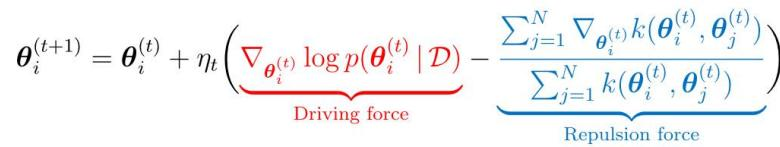
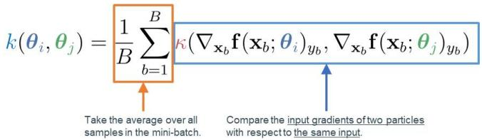
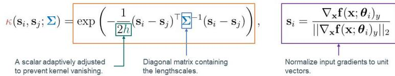
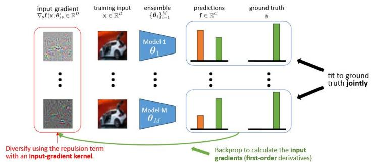
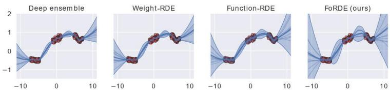
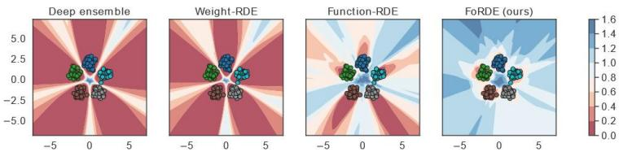
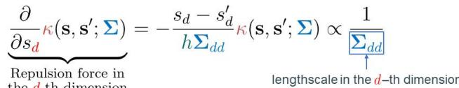
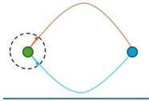
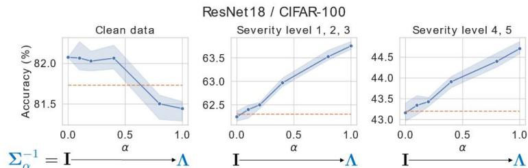

# Input-gradient space particle inference for neural network ensembles

Trung Trinh1,Markus Heinonen1,LuigiAcerbi2,Samuel Kaski1.3

1Aalto University,2Helsinki University，University of Manchester

{trung.trinh,markus.o.heinonen,samuel.kaski@aalto.fi,luigi.acerbi@helsinki.fi

#

TL;DR:We learn an ensemble of neural networks that is diverse with respect to their input gradients.

#

Description: Train an ensemble $\{ \pmb { \theta } _ { i } \} _ { i = 1 } ^ { M }$ using Wasserstein gradient descent [2], which employsa kernelized repulsion term to diversify the particles to cover the Bayes posterior $p ( \boldsymbol { \theta } | \mathcal { D } )$

·The driving force directs the particles towards high density regions of the posterior.   
·The repulsion force pushes the particles away from each other to enforce diversity.

Problem: It is unclear how to define the repulsion term for neural networks:

·weight-spacerepulsion is ineffectivedue to overparameterization.   
·function-spacerepulsion often results in underfiting.

#

Givena base kernel K,we define the kernel in the input-gradient space fora minidatcoftraningsampfe $B = \{ ( \mathbf { x } _ { b } , y _ { b } ) \} _ { b = 1 } ^ { B }$ asfolwvsn

We choose the RBF kernel ona unit sphere as the base kernel K:

#

#

·Each member is guaranteed to represent a diferent function;   
·The issues of weight-and function-space repulsion are avoided;   
·Each member is encouraged to learn different features,which can improve robustness.

#

Fora1D regression task(above) anda2D classification task(below),FoRDEs capture higher uncertainty than baselines in all regions outside of the training data. For the 2D classification task,we visualize the entropy of the predictive posteriors.

#

1. Input-gradient-space repulsion can perform better than weight- and function-space repulsion.   
2.Betercoruptionrobustnesscanbeachievedbyconfiguringtherepulsionkernelusingtheeigendecompositionoftetrainingdata

#

Table1:FoRDE-PCA achieves the best performance under corruptions while FoRDE-Identity outperforms baselines oncleandata.FoRDE-Tuned outperformsbaselines on both clean and corrupted data.Results of REsNET18/CIFAR-1OO averagedover5seeds.Each ensemble has 10 members.cA,cNLL and cECE areaccuracy,NLL,and ECE onCIFAR-100-C.

<table><tr><td>METHOD</td><td>NLL ↓</td><td>ACCURACY (%) ↑</td><td>ECE ↓</td><td>CA / CNLL / CECE</td></tr><tr><td>DEEP ENSEMBLES</td><td>0.70±0.00</td><td>81.8±0.2</td><td>0.041±0.003</td><td>54.3 / 1.99 / 0.05</td></tr><tr><td>WEIGHT-RDE</td><td>0.70±0.01</td><td>81.7±0.3</td><td>0.043±0.004</td><td>54.2 / 2.01 / 0.06</td></tr><tr><td>FUNCTION-RDE</td><td>0.76±0.02</td><td>80.1±0.4</td><td>0.042±0.005</td><td>51.9 / 2.08 / 0.07</td></tr><tr><td>FORDE-PCA (OURS)</td><td>0.71±0.00</td><td>81.4±0.2</td><td>0.039±0.002</td><td>56.1 / 1.90 / 0.05</td></tr><tr><td>FORDE-IDENTITY (OURS)</td><td>0.70±0.00</td><td>82.1±0.2</td><td>0.043±0.001</td><td>54.1 / 2.02 / 0.05</td></tr><tr><td>FORDE-TUNED (OURS)</td><td>0.70±0.00</td><td>82.1±0.2</td><td>0.044±0.002</td><td>55.3 / 1.94 / 0.05</td></tr></table>

Table2:FoRDE-PCA achieves the best performance under corruptions while FoRDE-Identity has the best NLL onclean data.FoRDE-Tuned outperformsmost baselines on both cleanand corrupted data.Results of REsNET18/CIFAR-1O averaged over5seeds.Each ensemblehas10 members.cA,cNLLand cECE are accuracy,NLL,andECE onCIFAR-10-C.

<table><tr><td>METHOD</td><td>NLL ↓</td><td>ACCURACY (%) ↑</td><td>ECE ↓</td><td>CA / CNLL / CECE</td></tr><tr><td>DEEP ENSEMBLES</td><td>0.117±0.001</td><td>96.3±0.1</td><td>0.005±0.001</td><td>78.1 / 0.78 / 0.08</td></tr><tr><td>WEIGHT-RDE</td><td>0.117±0.002</td><td>96.2±0.1</td><td>0.005±0.001</td><td>78.0 / 0.78 / 0.08</td></tr><tr><td>FUNCTION-RDE</td><td>0.128±0.001</td><td>95.8±0.2</td><td>0.006±0.001</td><td>77.1 / 0.81 / 0.08</td></tr><tr><td>FEATURE-RDE</td><td>0.116±0.001</td><td>96.4±0.1</td><td>0.004±0.001</td><td>78.1 / 0.77 / 0.08</td></tr><tr><td>FORDE-PCA (OURS)</td><td>0.125±0.001</td><td>96.1±0.1</td><td>0.006±0.001</td><td>80.5 / 0.71 / 0.07</td></tr><tr><td>FORDE-IDENTITY (OURS)</td><td>0.113±0.002</td><td>96.3±0.1</td><td>0.005±0.001</td><td>78.0 / 0.80 / 0.08</td></tr><tr><td>FORDE-TUNED (OURS)</td><td>0.114±0.002</td><td>96.4±0.1</td><td>0.005±0.001</td><td>79.1 / 0.74 / 0.07</td></tr></table>

#

#

Each lengthscale is inversely proportional to the strength of the repulsion force in the corresponding input dimension.

Proposition: One should apply strong forces in high-variance dimensions

  
In high-variance data dimensions,distances between datapointsare large,which lead tomorein-between uncertainty→we canapply strongrepulsion force to push the input gradients faraway fromeach other.

  
In low-variance data dimension,data points lie close to eachother，leading to less in-between uncertainty→we need to use weakrepulsion force.

·UsePCAtogetegenvasandeigenvectorsofterainigata $\{ \mathfrak { a } _ { d } , \lambda _ { d } \} _ { d = 1 } ^ { D }$   
·Define the base kernel:

$$
\kappa_ {\mathrm {P C A}} (\mathbf {s}, \mathbf {s} ^ {\prime}; \boldsymbol {\Sigma} _ {\alpha}) = \exp \left(- \frac {1}{2 h} \left(\mathbf {U} ^ {\top} \mathbf {s} - \mathbf {U} ^ {\top} \mathbf {s} ^ {\prime}\right) ^ {\top} \boldsymbol {\Sigma} _ {\alpha} ^ {- 1} \left(\mathbf {U} ^ {\top} \mathbf {s} - \mathbf {U} ^ {\top} \mathbf {s} ^ {\prime}\right)\right)
$$

$\mathbb { U } = \lceil \mathbb { u } _ { 1 } \rceil \mathbb { U } _ { 2 } , \cdots \mathbb { U } _ { D } \rceil$ is a matrix containing the eigenvectors as columns.

${ \boldsymbol { \Sigma } } _ { \alpha } ^ { - 1 } = ( 1 - \alpha ) \mathbf { I } + \alpha { \boldsymbol { \Lambda } }$ whereAisadiagonal matrixcontaining theeigenvalues.

#

·Blue lines show accuracies of FoRDEs,while dotted orange lines showaccuracies of Deep ensembles.   
·When moving from the identity lengthscale Ito the PCA lengthscalesA   
·FoRDEs exhibit small performance degradationson clean images of CIFAR-100;   
·while becomesmore robustagainst the natural corruptions of ClFAR-100-C.