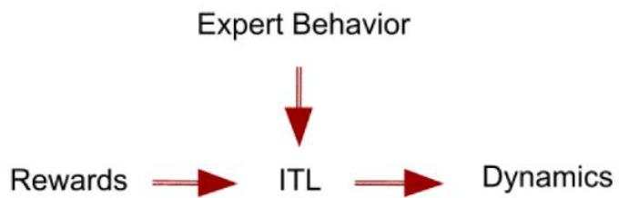
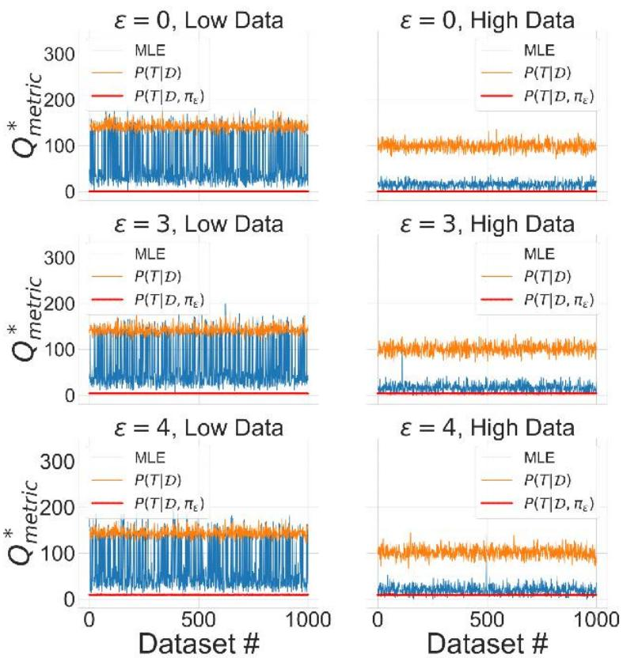

# Bayesian Inverse Transition Learning for Offline Settings

Leo Benac,Sonali Parbhoo,Finale Doshi-Velez

# Summary

·Lcarninga modcl is hard under low-covcragc data   
Having a model help be more data efficient   
Inverse Transition Learning infers the dynamics using near-optimal demonstrations   
We createa set of constraints to estimate in a gradient-free way an empirical posterior distribution over the transition dynamics $T$ ,where each sample has near-optimal guarantees   
Show that planned policies are highly performant and exhibit lower variance across different batches of datas compared to MLE estimates   
Explain how quantifying theuncertainty of the dynamics help planning morc informativc policies than thc cxpcrt policy and thc onc obtaincd from MLE estimates

# What is Inverse Transition Learning? Inverse Transition Learning

Infer thc dynamics T givcn ncar-optimal demonstrations $\mathcal { D }$ ,thcrcward function $R$ and a near-optimal expert policy $\pi _ { \epsilon }$ where $\mathcal { U } _ { \epsilon }$ is assumed to only take actions that are $\epsilon$ -close to thebest unkown action $a ^ { * }$

# Why is it hard?

Number of parameters grows with the dimensions of state and action spaces   
Trade-off between a model that is expressive enough and one that is small enough to learn   
Lack of covcrage in oflinc invcrsc scttings

# Why do we care?

Data efficiency   
Simulation of ncw data   
·Off-Policy Evaluation   
$\circledast$ Counterfactual Reasoning

# Baselines

$\nu T ^ { M L E }$ Maximum Likelihood Estimate obtained from the expert demonstrations $\mathcal { D }$   
$P ( T ( s ^ { \prime } | s , a ) | \mathcal { D } ) = D i r ( N _ { s , a } + \mathbf { 1 } | s , a )$ Probabilistic model over $\mathrm { T }$ without making any optimality assumption.Where $\mathbf { 1 }$ is avectorof $\rceil$ 'sof dimension $| S |$ and $\Lambda _ { s . a }$ is the number of transitions from state sand actionain thcbatchdata $\mathcal { D }$

# Constraints

Using the reward $R$ and near-optimal expert policy $\pi _ { \epsilon }$ we create a set of constraints with respect to the dynamics $T$ to impose the values of the actions of the expert to be superior to the ones of unseen actions.

# Method

Sample from $I ^ { \prime } ( T | \mathcal { D } )$ and only keep samples that satisfies the constraints.   
·Crcatc cmpirical postcrior $P ( T | \mathcal { D } , \pi _ { \epsilon } )$ with acccptcd samplcs.This will be the estimate of the posterior on $T$ given that the demonstrations from the expert are near-optimal

# Metric

$$
Q _ {m c t r i c} ^ {*} (\hat {\pi}) = \sum_ {s \in S} \left(Q ^ {*} (s, a ^ {*}) - \sum_ {a \in A} \hat {\pi} (a | s) Q ^ {*} (s, a)\right)
$$

# Results

·MLE

$$
\hat {T} = T ^ {M L E} \underset {\text {V a l u e I t e r a t i o n}} {\longrightarrow} (\pi^ {M L E}, Q ^ {M L E}) = (\hat {\pi}, \widehat {Q}) \underset {\text {C o m p u t e R e s u l t s}} {\longrightarrow}
$$

· $P ( T | \mathcal { D } , \pi _ { \epsilon } )$ and $P ( T | \mathcal { D } )$

$$
\begin{array}{l} \{\hat {T} ^ {(i)} \} _ {i = 1} ^ {1 0 0 0} \sim \text {P o s t e r i o r} \underset {\text {V a l u e I t e r a t i o n}} {\longrightarrow} \{(\hat {\pi} ^ {(i)}, \widehat {Q} ^ {(i)}) \} _ {i = 1} ^ {1 0 0 0} \\ \longrightarrow \left\{\left(\hat {\pi}, \widehat {Q}\right) \right\} _ {\text {C o m p u t e R e s u l t s}} \\ \end{array}
$$

· $P ( T | \mathcal { D } , \pi _ { \epsilon } )$ outerperforms both basclincs by bcing more accuratc and avoiding low value actions   
$P ( T | \mathcal { D } , \pi _ { \epsilon } )$ exhibits significantly less variance over different datasets   
· $P ( T | \mathcal { D } , \pi _ { \epsilon } )$ allows quantifying uncertainty on corresponding policies

# Acknowledgements

This material is based upon work supported by the National Science Foundation under Grant No. IS-2oo7o76. Any opinions,findings,and conclusions orrecomnendations expressed in thismaterial are those ofthe author(s) and do not necessarily reflect the views of the National Science Foundation.