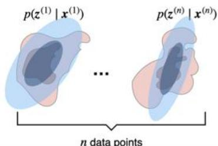
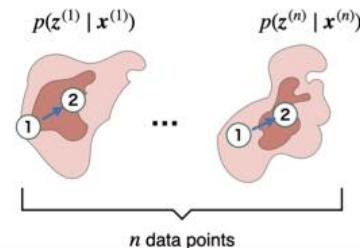
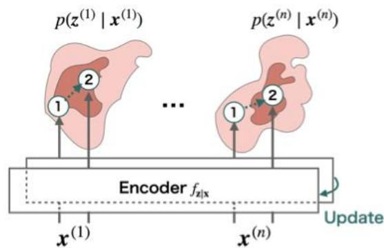
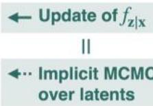
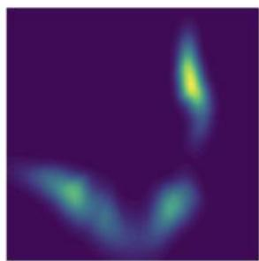
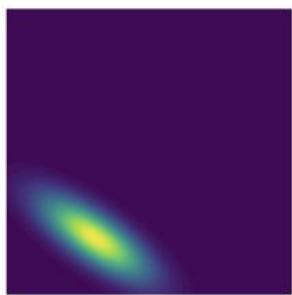
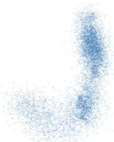

# Langevin Autoencoders for Learning Deep Latent Variable Models

# Motivation

Learning deep latent variable models

Latentvariablemodels

$$
p (\mathbf {x}; \boldsymbol {\theta}) = \int p (\mathbf {x} \mid z; \boldsymbol {\theta}) p (z) d z
$$

Gradient overmodel parameters

$$
\nabla_ {\boldsymbol {\theta}} \mathbb {E} _ {\hat {p} _ {\mathrm {d a t a} (\mathbf {x})}} [ \log p (\boldsymbol {x}; \boldsymbol {\theta}) ] \approx \frac {1}{n} \sum_ {i = 1} ^ {n} \mathbb {E} _ {p \left(\boldsymbol {z} ^ {(i)} \mid \boldsymbol {x} ^ {(i)}; \boldsymbol {\theta}\right)} \left[ \nabla_ {\boldsymbol {\theta}} \log p \left(\boldsymbol {x} ^ {(i)}, \boldsymbol {z} ^ {(i)}; \boldsymbol {\theta}\right) \right]
$$

·To learna latent variablemodel via gradientascent,we need to approximate the expectationover the latentposterior $p ( \mathbf { z } \mid \mathbf { x } ; \mathbf { \boldsymbol { \theta } } )$ which is intractableingeneral.   
·Variational inference isadominantapproach ofapproximation (e.g.,VAE [1]),but theapproximationpower is limited.   
Markovchain MonteCarlo(MCMC)iscapableof approximatecomplex posteriors,but istoo slowdue todatapoint-wise iterations.

# Preliminary

Langevindynamics

·Langevindynamics[2]isa gradient-based MCMC.

$$
\begin{array}{l} z ^ {\prime} \sim q (z ^ {\prime} \mid z) = \mathcal {N} (z ^ {\prime}; z + \eta \nabla_ {z} \log p (x, z; \theta), 2 \eta I) \\ z \leftarrow z ^ {\prime} \text {w i t h p r o b a b i l i t y} \min  \left\{1, \frac {p (x , z ^ {\prime} ; \theta) q (z \mid z ^ {\prime})}{p (x , z ; \theta) q (z ^ {\prime} \mid z)} \right\} \\ \end{array}
$$

·Byrepeating thisiterative update,thesamplesasymptoticallyapproach to thetrue posterior $p ( \mathbf { z } \mid \mathbf { x } ; \pmb \theta )$   
·MCMC iterationsare independentlyperformed foreach posterior per datapoint $p ( z ^ { ( i ) } \mid \boldsymbol { x } ^ { ( i ) } ; \boldsymbol { \theta } )$ for $i = 1 , . . . , n$

→How can we amortize the cost of datapoint-wise iterations?

Posteriordensity

Gaussian posterior approximation by Vl

Posteriordensity

←Datapoint-wise MCMC over the latent z

(a)Variational inference

(b) Langevindynamics

# Method

Amortized Langevin dynamics

·Inouramortized Langevin dynamics (ALD),we prepareanencoder that mapsthe observeddata into the latent variable,andrun MCMCon its parameterspace.   
·Markovchain onthe latent space is implicitlyperformed by collectingthe output of the encoder.   
·Our main theorem shows that theALDis validas MCMC if the encoder takes the form of:

$$
f _ {\mathbf {z} | \mathbf {x}} (x; \boldsymbol {\Phi}) = \Phi g (x).
$$

·Itcan beeasily implemented usinganeural netwhose parametersare fixed exceptforthelastlinearlayer.

Langevin Autoencoder

·ALDcan be applied to the training of deep latent variable models (DLVMs) byslightlymodifying the learningalgorithmof traditional autoencoders.   
·Wecallthis learning algorithm of DLVMs the Langevinautoencoder (LAE).

$\theta , \Phi , \psi $ Initialize parameters

repeat

$$
\begin{array}{l} \boldsymbol {x} ^ {(1)}, \dots , \boldsymbol {x} ^ {(n)} \sim \hat {p} (\mathbf {x}) \\ \mathbf {f o r} t = 0, \dots , T - 1 \mathbf {d o} \\ V _ {t} = - \sum_ {i = 1} ^ {n} \log p (\boldsymbol {x} ^ {(i)}, \boldsymbol {z} ^ {(i)} = \boldsymbol {\Phi} g (\boldsymbol {x} ^ {(i)}; \boldsymbol {\psi}); \boldsymbol {\theta}) \\ \boldsymbol {\Phi} ^ {\prime} \sim q (\boldsymbol {\Phi} ^ {\prime} \mid \boldsymbol {\Phi}) := \mathcal {N} (\boldsymbol {\Phi} ^ {\prime}; \boldsymbol {\Phi} - \eta \nabla_ {\boldsymbol {\Phi}} V _ {t}, 2 \eta \boldsymbol {I}) \\ V _ {t} ^ {\prime} = - \sum_ {i = 1} ^ {n} \log p (\boldsymbol {x} ^ {(i)}, \boldsymbol {z} ^ {(i)} = \boldsymbol {\Phi} ^ {\prime} g (\boldsymbol {x} ^ {(i)}; \boldsymbol {\psi}); \boldsymbol {\theta}) \\ \Phi \leftarrow \Phi^ {\prime} \text {w i t h p r o b a b i l i t y m i n} \left\{1, \frac {\exp (- V (\phi^ {\prime})) q (\phi | \phi^ {\prime})}{\exp (- V (\phi)) q (\phi^ {\prime} | \phi)} \right\} \\ \end{array}
$$

end for

$$
V _ {T} = - \sum_ {i = 1} ^ {n} \log p (\boldsymbol {x} ^ {(i)}, \boldsymbol {z} ^ {(i)} = \Phi g (\boldsymbol {x} ^ {(i)}; \psi); \boldsymbol {\theta})
$$

$$
\boldsymbol {\theta} \leftarrow \boldsymbol {\theta} - \eta \nabla_ {\boldsymbol {\theta}} \frac {1}{T} \sum_ {t = 1} ^ {T} V _ {t}
$$

$$
\boldsymbol {\psi} \leftarrow \boldsymbol {\psi} - \eta \nabla_ {\boldsymbol {\psi}} \frac {1}{T} \sum_ {t = 1} ^ {T} V _ {t}
$$

until convergence of parameters

return $\theta , \Phi , \psi$

# Results

Toy example

  
Trueposterior

  
Variational approximation

  
Ours

·Weperformposterior inference forarandomly initialized DLVMusing variational inference (Vl) and ourALD.   
·Vlfails tocapture themultimodality of the true posterior.   
·OurALDcanapproximate complexmultimodalposteriorsin toy examples.

Imagedensity estimation   

<table><tr><td></td><td>MNIST</td><td>SVHN</td><td>CIFAR-10</td><td>CelebA</td></tr><tr><td>VAE</td><td>1.189 ± 0.002</td><td>4.442 ± 0.003</td><td>4.820 ± 0.005</td><td>4.671 ± 0.001</td></tr><tr><td>VAE-flow</td><td>1.183 ± 0.001</td><td>4.454 ± 0.016</td><td>4.828 ± 0.005</td><td>4.667 ± 0.005</td></tr><tr><td>Hoffman (2017) [3]</td><td>1.189 ± 0.002</td><td>4.440 ± 0.007</td><td>4.831 ± 0.005</td><td>4.662 ± 0.011</td></tr><tr><td>LAE (ours)</td><td>1.177 ± 0.001</td><td>4.412 ± 0.002</td><td>4.773 ± 0.003</td><td>4.636 ± 0.003</td></tr></table>

# Likelihood evaluationfortestdata

·Our LAE consistently outperforms Vl-based methods such as the VAEand otherexisting MCMC-based methods.

# Future works

·Howcan we remove the bias of finite-step MCMC samples?   
·Recently proposed unbiased MCMC methods [4]may be useful.

·Isitpossible to apply the ALD (and LAE)to the state-of-the-artDLVMs, such as NVAE[5]?

# References

[1]Diederik PKingma and MaxWelling(2013).“Auto-encoding variational bayes."In:arXivpreprintarXiv:1312.6114.   
[2]Radford MNeal (2011).“Mcmc using hamiltonian dynamics."In:   
[3]MatthewD Hoffman (2017).“Learning deep latent gaussianmodelswith markovchainmontecarlo.In:International conferenceonmachine   
[4]PierreEJacob,JohnO'Leary,andYvesFAtchade(202O).“Unbiased markovchainmonte carlomethods withcouplings."In:Journal of the Royal   
[5]Arash Vahdat andJan Kautz(202O).“Nvae:Adeep hierarchical variationalautoencoder.In:AdvancesinNeural Information Processing