# Generate trajectories that “diffuse away" from potential goals，and train a policy to reverse them

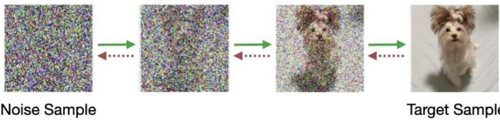  
Denoising Diffusion Models

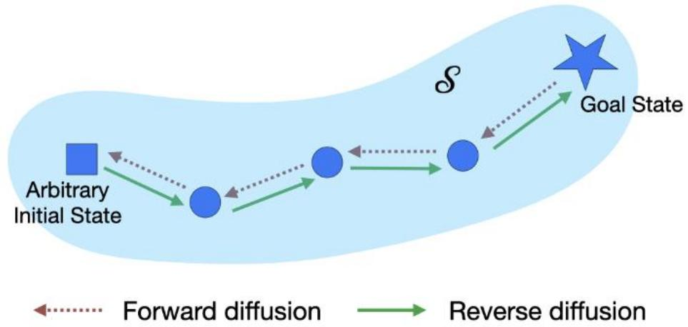  
Goal-conditioned Reinforcement Learning

# Goal Conditioned RL as Diffusion

Diffusion models: map any point from Gaussian data manifold Goal-conditioned RL: learn optimal path fromany state goal state

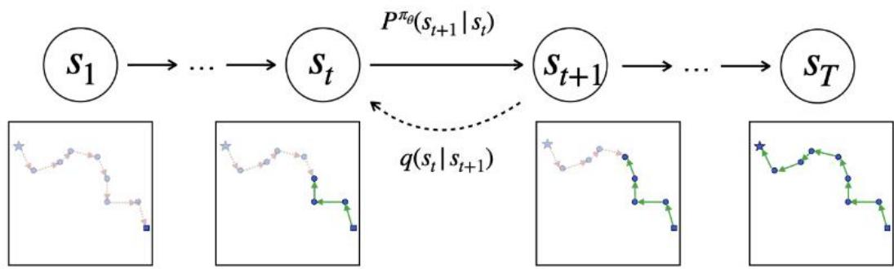

diffusion model

target dataset score function forward process reverse process

GCRL (Merlin)

goal states policy $q ( s _ { t } | s _ { t + 1 } )$ $\mathcal { P } ^ { \pi } ( s _ { t + 1 } | s _ { t } )$

Actions that lead us away from the goal in place of Gaussian noise; Policythat reverses theseactions inplace of score function

# A Simple 2D Navigation Problem

Task: Navigate to goal X；States: $( x , y )$ ；Actions:unit length displacement in $( x , y )$   
Forward process:Take randomactions starting from goal   
Reverseprocess:Train policy to reverse the forward trajectories

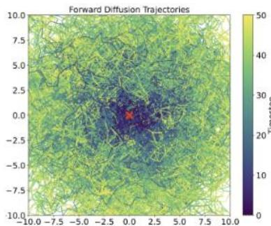

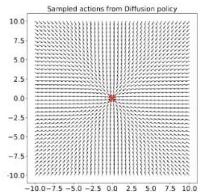

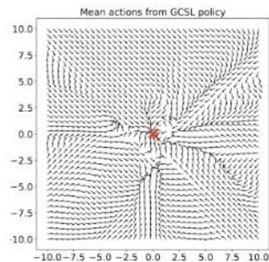

(a)VisualizationoftrajectoriesstartingfromthegoalXgeneratedduringtheforwardprocess,   
(b)Predictedactions from Merlin policy,(c) Predictedactions from GCSL policy

Backward view of difusion gives uscontrol over the goal distribution

# Effect of Time Conditioning

Analogous to the score functionindiffusion,theMerlin policy is conditioned onthe time   
This time indicates how“noisy"current stateis,or how farwe arefrom the target goal state   
Policy takes optimalaction faraway from goal and becomesuncertainas itapproaches the goal;thisuncertaintyappearsfartherfromgoalastimehorizonincreases

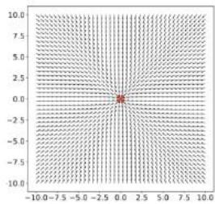

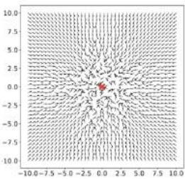

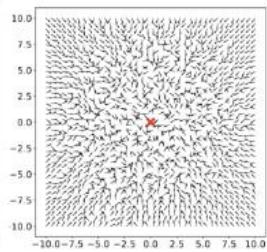

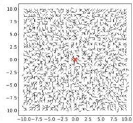  
(a) h=1   
(b)h=5   
(c) h=10   
(d）h=20

The time conditioning affects policy uncertainty based on expected number of steps to reach the goal

# Optimization Objective

Givenanoffline dataset $\mathcal { D }$ ,wecan view thetrajectoriesas forward diffsionchains generated by some unknown policy   
·Asper below Theorem,behavior cloningmaximizes the probabilityof reaching the goal states $\theta ^ { * } = \arg \operatorname* { m a x } _ { \theta } \mathbb { E } _ { g \sim p ( g ) , ( s , a ) \sim D ( g ) } [ \log \pi _ { \theta } ( a \mid s , g ) ]$

Theorem:Givenadataset $\mathcal { D }$ andtarget goal distribution $p ( g )$ ,behavior cloning usinga goal-conditionedpolicymaximizesa lower boundonthe log-likelihood of thegoal states $L = \mathbb { E } _ { g \sim p ( g ) , s _ { T } \sim q ( s _ { T } | g ) } [ \log p _ { \theta } ( s _ { T } ) ] .$

# Constructing the Forward Process

Merlin:Usepre-collected offline trajectories,trainpolicy using behavior cloning   
Merlin-P:Learnreverse dynamicsmodel to simulate trajectories backward fromgoal   
Merlin-NP:Use proposed trajectory stitching method to construct backward trajectories

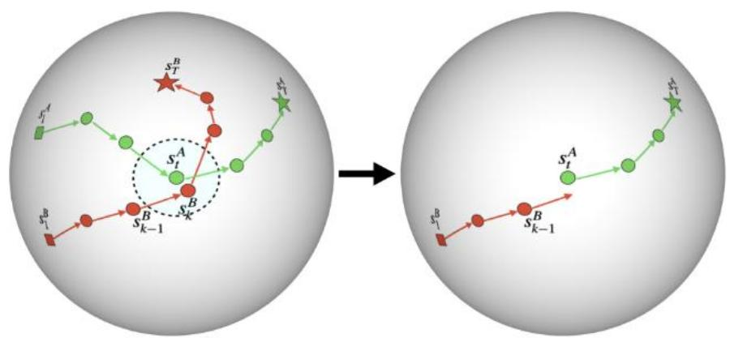

# Experimental Results

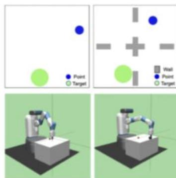

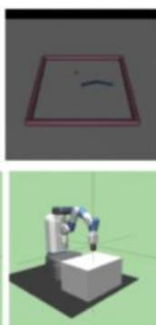

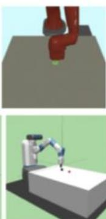

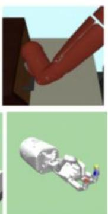

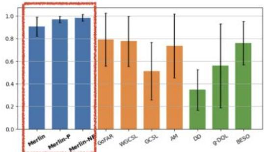  
NormalizedReturns

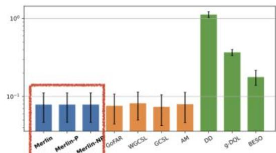  
Log InferenceTime

Merlinoutperforms previousmethods,while being highly-eficient!

# Conclusions and future work

Merlinconstructstrajectoriesthat“diffuseaway" fromgoalsandtrainsapolicy to reverse them   
Simple trainingdynamics indicatepotential for scalability,asproven bydenoisingdiffusionmodels   
Directions for future work include extending to online settingand partiallyobservableenvironments

paper

code

