# □ Motivation: Unpaired Domain Translation

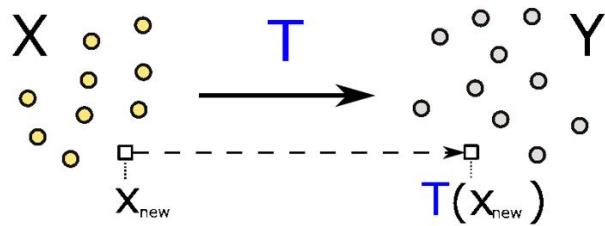

The(informal) task:given samplesX,Yfrom two domains,construct a map Twhich can translate new samples from the input domain to the target domain.

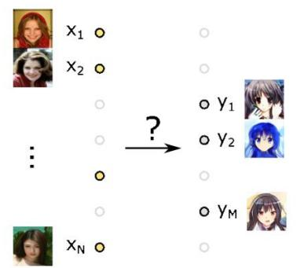  
Unpaired setup   
Nopairedtrainingexamplesareavailable.

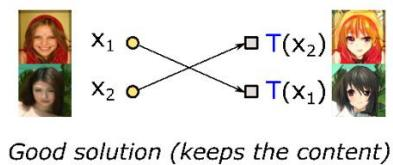  
Main problem   
Ambiguity in translations Badsolution (changes the content)

# Examples of image unpaired domain translation

Example I:image super-resolution

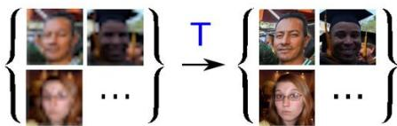

ExampleII:image style transfer

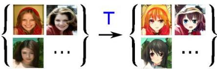

# Single-cell data domain translation

Single-cell (SC) sequencing extracts features for individual cells froma population but destroys them.Therefore, tostudyindividual cell dynamicsoneneedsamethod tomap cells between different observation times.

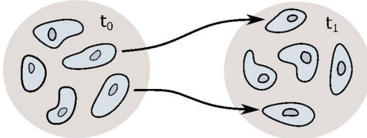

# 回 Background: Diffusion Schrodinger Bridge (SB)

Given two probability distributions $\mathsf { p } _ { 0 } , \mathsf { p } _ { 1 } ,$ how to transform $\mathsf { p } _ { 0 }$ to $\mathsf { p } _ { 1 }$ via adiffusion process and preserve the input-output similarity?

# 1.Formulation of the Schrodinger Bridge Problem:

For two continuous distributions $\pmb { p } _ { 0 }$ and $p _ { 1 }$ on $\mathbb { R } ^ { D }$ ，isthe Schrodinger bridge problem:

$$
\inf  _ {T \in \mathcal {F} (p _ {0}, p _ {1})} K L (T | | W ^ {\epsilon}),
$$

where $\mathcal { F } ( p _ { 0 } , p _ { 1 } )$ are stochastic processes with marginals $\pmb { p } _ { 0 }$ $_ { p _ { 1 } }$ at $t = 0$ and $t = 1$ ,respectively，while $W ^ { \epsilon }$ is the Wiener processwithvariance∈,i.e.，given by the SDE:

$$
W ^ {\epsilon}: \quad d X _ {t} = \sqrt {\epsilon} d W _ {t}.
$$

This problem has a unique solution,which is a diffusion process $\tau ^ { * }$ described bythe SDE:

$$
T ^ {*}: \quad d X _ {t} = g ^ {*} (X _ {t}, t) d t + \sqrt {\epsilon} d W _ {t}.
$$

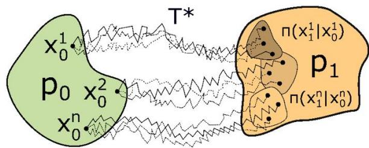

The minimizer T*

is called the Schrodinger Bridge.

# 2. Structure of the Schrodinger Bridge.

The Schrodinger bridge problem can be fully characterized bythe initial distribution $\pmb { p } _ { 0 }$ andthe Schrodingerpotential $\phi ^ { * } ( x ) : \mathbb { R } ^ { D }  \mathbb { R } _ { + }$ .The optimal drift can be expressed by the Schrodinger potential as

$$
g ^ {*} (x, t) = \epsilon \nabla_ {x} \log \int_ {\mathbb {R} ^ {D}} \mathcal {N} \left(x ^ {\prime} | x, (1 - t) \epsilon I _ {D}\right) \phi^ {*} \left(x ^ {\prime}\right) d x ^ {\prime}
$$

$\begin{array} { r } { v ^ { * } ( x _ { 1 } ) \stackrel { \mathrm { d e f } } { = } \exp ( - \frac { \| x _ { 1 } \| ^ { 2 } } { 2 \epsilon } ) \phi ^ { * } ( x _ { 1 } ) } \end{array}$

# 3.Integration of the Schrodinger Bridge SDE.

The Schrodinger bridge SDE:

$$
T ^ {*}: \quad d X _ {t} = g ^ {*} (X _ {t}, t) d t + \sqrt {\epsilon} d W _ {t}.
$$

admitsa closed-form solution $\pi ^ { * } ( x _ { 1 } | x _ { 0 } )$ expressed through theadjusted Schrodinger potential $v ^ { * }$

$$
\pi^ {*} (x _ {1} | x _ {0}) \stackrel {\text {d e f}} {=} \frac {\exp (\langle x _ {0} , x _ {1} \rangle / \epsilon) v ^ {*} (x _ {1})}{c ^ {*} (x _ {0})},
$$

where $\begin{array} { r } { c ^ { * } ( x _ { 0 } ) \ { \stackrel { \mathrm { d e f } } { = } } \ \int _ { \mathbb { R } ^ { D } } \exp \left( \langle x _ { 0 } , x _ { 1 } \rangle / \epsilon \right) v ^ { * } ( x _ { 1 } ) d x _ { 1 } } \end{array}$ is the normalizing constant.

# [II] Proposed Algorithm: Light Schrodinger Bridge (LightSB)

# Our solver is based on:

1.Optimal parameterization of the Schrodinger bridge using mixtures of Gaussians:

$$
v _ {\theta} \left(x _ {1}\right) = \sum_ {k = 1} ^ {K} \alpha_ {k} \mathcal {N} \left(x _ {1} \mid r _ {k}, \epsilon S _ {k}\right), \quad c _ {\theta} \left(x _ {0}\right) = \sum_ {k = 1} ^ {K} \alpha_ {k} \exp \left(\frac {x _ {0} ^ {T} S _ {k} x _ {0} + 2 r _ {k} ^ {T} x _ {0}}{2 \epsilon}\right).
$$

2.New loss function for training the Schrodinger bridge:

$$
\operatorname {K L} \left(T ^ {*} \mid \mid T _ {\theta}\right) = \underbrace {\int_ {\mathbb {R} ^ {D}} \log c _ {\theta} \left(x _ {0}\right) p _ {0} \left(x _ {0}\right) d x _ {0} - \int_ {\mathbb {R} ^ {D}} \log v _ {\theta} \left(x _ {1}\right) p _ {1} \left(x _ {1}\right) d x _ {1}} _ {\mathcal {L} (\theta)} + \text {C o n s t}
$$

Advantages:

Fast training

(<1 minute on 4 CPU cores, not hours of training on GPU,like others).

# Algorithm 1: Light Schrodinger Bridge (LightSB)

# repeat

$$
\begin{array}{l} \text {S a m p l e} \left\{x _ {0} ^ {1}, \dots , x _ {0} ^ {N} \right\} \sim p _ {0}, \left\{x _ {1} ^ {1}, \dots , x _ {1} ^ {M} \right\} \sim p _ {1}; \\ \widehat {\mathcal {L}} _ {\theta} \leftarrow \frac {1}{N} \sum_ {n = 1} ^ {N} \log c _ {\theta} \left(x _ {0} ^ {n}\right) - \frac {1}{M} \sum_ {m = 1} ^ {M} \log v _ {\theta} \left(x _ {1} ^ {m}\right); \\ \text {U p d a t e} \theta \text {b y u s i n g} \frac {\partial \widehat {\mathcal {L}} _ {\theta}}{\partial \theta}; \\ \end{array}
$$

until converged;

Theoretical validity (the guarantees of the method's learningability from thepointof view of statistical learningand approximation theories).

# IV Toy examples

Qualitative results of our solverapplied to 2D model distributions("Gaussian" to "swiss-roll").

The volatility of trajectories increases withε, andthe distributions $\pi ( x _ { \mathit { 1 } } | x _ { \mathit { 0 } } )$ becomemoredisperse.

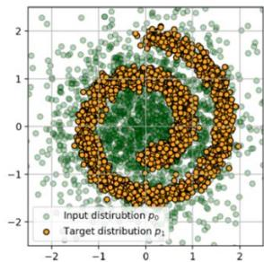  
(a)x~ Po,y~ P1.

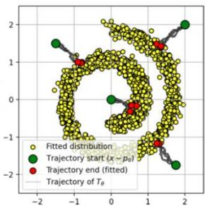  
(c) ∈= 0.01.

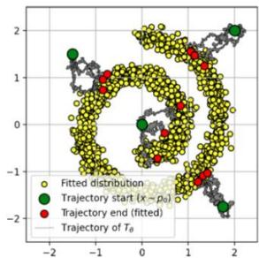  
(d)∈= 0.1.

# VSchrodinger Bridge Benchmark

Quantitative results of our solver on the standard benchmark forthe Schrodingerbridge problem.

<table><tr><td rowspan="2"></td><td colspan="4">ε=0.1</td><td colspan="4">ε=1</td><td colspan="4">ε=10</td></tr><tr><td>D=2</td><td>D=16</td><td>D=64</td><td>D=128</td><td>D=2</td><td>D=16</td><td>D=64</td><td>D=128</td><td>D=2</td><td>D=16</td><td>D=64</td><td>D=128</td></tr><tr><td>Best solver</td><td>1.94</td><td>13.67</td><td>11.74</td><td>11.4</td><td>1.04</td><td>9.08</td><td>18.05</td><td>15.23</td><td>1.40</td><td>1.27</td><td>2.36</td><td>1.31</td></tr><tr><td>|LightSB|</td><td>0.03</td><td>0.08</td><td>0.28</td><td>0.60</td><td>0.05</td><td>0.09</td><td>0.24</td><td>0.62</td><td>0.07</td><td>0.11</td><td>0.21</td><td>0.37</td></tr><tr><td>±std</td><td>±0.01</td><td>±0.04</td><td>±0.02</td><td>±0.02</td><td>±0.003</td><td>±0.006</td><td>±0.007</td><td>±0.007</td><td>±0.02</td><td>±0.01</td><td>±0.01</td><td>±0.01</td></tr></table>

# 回 Single cell experiment

Quantitative results in the problem of predicting single-cell trajectories in the feature space (single-celltrajectory inference).

<table><tr><td>Setup</td><td>Solver type</td><td>DIM Solver</td><td>50</td><td>100</td><td>1000</td></tr><tr><td>Discrete EOT</td><td>Sinkhorn</td><td>(Cuturi, 2013) [GPU V100]</td><td>2.34 (90 s)</td><td>2.24 (2.5 m)</td><td>1.864 (9 m)</td></tr><tr><td>Continuous EOT</td><td>Langevin-based</td><td>(Mokrov et al., 2023) [GPU V100]</td><td>2.39 ± 0.06 (19 m)</td><td>2.32 ± 0.15 (19 m)</td><td>1.46 ± 0.20 (15 m)</td></tr><tr><td>Continuous EOT</td><td>Minimax</td><td>(Gushchin et al., 2023) [GPU V100]</td><td>2.44 ± 0.13 (43 m)</td><td>2.24 ± 0.13 (45 m)</td><td>1.32 ± 0.06 (71 m)</td></tr><tr><td>Continuous EOT</td><td>IPF</td><td>(Vargas et al., 2021) [GPU V100]</td><td>3.14 ± 0.27 (8 m)</td><td>2.86 ± 0.26 (8 m)</td><td>2.05 ± 0.19 (11 m)</td></tr><tr><td>Continuous EOT</td><td>KL minimization</td><td>LightSB (ours) [4 CPU cores]</td><td>2.31 ± 0.27 (65 s)</td><td>2.16 ± 0.26 (66 s)</td><td>1.27 ± 0.19 (146 s)</td></tr></table>

**TheEnergydistancemetricisusedtocomparethepredictedcellpositionandtheobservedone(smalerbetter).

# VII Unpaired Image-to-image Translation

Qualitative results of our solver for solving the domain translation problem (in the latent space of the ALAE autoencoder).

Imagesresolution is 1024x1024.

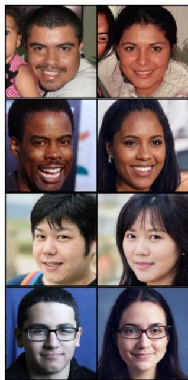  
(a)Male Female.

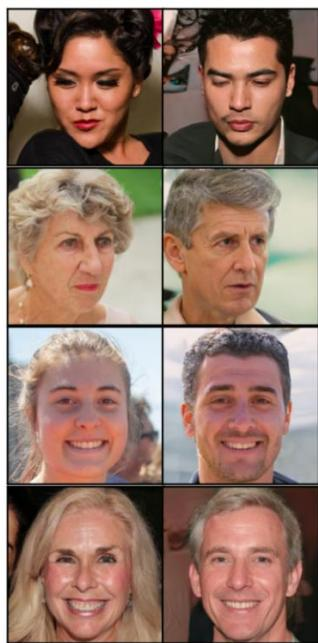  
(b)Female Male.

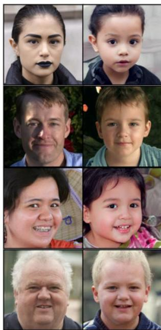  
(c) Adult Child.

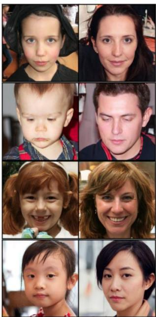  
(d) Child → Adult.