# Motivation

·Matrices are ubiquitous -- can involve billions of elements making their storage and processing quite demanding in terms of computational resources and memory usage. Eg.: Vector databases, Kernel matrices,LLMweight matrices, etc.   
· Question: How to compress matrices via dimensionality reduction and quantization?   
·Several real-world matrices exhibit approximately low-rank structure due to inherent redundancy or patterns.

$$
\mathbf {A} = \sum_ {i = 1} ^ {\operatorname {r a n k} (\mathbf {A})} \sigma_ {i} \mathbf {u} _ {i} \mathbf {v} _ {i} ^ {\top}
$$

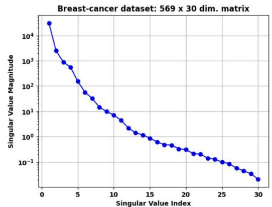

Leverage the approximate low-rank structure while quantizing matrices

# Our Algorithm: Low-Precision and Low Rank

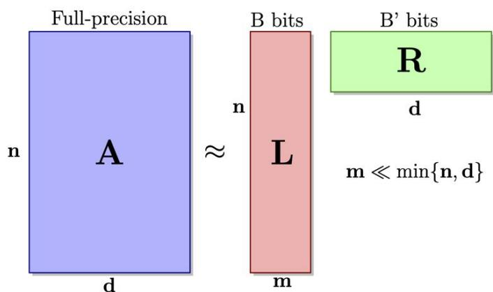

Algorithm 1: LPLR: Randomized Low-Precision Low-Rank factorization

m Input :Matrix A ∈Rnxd,sketch size $_ m$ ,Quantizers Q, $\mathrm { \Delta Q ^ { \prime } }$ with dynamic ranges RQ, $\mathrm { R } _ { \mathrm { Q ^ { \prime } } }$ and bit-budgetsB,B'respectively.

Output:Factorization:LR where $\mathbf { L } \doteq \mathbb { R } ^ { n \times m }$ $\mathbf { R } \in \mathbb { R } ^ { m \times d }$

1 Sample a Gaussan sketching matrix $\mathbf { S } \in \mathbb { R } ^ { d \times m }$ with entries $S _ { i j } \sim { \mathcal { N } } \left( 0 , { \frac { 1 } { m } } \right)$   
2 Compute an approximate basis of column space of A by forming the sketch:AS.   
3 Quantize the approximate basis with $\mathrm { Q }$ to get Q(AS).   
4 Find W* = arg minw $\| \mathbf { Q } ( \mathbf { A S } ) \mathbf { W } - \mathbf { A } \| _ { \mathbf { F } } ^ { 2 } = \mathbf { Q } ( \mathbf { A S } ) ^ { \dagger } \mathbf { A }$   
5Quantize $\mathbf { W } ^ { * }$ using quantizer $\mathrm { \bf Q ^ { \prime } }$ to get $\mathbf { { Q } ^ { \prime } } ( \mathbf { { W } ^ { * } } )$   
6 return Low-rank and low-precision approximation LR where $\mathbf { L } = \mathbf { Q } ( \mathbf { A } \mathbf { S } )$ $\mathbf { R } = \mathbf { Q } ^ { \prime } ( \mathbf { W } ^ { * } )$

· We factorize, $\mathbf { A } \approx \mathbf { L R }$ , where the entries of $\mathbf { L }$ and $\mathbf { R }$ are quantized with B and $\mathbf { B ^ { \prime } }$ bits per entry respectively.   
· Compression ratio with respect to naive quantization (uniformly allocate ${ \bf { B _ { n q } } }$ bits per entry) is mnB+mdB' $\frac { m n \mathrm { B } + m d \mathrm { B } ^ { \prime } } { n d \mathrm { B } _ { \mathrm { n q } } }$ ndBnq   
·By tuning sketch-size we can ensure compression ratio $\leq 1$ for $\mathtt { B } _ { \mathtt { n q } } = 1$ ,while letting B and $\mathsf { B } ^ { \prime }$ to take values allowed by current hardware-primitives,e.g.,4-- bits,8--bits,etc.   
·Low-precision computations are faster: Computing Ax versus $\mathbf { L } ( \mathbf { R x } )$

# Randomized Embeddings

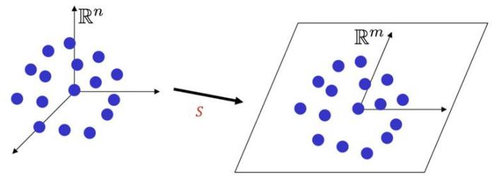

$$
(1 - \epsilon) \| \mathbf {z} \| _ {2} \leq \| \mathbf {S z} \| _ {2} \leq (1 + \epsilon) \| \mathbf {z} \| _ {2} \forall \mathbf {z} \in \mathcal {V}
$$

Subspace embeddings: Norm of vectors in therange space is approximately preserved with high probability when $m \gtrsim \epsilon ^ { - 2 } \mathrm { r a n k } ( \mathbf { A } )$   
Critical dimension, $_ m$ does_ not depend on original dimension,n.

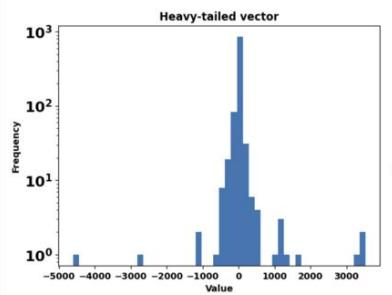

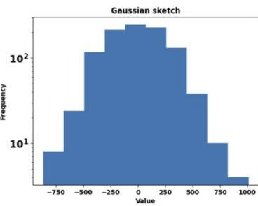

Random Embeddings (e.g.,Gaussian) also help in quantization by reducing the dynamic range.

$$
\| \mathbf {S} \mathbf {x} \| _ {\infty} \leq O \left(\frac {\| \mathbf {x} \| _ {2}}{\sqrt {d}}\right) o r, \| \mathbf {S} \mathbf {x} \| _ {\infty} \leq O \left(\sqrt {\frac {\log d}{d}} \| \mathbf {x} \| _ {2}\right)
$$

# Data compression and Nearest Neighbors

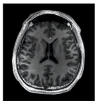  
Original

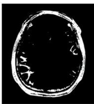  
Naive

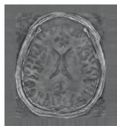  
DSVD

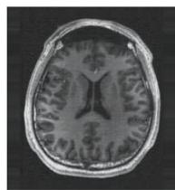  
LPLR

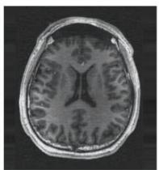  
LSVD

Compressinga brain MRI. $\mathrm { B } = 4$ $\mathrm { B } ^ { \prime } = 8$ $\mathrm { B _ { n q } } = 1$ $m = 1 2 4$ ,n=1534 d= 1433

DsVD: Computes the best rank-k approximation and quantize the factors independently. LsVD: Variant of LPLR that computes exact SVD instead of randomized SVD.

·For a given data matrix $\mathbf { A } \in \mathbb { R } ^ { n \times d }$ and a query $\mathbf { x } \in \mathbb { R } ^ { d }$ ,retrieve

$$
i ^ {*} = \operatorname {a r g m a x} _ {i \in [ n ]} (\mathbf {A x}) _ {i} \approx \operatorname {a r g m a x} _ {i \in [ n ]} (\mathbf {L R x}) _ {i}
$$

Applications: Semantic search over vector databases (music recommendation), In-context learning forLLMs,etc.

Table 5: CIFAR1o0 embeddings generated by MobileNetV3 with an unquantized accuracy and F1 score $7 6 \%$ :Results on LPLR andLPLR-SVDwith $\mathrm { B } = \mathrm { B } ^ { \prime } = 8$ bits   

<table><tr><td colspan="5">Frobenius Norm Error</td><td colspan="4">Accuracy (%)</td><td colspan="4">Weighted F1 Score (%)</td></tr><tr><td>Bnq</td><td>LPLR</td><td>LSVD</td><td>DSVD</td><td>NQ</td><td>LPLR</td><td>LSVD</td><td>DSVD</td><td>NQ</td><td>LPLR</td><td>LSVD</td><td>DSVD</td><td>NQ</td></tr><tr><td>1</td><td>1.04</td><td>1.08</td><td>1.09</td><td>6.75</td><td>79</td><td>82</td><td>82</td><td>1</td><td>79</td><td>82</td><td>82</td><td>0</td></tr><tr><td>2</td><td>1.08</td><td>1.1</td><td>1.12</td><td>2.18</td><td>80</td><td>80</td><td>80</td><td>1.7</td><td>80</td><td>80</td><td>80</td><td>1.3</td></tr><tr><td>4</td><td>1.11</td><td>1.12</td><td>1.14</td><td>1.17</td><td>79</td><td>78</td><td>77</td><td>75</td><td>79</td><td>78</td><td>78</td><td>75</td></tr></table>

Table 6:IMDB embeddings generated by BERT with an unquantized accuracy and F1 score $7 5 \%$ and $7 4 \%$ respectively:ResultsonLPLRandLPLR-SVDwith $\mathrm { B } = \bar { \mathrm { B ^ { \prime } } } = 8$ bits   

<table><tr><td colspan="5">Frobenius Norm Error</td><td colspan="3">Accuracy (%)</td><td colspan="5">Weighted F1 Score (%)</td></tr><tr><td>Bnq</td><td>LPLR</td><td>LSVD</td><td>DSVD</td><td>NQ</td><td>LPLR</td><td>LSVD</td><td>DSVD</td><td>NQ</td><td>LPLR</td><td>LSVD</td><td>DSVD</td><td>NQ</td></tr><tr><td>1</td><td>0.313</td><td>0.241</td><td>0.229</td><td>6.63</td><td>73</td><td>74</td><td>75</td><td>50</td><td>74</td><td>74</td><td>75</td><td>33</td></tr><tr><td>2</td><td>0.235</td><td>0.178</td><td>0.161</td><td>1.016</td><td>74</td><td>74</td><td>74</td><td>50</td><td>74</td><td>74</td><td>74</td><td>50</td></tr><tr><td>4</td><td>0.148</td><td>0.122</td><td>0.098</td><td>0.417</td><td>75</td><td>74</td><td>75</td><td>73</td><td>74</td><td>74</td><td>75</td><td>73</td></tr></table>

# Compression of Large Language Models

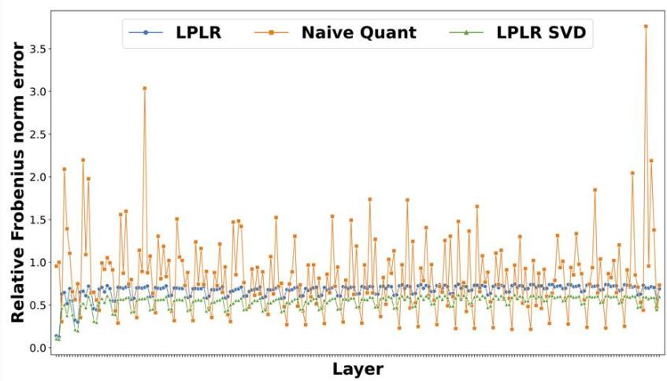

<table><tr><td colspan="4">B = B&#x27; = 8 bits, Bnq = 4 bits</td></tr><tr><td>Metric</td><td>LPLR</td><td>LPLR-SVD</td><td>Naive Quant.</td></tr><tr><td>Mean</td><td>0.672</td><td>0.537</td><td>0.836</td></tr><tr><td>Std Dev</td><td>0.080</td><td>0.079</td><td>0.470</td></tr></table>

Compressing the weight matrices ofLlaMa.We consistently observe betterFrobeniusnormerror, except for specific layers.

# Approximation Error Guarantees

Table 1: Comparison with baselines (row-norm bound is constant, i.e., $\| \mathbf { a } ^ { ( i ) } \| = \mathsf { O } ( 1 ) )$ $k , m \ll \operatorname* { m i n } \{ d , n \}$ $\boldsymbol { n } .$ no.ofrows, $d \mathbf { \cdot }$ ：no.of columns,m: sketch size,∈: error tolerance, $\delta = k / ( m - k - 1 )$ .The expressions for bit-budget (per entry) ignores constant multiplicative factors inside the $\log _ { 2 } ( \cdot )$ .We assume $n \geq d$   

<table><tr><td>Algorithms</td><td>Approximation error</td><td>Bit-budget (per entry)</td><td>Computation</td></tr><tr><td>Naïve uniform</td><td>ε</td><td>1/2 log2(nd/ε)</td><td>O(nd)</td></tr><tr><td>Direct-SVD</td><td>||Ak-A||2F+ε</td><td>1/2 log2(kσ12/ε√nd)</td><td>O(nd2)</td></tr><tr><td>LPLR (ours)</td><td>(1+δ)||Ak-A||2F+ε</td><td>1/2 log2(κ(Ak)κ/nm/√d√log(mn2/ε))</td><td>O(ndm)</td></tr></table>

R.Saha，V.Srivastava，M. Pilanci，"Matrix Compression via Randomized Low Rank and Low Precision Factorization",37th Conference on Neural Information Processing Systems (NeurIPS),2023.

  
Github