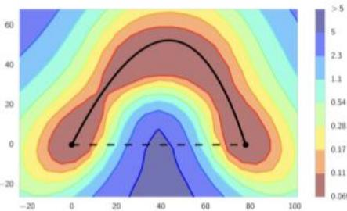
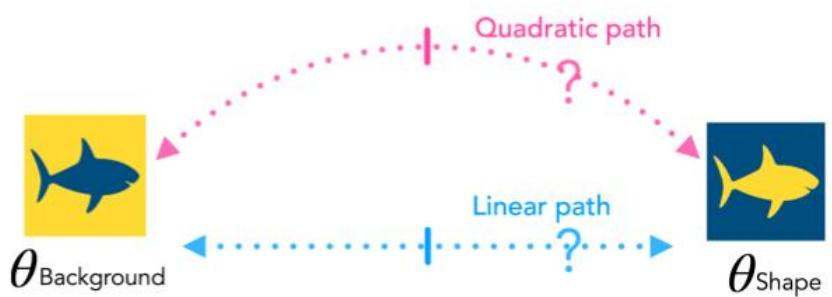
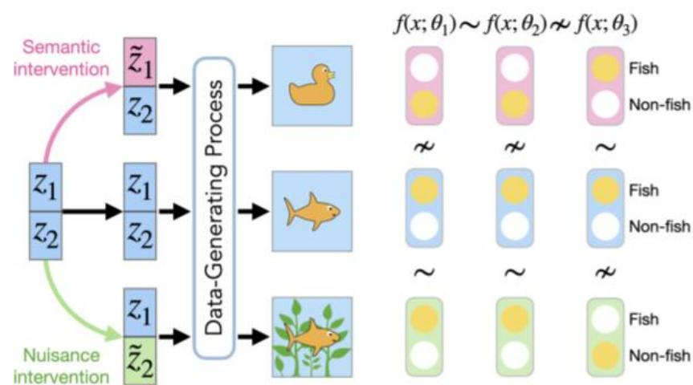
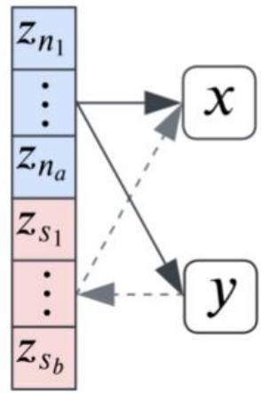
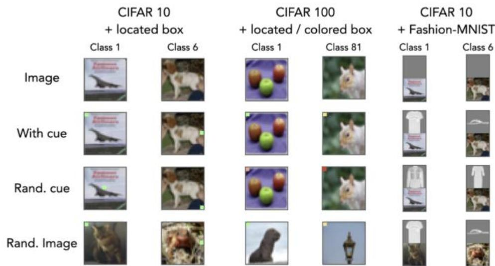
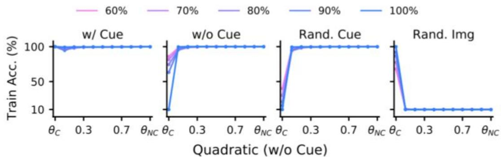
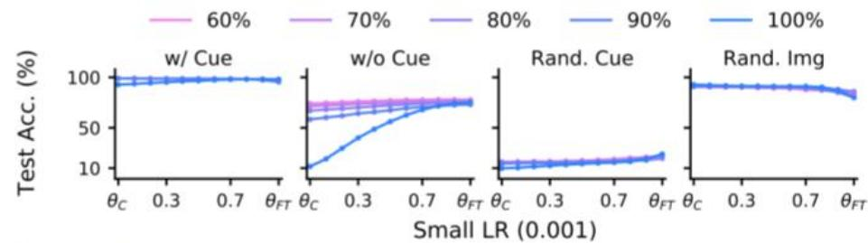
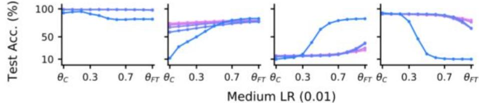
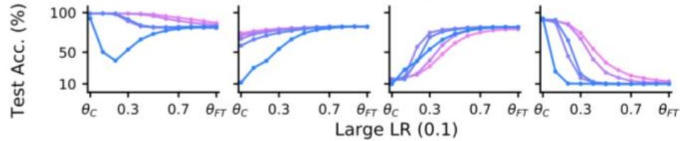
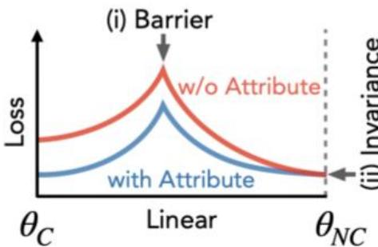

# Connectivity of Minimizers from a Given Dataset

Mode Connectivity:Minimizers of modern NNs retrieved using SGD on adatasetcan beconnected via simple paths of zero loss.

Linear: $t \theta _ { 1 } + ( 1 - t ) \theta _ { 2 }$

Quadratic: $t ^ { 2 } \theta _ { 1 } + 2 t ( 1 - t ) \theta _ { m } + ( 1 - t ) ^ { 2 } \theta _ { 2 }$

  
Figure:Train loss ofResNet-164 on CIFAR-100.(Garipov et al.)

  
Motivating Problem: Are Minimizers Retrieved from Different Datasets of a Task Connected?

Q1:Are mechanisticallydissimilar models,which rely on different input attributes to make predictions,connected?   
Q2:Can we exploit this connectivity?

# Towards a Definition of Mechanistic Similarity

Weuse shared invariances to interventions on the data-generating process todefinea notion of Mechanistic Similarity between two models.

# Synthetically InducingMechanistically Dissimilar Models

Adata-generatingprocess that syntheticallyembedscontrollable, partiallypredictivecues in thedata.   
Evaluation:Counterfactualsthatbreak predictivityof label byaltering synthetic versusnatural attributes.   
Goal:Analyze connectivity of models that rely vs.ignore spurious attributes.

# Result 1: Are Mechanistically Dissimilar Minimizers Connected? Yes!

Proposition.(Mode Connectivity under Mechanistic Dissimilarity.） Assume $\theta _ { 1 } , \theta _ { 2 }$ are minimizers of theloss on a dataset $\mathcal { D }$ andinducemechanistically dissimilar models.Given sufficientoverparameterization,thereexistsacontinuouspath alongwhich theminimizersaremodeconnected.

  
Figure:ResNet-18models trained on located cue ClFAR-10withdifferent %cuedata (C) show connectivity via quadratic paths to modes identified using no cue (NC) data,butare mechanistically dissimilar.

# Result 2: Is Mechanistic Similarity and Simplicity of Connectivity Paths Related? Yes!

Conjecture.(LackofLinearConnectivity impliesMechanistic Dissimilarity.）Iftwo minimizers $\theta _ { 1 }$ and $\theta _ { 2 }$ oftheloss $\mathcal { L } ( f ( \mathcal { D } ; \theta ) )$ onadataset $\mathcal { D }$ cannotbelinearmodeconnected(uptoarchitectural symmetries),their inducedmodels $f ( . ; \theta _ { 1 } ) , f ( . ; \theta _ { 2 } )$ mustbemechanistically dissimilar.

  
Figure:ResNet-18 models trained on located cue CIFAR-10(C)and fine-tuned on data w/o cue (FT) show linear connectivity under small-medium learningrates,yieldingmechanisticallysimilarmodes.

# Result 3: Altering Mechanisms via Lack of Linear Connectivity

Assume a model learns to rely on an undesirable input attribute:Can we"alter"itsmechanismstouse another,desirableattribute?   
Connectivity-Based Fine-Tuning (CBFT):Find a minimizer that lacks linearconnectivitybutisinvariant to the undesirable attribute.

<table><tr><td></td><td colspan="4">60% Cue data</td><td colspan="4">70% Cue data</td><td colspan="4">80% Cue data</td><td colspan="4">90% Cue data</td></tr><tr><td>C-10</td><td>NC↑</td><td>C~</td><td>RC~</td><td>RI↓</td><td>NC↑</td><td>C~</td><td>RC~</td><td>RI↓</td><td>NC↑</td><td>C~</td><td>RC~</td><td>RI↓</td><td>NC↑</td><td>C~</td><td>RC~</td><td>RI↓</td></tr><tr><td>FTM</td><td>75.7</td><td>98.4</td><td>23.6</td><td>83.4</td><td>75.8</td><td>98.6</td><td>27.7</td><td>78.6</td><td>71.3</td><td>97.7</td><td>37.6</td><td>63.6</td><td>67.2</td><td>95.4</td><td>49.6</td><td>46.6</td></tr><tr><td>FTS</td><td>75.8</td><td>98.7</td><td>17.5</td><td>90.1</td><td>74.9</td><td>98.8</td><td>16.3</td><td>91.1</td><td>69.9</td><td>98.4</td><td>15.7</td><td>90.9</td><td>64.7</td><td>97.9</td><td>15.3</td><td>90.7</td></tr><tr><td>LLR</td><td>71.6</td><td>95.1</td><td>36.3</td><td>57.1</td><td>70.9</td><td>95.8</td><td>29.9</td><td>65.8</td><td>65.1</td><td>81.8</td><td>27.0</td><td>53.2</td><td>59.3</td><td>70.7</td><td>24.6</td><td>40.7</td></tr><tr><td>LPFT</td><td>70.6</td><td>88.1</td><td>21.0</td><td>70.7</td><td>69.6</td><td>87.3</td><td>18.7</td><td>72.5</td><td>64.4</td><td>63.8</td><td>18.8</td><td>48.0</td><td>59.7</td><td>56.6</td><td>19.8</td><td>37.8</td></tr><tr><td>CBFT</td><td>74.1</td><td>71.5</td><td>73.4</td><td>8.75</td><td>73.2</td><td>69.2</td><td>72.3</td><td>8.60</td><td>70.0</td><td>70.0</td><td>69.5</td><td>9.68</td><td>67.9</td><td>72.5</td><td>68.1</td><td>13.1</td></tr></table>