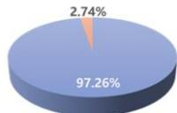
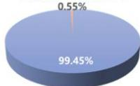
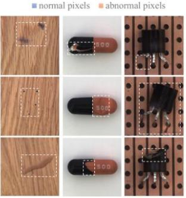
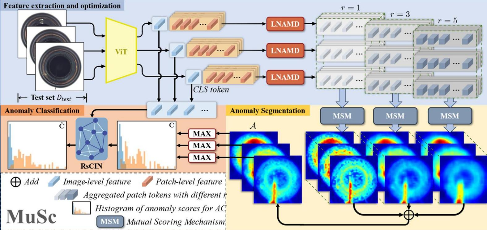
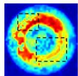
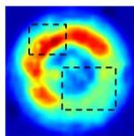
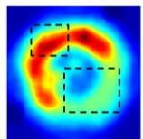
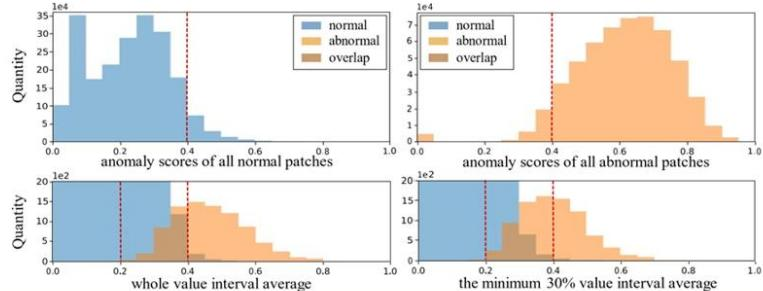
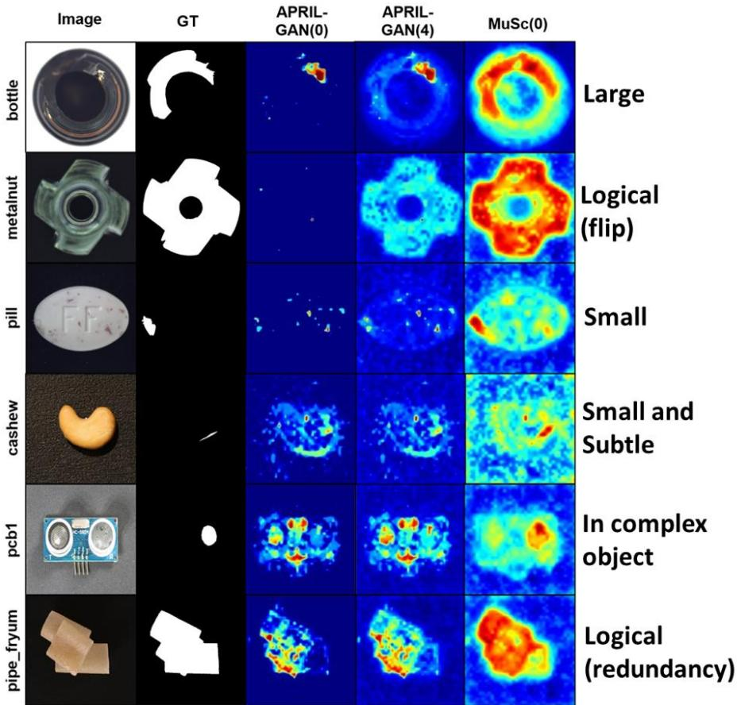

# Motivation

A rich amount of normal information implicit in unlabeled test images can be exploited for anomaly detection.   
>Adiscriminative characteristic: the normal image patches could find a relatively large number of similar patches in other unlabeled images, while the abnormal ones only have a few similar patches.

MVTec AD dataset

  
VisA dataset

# Contributions

V The first method that only uses the unlabeled test images for industrial anomaly detection.   
》We reveal the potential capability of normal and abnormal patches contained in unlabeled images.   
$2 1 . 1 \%$ PRO gains and $2 1 . 9 \%$ seg-AP gains on MVTec AD and $1 9 . 4 \%$ seg-AP gains on VisA.

# Framework

# LNAMD

Neighborhood range

$$
1 \times 1 3 \times 3 5 \times 5
$$

》 Aggregate function:   
Adaptive average pooling   
》 Multi-degree aggregation To segment abnormal regions of varying sizes.

  
1×1

  
3×3

  
5×5

# Mutual Scoring Mechanism

Image $I _ { j }$ assigns a score to each aggregated patch token of mage $I _ { i }$

$$
a _ {i, l} ^ {m, r} (I _ {j}) = \min  _ {n} \| \hat {p} _ {i, l} ^ {m, r} - \hat {p} _ {j, l} ^ {n, r} \| _ {2}
$$

》 Interval Average (minimum $30 \%$

$$
\overline {{a}} _ {i, l} ^ {m, r} = \frac {1}{K} \sum_ {k \in [ 1, K ]} a _ {i, l} ^ {m, r} (\bar {I} _ {k})
$$

>Mean:

rand l

$$
\boldsymbol {a} _ {i} ^ {m} = \frac {1}{L} \sum_ {l \in \{1, \dots , L \}} \frac {1}{3} \sum_ {r \in \{1, 3, 5 \}} \overline {{a}} _ {i, l} ^ {m, r}
$$

# Experiments

》 Comparison with 0-shot methods

<table><tr><td>Methods</td><td>WinCLIP[1]</td><td>APRIL-GAN[2]</td><td>ACR[3]</td><td>MuSc(ours)</td></tr><tr><td colspan="5">MVTec AD Dataset</td></tr><tr><td>cls-AUROC</td><td>91.8</td><td>86.1</td><td>85.8</td><td>97.8(+6.0)</td></tr><tr><td>PRO</td><td>64.6</td><td>44.0</td><td>72.7</td><td>93.8(+12.4)</td></tr><tr><td colspan="5">VisA Dataset</td></tr><tr><td>cls-AUROC</td><td>78.1</td><td>78.0</td><td>-</td><td>92.8(+10.7)</td></tr><tr><td>PRO</td><td>56.8</td><td>86.8</td><td>-</td><td>92.7(+5.7)</td></tr></table>

No training

No prompt

> Comparison with 4-shot methods

<table><tr><td>Methods</td><td>PatchCore[4]</td><td>WinCLIP[1]</td><td>APRIL-GAN[2]</td><td>MuSc(ours)</td></tr><tr><td colspan="5">MVTec AD Dataset</td></tr><tr><td>cls-AUROC</td><td>88.8</td><td>95.2</td><td>92.8</td><td>97.8(+2.6)</td></tr><tr><td>PRO</td><td>84.3</td><td>89.0</td><td>91.8</td><td>93.8(+2.0)</td></tr><tr><td colspan="5">VisA Dataset</td></tr><tr><td>cls-AUROC</td><td>85.3</td><td>87.3</td><td>92.6</td><td>92.8(+0.2)</td></tr><tr><td>PRO</td><td>84.9</td><td>87.6</td><td>90.2</td><td>92.7(+2.5)</td></tr></table>

Detect various types of defects

# RsCIN

>Image-level feature $\mathcal { F } _ { i }$ Extracted by ViT   
》Multi-window Mask

$$
M _ {k} (i, j) = \left\{ \begin{array}{l l} 1, & \text {i f} I _ {j} \in \mathcal {N} _ {k} (I _ {i}) \\ 0, & \text {o t h e r w i s e}, \end{array} \right. k \in \{k _ {1}, k _ {2} \}
$$

>Re-Scoring

$$
\begin{array}{l} D (i, i) = \sum_ {j = 1} ^ {N} M _ {k} \odot W (i, j) \\ \hat {\mathbf {C}} = (\sum (D ^ {- 1} (M _ {k} \odot W) \mathbf {C}) + \mathbf {C}) / (K + 1) \\ M _ {k} \in \overline {{\mathcal {M}}} \\ \end{array}
$$

》 Similarity matrix

$$
W _ {i, j} = \mathcal {F} _ {i} \cdot \mathcal {F} _ {j}
$$

Optimize score Ci of l

Optimized score ci

$$
\hat {c} _ {i} = \frac {c _ {i}}{3} + \frac {1}{3} \sum_ {j = 1} ^ {k _ {2}} \bar {w} _ {i, j} \bar {c} _ {j}
$$

Weighted average of scores within the window mask

$$
\begin{array}{l} \mid \\ \overline {{w}} _ {i, j} = \left\{ \begin{array}{c l} \hat {w} _ {i, j} ^ {k _ {1}} + \hat {w} _ {i, j} ^ {k _ {2}}, & \text {i f} 0 <   j \leq k _ {1} \\ \hat {w} _ {i, j} ^ {k _ {2}}, & \text {i f} k _ {1} <   j \leq k _ {2} \end{array} \right. \end{array}
$$

Universal module for other AD methods

# References

[1]JeongJouYimetal.inlip:Zero-/e-otoalyiiatiodgmationC/roceng of the IEEE/CVF Conferenceon ComputerVisionand Pattern Recognition.2023:19606-19616.   
[2]ChenX，HanY，ZhangJ.Azero-/few-shotanomalyclasificationandsegmentationmethodforcvpr2023 vandworkshopchalengetracks1&2:1stplaceonzero-shotadand4thplaceonfew-shotad[J].arXivpreprint arXiv:2305.17382，2023.   
[3]LiA,QiuC，KloftM,etal.Zero-shotanomalydetection viabatchnormalization[J].AdvancesinNeural InformationProcessingSystems,2024，36.   
[4]RothK，emulaLZepedaJetal.TowardstotalrcalinindustrialanomalydetectionC/Proceedingsofthe IEEE/CVFConferenceonComputerVisionandPatternRecognition.2022:14318-14328.

Paper

Code

