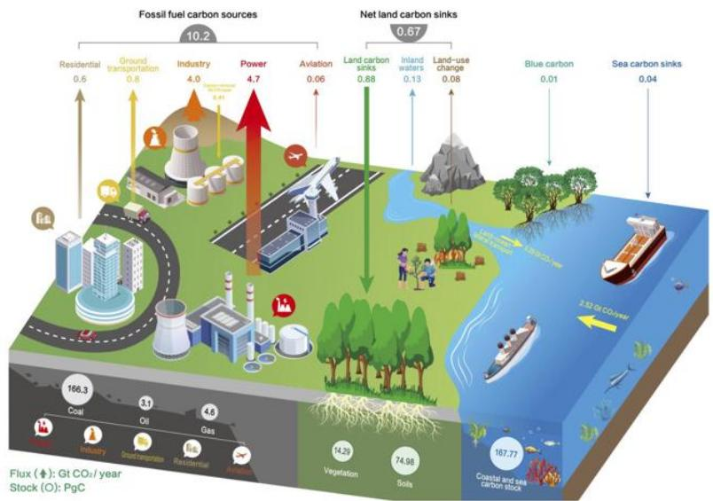
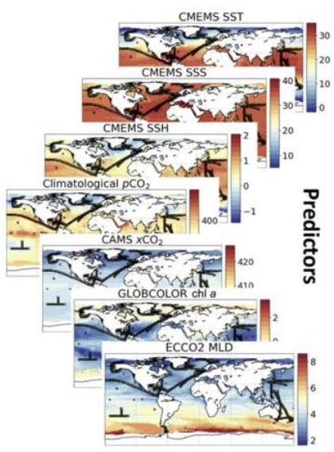
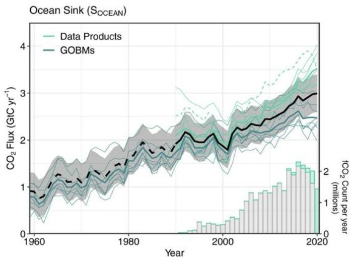
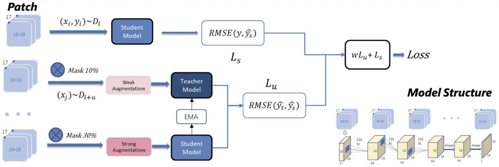
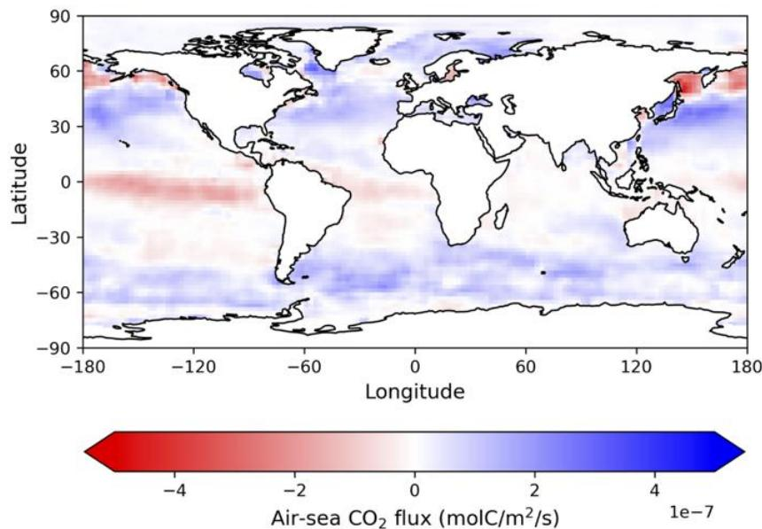
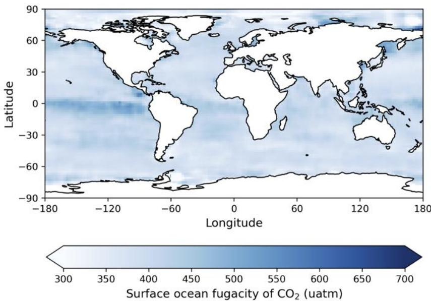

# Near-real-time monitoring of global ocean carbon sink

PiyuKe,XiaofanGuiWeCao,DeziWangCeHouiingWang,uanenSong,YunLiingZuangBianteich PhilippeCiais,PierreFriedlingstein,Zhu Liu

Contact: xiaofangui@microsoft.com

# Introduction

We present Carbon Monitor Ocean (CMO-NRT),a novel dataset providing near-real-time monthly gridded estimates of global surface ocean fugacity of $C O _ { 2 } ( f c o _ { 2 } )$ )and ocean-atmosphere $C O _ { 2 }$ flux from January 2022 to July 2023.Leveraging Convolutional Neural Networks and semisupervised learning, our highly accurate models enhance timely climate change mitigation efforts.

# Environmental factors

· Environmental factors influencing and reflecting oceanic carbon sink variations   
· Reconstructing global oceanic carbon sink using ML methods with global environmental data

  
Global ocean carbon sink Target

# Model

# Result

Our models maintain accuracy with errors below a $5 \%$ threshold(NRMSE),most models have losses below $2 \%$

