# NeuPL: Neural Population Learning

Siqi Liu, Luke Marris,Daniel Hennes,Josh Merel, Nicolas Heess,Thore Graepel

# Background

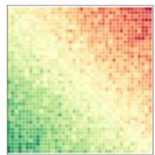  
Transitive Skills

  
Strategic Cycles

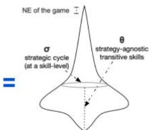  
Game-of-Skills

The policy space of symmetric zero-sum Game-of-Skillsl1l iscomposed oftransitive skilldimensionsand intransitive strategiccycles[2].

Transitive

Intransitive

# Solving intransitive strategy games

Game-theoretic population learningalgorithms (e.g.FP, PSRO[3l)offerconvergence guaranteestoan NE,where each policy best-responds toamixture over predecessors:

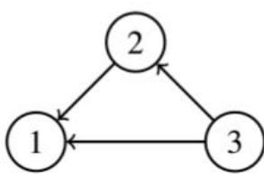  
Fictitious Play

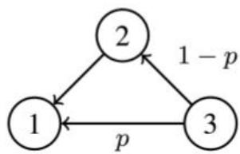  
PSRO-NASH

However,whencombined withmoderndeep RL techniquesl4，population learningcomesatsignificant costs,fortworeasons:

Lack ofpositive transferacrosspolicies;   
Suboptimal "good-"responsespopulating thepolicy population;

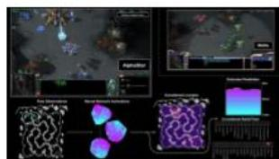

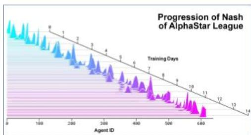

Canwe leverage the expressiveness of moderndeep NNs toenableasinglemodel toexplore,representand reason aboutdiverse strategieswhile retaining game theoretic guaranteesusingthesame infrastructureas"self-play"?

# Methods

# Algorithm 1 Neural Population Learning (Ours)

1: IIe(-|s,σ) Conditional neural population net.   
Initial interaction graph.   
3:F:RNXN-→RNXN Meta-graph solver.   
4:while true do   
$\Pi _ { \theta } ^ { \Sigma }  \{ \Pi _ { \theta } ( \cdot | s , \sigma _ { i } ) \} _ { i = 1 } ^ { N }$ Neural population.   
6: forgiEUNIQUE(∑）do   
7: $\Pi _ { \theta } ^ { \sigma _ { i } } \gets \Pi _ { \theta } ( \cdot | s , \sigma _ { i } )$   
8: $\Pi _ { \theta } ^ { \sigma _ { i } } \gets \mathbf { A B R } ( \Pi _ { \theta } ^ { \sigma _ { i } } , \sigma _ { i } , \Pi _ { \theta } ^ { \Sigma } )$ Self-play.   
9:U←EVAL(I） (Optional) if $\mathcal { F }$ adaptive.   
10:←F（u） (Optional)ifFadaptive.   
11:return Iθ,∑

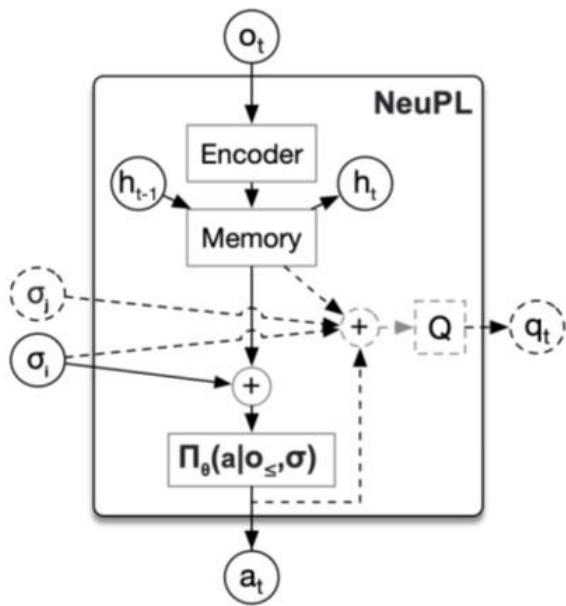

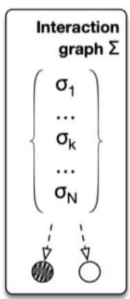

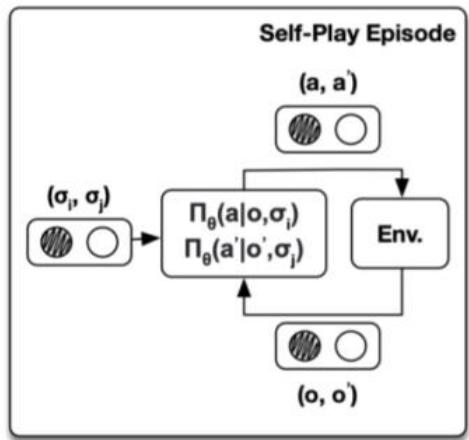

# Experiments (RwS)

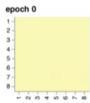

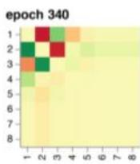

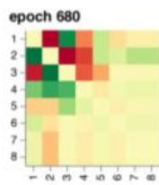

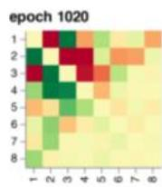

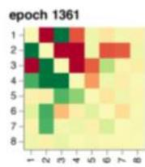

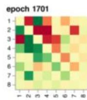

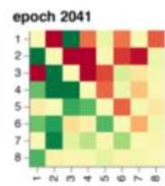

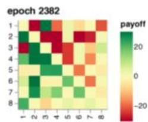

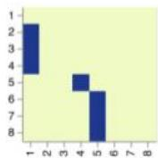

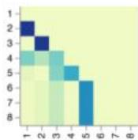

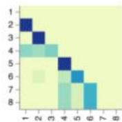

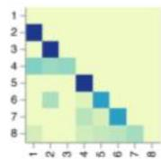

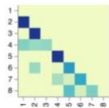

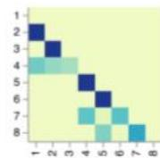

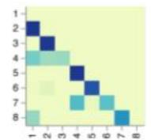

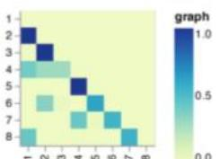

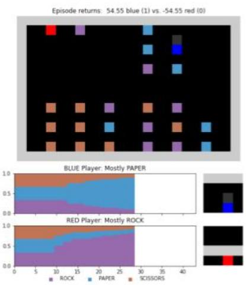

# Forward Transfer

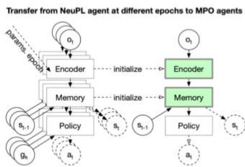

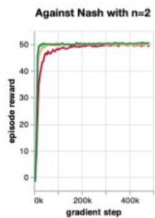

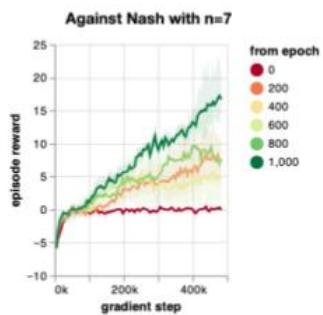

# Improved Population Learning

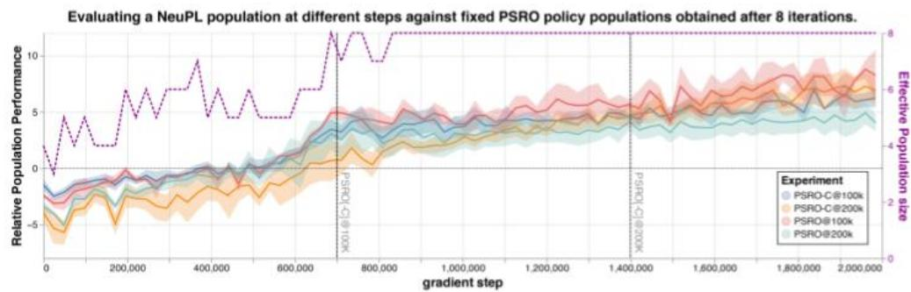

# References

[1]CzarneckiechaRaldmeLieSpngps"danesinuraformatiroesingStes   
[2]Baldzividtddngerimteatieren1   
tot   
[4]VinyalsOriltsteiaaftgntrmtgtur)4