# Contribution

We formulate the Neural Tangent Kernel (NTK) induced by infinitely

# Differentiable Decision Tree

By employing a sigmoid-like function, we can relax the splitting into a continuous form,which allows the use of gradient descent.

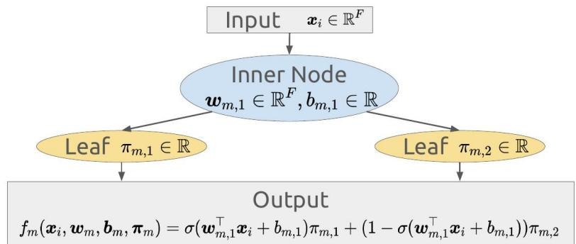

# Neural Tangent Kernel for Tree Ensembles

The NTK emerges in the context of functional gradient descent.

# Functional Gradient Descent

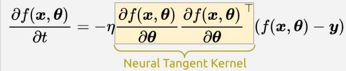

○It does not change during training when considering infinitely wide neural networks.   
○Then,functional behavior becomesanalytically tractable.

By handling the number of trees like the width of neural networks, we can apply NTK theory to differentiable tree ensembles.   
Proved in our previous work: Kanoh & Sugiyama (ICLR 2022)   
• In this work,we extend the NTK concept for axis-aligned trees.

# Axis-Aligned Constraint

We consider two axis-aligned cases: AAA and AAl.   
${ \pmb w } _ { m , n }$ is in one-hot representation,spliting isaxis-aligned.

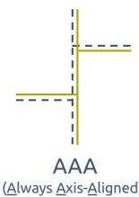

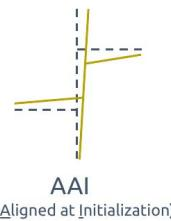

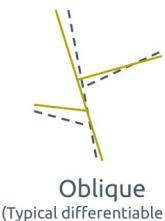

# Closed-form NTK formula for Axis-Aligned Trees

# NTK for Infinite Ensembles of Axis-Aligned Trees

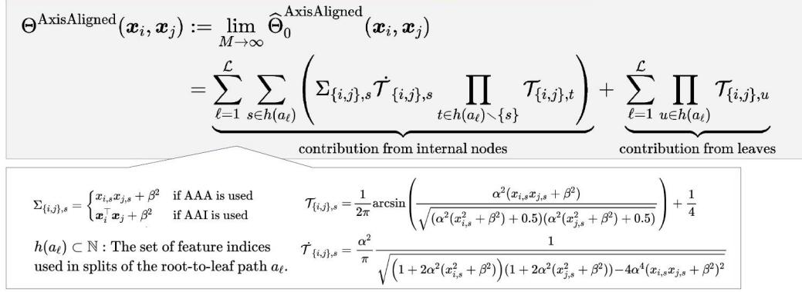

•Training behavior is now analytically tractable using our formula.

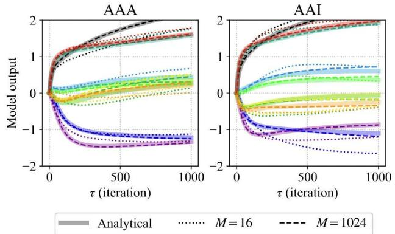  
Output dynamics for test data points.Each line color corresponds to each data point.

# Ensembles of Various Trees

The NTK induced by an ensemble of various tree architectures is equal to the sum of the NTKs induced by each architecture.

Op is the proportion of the corresponding tree architecture within the ensemble.

# NTK Property forMixed Trees

Mixed $( \pmb { x } _ { i } , \pmb { x } _ { j } ) = \rho _ { 1 } \Theta ^ { \tt A }$

# Insight on Oblivious Trees

Any non-oblivious trees can be transformed into oblivious trees that induce exactly the same limiting NTK.   
There is no need to consider combinations of complex trees,and it is sufficient to consider only combinations of oblivious trees.

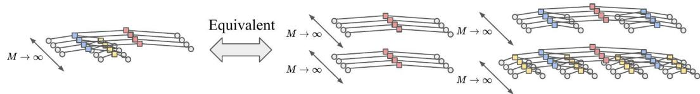

# Multiple Kernel Learning (MKL) as Architecture Search ---

MKL enables tree architecture search based on convex optimization.

○Suitable features for AAA and AAl can be different.

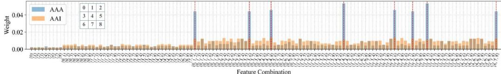  
MKL weights obtained bythe tic-tac-toe endgame dataset

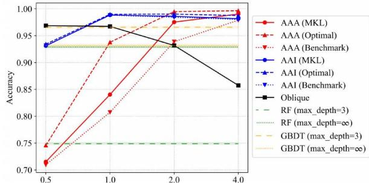  
Classification accuracy on tic-tac-toe endgame dataset   
Hardness ofthe sigmoidused inasplitting

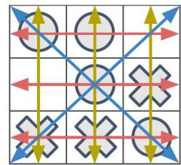  
Interactions for tic-tac-toe endgame