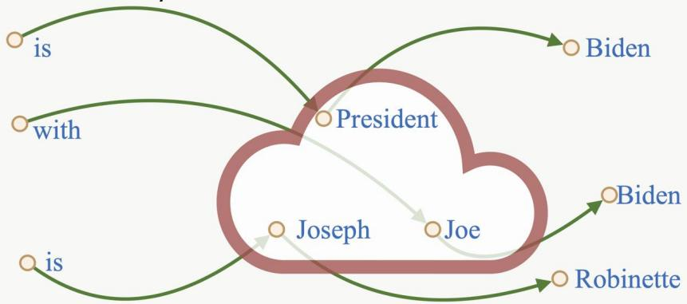
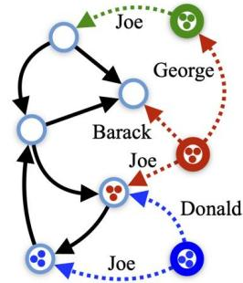
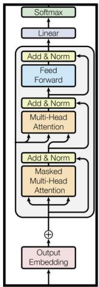
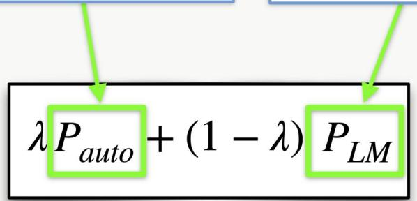
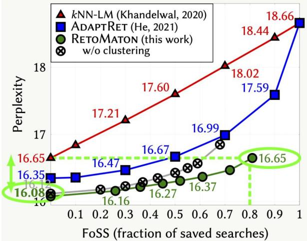
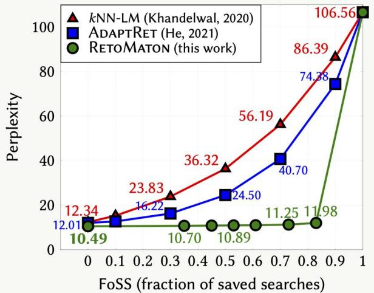
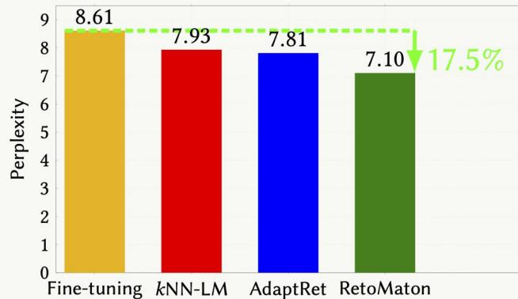
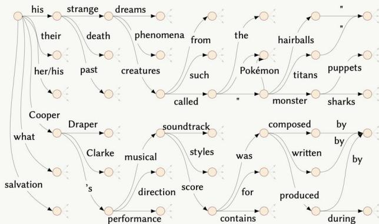

# Neuro-Symbolic Language Modeling with Automaton-augmented Retrieval

# Key ldea #1: Pointers Between Examples

Encode the training set as linked lists of (key, value, pointer):

encode("by the president") Joe

encode("by the president Joe")

encode("...")

)）..

This extends kNN-LM (Khandelwal et al.,'2020) by adding pointers between consecutive datastore entries.

# Key ldea #2: Clustering Similar Keys

Cluster similar keys into automaton states:

# RetoMaton

Test context:

  
Automaton

Nodes: clusters of training examples, encoded by the LM

Edges: pointers between consecutive examples, shared in cluster

Weights: $- \| h _ { t } , \ker \| _ { 2 }$

<table><tr><td>The</td><td>president</td><td>is</td><td>_</td></tr></table>

  
Trained LM

Pauto(w | ht, statest) α

£

M

sEstatest (key,val)∈s,val=w

# In-domain Datastore

  
Figure: Experiments on WikITEXT-103,where the datastore is created from the same training set that the base LM was trained on.

# Domain Adaptation

  
Figure: Domain adaptation experiments: the model was trained on News Crawl,and thedatastore isconstructed from Law-MT.

  
Improving Fine-Tuning   
Figure: When constructing REToMATON on top of a fine-tuned model,REooNreducesperplexityby17.5%.

  
Sample   
Figure: A random sample of the automaton constructed from the training set of WIKITEXT-103