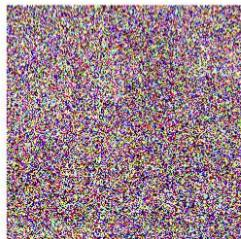
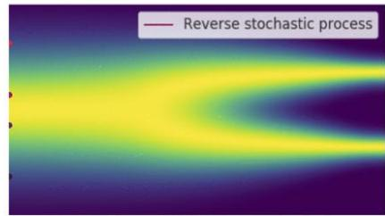
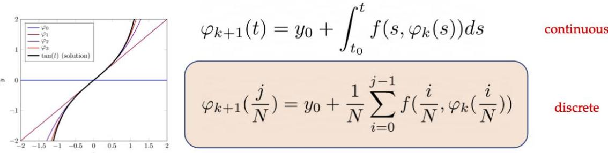
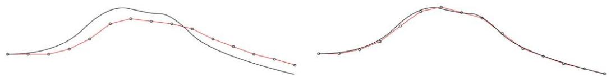
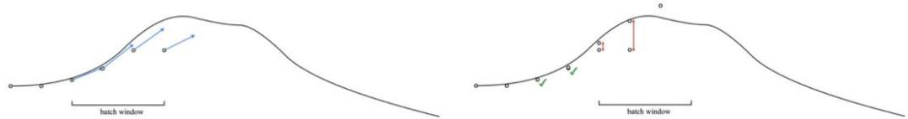
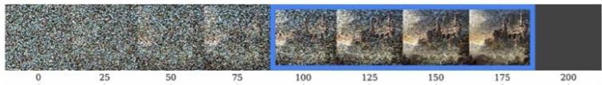
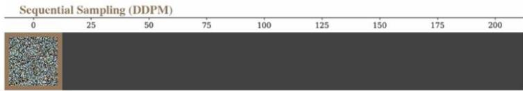
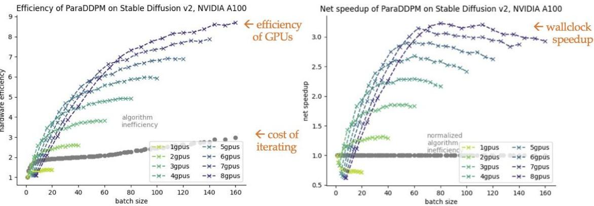

# Parallel Sampling of Diffusion Models

Andy Shih,Suneel Belkhale,Stefano Ermon,Dorsa Sadigh,Nima Anari

andyshih@cs.stanford.edu

  
[Song 2021]

$$
\mathrm {d} \boldsymbol {x} _ {t} = [ f (t) \boldsymbol {x} _ {t} - g ^ {2} (t) \nabla_ {\boldsymbol {x}} \log q _ {t} (\boldsymbol {x} _ {t}) ] \mathrm {d} t + g (t) \mathrm {d} \bar {\boldsymbol {w}} _ {t}
$$

canreverse the SDE

[Anderson 1982]

$$
\frac {\mathrm {d} \boldsymbol {x} _ {t}}{\mathrm {d} t} = f (t) \boldsymbol {x} _ {t} - \frac {1}{2} g ^ {2} (t) \nabla_ {\boldsymbol {x}} \log q _ {t} (\boldsymbol {x} _ {t})
$$

[Maoutsa 2020]

can also write as ODE

<table><tr><td></td><td>DDPM [Ho 2020]</td><td>DDIM [Song 2021]</td><td>DPMSolver [Lu 2022]</td><td>ParaDiGMS [ours]</td></tr><tr><td>Sample Method</td><td>SDE (euler maruyama)</td><td>ODE (euler)</td><td>ODE (heun)</td><td>ODE (picard+ euler/heun)</td></tr><tr><td>Speed</td><td>Slow 1000 steps</td><td>Fast 50 steps</td><td>Fast 50 steps</td><td>Fast 1000 steps</td></tr><tr><td>Quality</td><td>Best</td><td>Good</td><td>Good</td><td>Best</td></tr></table>

forspeed

for speed

# Picard Iterations

Solve discretized ODE by iterating until convergence

# Practical Issues

out of memory? Batching: process k timesteps at a time with sliding window

# approximate?

# No measurable degradation on standard benchmarks

$$
\begin{array}{l} \text {I f} \quad \| \boldsymbol {x} _ {t} ^ {K} - \boldsymbol {x} _ {t} ^ {K - 1} \| ^ {2} \leq 4 \epsilon^ {2} \sigma_ {t} ^ {2} / T ^ {2} \\ \text {T h e n} \quad D _ {\mathrm {T V}} \left(\mathcal {N} \left(\boldsymbol {x} _ {t} ^ {K}, \sigma_ {t} ^ {2} \boldsymbol {I}\right) \mid \mid \mathcal {N} \left(\boldsymbol {x} _ {t} ^ {\star}, \sigma_ {t} ^ {2} \boldsymbol {I}\right)\right) \leq \sqrt {\frac {1}{2} D _ {\mathrm {K L}} \left(\mathcal {N} \left(\boldsymbol {x} _ {t} ^ {K} , \sigma_ {t} ^ {2} \boldsymbol {I}\right) \mid \mid \mathcal {N} \left(\boldsymbol {x} _ {t} ^ {\star} , \sigma_ {t} ^ {2} \boldsymbol {I}\right)\right)} \\ \text {W e} = \sqrt {\frac {\left\| \boldsymbol {x} _ {t} ^ {K} - \boldsymbol {x} _ {t} ^ {\star} \right\| ^ {2}}{4 \sigma_ {t} ^ {2}}} \leq \sqrt {\frac {\left\| \boldsymbol {x} _ {t} ^ {K} - \boldsymbol {x} _ {t} ^ {K - 1} \right\| ^ {2}}{4 \sigma_ {t} ^ {2}}} \leq \frac {\epsilon}{T} \\ \end{array}
$$

  
ParallelSampling(ParaDDPM)

3x speedup!   
Robotics   

<table><tr><td rowspan="2">Franka Kitchen</td><td rowspan="2">Model Evals</td><td rowspan="2">Sequential Reward</td><td rowspan="2">Time per Episode</td><td colspan="3">ParaDiGMS</td><td rowspan="2">Time per Episode</td><td rowspan="2">Speedup</td></tr><tr><td>Model Evals</td><td>Parallel Iters</td><td>Reward</td></tr><tr><td>DDPM</td><td>100</td><td>0.85 ± 0.03</td><td>112s</td><td>390</td><td>25</td><td>0.84 ± 0.03</td><td>33.3s</td><td>3.4x</td></tr><tr><td>DDIM</td><td>15</td><td>0.80 ± 0.03</td><td>16.9s</td><td>47</td><td>7</td><td>0.80 ± 0.03</td><td>9.45s</td><td>1.8x</td></tr><tr><td>DPMSolver</td><td>15</td><td>0.79 ± 0.03</td><td>17.4s</td><td>41</td><td>6</td><td>0.80 ± 0.03</td><td>8.89s</td><td>2.0x</td></tr></table>

Latent Image   

<table><tr><td rowspan="2">StableDiffusion-v2</td><td colspan="3">Sequential</td><td colspan="4">ParaDiGMS</td><td rowspan="2">Speedup</td></tr><tr><td>Model Eval</td><td>CLIP Score</td><td>Time per Sample</td><td>Model Eval</td><td>Parallel Iters</td><td>CLIP Score</td><td>Time per Sample</td></tr><tr><td>DDPM</td><td>1000</td><td>32.1</td><td>50.0s</td><td>2040</td><td>44</td><td>32.1</td><td>16.2s</td><td>3.1x</td></tr><tr><td>DDIM</td><td>200</td><td>31.9</td><td>10.3s</td><td>425</td><td>16</td><td>31.9</td><td>5.8s</td><td>1.8x</td></tr><tr><td>DPMSolver</td><td>200</td><td>31.7</td><td>10.3s</td><td>411</td><td>16</td><td>31.7</td><td>5.8s</td><td>1.8x</td></tr></table>

Pixel Image   

<table><tr><td rowspan="2">LSUN Church</td><td colspan="3">Sequential</td><td colspan="4">ParaDiGMS</td><td rowspan="2">Speedup</td></tr><tr><td>Model Evals</td><td>FID Score</td><td>Time per Sample</td><td>Model Evals</td><td>Parallel Iters</td><td>FID Score</td><td>Time per Sample</td></tr><tr><td>DDPM</td><td>1000</td><td>12.8</td><td>24.0s</td><td>2556</td><td>42</td><td>12.9</td><td>8.2s</td><td>2.9x</td></tr><tr><td>DDIM</td><td>500</td><td>15.7</td><td>12.2s</td><td>1502</td><td>42</td><td>15.7</td><td>6.3s</td><td>1.9x</td></tr></table>