# TL;DR:

Graph cumulants perform better and are more intuitive than the typical subgraph statistics

Using only moments is awkward

"The length of a human averages 1.7 meters,

and their average squared length is 2.9 square meters"

Using cumulants is easier to understand

“The length of a human has: a variance of 0.01 meters,

a standard deviation of 0.1 meters,

a relative fluctuation of $6 \% ^ { \prime }$

# Graph Cumulants: the Better Subgraph Statistics

Erd6s-Rényi is the new Gaussian...

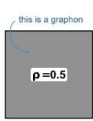

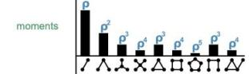

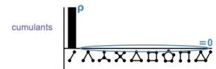

...degreesare encoded in stars...

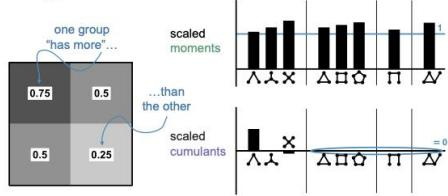

...clustering is encoded in cycles..

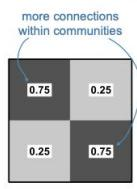

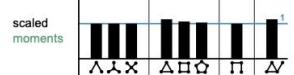

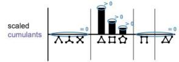

...and bipartite-ness as well!

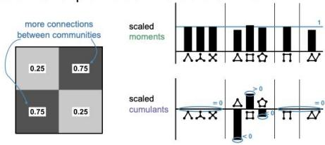

But

are graph cumulants better for testing?

(than subgraph densities)

# Apples-to-Apples: A Two-Sample Test

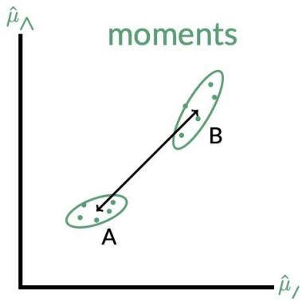

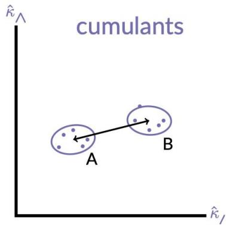

$$
\hat {d} _ {\kappa} ^ {2} (\mathbf {A}, \mathbf {B}) = \left(\hat {\kappa} (\mathbf {A}) - \hat {\kappa} (\mathbf {B})\right) ^ {\top} \left(\hat {\Sigma} _ {\kappa} (\mathbf {A}) + \hat {\Sigma} _ {\kappa} (\mathbf {B})\right) ^ {- 1} \left(\hat {\kappa} (\mathbf {A}) - \hat {\kappa} (\mathbf {B})\right)
$$

$$
\underbrace {\hat {d} _ {\mu} ^ {2} (\mathbf {A} , \mathbf {B})} _ {\text {" Z ^ {2} - s c o r e "}} = \underbrace {\left(\hat {\mu} (\mathbf {A}) - \hat {\mu} (\mathbf {B})\right) ^ {\top}} _ {\text {d i f f e r e n c e}} \underbrace {\left(\hat {\Sigma} _ {\mu} (\mathbf {A}) + \hat {\Sigma} _ {\mu} (\mathbf {B})\right) ^ {- 1}} _ {\text {m e t r i c}} \underbrace {\left(\hat {\mu} (\mathbf {A}) - \hat {\mu} (\mathbf {B})\right)} _ {\text {d i f f e r e n c e}}
$$

When estimating the covariance...

$$
\operatorname {C o v} \left(\hat {\mu} _ {g}, \hat {\mu} _ {g ^ {\prime}}\right) = \underbrace {\left\langle \hat {\mu} _ {g} \hat {\mu} _ {g ^ {\prime}} \right\rangle} _ {\text {" h a r d "}} - \underbrace {\left\langle \hat {\mu} _ {g} \right\rangle \left\langle \hat {\mu} _ {g ^ {\prime}} \right\rangle} _ {\text {" e a s y "}}
$$

...the“hard” part uses a combinatorial disjoint union rule

$$
c _ {\Lambda} c _ {/} = 4 c _ {\Lambda} + 2 c _ {\Delta} + 2 c _ {\perp} + 4 c _ {\cap} + c _ {\Lambda}
$$

# Combinatorial Construction of Cumulants

$$
\begin{array}{c c c} \bullet & & \odot \\ \mu_ {1} & = & \kappa_ {1} \end{array}
$$

$\left. X \right. = { \mathsf { m e a n } }$

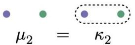

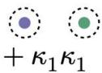

<X²)= variance + mean²

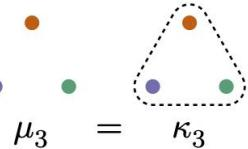

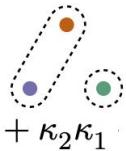

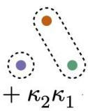

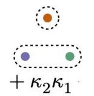

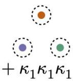

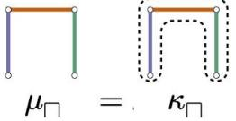

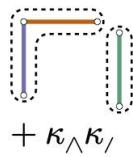

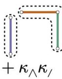

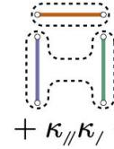

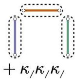

# Graph Cumulants Clearly Conquer

Graph cumulants outperform subgraph densities in general...

...and graph cumulants also work for single graph samples!

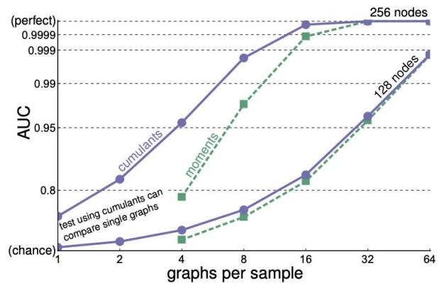

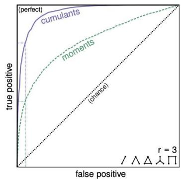

Why do graph cumulants perform better?

...because their fluctuations lookmoreNormal!

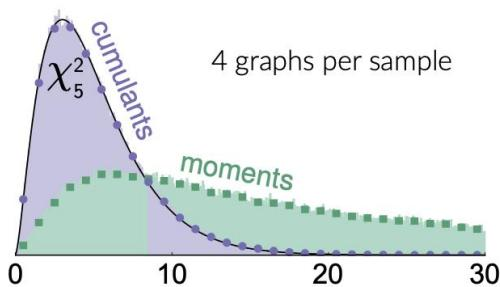

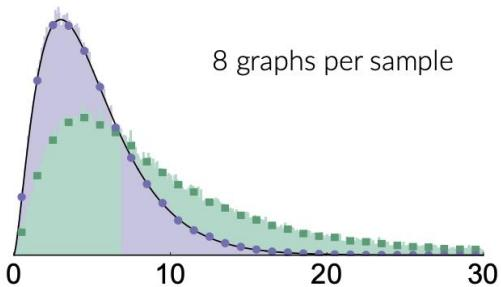

"Z2-score" for graphs sampled from the same distribution

# Graph Cumulants in the (semi-)Wild!

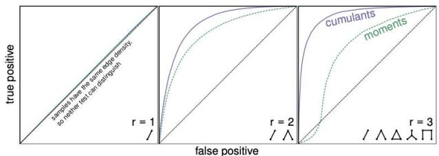

Varying:

Number of subgraphs

used by both tests

Comparing:

Genetic interaction networks of Arabidopsisand Mouse

Varying:

Number of graphs per sample used by both tests

Comparing:

Genetic interaction networks of Humanand Rat

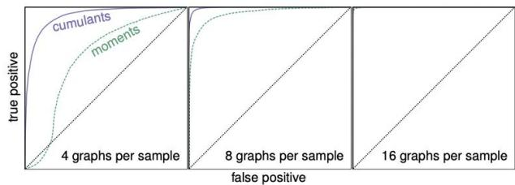