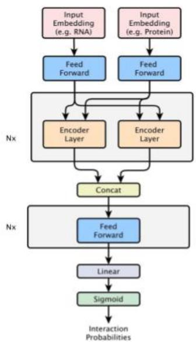
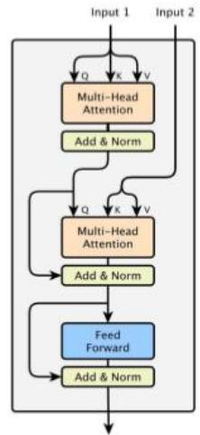
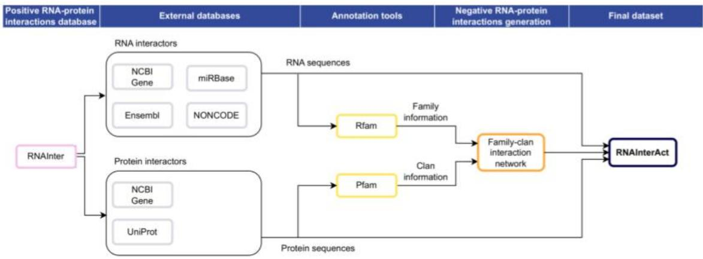
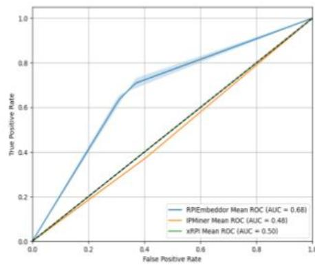

# RNA-Protein Interaction Classification via Sequence Embeddings

universitatfreiburg

DominikaMatus1,2,FredericRunge',JrgK.H.Franke',LarsGerne',MichaelUhl',FrankHutter3,1,RolfBackofen'

Univeritfdsoellteltsa

# In a nutshell

RNA and proteins form complexes through binding interactions,crucial foradvancesinbiologyor medicine,such as drug development.   
·Predicting RNA-protein interactions (RPls) computationallyischallengingdue todatascarcity anditsbias.   
We presentRNAlnterAct,the largest publiclyavailable dataset with biologically plausiblenegative interactions.   
The dataset includes sequence information and precomputed embeddings thatcapturemeaningful informationabout interactors'structureandfunction.   
·Ameticulous train/test split based on the RNA family enablesevaluationon trulyunseeninteractions.   
We introduce RPlembeddor,a transformer-based modelforbinary interactionclassificationand demonstrate its strong performance.

# RPlembeddor

·Protein embeddings:ESM $\cdot 2 ^ { 3 }$   
RNA embeddings:RNA-FM4

# Ablation studies

<table><tr><td>Model</td><td>Prec.</td><td>Rec.</td><td>F1</td><td>Acc.</td></tr><tr><td>RPlembeddor</td><td>0.563±0.019</td><td>0.659±0.071</td><td>0.605±0.019</td><td>0.678±0.009</td></tr><tr><td>One-Hot</td><td>0.0±0.0</td><td>0.0±0.0</td><td>0.0±0.0</td><td>0.0±0.0</td></tr><tr><td>Random-Protein</td><td>0.0±0.0</td><td>0.0±0.0</td><td>0.0±0.0</td><td>0.0±0.0</td></tr><tr><td>RNA-Random</td><td>0.0±0.0</td><td>0.0±0.0</td><td>0.0±0.0</td><td>0.0±0.0</td></tr></table>

# Both embeddings contribute to RPlembeddor's performance.

10.1093/nar/gkab997.   
gradientboostingmachine."ScientificReports,8(1):9552,2018.   
model."Science，379（6637):1123-1130，2023.doi:10.1126/science.ade2574.Epub2023Mar16.  
accurateRNA structureand functionpredictions."arXivpreprint arXiv:2204.0o3o0,2022.

# RNAlnterAct

Compilation of the RNAlnterAct dataset in five steps:

1.Gathering positive RPls from theRNAlnter1database:   
2.Cross-linking large scale databases to obtain sequence information.   
3.Filtering.   
4.Annotating proteins with clan and RNA with RNA family information.   
5.Generating biologically relevant negative interactions.

  
The final dataset contains 122,217 RPls with a 1:2 positive to negative ratio.

# RNA family-based train/test split

Dataset split into TRinter (training) and TSfam (test) setsbased on RNA families.   
·Non-homologous data guarantees evaluations on truly unseen interactions.

<table><tr><td>Feature</td><td>TRinter</td><td>TSfam</td><td>RPI28252</td></tr><tr><td>Unique RNA Families</td><td>976</td><td>172</td><td>N/A</td></tr><tr><td>Unique Protein Clans</td><td>152</td><td>152</td><td>N/A</td></tr><tr><td>Positive Interactions</td><td>35,852</td><td>4,887</td><td>871</td></tr><tr><td>Negative Interactions</td><td>73,362</td><td>8,116</td><td>0</td></tr><tr><td>Total Interactions</td><td>109,214</td><td>13,003</td><td>871</td></tr></table>

# Evaluation on TSfam and RPl2825

<table><tr><td rowspan="2">Model\Test set</td><td colspan="4">TSfam</td><td colspan="4">RPI2825</td></tr><tr><td>Prec.</td><td>Rec.</td><td>F1</td><td>Acc.</td><td>Prec.</td><td>Rec.</td><td>F1</td><td>Acc.</td></tr><tr><td>RPlembeddor</td><td>0.550±0.010</td><td>0.627±0.017</td><td>0.586±0.013</td><td>0.667±0.009</td><td>1.0±0.0</td><td>0.667±0.085</td><td>0.8±0.049</td><td>0.667±0.085</td></tr><tr><td>IPMiner</td><td>0.357</td><td>0.375</td><td>0.366</td><td>0.512</td><td>1.0</td><td>0.107</td><td>0.193</td><td>0.107</td></tr><tr><td>XRPI</td><td>0.375</td><td>0.909</td><td>0.531</td><td>0.398</td><td>1.0*</td><td>0.982*</td><td>0.991*</td><td>0.982*</td></tr></table>

*XRPI hasbeen trained on the RPl2825dataset.

RPlembeddor generalizesacross data distributions.   
·Competitors behave likerandom classifiers.