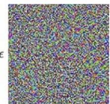
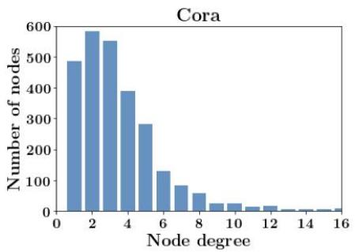
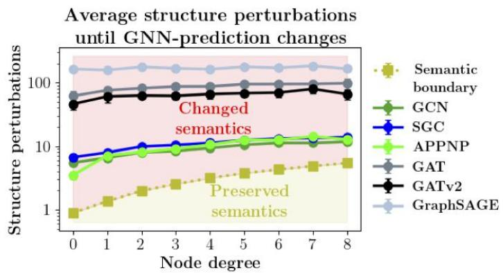
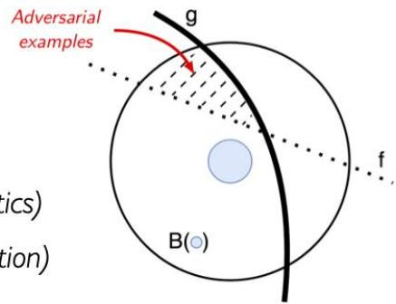
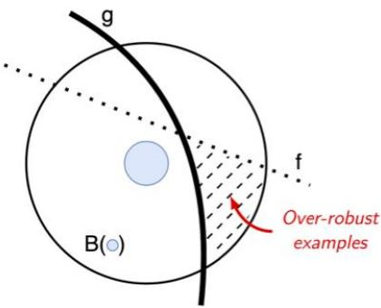
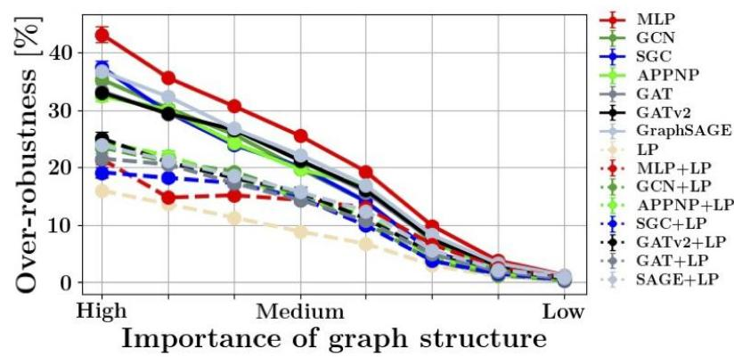

# Revisiting Robustness in Graph Machine Leaming

Lukas Gosch, Daniel Sturm,Simon Geisler, Stephan Gunnemann

# Graph Neural Networks (GNNs) suffer from over-robustness

> Common threat models allow perturbations which change the node-level semantic content in graphs   
> GNNs are wrongly robust to these changes   
> Introduce semantic-aware notions of robustness   
> No robustness-accuracy tradeoffor inductively classifying a new node

# On Adversarial Examples

Small perturbations( $\ell _ { p }$ -norm)   
Change prediction of classifier $f$   
■Unchanged semanticcontent (e.g,imagecategory)

  
“panda"

  
Figure:Goodfellow et al. (2015)

“gibbon" “gibbon"

What constitutes a small,semantics-preserving perturbation to a graph?

Commonly: Restrict number of inserted /deleted edges ( $\langle \ell _ { 0 } \rangle$ -nomm)

Majority of nodesare low-degree

Largeeffect on neighborhood

Do common threat models preserve semantic content?

# Use Random Graph Models

■Exactly measure (node-level) semantic change

# New Phenomenon

Over-robustness: Robustness beyond semantic change

# Semantic-Aware Robustness

Idea: Use reference nodeclassifier $g$ to indicate semantic change.

# Adversarial Example

A perturbed graph ${ \tilde { G } } \in { \mathcal { B } } ( G )$ is said to be adversarial for a node classfier $f$ ata target node $v$ w.r.t. $g$ if

$f ( G , y ) _ { v } = g ( G , y ) _ { v }$ (correct clean prediction)   
$g \big ( \tilde { G } , y \big ) _ { v } = g ( G , y ) _ { v }$ (perurbationpeseesemanti   
i. $f \left( { \tilde { G } } , y \right) _ { v } \neq g ( G , y ) _ { v }$ (node dassiferchangesdit

# Over-robust Example

A perturbed graph ${ \tilde { G } } \in { \mathcal { B } } ( G )$ is said to be an over-robust exampleforanode classifier $f$ at a target node v w.r.t. $g$ iff

$f ( G , y ) _ { v } = g ( G , y ) _ { v }$ (correct clean prediction)   
i $g \big ( \tilde { G } , y \big ) _ { v } \neq g ( G , y ) _ { v }$ (perturbation changessemantics)   
i. $\begin{array} { r } { f \bigl ( \tilde { G } , y \bigr ) _ { v } = g ( G , y ) _ { v } } \end{array}$ (nodedlassiferstaysunchanged)

# Theorem (informal)

There is no semantic-aware robustness-accuracy tradeoff for non-i.i.d.graph data when classifying a newly added node to a graph.

# Experiments

Setup: Contextual stochastic block models (CSBM)

■Derived Bayes optimal clasifier as reference clasifier $g$

Table:Existence probability of graphs with changed semantics.

<table><tr><td rowspan="2">Threat models</td><td colspan="8">Importance of graph structure</td></tr><tr><td>High</td><td>·</td><td>·</td><td>Medium</td><td>·</td><td>·</td><td>Low</td><td>·</td></tr><tr><td>B2(·)</td><td>36%</td><td>31%</td><td>26%</td><td>20%</td><td>14%</td><td>6%</td><td>2%</td><td>1%</td></tr><tr><td>Bdeg(·)</td><td>76%</td><td>60%</td><td>55%</td><td>49%</td><td>40%</td><td>22%</td><td>9%</td><td>3%</td></tr><tr><td>Bdeg+2(·)</td><td>100%</td><td>100%</td><td>99%</td><td>93%</td><td>81%</td><td>52%</td><td>25%</td><td>9%</td></tr></table>

High prevalence of graphs with changed semantics!

  
How much of the measured robustness is in fact over-robustness?

Significant amount of conventional robustness is overrobustness

# Take-Aways

Use strong attacks   
Reduce the amount of overrobustness measured   
■Be cautious in applying $\ell _ { 0 }$ -norm restrictedadversaries   
■More research into semanticpreserving perturbations necessary

