# Introduction

# Spherical CNNs

Principled way of learning from spherical signals,using spherical convolutions computed spectrally.   
Equivariant to 3Drotations.   
·Respects spherical topology,robust to sampling.

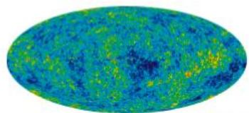

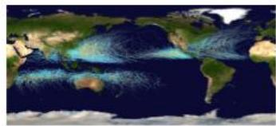  
Cyclone tracksNASA，Nilfanion）

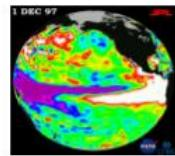  
Sea surface temperature

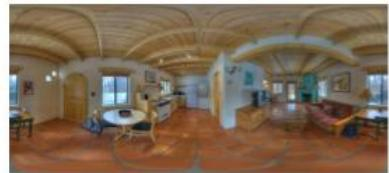  
Spherical panorama (SUN360)

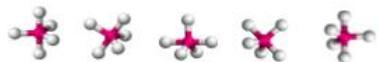  
Molecules

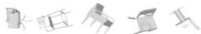  
3DCADmodels（Modelnet40)

# Contributions

Spherical CNNs 10ox larger than previously possible.   
·More expressive and efficient layersand activations.   
Application-specific modeling for molecules and weather.

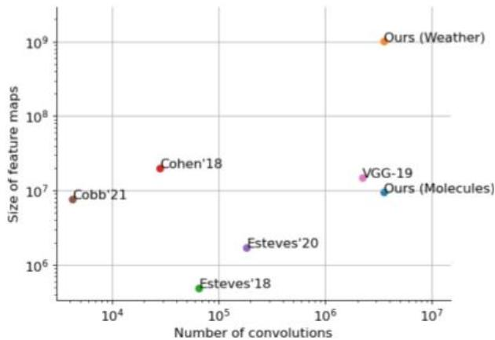

# Relatedwork

Cohenetal（CLR18),Estevesetal(ECCV'18,NeurlP20)，Kondoretal(Neur18),

# Method

Based onspin-weighted SCNNs (Esteves etal,NeurlP'20).   
·Phase collapse activation: $x _ { 0 }  W _ { 1 } x _ { 0 } + W _ { 2 } | x | + b$

Inspired by Guth etal,arXiv'21.

Efficient spin-weighted spherical harmonics on TPUs   
○Avoid tensor slicing/concatenation.   
Use DFTmatrices instead of FFT.   
·Spectral batch normalization,pooling and residual connection.

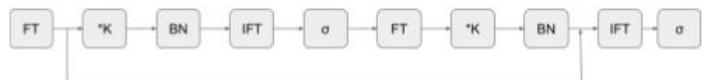  
Spectral residual block

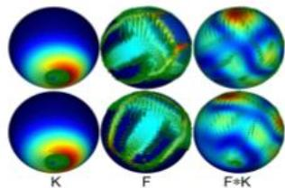  
Spin-weighted spherical convolution with spin=1as a vector field

<table><tr><td></td><td>Δ Steps/s [%]↑</td><td>Δ RMSE [%]↓</td></tr><tr><td>JAX implementation</td><td>33.7</td><td>0.0</td></tr><tr><td>Phase collapse</td><td>-4.6</td><td>-8.0</td></tr><tr><td>No Δ symmetries</td><td>16.3</td><td>0.0</td></tr><tr><td>Use DFT</td><td>21.4</td><td>0.0</td></tr><tr><td>Spectral batch norm</td><td>7.8</td><td>-1.4</td></tr><tr><td>Efficient residual</td><td>19.3</td><td>-2.4</td></tr></table>

#

·Represent a molecule as a set of spheres per atom, regressa set of properties.   
·One feature channel per atom type.   
·Use directionalatributes only (no radius).

$$
\bullet f _ {i z} (x) = \sum_ {z _ {j} = z} \frac {z _ {i} z _ {j}}{\left| r _ {i j} \right| ^ {p}} e ^ {- \frac {(x \cdot r _ {i j}) ^ {2}}{\beta \left| r _ {i j} \right|}}
$$

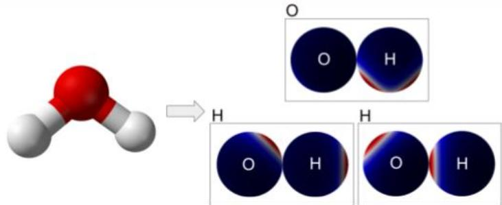

<table><tr><td colspan="2"></td><td>μ [D]</td><td>α [a03]</td><td>εHOMO [meV]</td><td>εLUMO [meV]</td><td>εgap [meV]</td><td>&lt;R2&gt; [a02]</td><td>zpve [meV]</td><td>U0 [meV]</td><td>U [meV]</td><td>H [meV]</td><td>G [meV]</td><td>Cv [cal mol K]</td></tr><tr><td rowspan="4">Split 1</td><td>DimeNet++ (2020)</td><td>0.030</td><td>0.044</td><td>24.6</td><td>19.5</td><td>32.6</td><td>0.331</td><td>1.21</td><td>6.32</td><td>6.28</td><td>6.53</td><td>7.56</td><td>0.023</td></tr><tr><td>PaiNN (2021)</td><td>0.012</td><td>0.045</td><td>27.6</td><td>20.4</td><td>45.7</td><td>0.066</td><td>1.28</td><td>5.85</td><td>5.83</td><td>5.98</td><td>7.35</td><td>0.024</td></tr><tr><td>TorchMD-Net (2022)</td><td>0.011</td><td>0.059</td><td>20.3</td><td>17.5</td><td>36.1</td><td>0.033</td><td>1.84</td><td>6.15</td><td>6.38</td><td>6.16</td><td>7.62</td><td>0.026</td></tr><tr><td>Ours</td><td>0.016</td><td>0.049</td><td>21.6</td><td>18.0</td><td>28.8</td><td>0.027</td><td>1.15</td><td>5.65</td><td>5.72</td><td>5.69</td><td>6.54</td><td>0.022</td></tr><tr><td rowspan="4">Split 2</td><td>EGNN (2021)</td><td>0.029</td><td>0.071</td><td>29.0</td><td>25.0</td><td>48.0</td><td>0.106</td><td>1.55</td><td>11.00</td><td>12.00</td><td>12.00</td><td>12.00</td><td>0.031</td></tr><tr><td>SEGNN (2022)</td><td>0.023</td><td>0.060</td><td>24.0</td><td>21.0</td><td>42.0</td><td>0.660</td><td>1.62</td><td>15.00</td><td>13.00</td><td>16.00</td><td>15.00</td><td>0.031</td></tr><tr><td>Equiformer (2022)</td><td>0.014</td><td>0.056</td><td>17.0</td><td>16.0</td><td>33.0</td><td>0.227</td><td>1.32</td><td>10.00</td><td>11.00</td><td>10.00</td><td>10.00</td><td>0.025</td></tr><tr><td>Ours</td><td>0.017</td><td>0.049</td><td>22.3</td><td>19.1</td><td>29.8</td><td>0.028</td><td>1.19</td><td>5.96</td><td>5.98</td><td>5.97</td><td>6.97</td><td>0.023</td></tr></table>

# Weather forecasting

Takeasetofatmosphericvariables liketemperature,wind,humidityand predict their future valueswith fully convolutionalmodels.   
·WeatherBench (Rasp et al):predict directly3or5days ahead.   
·Keisler (arXiv'22):predictiteratively in 6h increments.

Ourlargest model:256x256x78inputsandoutputs;iterated for12 steps during training,upto20during inference.

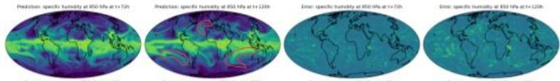

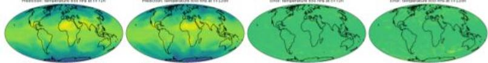

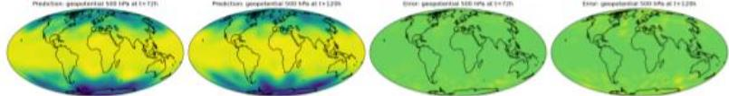

<table><tr><td rowspan="2"></td><td colspan="2">1 day</td><td colspan="2">3 days</td><td colspan="2">5 days</td></tr><tr><td>Z500</td><td>T850</td><td>Z500</td><td>T850</td><td>Z500</td><td>T850</td></tr><tr><td>Keisler (2022)</td><td>64.9</td><td>0.730</td><td>175.5</td><td>1.17</td><td>344.7</td><td>1.78</td></tr><tr><td>Ours</td><td>58.3</td><td>0.827</td><td>167.2</td><td>1.26</td><td>340.0</td><td>1.91</td></tr></table>

<table><tr><td rowspan="2"></td><td colspan="3">3 days</td><td colspan="3">5 days</td></tr><tr><td>Z500\( [m^2/s^2] \)</td><td>T850[K]</td><td>T2M[K]</td><td>Z500\( [m^2/s^2] \)</td><td>T850[K]</td><td>T2M[K]</td></tr><tr><td colspan="7">2 predictors</td></tr><tr><td>Rasp et al. (2020)</td><td>626</td><td>2.87</td><td>-</td><td>757</td><td>3.37</td><td>-</td></tr><tr><td>Ours</td><td>531</td><td>2.38</td><td>-</td><td>717</td><td>3.03</td><td>-</td></tr><tr><td colspan="7">117 predictors</td></tr><tr><td>Rasp &amp; Thuerey \( ^{cont} \)</td><td>331</td><td>1.87</td><td>1.60</td><td>545</td><td>2.57</td><td>2.06</td></tr><tr><td>Rasp &amp; Thuerey</td><td>314</td><td>1.79</td><td>1.53</td><td>561</td><td>2.82</td><td>2.32</td></tr><tr><td>Ours</td><td>329</td><td>1.62</td><td>1.29</td><td>601</td><td>2.57</td><td>1.89</td></tr></table>

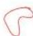  
Similar patternsmayappearatdifferent positionsand orientations;equivarianceallows filterreuse.