# Contributions

√Static collection

■Many pedestrian trajectory datasets were collected from fixed positions, limiting variability.   
√ Missing ego motion   
■Many existing robot datasets lack ego-motion information.   
√Vehicle-centric bias   
■Most autonomous datasets were collected from vehicles, exhibiting a gap from realistic robot-pedestrian interaction behavior. *+:Multi

*+: Multi - layered map

<table><tr><td>Dataset</td><td>Platform</td><td>Task</td><td>Sync.</td><td>Map</td><td>E2E</td><td>Location</td></tr><tr><td>UCY</td><td>Fixed</td><td>Tracking, Prediction</td><td>-</td><td></td><td></td><td>Outdoor</td></tr><tr><td>ETH</td><td>Fixed</td><td>Tracking, Prediction</td><td>-</td><td></td><td></td><td>Outdoor</td></tr><tr><td>SDD</td><td>Fixed</td><td>Tracking, Prediction</td><td>-</td><td></td><td></td><td>Outdoor</td></tr><tr><td>CITR-DUT</td><td>Fixed</td><td>Tracking, Prediction</td><td>-</td><td></td><td></td><td>Outdoor</td></tr><tr><td>nuScenes</td><td>Vehicle</td><td>Detection, Tracking, Prediction</td><td>-</td><td>✓†</td><td></td><td>Outdoor</td></tr><tr><td>Waymo Open</td><td>Vehicle</td><td>Detection, Tracking, Prediction</td><td>✓</td><td>✓</td><td></td><td>Outdoor</td></tr><tr><td>Argoverse</td><td>Vehicle</td><td>Detection, Tracking, Prediction</td><td>✓</td><td>✓†</td><td>✓</td><td>Outdoor</td></tr><tr><td>JRDB</td><td>Robot</td><td>Detection, Tracking</td><td></td><td></td><td></td><td>Indoor &amp; Outdoor</td></tr><tr><td>STCrowd</td><td>Fixed</td><td>Detection, Tracking, Prediction</td><td>✓</td><td></td><td></td><td>Outdoor</td></tr><tr><td>SiT(Ours)</td><td>Robot</td><td>Detection, Tracking, Prediction</td><td>✓</td><td>✓†</td><td>✓</td><td>Indoor &amp; Outdoor</td></tr></table>

# Overview

√Real-world context   
■Collected data from dense areas like campuses and public roads   
√Comprehensive data   
■Sequential raw data from various sensors   
■60 scenes with 60K images and 12K point cloud frames at 10 Hz   
■2D and 3D bounding boxes for 6 classes   
√Unique features   
■Emphasis on Human-Robot Interactions (HRl)   
■ Precise multi-sensor synchronization   
■Multi-layered indoor& outdoor semantic maps from SLAM   
■ Cover tasks from 3D detection to motion forecasting (end-to-end)

# Robot Setup

√Multi-sensors equipped on UGV

■ 1 x Husky UGV platform   
■ 2 x Velodyne VLP-16   
■ 5× Basler a2A1920-51gc cameras   
■1× MTi-680G IMU& RTK   
■1 x VectorNav VN-100 IMU

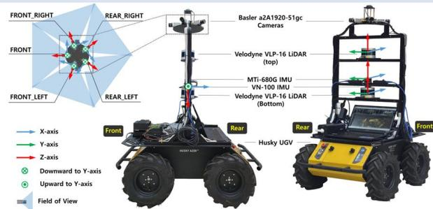

# Details of SiT Dataset

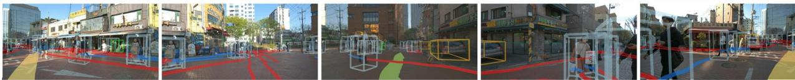

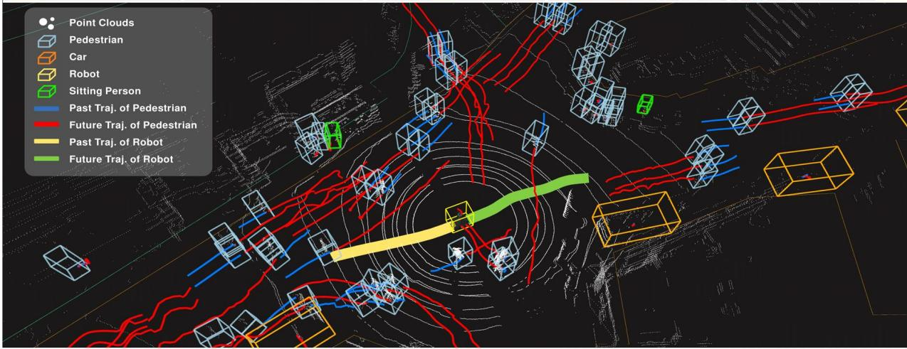

√Comparison with other datasets

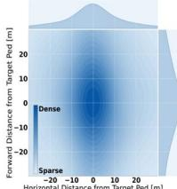  
SiT(Ours)

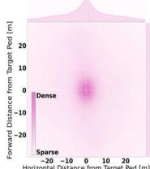  
SSD

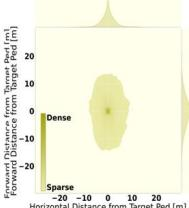

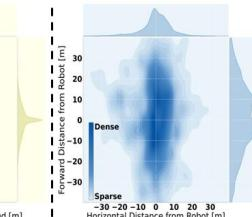  
SiT(Ours)

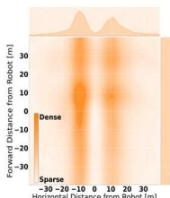  
Waymo Open

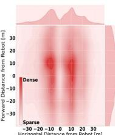  
nuScenes

√Examples of human-robot interactions

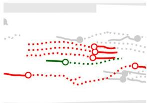  
Approach

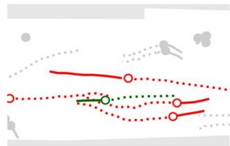  
Followed by Pedestrian

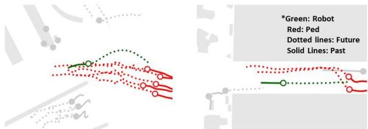  
Avoidance by Robot   
Avoidance by Pedestrians

# Tasks and Benchmark

√Perception tasks

■3D Object Detection based on image or point clouds   
■ 3D Multi-Object Tracking   
■ Trajectory Prediction   
■ End-to-End 3D Detection to Motion Forecasting

√Benchmark

■ Plan to release benchmarks and pre-trained models.   
■ Challenges open on Eval.Al (Feb.2024)

# Samples of dataset

√Real-world captures   
■ Candid shots from diverse urban environments   
√3D visualization   
■ Dynamic representations of objects and trajectories   
√Semantic maps   
■ 12 Color-coded layouts detailing regions

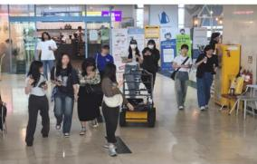

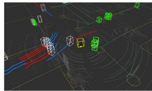

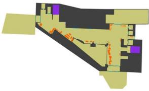

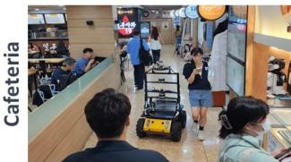

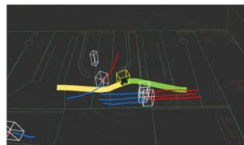

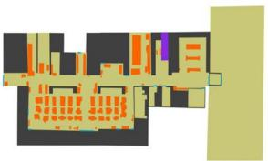

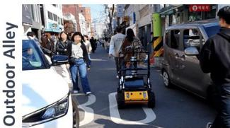

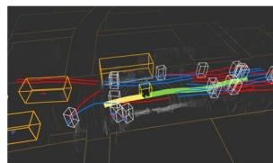

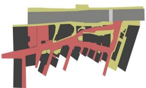

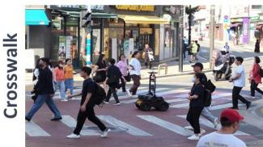

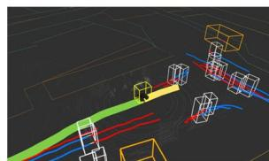

RealWorld   
3DVisualization   
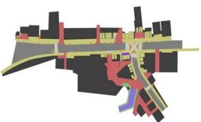  
Semantic Map